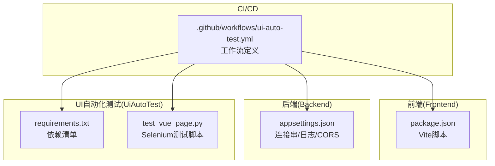
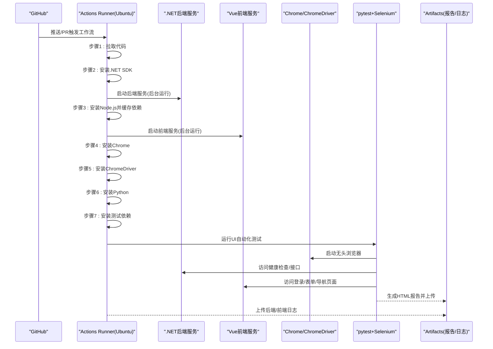
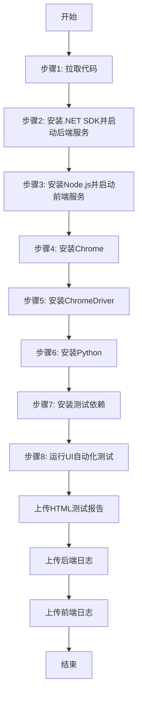
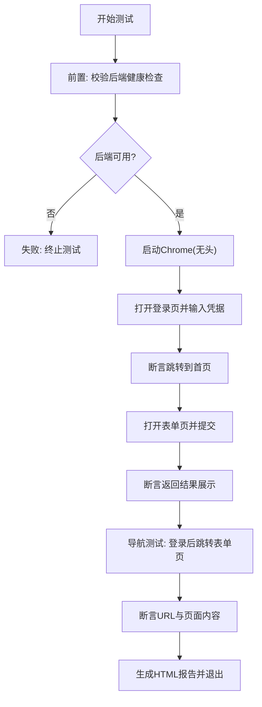
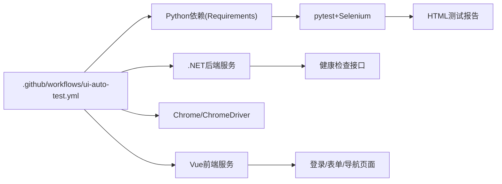

# CI/CD与GitHub Actions流程

<cite>
**本文引用的文件**
- [.github/workflows/ui-auto-test.yml](file://.github/workflows/ui-auto-test.yml)
- [README.md](file://README.md)
- [vue-csharp-ui-auto/README.md](file://vue-csharp-ui-auto/README.md)
- [vue-csharp-ui-auto/UiAutoTest/test_vue_page.py](file://vue-csharp-ui-auto/UiAutoTest/test_vue_page.py)
- [vue-csharp-ui-auto/UiAutoTest/requirements.txt](file://vue-csharp-ui-auto/UiAutoTest/requirements.txt)
- [vue-csharp-ui-auto/Backend/appsettings.json](file://vue-csharp-ui-auto/Backend/appsettings.json)
- [vue-csharp-ui-auto/Frontend/package.json](file://vue-csharp-ui-auto/Frontend/package.json)
- [ConsoleApp1/Dockerfile](file://ConsoleApp1/Dockerfile)
</cite>

## 目录
1. [简介](#简介)
2. [项目结构](#项目结构)
3. [核心组件](#核心组件)
4. [架构总览](#架构总览)
5. [详细组件分析](#详细组件分析)
6. [依赖关系分析](#依赖关系分析)
7. [性能考量](#性能考量)
8. [故障排查指南](#故障排查指南)
9. [结论](#结论)
10. [附录](#附录)

## 简介
本文件面向智能体项目的持续集成与持续部署（CI/CD），聚焦于GitHub Actions工作流的执行逻辑与端到端验证流程。工作流针对Vue前端与C#后端的UI自动化测试场景，通过并行启动前后端服务、安装浏览器与驱动、运行Selenium测试、生成HTML测试报告与上传日志的方式，确保每次提交均经过完整的端到端验证，从而提升代码质量与交付稳定性。

## 项目结构
项目采用多模块组织方式：
- 前端：Vue3 + Vite，负责用户界面与交互。
- 后端：C# ASP.NET Core，提供REST API与健康检查。
- UI自动化测试：Python + Selenium + pytest，覆盖登录、表单提交与页面导航等关键路径。
- CI/CD：GitHub Actions工作流，按步骤拉取代码、准备环境、启动服务、执行测试并产出报告与日志。

图表来源
- [.github/workflows/ui-auto-test.yml](file://.github/workflows/ui-auto-test.yml#L1-L123)
- [vue-csharp-ui-auto/Frontend/package.json](file://vue-csharp-ui-auto/Frontend/package.json#L1-L19)
- [vue-csharp-ui-auto/Backend/appsettings.json](file://vue-csharp-ui-auto/Backend/appsettings.json#L1-L18)
- [vue-csharp-ui-auto/UiAutoTest/requirements.txt](file://vue-csharp-ui-auto/UiAutoTest/requirements.txt#L1-L4)
- [vue-csharp-ui-auto/UiAutoTest/test_vue_page.py](file://vue-csharp-ui-auto/UiAutoTest/test_vue_page.py#L1-L161)

章节来源
- [README.md](file://README.md#L1-L113)
- [vue-csharp-ui-auto/README.md](file://vue-csharp-ui-auto/README.md#L1-L113)

## 核心组件
- GitHub Actions工作流：定义触发条件、运行环境与12步执行步骤，涵盖C#/.NET、Node.js、Python、Chrome/ChromeDriver与Selenium测试。
- 前端服务：通过Vite启动，监听指定主机与端口，供UI自动化测试访问。
- 后端服务：ASP.NET Core应用，提供健康检查与认证/数据接口，绑定0.0.0.0以便容器/CI访问。
- UI自动化测试：基于Selenium与pytest，生成HTML报告；包含前置后端可用性校验、无头浏览器配置与断言。
- 日志与报告：工作流上传测试报告与前后端日志，便于失败排查与审计。

章节来源
- [.github/workflows/ui-auto-test.yml](file://.github/workflows/ui-auto-test.yml#L1-L123)
- [vue-csharp-ui-auto/UiAutoTest/test_vue_page.py](file://vue-csharp-ui-auto/UiAutoTest/test_vue_page.py#L1-L161)
- [vue-csharp-ui-auto/UiAutoTest/requirements.txt](file://vue-csharp-ui-auto/UiAutoTest/requirements.txt#L1-L4)
- [vue-csharp-ui-auto/Backend/appsettings.json](file://vue-csharp-ui-auto/Backend/appsettings.json#L1-L18)
- [vue-csharp-ui-auto/Frontend/package.json](file://vue-csharp-ui-auto/Frontend/package.json#L1-L19)

## 架构总览
下图展示CI/CD流水线在GitHub Actions中的整体执行顺序与各组件交互关系。

图表来源
- [.github/workflows/ui-auto-test.yml](file://.github/workflows/ui-auto-test.yml#L1-L123)
- [vue-csharp-ui-auto/UiAutoTest/test_vue_page.py](file://vue-csharp-ui-auto/UiAutoTest/test_vue_page.py#L1-L161)

## 详细组件分析

### GitHub Actions工作流执行逻辑
- 触发条件：主分支推送与PR合并至主分支。
- 运行环境：Ubuntu虚拟机，提供稳定且可复现的Linux环境。
- 步骤概览：
  1) 拉取代码
  2) 安装.NET SDK并编译后端，后台启动服务，绑定0.0.0.0并等待健康检查通过
  3) 安装Node.js并缓存依赖，后台启动Vue前端，绑定0.0.0.0并等待
  4) 安装Chrome浏览器与ChromeDriver
  5) 安装Python与测试依赖
  6) 运行pytest+Selenium测试，生成HTML报告
  7) 上传测试报告与前后端日志，保留7天

图表来源
- [.github/workflows/ui-auto-test.yml](file://.github/workflows/ui-auto-test.yml#L1-L123)

章节来源
- [.github/workflows/ui-auto-test.yml](file://.github/workflows/ui-auto-test.yml#L1-L123)

### 前端服务启动与配置
- 使用Vite作为开发服务器，支持--host与--port参数以便外部访问。
- package.json中定义了serve脚本，配合工作流中的npm run serve启动。
- 建议保持与工作流中相同的主机与端口配置，确保Selenium可访问。

章节来源
- [vue-csharp-ui-auto/Frontend/package.json](file://vue-csharp-ui-auto/Frontend/package.json#L1-L19)
- [.github/workflows/ui-auto-test.yml](file://.github/workflows/ui-auto-test.yml#L50-L60)

### 后端服务启动与配置
- 后端通过dotnet run启动，绑定0.0.0.0以允许外部访问。
- 工作流中通过健康检查URL等待后端就绪，避免测试过早执行。
- appsettings.json包含连接串、日志级别与允许的主机，确保开发与CI环境兼容。

章节来源
- [.github/workflows/ui-auto-test.yml](file://.github/workflows/ui-auto-test.yml#L28-L41)
- [vue-csharp-ui-auto/Backend/appsettings.json](file://vue-csharp-ui-auto/Backend/appsettings.json#L1-L18)

### UI自动化测试与断言
- 测试脚本使用Selenium与pytest，包含：
  - 健康检查前置校验：确保后端可用再执行UI测试
  - 无头浏览器配置：适配CI无界面环境
  - 登录、表单提交与页面导航三大核心用例
  - 断言与显式等待，保证页面元素定位与交互稳定性
- 测试报告由pytest-html生成，工作流上传为Artifact，便于查看。

图表来源
- [vue-csharp-ui-auto/UiAutoTest/test_vue_page.py](file://vue-csharp-ui-auto/UiAutoTest/test_vue_page.py#L1-L161)

章节来源
- [vue-csharp-ui-auto/UiAutoTest/test_vue_page.py](file://vue-csharp-ui-auto/UiAutoTest/test_vue_page.py#L1-L161)
- [vue-csharp-ui-auto/UiAutoTest/requirements.txt](file://vue-csharp-ui-auto/UiAutoTest/requirements.txt#L1-L4)
- [.github/workflows/ui-auto-test.yml](file://.github/workflows/ui-auto-test.yml#L94-L106)

### 日志与报告管理
- 测试报告：pytest-html生成HTML报告，工作流上传为Artifact，保留7天。
- 前后端日志：工作流在always()条件下上传后端与前端日志，便于失败排查。
- 建议：在测试失败时保留更长时间的日志，或增加日志压缩与分片策略。

章节来源
- [.github/workflows/ui-auto-test.yml](file://.github/workflows/ui-auto-test.yml#L100-L123)

## 依赖关系分析
- 工作流对后端与前端服务存在强依赖：必须先启动服务并通过健康检查。
- 浏览器与驱动版本需匹配，工作流动态查询Chrome版本并安装对应ChromeDriver。
- Python测试依赖通过requirements.txt统一管理，pytest-html用于生成报告。
- 前后端端口与主机绑定需与测试脚本一致，否则Selenium无法访问。

图表来源
- [.github/workflows/ui-auto-test.yml](file://.github/workflows/ui-auto-test.yml#L1-L123)
- [vue-csharp-ui-auto/UiAutoTest/requirements.txt](file://vue-csharp-ui-auto/UiAutoTest/requirements.txt#L1-L4)
- [vue-csharp-ui-auto/UiAutoTest/test_vue_page.py](file://vue-csharp-ui-auto/UiAutoTest/test_vue_page.py#L1-L161)

章节来源
- [.github/workflows/ui-auto-test.yml](file://.github/workflows/ui-auto-test.yml#L1-L123)
- [vue-csharp-ui-auto/UiAutoTest/requirements.txt](file://vue-csharp-ui-auto/UiAutoTest/requirements.txt#L1-L4)
- [vue-csharp-ui-auto/UiAutoTest/test_vue_page.py](file://vue-csharp-ui-auto/UiAutoTest/test_vue_page.py#L1-L161)

## 性能考量
- 并行启动：工作流按步骤顺序执行，但后端与前端可在同一Runner内并行启动，缩短总耗时。
- 依赖缓存：Node.js使用npm缓存依赖，减少重复安装时间。
- 服务等待：合理设置等待时间，避免过短导致测试过早执行，过长浪费资源。
- 浏览器安装：仅在需要时安装Chrome与驱动，避免不必要的下载与解压。
- 日志与报告：仅在失败或always()条件下上传日志，减少Artifact体积。

章节来源
- [.github/workflows/ui-auto-test.yml](file://.github/workflows/ui-auto-test.yml#L42-L60)
- [.github/workflows/ui-auto-test.yml](file://.github/workflows/ui-auto-test.yml#L61-L80)
- [.github/workflows/ui-auto-test.yml](file://.github/workflows/ui-auto-test.yml#L81-L106)

## 故障排查指南
- 后端未启动或端口占用
  - 确认后端绑定0.0.0.0与端口5000，健康检查URL可达。
  - 查看后端日志Artifact，定位异常堆栈或连接串错误。
- 前端启动缓慢或端口冲突
  - 确认前端绑定0.0.0.0与端口8080，等待时间充足。
  - 查看前端日志Artifact，确认Vite启动输出。
- Chrome/ChromeDriver版本不匹配
  - 工作流会根据Chrome版本选择对应驱动，若仍失败，手动固定驱动版本。
- 测试失败但无明确信息
  - 下载HTML测试报告，查看断言失败的具体页面截图与源码片段。
  - 在always()条件下下载前后端日志，结合报告定位问题。
- 跨域与路由问题
  - 确保后端appsettings.json允许跨域访问，前端路由与data-testid一致。

章节来源
- [.github/workflows/ui-auto-test.yml](file://.github/workflows/ui-auto-test.yml#L28-L41)
- [.github/workflows/ui-auto-test.yml](file://.github/workflows/ui-auto-test.yml#L50-L60)
- [.github/workflows/ui-auto-test.yml](file://.github/workflows/ui-auto-test.yml#L61-L80)
- [.github/workflows/ui-auto-test.yml](file://.github/workflows/ui-auto-test.yml#L94-L123)
- [vue-csharp-ui-auto/Backend/appsettings.json](file://vue-csharp-ui-auto/Backend/appsettings.json#L1-L18)
- [vue-csharp-ui-auto/UiAutoTest/test_vue_page.py](file://vue-csharp-ui-auto/UiAutoTest/test_vue_page.py#L1-L161)

## 结论
该CI/CD流水线通过标准化的步骤与严格的端到端验证，有效保障了每次提交的质量。工作流在Ubuntu环境中并行启动前后端服务，使用Selenium与pytest完成关键业务路径的自动化测试，并通过HTML报告与日志Artifact实现可观测性与可追溯性。结合README中的说明，开发者可以轻松触发工作流、查看运行日志与处理失败情况。

## 附录

### 如何触发工作流与查看日志
- 触发方式：向主分支推送或合并PR至主分支时自动触发。
- 查看日志：在GitHub Actions页面查看工作流运行详情，下载Artifacts中的HTML报告与前后端日志。
- 失败处理：根据报告与日志定位问题，修复后重新推送触发工作流。

章节来源
- [README.md](file://README.md#L95-L107)
- [vue-csharp-ui-auto/README.md](file://vue-csharp-ui-auto/README.md#L52-L65)
- [.github/workflows/ui-auto-test.yml](file://.github/workflows/ui-auto-test.yml#L100-L123)

### 最佳实践建议
- 优化构建时间
  - 使用依赖缓存（Node.js已启用npm缓存）
  - 将后端与前端启动步骤尽可能并行，减少总等待时间
  - 固定ChromeDriver版本，避免动态查询带来的不确定性
- 增加测试阶段
  - 添加单元测试与集成测试，覆盖更多边界场景
  - 引入静态代码分析（如SonarQube、CodeClimate）与安全扫描
- 提升可观测性
  - 在后端与前端增加结构化日志与指标上报
  - 将HTML报告与日志上传到专门的存储或平台，便于长期归档
- 环境一致性
  - 使用Docker镜像或容器化部署，确保本地与CI环境一致
  - 对关键配置（端口、连接串、CORS）集中管理与版本控制

章节来源
- [.github/workflows/ui-auto-test.yml](file://.github/workflows/ui-auto-test.yml#L42-L60)
- [.github/workflows/ui-auto-test.yml](file://.github/workflows/ui-auto-test.yml#L61-L80)
- [ConsoleApp1/Dockerfile](file://ConsoleApp1/Dockerfile#L1-L28)