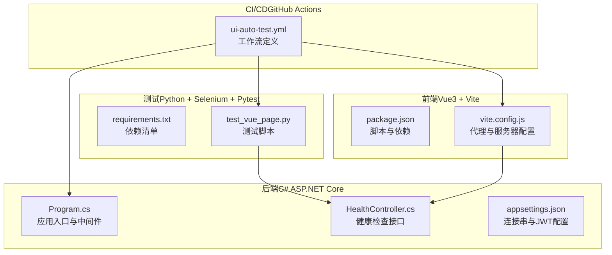
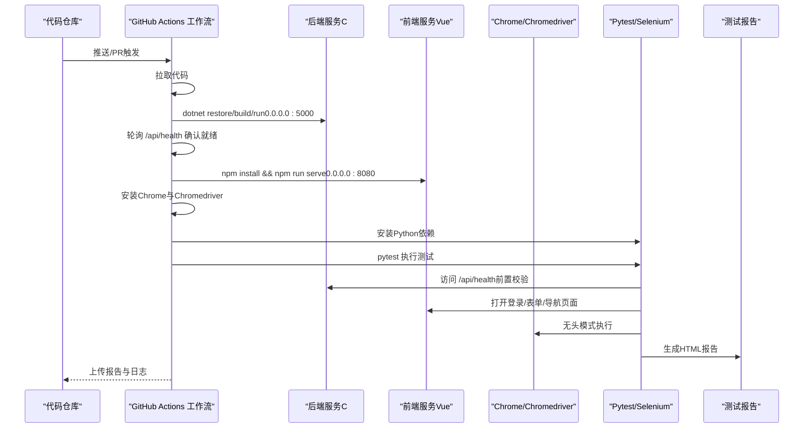
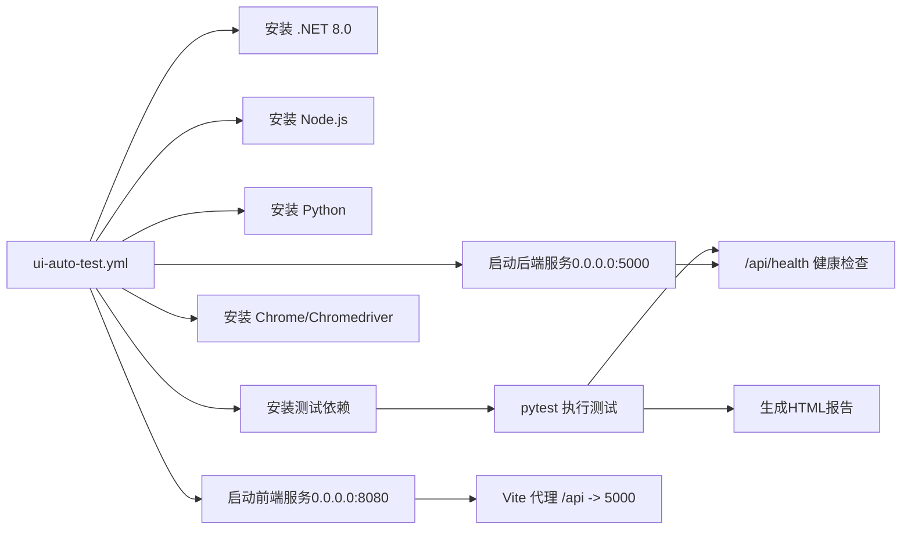

# CI/CD执行流程与阶段

<cite>
**本文引用的文件**
- [README.md](file://vue-csharp-ui-auto/README.md)
- [ui-auto-test.yml](file://.github/workflows/ui-auto-test.yml)
- [Program.cs](file://vue-csharp-ui-auto/Backend/Program.cs)
- [appsettings.json](file://vue-csharp-ui-auto/Backend/appsettings.json)
- [HealthController.cs](file://vue-csharp-ui-auto/Backend/Controllers/HealthController.cs)
- [package.json](file://vue-csharp-ui-auto/Frontend/package.json)
- [vite.config.js](file://vue-csharp-ui-auto/Frontend/vite.config.js)
- [requirements.txt](file://vue-csharp-ui-auto/UiAutoTest/requirements.txt)
- [test_vue_page.py](file://vue-csharp-ui-auto/UiAutoTest/test_vue_page.py)
</cite>

## 目录
1. [引言](#引言)
2. [项目结构](#项目结构)
3. [核心组件](#核心组件)
4. [架构总览](#架构总览)
5. [详细阶段分析](#详细阶段分析)
6. [依赖关系分析](#依赖关系分析)
7. [性能与稳定性考量](#性能与稳定性考量)
8. [故障排查指南](#故障排查指南)
9. [结论](#结论)
10. [附录](#附录)

## 引言
本文件面向CI/CD流水线执行流程，围绕“从代码提交到测试完成”的完整生命周期，系统梳理并解释以下阶段：
- 环境准备（安装.NET 8.0、Node.js、Python及依赖）
- 后端服务启动（dotnet run）
- 前端服务启动（npm run serve）
- 等待服务就绪策略
- Selenium测试脚本执行
- 测试结果收集与报告生成

同时，结合工作流配置与项目代码，明确各阶段的依赖关系与潜在失败点，并提供可操作的排查建议。

## 项目结构
该项目采用前后端分离架构，包含：
- 后端（C# ASP.NET Core）：提供健康检查与业务接口，支持跨域访问，使用内存数据库以避免污染生产数据
- 前端（Vue3 + Vite）：通过代理将 /api 请求转发至后端，提供登录、首页、表单等页面
- UI自动化测试（Python + Selenium + Pytest）：在无头Chrome环境下执行，生成HTML测试报告

图表来源
- [Program.cs](file://vue-csharp-ui-auto/Backend/Program.cs#L1-L55)
- [HealthController.cs](file://vue-csharp-ui-auto/Backend/Controllers/HealthController.cs#L1-L15)
- [appsettings.json](file://vue-csharp-ui-auto/Backend/appsettings.json#L1-L18)
- [package.json](file://vue-csharp-ui-auto/Frontend/package.json#L1-L19)
- [vite.config.js](file://vue-csharp-ui-auto/Frontend/vite.config.js#L1-L22)
- [requirements.txt](file://vue-csharp-ui-auto/UiAutoTest/requirements.txt#L1-L4)
- [test_vue_page.py](file://vue-csharp-ui-auto/UiAutoTest/test_vue_page.py#L1-L161)
- [ui-auto-test.yml](file://.github/workflows/ui-auto-test.yml#L1-L116)

章节来源
- [README.md](file://vue-csharp-ui-auto/README.md#L1-L113)
- [ui-auto-test.yml](file://.github/workflows/ui-auto-test.yml#L1-L116)

## 核心组件
- 后端服务：通过 Program.cs 注册控制器、CORS、Swagger（开发环境）、Entity Framework 内存数据库，并在开发环境启用 HTTPS 与授权中间件
- 健康检查接口：HealthController 提供 /api/health，供流水线轮询确认后端可用
- 前端服务：Vite 在 0.0.0.0:8080 启动，配置 /api 代理到后端 5000 端口
- 测试脚本：Pytest 驱动 Selenium，使用无头Chrome，生成 HTML 报告

章节来源
- [Program.cs](file://vue-csharp-ui-auto/Backend/Program.cs#L1-L55)
- [HealthController.cs](file://vue-csharp-ui-auto/Backend/Controllers/HealthController.cs#L1-L15)
- [vite.config.js](file://vue-csharp-ui-auto/Frontend/vite.config.js#L1-L22)
- [requirements.txt](file://vue-csharp-ui-auto/UiAutoTest/requirements.txt#L1-L4)
- [test_vue_page.py](file://vue-csharp-ui-auto/UiAutoTest/test_vue_page.py#L1-L161)

## 架构总览
下图展示CI/CD流水线中各阶段的顺序与交互关系，以及测试脚本对后端健康检查接口的依赖。

图表来源
- [ui-auto-test.yml](file://.github/workflows/ui-auto-test.yml#L1-L116)
- [HealthController.cs](file://vue-csharp-ui-auto/Backend/Controllers/HealthController.cs#L1-L15)
- [test_vue_page.py](file://vue-csharp-ui-auto/UiAutoTest/test_vue_page.py#L1-L161)

## 详细阶段分析

### 阶段一：环境准备（安装.NET 8.0、Node.js、Python及依赖）
- .NET 8.0：通过 actions/setup-dotnet@v4 安装指定版本，随后在后端目录执行 dotnet restore 与 dotnet build
- Node.js：通过 actions/setup-node@v4 安装指定版本并缓存依赖，前端目录执行 npm install
- Python：通过 actions/setup-python@v5 安装指定版本，UiAutoTest 目录执行 pip install -r requirements.txt
- 浏览器与驱动：安装 Chrome 并动态获取对应 Chromedriver 版本，写入 GITHUB_ENV 供后续使用

潜在失败点
- .NET SDK 版本不匹配或网络受限导致 restore 失败
- Node 缓存失效或 package-lock.json 不一致导致安装缓慢或失败
- Python 依赖安装失败（网络、权限或版本冲突）

排查建议
- 确认 .NET 8.0 与 Node.js 版本与项目要求一致
- 检查 requirements.txt 中依赖版本范围，必要时锁定版本
- 如网络不稳定，考虑使用国内镜像源或离线包

章节来源
- [ui-auto-test.yml](file://.github/workflows/ui-auto-test.yml#L1-L116)
- [requirements.txt](file://vue-csharp-ui-auto/UiAutoTest/requirements.txt#L1-L4)
- [package.json](file://vue-csharp-ui-auto/Frontend/package.json#L1-L19)

### 阶段二：后端服务启动（dotnet run）
- 后端在 Ubuntu 环境后台运行，绑定 0.0.0.0:5000，便于外部访问
- 启动后立即休眠等待，随后通过轮询 /api/health 确认服务可用
- 超时控制：使用 timeout 30 限制等待时间，失败时输出后端日志并中断流水线

潜在失败点
- 端口 5000 被占用或防火墙阻断
- 健康检查接口未正确映射或CORS未允许前端域名
- EF 内存数据库初始化异常导致启动失败

排查建议
- 确保监听地址为 0.0.0.0，且端口未被占用
- 检查 Program.cs 中的 CORS 策略与路由注册
- 查看 backend.log 获取启动异常堆栈

章节来源
- [ui-auto-test.yml](file://.github/workflows/ui-auto-test.yml#L1-L116)
- [Program.cs](file://vue-csharp-ui-auto/Backend/Program.cs#L1-L55)
- [HealthController.cs](file://vue-csharp-ui-auto/Backend/Controllers/HealthController.cs#L1-L15)

### 阶段三：前端服务启动（npm run serve）
- 前端在 Ubuntu 环境后台运行，绑定 0.0.0.0:8080
- 通过 Vite 的 server.host 与 server.port 设置，代理 /api 到后端 5000
- 启动后额外休眠 15 秒，以应对 Vue 启动较慢的情况

潜在失败点
- 端口 8080 被占用或与后端冲突
- 代理配置错误导致 /api 请求无法到达后端
- 依赖安装失败或 Node 版本不兼容

排查建议
- 确认 vite.config.js 的 host/port 与工作流启动参数一致
- 检查 /api 代理 target 是否指向 0.0.0.0:5000
- 若启动缓慢，适当延长等待时间

章节来源
- [ui-auto-test.yml](file://.github/workflows/ui-auto-test.yml#L1-L116)
- [vite.config.js](file://vue-csharp-ui-auto/Frontend/vite.config.js#L1-L22)
- [package.json](file://vue-csharp-ui-auto/Frontend/package.json#L1-L19)

### 阶段四：等待服务就绪策略
- 后端：使用 curl 轮询 /api/health，最多等待 30 秒，失败则输出后端日志并中断
- 前端：启动后等待 15 秒，确保静态资源与代理生效

潜在失败点
- 健康检查接口未暴露或返回非 200
- 轮询间隔过短导致误判
- 网络隔离或代理未生效

排查建议
- 在本地验证 curl http://localhost:5000/api/health 可达
- 调整轮询间隔与超时阈值，平衡稳定性与速度

章节来源
- [ui-auto-test.yml](file://.github/workflows/ui-auto-test.yml#L1-L116)
- [HealthController.cs](file://vue-csharp-ui-auto/Backend/Controllers/HealthController.cs#L1-L15)

### 阶段五：Selenium测试脚本执行
- 测试前置：使用 requests 对 /api/health 进行快速可用性校验，避免因后端问题导致 UI 测试失败
- 浏览器：使用无头 Chrome，设置窗口大小与沙箱参数，适配 CI 环境
- 用例覆盖：
  - 登录页面与后端认证接口联动
  - 表单提交与后端数据处理联动
  - 页面导航与路由跳转验证
- 结果：每个用例结束后均关闭浏览器，保证资源释放

潜在失败点
- 浏览器驱动缺失或版本不匹配
- 页面元素定位依赖 data-testid 或 ID，若变更需同步更新
- 等待策略不足导致元素未加载完成

排查建议
- 确认 Chromedriver 路径已注入 GITHUB_ENV
- 使用稳定的定位策略（优先 data-testid），减少对动态 class 的依赖
- 适当增加显式等待时间，避免竞态条件

章节来源
- [test_vue_page.py](file://vue-csharp-ui-auto/UiAutoTest/test_vue_page.py#L1-L161)
- [ui-auto-test.yml](file://.github/workflows/ui-auto-test.yml#L1-L116)

### 阶段六：测试结果收集与报告生成
- 使用 pytest 的 --html 参数生成 HTML 报告，文件名固定为 ui-test-report.html
- 将报告作为工作流制品上传，保留 7 天，便于回溯与审查
- 日志采集：后端日志随失败一起输出，前端日志在注释中预留上传步骤

潜在失败点
- 报告路径或文件名不匹配导致上传失败
- 工作流权限不足导致制品上传失败

排查建议
- 确认报告路径与上传配置一致
- 检查工作流权限与存储配额

章节来源
- [ui-auto-test.yml](file://.github/workflows/ui-auto-test.yml#L1-L116)

## 依赖关系分析
- 后端依赖：CORS 允许前端访问；EF 内存数据库用于测试；健康检查接口对外暴露
- 前端依赖：Vite 代理将 /api 请求转发至后端；端口与主机绑定需与后端一致
- 测试依赖：Selenium + Chrome/Chromedriver；Pytest + pytest-html；requests 用于前置校验
- 工作流依赖：actions/setup-*、upload-artifact、curl 轮询

图表来源
- [ui-auto-test.yml](file://.github/workflows/ui-auto-test.yml#L1-L116)
- [vite.config.js](file://vue-csharp-ui-auto/Frontend/vite.config.js#L1-L22)
- [HealthController.cs](file://vue-csharp-ui-auto/Backend/Controllers/HealthController.cs#L1-L15)
- [requirements.txt](file://vue-csharp-ui-auto/UiAutoTest/requirements.txt#L1-L4)
- [test_vue_page.py](file://vue-csharp-ui-auto/UiAutoTest/test_vue_page.py#L1-L161)

## 性能与稳定性考量
- 启动等待时间：前端启动较慢，建议根据实际环境适当延长等待时间
- 轮询策略：后端健康检查使用超时与轮询，避免长时间阻塞
- 资源隔离：前端与后端分别绑定不同端口，避免端口冲突
- 代理一致性：Vite 代理与工作流启动参数保持一致，减少网络层不确定性
- 报告与日志：生成 HTML 报告并上传制品，便于快速定位问题

## 故障排查指南
- 后端启动失败
  - 现象：健康检查轮询超时或后端日志输出
  - 排查：检查 Program.cs 中 CORS、路由与数据库初始化；确认端口未被占用
  - 参考
    - [ui-auto-test.yml](file://.github/workflows/ui-auto-test.yml#L1-L116)
    - [Program.cs](file://vue-csharp-ui-auto/Backend/Program.cs#L1-L55)
- 前端启动失败
  - 现象：8080 端口冲突或代理无效
  - 排查：确认 vite.config.js 的 host/port 与启动参数一致；检查代理 target
  - 参考
    - [vite.config.js](file://vue-csharp-ui-auto/Frontend/vite.config.js#L1-L22)
    - [ui-auto-test.yml](file://.github/workflows/ui-auto-test.yml#L1-L116)
- 浏览器驱动问题
  - 现象：Selenium 初始化失败或版本不匹配
  - 排查：确认 Chromedriver 路径已注入 GITHUB_ENV；版本与 Chrome 版本匹配
  - 参考
    - [ui-auto-test.yml](file://.github/workflows/ui-auto-test.yml#L1-L116)
    - [test_vue_page.py](file://vue-csharp-ui-auto/UiAutoTest/test_vue_page.py#L1-L161)
- 测试用例失败
  - 现象：页面元素定位不到或导航失败
  - 排查：核对 data-testid 与 ID 是否变更；适当增加等待时间
  - 参考
    - [test_vue_page.py](file://vue-csharp-ui-auto/UiAutoTest/test_vue_page.py#L1-L161)
- 报告与日志
  - 现象：报告未上传或日志缺失
  - 排查：确认报告路径与上传配置一致；必要时开启前端日志上传
  - 参考
    - [ui-auto-test.yml](file://.github/workflows/ui-auto-test.yml#L1-L116)

## 结论
该流水线以清晰的阶段划分与严格的就绪检查，确保前后端联调测试的稳定性。通过健康检查、代理配置与无头浏览器执行，有效覆盖登录、表单与导航等关键场景。建议在实际环境中根据启动耗时与网络状况微调等待与超时参数，并持续优化测试定位策略与报告质量。

## 附录
- 端口约定
  - 后端：5000（0.0.0.0）
  - 前端：8080（0.0.0.0）
- 关键接口
  - /api/health（健康检查）
- 测试定位建议
  - 优先使用 data-testid 或稳定 ID
  - 避免依赖动态 class
- 本地复现
  - 后端：dotnet run
  - 前端：npm run serve
  - 测试：pip install -r requirements.txt；python test_vue_page.py