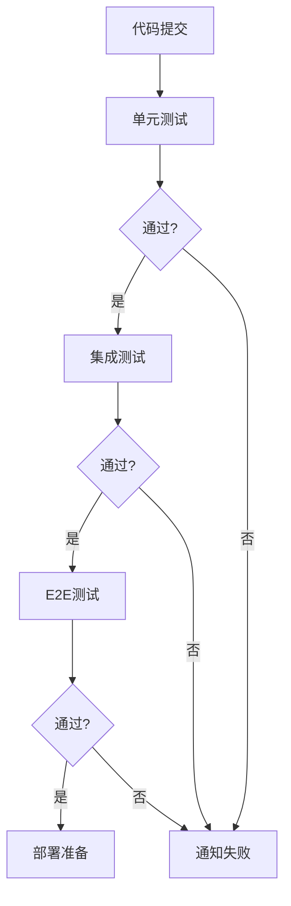
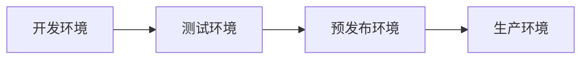

# CI/CD最佳实践与扩展建议

<cite>
**本文档引用文件**  
- [Dockerfile](file://ConsoleApp1/Dockerfile)
- [ConsoleApp1.csproj](file://ConsoleApp1/ConsoleApp1.csproj)
- [Backend.csproj](file://vue-csharp-ui-auto/Backend/Backend.csproj)
- [package.json](file://vue-csharp-ui-auto/Frontend/package.json)
- [requirements.txt](file://vue-csharp-ui-auto/UiAutoTest/requirements.txt)
- [README.md](file://vue-csharp-ui-auto/README.md)
</cite>

## 目录
1. [项目概述](#项目概述)
2. [当前CI/CD流程分析](#当前cicd流程分析)
3. [构建优化：依赖缓存策略](#构建优化依赖缓存策略)
4. [代码质量检查集成](#代码质量检查集成)
5. [测试阶段分离实践](#测试阶段分离实践)
6. [通知机制配置](#通知机制配置)
7. [Docker镜像构建与推送](#docker镜像构建与推送)
8. [未来可扩展方向](#未来可扩展方向)
9. [总结](#总结)

## 项目概述

本项目为一个包含Vue前端、C#后端及Python UI自动化测试的全栈智能体项目。项目结构清晰，包含多个子系统，具备典型的多语言、多组件协作特征。其CI/CD流程基于GitHub Actions实现，通过自动化测试保障系统稳定性。

项目主要由三部分构成：
- **前端**：Vue3 + Vite构建的单页应用
- **后端**：ASP.NET Core 8.0 Web API服务
- **自动化测试**：Python + Selenium实现的UI端到端测试

**Section sources**
- [README.md](file://vue-csharp-ui-auto/README.md#L1-L28)

## 当前CI/CD流程分析

根据`README.md`中的描述，项目已配置GitHub Actions工作流（`.github/workflows/ui-auto-test.yml`），实现了完整的UI自动化测试流水线。尽管该文件未在文件系统中找到，但文档明确描述了其执行流程：

1. 拉取代码
2. 配置C#运行环境并启动后端服务
3. 配置Node.js环境并启动前端服务
4. 安装Chrome浏览器及驱动
5. 配置Python环境并安装测试依赖
6. 执行UI自动化测试脚本
7. 上传测试报告和日志

该流程实现了前后端联调测试，验证了真实用户场景下的系统行为。

**Section sources**
- [README.md](file://vue-csharp-ui-auto/README.md#L52-L64)

## 构建优化：依赖缓存策略

当前流程每次运行均重新安装所有依赖，导致构建时间较长。建议引入缓存机制以显著提升效率。

### NuGet包缓存（C#后端）
```yaml
- name: Cache NuGet packages
  uses: actions/cache@v3
  with:
    path: ~/.nuget/packages
    key: ${{ runner.os }}-nuget-${{ hashFiles('**/packages.lock.json') }}
    restore-keys: |
      ${{ runner.os }}-nuet-${{ hashFiles('**/packages.lock.json') }}
      ${{ runner.os }}-nuget-
```

### npm包缓存（Vue前端）
```yaml
- name: Cache Node modules
  uses: actions/cache@v3
  with:
    path: node_modules
    key: ${{ runner.os }}-node-${{ hashFiles('**/package-lock.json') }}
    restore-keys: |
      ${{ runner.os }}-node-
```

### pip包缓存（Python测试）
```yaml
- name: Cache Python packages
  uses: actions/cache@v3
  with:
    path: ~/.cache/pip
    key: ${{ runner.os }}-pip-${{ hashFiles('**/requirements.txt') }}
```

**Section sources**
- [Backend.csproj](file://vue-csharp-ui-auto/Backend/Backend.csproj)
- [package.json](file://vue-csharp-ui-auto/Frontend/package.json)
- [requirements.txt](file://vue-csharp-ui-auto/UiAutoTest/requirements.txt)

## 代码质量检查集成

当前流程缺乏静态代码分析环节。建议引入以下工具提升代码质量：

### C#代码质量检查
集成SonarQube扫描：
```yaml
- name: Build and Analyze with SonarQube
  run: |
    dotnet tool install --global dotnet-sonarscanner
    dotnet sonarscanner begin /k:"vue-csharp-ui-auto" /d:sonar.login="${{ secrets.SONAR_TOKEN }}"
    dotnet build Backend/Backend.csproj --no-incremental
    dotnet sonarscanner end /d:sonar.login="${{ secrets.SONAR_TOKEN }}"
```

### Vue代码质量检查
集成ESLint：
```yaml
- name: Install ESLint
  run: |
    npm install eslint --save-dev
- name: Run ESLint
  run: |
    npm run lint
```

建议在`package.json`中添加lint脚本：
```json
"scripts": {
  "lint": "eslint src --ext .js,.vue"
}
```

**Section sources**
- [Backend.csproj](file://vue-csharp-ui-auto/Backend/Backend.csproj)
- [package.json](file://vue-csharp-ui-auto/Frontend/package.json)

## 测试阶段分离实践

当前流程将所有测试集中执行，建议按测试类型分阶段执行，便于问题定位和资源管理。

### 分阶段测试策略


**Diagram sources**
- [README.md](file://vue-csharp-ui-auto/README.md#L46-L51)

### 具体实施建议
1. **单元测试**：针对C#服务和Vue组件的独立逻辑测试
2. **集成测试**：验证前后端API接口连通性
3. **E2E测试**：使用Selenium模拟用户操作全流程

每个阶段独立运行，失败时立即终止并通知。

**Section sources**
- [README.md](file://vue-csharp-ui-auto/README.md#L46-L51)

## 通知机制配置

当前流程缺乏主动通知能力。建议配置多通道通知机制。

### Slack通知集成
```yaml
- name: Send Slack Notification on Failure
  if: failure()
  uses: slackapi/slack-github-action@v1.23.0
  with:
    webhook-url: ${{ secrets.SLACK_WEBHOOK }}
    channel: ci-cd-alerts
    message: 'CI/CD流水线失败: ${{ github.workflow }} @ ${{ github.ref }}'
```

### 邮件通知
```yaml
- name: Send Email on Success/Failure
  uses: dawidd6/action-send-mail@v3
  if: always()
  with:
    server_address: smtp.gmail.com
    server_port: 587
    username: ${{ secrets.EMAIL_USERNAME }}
    password: ${{ secrets.EMAIL_PASSWORD }}
    subject: CI/CD Status: ${{ job.status }}
    to: team@example.com
    from: "CI/CD Bot"
```

**Section sources**
- [README.md](file://vue-csharp-ui-auto/README.md)

## Docker镜像构建与推送

项目已包含Dockerfile，但未集成到CI/CD流程中。建议完善镜像构建与发布流程。

### Docker镜像构建
```yaml
- name: Build Docker Image
  run: |
    docker build -t vue-csharp-ui-auto-backend:latest ./Backend
    docker build -t vue-csharp-ui-auto-frontend:latest ./Frontend
```

### 推送至容器注册中心
```yaml
- name: Push to Docker Hub
  run: |
    echo "${{ secrets.DOCKER_PASSWORD }}" | docker login -u ${{ secrets.DOCKER_USERNAME }} --password-stdin
    docker tag vue-csharp-ui-auto-backend:latest ${{ secrets.DOCKER_USERNAME }}/vue-csharp-ui-auto-backend:${{ github.sha }}
    docker push ${{ secrets.DOCKER_USERNAME }}/vue-csharp-ui-auto-backend:${{ github.sha }}
```

**Section sources**
- [Dockerfile](file://ConsoleApp1/Dockerfile)

## 未来可扩展方向

### 多环境部署
建立开发、测试、预发布、生产多环境部署流水线：


支持通过分支或标签触发不同环境部署：
- `dev`分支 → 开发环境
- `test`分支 → 测试环境
- `main`分支 + tag → 生产环境

**Diagram sources**
- [README.md](file://vue-csharp-ui-auto/README.md)

### 手动审批流程
在关键环境（如生产）部署前添加手动审批：
```yaml
- name: Manual Approval for Production
  uses: trstringer/manual-approval@v1
  if: github.ref == 'refs/heads/main'
  with:
    approval-token: ${{ secrets.APPROVAL_TOKEN }}
    comment: "Deploy to production?"
```

### 蓝绿部署与滚动更新
利用Kubernetes实现零停机部署：
- 蓝绿部署：同时运行新旧版本，流量切换
- 滚动更新：逐步替换实例，平滑过渡

### 自动化回滚机制
基于健康检查和监控指标实现自动回滚：
- 部署后持续监控API响应时间、错误率
- 超过阈值自动触发回滚
- 通知团队进行问题排查

**Section sources**
- [README.md](file://vue-csharp-ui-auto/README.md)

## 总结

本项目已具备基础的CI/CD能力，通过GitHub Actions实现了UI自动化测试。为进一步提升交付效率与质量，建议：

1. **优化构建速度**：引入NuGet、npm、pip依赖缓存
2. **增强代码质量**：集成SonarQube、ESLint等静态分析工具
3. **分层测试策略**：分离单元、集成、E2E测试阶段
4. **完善通知机制**：配置Slack、邮件等多通道通知
5. **强化容器化**：将Docker镜像构建与推送集成到流水线
6. **扩展部署能力**：支持多环境部署与手动审批流程

通过上述优化，可构建更加高效、可靠、可扩展的CI/CD体系，为项目持续交付提供坚实保障。

**Section sources**
- [README.md](file://vue-csharp-ui-auto/README.md)
- [Dockerfile](file://ConsoleApp1/Dockerfile)
- [package.json](file://vue-csharp-ui-auto/Frontend/package.json)