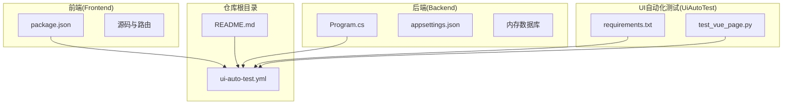
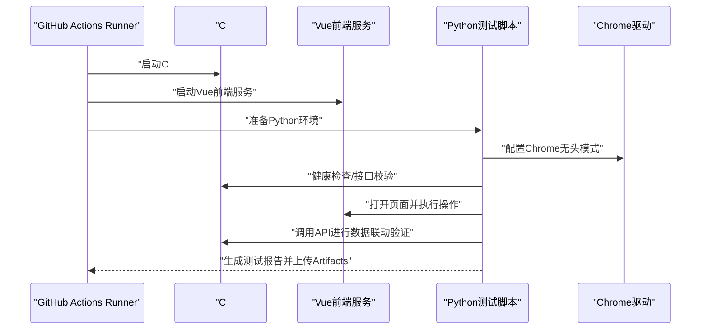
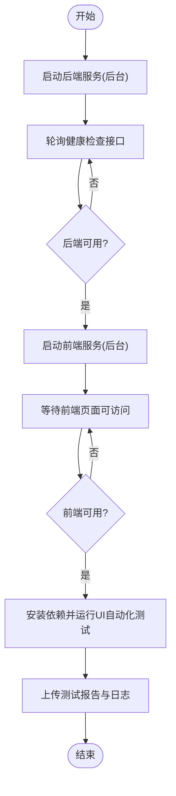
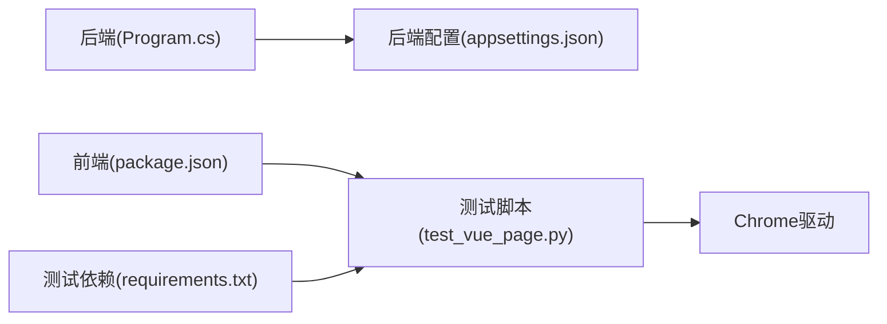

# GitHub Actions工作流结构

<cite>
**本文引用的文件**
- [README.md](file://vue-csharp-ui-auto/README.md)
- [test_vue_page.py](file://vue-csharp-ui-auto/UiAutoTest/test_vue_page.py)
- [requirements.txt](file://vue-csharp-ui-auto/UiAutoTest/requirements.txt)
- [Program.cs](file://vue-csharp-ui-auto/Backend/Program.cs)
- [package.json](file://vue-csharp-ui-auto/Frontend/package.json)
- [appsettings.json](file://vue-csharp-ui-auto/Backend/appsettings.json)
</cite>

## 目录
1. [简介](#简介)
2. [项目结构](#项目结构)
3. [核心组件](#核心组件)
4. [架构总览](#架构总览)
5. [详细组件分析](#详细组件分析)
6. [依赖关系分析](#依赖关系分析)
7. [性能考虑](#性能考虑)
8. [故障排查指南](#故障排查指南)
9. [结论](#结论)
10. [附录](#附录)

## 简介
本文件面向智能体项目中的GitHub Actions工作流，基于仓库中README.md对CI/CD流程的描述，系统性地推导并文档化UI自动化测试工作流的典型结构。重点覆盖：
- 触发机制（如push事件）
- Job划分（如build、test）
- 运行器环境（ubuntu-latest）
- 步骤执行顺序（代码检出、依赖安装、服务启动、测试执行）
- 并行任务协调前后端服务启动与UI自动化测试的同步问题
- 提供标准的YAML配置示例与关键字段说明

## 项目结构
该仓库采用“前后端分离 + UI自动化测试”的组织方式，包含：
- 前端（Vue3）：位于Frontend目录，使用Vite作为开发服务器
- 后端（C# ASP.NET Core）：位于Backend目录，提供健康检查、认证、数据提交等API
- UI自动化测试（Python+Selenium）：位于UiAutoTest目录，包含测试脚本与依赖清单
- GitHub Actions工作流：位于.github/workflows/ui-auto-test.yml（根据README.md描述）

图表来源
- [README.md](file://vue-csharp-ui-auto/README.md#L1-L113)
- [package.json](file://vue-csharp-ui-auto/Frontend/package.json#L1-L19)
- [Program.cs](file://vue-csharp-ui-auto/Backend/Program.cs#L1-L55)
- [appsettings.json](file://vue-csharp-ui-auto/Backend/appsettings.json#L1-L18)
- [requirements.txt](file://vue-csharp-ui-auto/UiAutoTest/requirements.txt#L1-L4)
- [test_vue_page.py](file://vue-csharp-ui-auto/UiAutoTest/test_vue_page.py#L1-L161)

章节来源
- [README.md](file://vue-csharp-ui-auto/README.md#L1-L113)

## 核心组件
- 触发机制：根据README.md描述，推送后自动触发工作流
- 运行器环境：使用ubuntu-latest
- Job划分：至少包含“启动后端服务”“启动前端服务”“安装测试依赖并执行UI自动化测试”
- 步骤顺序：拉取代码 → 配置C#运行环境 → 启动C#后端服务 → 配置Node.js环境 → 启动Vue前端服务 → 安装Chrome与驱动 → 配置Python环境 → 安装测试依赖 → 运行UI自动化测试 → 上传测试报告与日志

章节来源
- [README.md](file://vue-csharp-ui-auto/README.md#L52-L65)

## 架构总览
下图展示工作流在CI环境中的整体交互：后端服务与前端服务分别在后台运行，UI自动化测试脚本通过Selenium连接前端页面并调用后端API进行验证。

图表来源
- [README.md](file://vue-csharp-ui-auto/README.md#L52-L65)
- [test_vue_page.py](file://vue-csharp-ui-auto/UiAutoTest/test_vue_page.py#L1-L161)

## 详细组件分析

### 触发机制与Job划分
- 触发事件：根据README.md描述，推送后自动触发工作流
- Job划分：建议至少包含两个并行Job或流水线阶段：
  - 后端服务Job：负责拉取代码、配置C#运行环境、启动后端服务
  - 前端服务Job：负责拉取代码、配置Node.js环境、启动前端服务
  - 测试Job：在后端与前端均可用的前提下，安装Chrome与驱动、Python依赖，运行UI自动化测试并上传报告

章节来源
- [README.md](file://vue-csharp-ui-auto/README.md#L52-L65)

### 运行器环境与平台兼容性
- 运行器：ubuntu-latest
- 平台特性：需要在无桌面环境下运行Chrome（使用无头模式），并正确配置ChromeDriver

章节来源
- [test_vue_page.py](file://vue-csharp-ui-auto/UiAutoTest/test_vue_page.py#L22-L35)

### 步骤执行顺序与关键要点
- 代码检出：使用官方actions/checkout
- C#后端服务：
  - 配置运行时（如dotnet）
  - 启动后端服务（监听0.0.0.0:5000，确保可被CI环境访问）
- Node.js前端服务：
  - 安装依赖并启动开发服务器（监听0.0.0.0:8080）
  - 注意前端启动时间较长，需设置合理的等待策略
- Chrome与驱动：
  - 安装Chrome与ChromeDriver
  - 使用无头模式以适配CI环境
- Python测试环境：
  - 安装pytest、pytest-html、selenium、requests等依赖
- UI自动化测试：
  - 前置校验后端健康检查接口
  - 通过Selenium访问前端页面，执行登录、表单提交、页面导航等用例
  - 生成HTML测试报告并上传Artifacts

章节来源
- [README.md](file://vue-csharp-ui-auto/README.md#L52-L65)
- [test_vue_page.py](file://vue-csharp-ui-auto/UiAutoTest/test_vue_page.py#L1-L161)
- [requirements.txt](file://vue-csharp-ui-auto/UiAutoTest/requirements.txt#L1-L4)
- [Program.cs](file://vue-csharp-ui-auto/Backend/Program.cs#L1-L55)
- [package.json](file://vue-csharp-ui-auto/Frontend/package.json#L1-L19)

### 并行任务协调与同步问题
为避免前后端服务启动不同步导致测试失败，建议采用以下策略：
- 使用“后台启动 + 健康检查 + 轮询等待”模式：
  - 后端Job：启动后端服务并在后台运行，同时轮询健康检查接口直到可用
  - 前端Job：启动前端服务并在后台运行，等待前端页面可访问
- 在测试Job中增加前置条件：
  - 先通过requests校验后端健康检查接口
  - 再启动Selenium并打开前端页面，设置显式等待与隐式等待
- 使用Artifacts上传测试报告与日志，便于排障

图表来源
- [README.md](file://vue-csharp-ui-auto/README.md#L52-L65)
- [test_vue_page.py](file://vue-csharp-ui-auto/UiAutoTest/test_vue_page.py#L1-L161)

### 关键字段与最佳实践
- name：工作流名称
- on.push：触发事件
- jobs.<job_id>.runs-on：运行器环境（ubuntu-latest）
- jobs.<job_id>.steps：按序执行的步骤
- jobs.<job_id>.needs：定义Job之间的依赖关系
- env：环境变量（如端口、主机地址）
- strategy.matrix：并行矩阵（可选）
- continue-on-error：允许部分步骤失败不影响整体
- outputs/needs.outputs：跨Job传递状态
- artifacts：上传测试报告与日志

章节来源
- [README.md](file://vue-csharp-ui-auto/README.md#L52-L65)

## 依赖关系分析
- 后端服务依赖：
  - Program.cs中启用CORS、内存数据库、控制器映射
  - appsettings.json中包含连接字符串与JWT配置
- 前端服务依赖：
  - package.json中声明依赖与脚本（vite serve）
- UI自动化测试依赖：
  - requirements.txt中声明selenium、pytest、pytest-html、requests
  - test_vue_page.py中使用requests校验后端健康检查，使用selenium驱动Chrome

图表来源
- [Program.cs](file://vue-csharp-ui-auto/Backend/Program.cs#L1-L55)
- [appsettings.json](file://vue-csharp-ui-auto/Backend/appsettings.json#L1-L18)
- [package.json](file://vue-csharp-ui-auto/Frontend/package.json#L1-L19)
- [requirements.txt](file://vue-csharp-ui-auto/UiAutoTest/requirements.txt#L1-L4)
- [test_vue_page.py](file://vue-csharp-ui-auto/UiAutoTest/test_vue_page.py#L1-L161)

章节来源
- [Program.cs](file://vue-csharp-ui-auto/Backend/Program.cs#L1-L55)
- [appsettings.json](file://vue-csharp-ui-auto/Backend/appsettings.json#L1-L18)
- [package.json](file://vue-csharp-ui-auto/Frontend/package.json#L1-L19)
- [requirements.txt](file://vue-csharp-ui-auto/UiAutoTest/requirements.txt#L1-L4)
- [test_vue_page.py](file://vue-csharp-ui-auto/UiAutoTest/test_vue_page.py#L1-L161)

## 性能考虑
- 前端启动时间较长，应设置合理的等待策略与超时时间
- 使用无头模式减少资源消耗
- 将测试报告与日志上传为Artifacts，便于快速定位问题
- 在CI环境中尽量复用缓存（如依赖缓存），缩短构建时间

## 故障排查指南
- 后端服务未启动或端口占用：
  - 确认后端监听0.0.0.0:5000且可通过网络访问
  - 使用健康检查接口进行前置校验
- 前端服务未启动或端口占用：
  - 确认前端监听0.0.0.0:8080且可通过网络访问
  - 增加等待时间，避免过早进入下一步
- Chrome与驱动不匹配：
  - 明确Chrome版本与ChromeDriver版本对应关系
  - 在CI中固定版本或使用自动匹配工具
- 测试失败：
  - 检查Artifacts中的测试报告与日志
  - 确认测试脚本中使用的元素定位符（如data-testid）与页面一致
  - 校验测试账号与密码与后端测试数据一致

章节来源
- [README.md](file://vue-csharp-ui-auto/README.md#L88-L113)
- [test_vue_page.py](file://vue-csharp-ui-auto/UiAutoTest/test_vue_page.py#L1-L161)

## 结论
基于README.md描述的CI/CD流程，本工作流以“前后端并行启动 + 健康检查 + UI自动化测试”为核心，通过合理的Job划分与同步策略，能够在ubuntu-latest运行器上稳定地完成端到端UI自动化测试。建议在实际配置中明确端口、主机地址、等待策略与Artifacts上传，以提升可靠性与可观测性。

## 附录
以下为标准的YAML配置示例（仅列出关键字段与注释，不包含具体代码内容）：
- name：工作流名称
- on.push：触发事件
- jobs.<job_id>.runs-on：ubuntu-latest
- jobs.<job_id>.steps：
  - 使用actions/checkout检出代码
  - 使用actions/setup-dotnet配置C#运行时（后端Job）
  - 使用actions/setup-node配置Node.js（前端Job）
  - 后端Job：启动后端服务并在后台运行；轮询健康检查接口直至可用
  - 前端Job：安装依赖并启动前端服务；等待页面可访问
  - 测试Job：安装Chrome与ChromeDriver；安装Python依赖；运行测试并生成HTML报告
  - 使用actions/upload-artifact上传测试报告与日志

章节来源
- [README.md](file://vue-csharp-ui-auto/README.md#L52-L65)