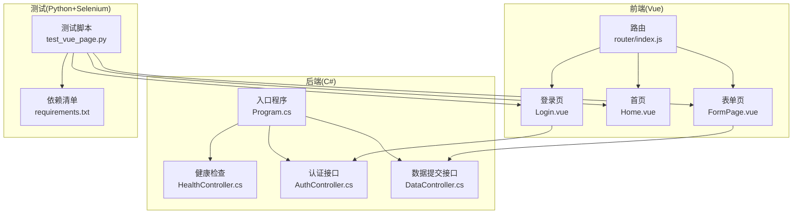
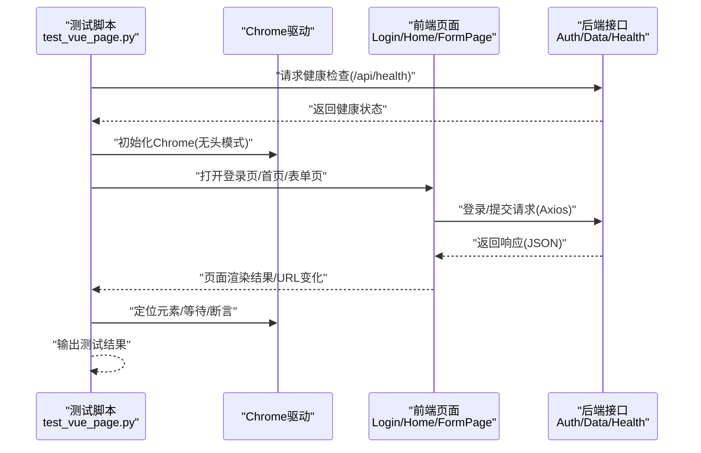
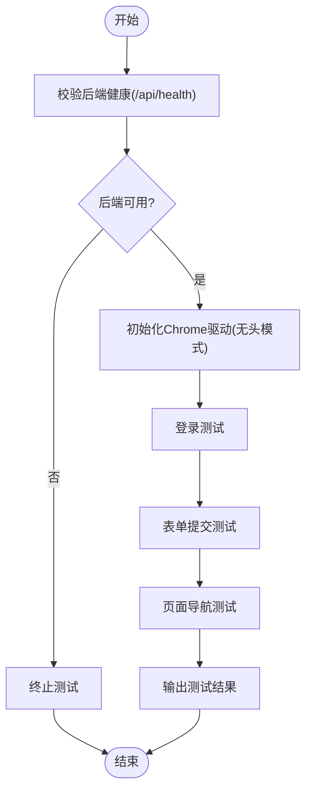
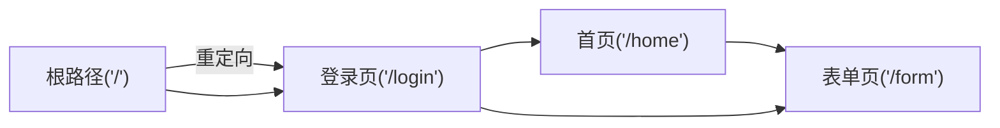
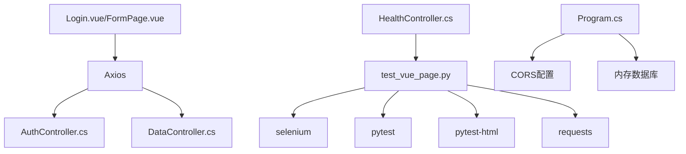

# UI自动化测试体系

<cite>
**本文引用的文件**
- [test_vue_page.py](file://vue-csharp-ui-auto/UiAutoTest/test_vue_page.py)
- [requirements.txt](file://vue-csharp-ui-auto/UiAutoTest/requirements.txt)
- [README.md](file://vue-csharp-ui-auto/README.md)
- [Login.vue](file://vue-csharp-ui-auto/Frontend/src/views/Login.vue)
- [Home.vue](file://vue-csharp-ui-auto/Frontend/src/views/Home.vue)
- [FormPage.vue](file://vue-csharp-ui-auto/Frontend/src/views/FormPage.vue)
- [router/index.js](file://vue-csharp-ui-auto/Frontend/src/router/index.js)
- [AuthController.cs](file://vue-csharp-ui-auto/Backend/Controllers/AuthController.cs)
- [DataController.cs](file://vue-csharp-ui-auto/Backend/Controllers/DataController.cs)
- [HealthController.cs](file://vue-csharp-ui-auto/Backend/Controllers/HealthController.cs)
- [Program.cs](file://vue-csharp-ui-auto/Backend/Program.cs)
</cite>

## 目录
1. [引言](#引言)
2. [项目结构](#项目结构)
3. [核心组件](#核心组件)
4. [架构总览](#架构总览)
5. [详细组件分析](#详细组件分析)
6. [依赖关系分析](#依赖关系分析)
7. [性能考虑](#性能考虑)
8. [故障排查指南](#故障排查指南)
9. [结论](#结论)
10. [附录](#附录)

## 引言
本文件系统性记录智能体项目中的UI自动化测试实现方案，围绕“Python + Selenium + ChromeDriver”的技术栈，模拟真实用户操作浏览器进行端到端验证。文档聚焦于测试脚本结构、WebDriver初始化、页面元素定位策略（如使用data-testid属性）、表单填写、按钮点击与结果断言等关键步骤；同时梳理测试覆盖的典型用户路径：登录验证、表单提交、页面导航；并说明依赖项版本要求、安装方法、测试执行命令与常见问题排查，帮助开发者快速运行与扩展测试套件。

## 项目结构
项目采用前后端分离架构：
- 前端：Vue3 应用，包含登录页、首页、表单页，路由以 history 模式管理页面导航。
- 后端：C# ASP.NET Core 应用，提供健康检查、认证与数据提交接口，并启用跨域支持。
- 测试：UiAutoTest 目录下包含 Python+Selenium 的测试脚本与依赖清单。

图表来源
- [router/index.js](file://vue-csharp-ui-auto/Frontend/src/router/index.js#L1-L33)
- [Login.vue](file://vue-csharp-ui-auto/Frontend/src/views/Login.vue#L1-L133)
- [Home.vue](file://vue-csharp-ui-auto/Frontend/src/views/Home.vue#L1-L51)
- [FormPage.vue](file://vue-csharp-ui-auto/Frontend/src/views/FormPage.vue#L1-L142)
- [Program.cs](file://vue-csharp-ui-auto/Backend/Program.cs#L1-L55)
- [HealthController.cs](file://vue-csharp-ui-auto/Backend/Controllers/HealthController.cs#L1-L15)
- [AuthController.cs](file://vue-csharp-ui-auto/Backend/Controllers/AuthController.cs#L1-L25)
- [DataController.cs](file://vue-csharp-ui-auto/Backend/Controllers/DataController.cs#L1-L25)
- [test_vue_page.py](file://vue-csharp-ui-auto/UiAutoTest/test_vue_page.py#L1-L161)
- [requirements.txt](file://vue-csharp-ui-auto/UiAutoTest/requirements.txt#L1-L4)

章节来源
- [README.md](file://vue-csharp-ui-auto/README.md#L1-L113)

## 核心组件
- 测试脚本 test_vue_page.py
  - 后端接口可用性前置校验：通过请求健康检查接口确保后端可用后再执行UI测试。
  - WebDriver初始化：配置Chrome无头模式参数，适配CI环境；设置隐式等待提升稳定性。
  - 测试用例组织：分别覆盖登录联动、表单提交、页面导航三大用户路径。
  - 元素定位策略：优先使用data-testid属性，其次使用ID、CSS选择器、部分链接文本等。
  - 断言与等待：使用WebDriverWait显式等待页面元素出现或URL变化，断言页面源码或元素文本。
- 依赖清单 requirements.txt
  - selenium、pytest、pytest-html、requests 四个包，明确版本号，用于驱动浏览器、运行测试、生成报告与后端健康检查。
- 前端页面与路由
  - Login.vue：包含用户名、密码输入框与提交按钮的data-testid标识，触发认证接口并跳转首页。
  - Home.vue：首页展示用户信息与导航链接。
  - FormPage.vue：表单输入姓名、邮箱，提交后显示来自后端的数据提交接口响应。
  - router/index.js：定义根路径重定向至登录页、以及登录页、首页、表单页的路由。
- 后端控制器
  - HealthController.cs：提供健康检查接口。
  - AuthController.cs：提供登录接口。
  - DataController.cs：提供数据提交接口。
  - Program.cs：启用CORS，允许前端访问；使用内存数据库进行测试。

章节来源
- [test_vue_page.py](file://vue-csharp-ui-auto/UiAutoTest/test_vue_page.py#L1-L161)
- [requirements.txt](file://vue-csharp-ui-auto/UiAutoTest/requirements.txt#L1-L4)
- [Login.vue](file://vue-csharp-ui-auto/Frontend/src/views/Login.vue#L1-L133)
- [Home.vue](file://vue-csharp-ui-auto/Frontend/src/views/Home.vue#L1-L51)
- [FormPage.vue](file://vue-csharp-ui-auto/Frontend/src/views/FormPage.vue#L1-L142)
- [router/index.js](file://vue-csharp-ui-auto/Frontend/src/router/index.js#L1-L33)
- [HealthController.cs](file://vue-csharp-ui-auto/Backend/Controllers/HealthController.cs#L1-L15)
- [AuthController.cs](file://vue-csharp-ui-auto/Backend/Controllers/AuthController.cs#L1-L25)
- [DataController.cs](file://vue-csharp-ui-auto/Backend/Controllers/DataController.cs#L1-L25)
- [Program.cs](file://vue-csharp-ui-auto/Backend/Program.cs#L1-L55)

## 架构总览
UI自动化测试的端到端流程如下：测试脚本先校验后端健康，再启动Chrome驱动打开前端页面，通过data-testid等稳定的选择器定位元素，模拟用户输入与点击，等待页面状态变化或URL跳转，最后断言页面内容或结果展示，从而完成登录验证、表单提交、页面导航等场景的端到端验证。

图表来源
- [test_vue_page.py](file://vue-csharp-ui-auto/UiAutoTest/test_vue_page.py#L1-L161)
- [Login.vue](file://vue-csharp-ui-auto/Frontend/src/views/Login.vue#L1-L133)
- [FormPage.vue](file://vue-csharp-ui-auto/Frontend/src/views/FormPage.vue#L1-L142)
- [AuthController.cs](file://vue-csharp-ui-auto/Backend/Controllers/AuthController.cs#L1-L25)
- [DataController.cs](file://vue-csharp-ui-auto/Backend/Controllers/DataController.cs#L1-L25)
- [HealthController.cs](file://vue-csharp-ui-auto/Backend/Controllers/HealthController.cs#L1-L15)

## 详细组件分析

### 测试脚本结构与流程
- 前置校验：调用后端健康检查接口，断言返回状态码为200，避免因后端异常导致测试失败。
- WebDriver初始化：配置Chrome无头模式参数（如窗口大小、禁用GPU、远程调试端口等），创建driver实例并设置隐式等待。
- 登录测试(test_vue_login_with_csharp_api)：
  - 打开登录页，等待用户名/密码输入框与提交按钮出现；
  - 使用data-testid定位输入框与按钮，输入测试凭据并点击；
  - 等待URL包含首页路径或页面源码包含首页文案，断言登录成功。
- 表单提交测试(test_vue_form_submit)：
  - 打开表单页，等待表单字段与提交按钮出现；
  - 输入姓名与邮箱，点击提交按钮；
  - 等待data-testid为“form-result”的元素出现，断言包含“提交成功”字样。
- 导航测试(test_vue_navigation)：
  - 打开根路径，验证重定向到登录页；
  - 登录成功后，点击导航链接进入表单页，断言URL与页面文案。
- 执行入口：直接运行脚本时依次执行上述三个测试用例。

图表来源
- [test_vue_page.py](file://vue-csharp-ui-auto/UiAutoTest/test_vue_page.py#L1-L161)

章节来源
- [test_vue_page.py](file://vue-csharp-ui-auto/UiAutoTest/test_vue_page.py#L1-L161)

### 元素定位策略与最佳实践
- data-testid优先：登录页与表单页均提供稳定的data-testid属性，便于测试脚本稳定定位。
- 多种定位方式并用：当无法使用data-testid时，采用ID、CSS选择器、部分链接文本等方式定位元素。
- 显式等待：对关键交互（如URL变化、元素出现）使用WebDriverWait，避免硬编码sleep。
- 断言策略：结合URL断言、页面源码断言与元素文本断言，确保多维度验证。

章节来源
- [Login.vue](file://vue-csharp-ui-auto/Frontend/src/views/Login.vue#L1-L133)
- [FormPage.vue](file://vue-csharp-ui-auto/Frontend/src/views/FormPage.vue#L1-L142)
- [test_vue_page.py](file://vue-csharp-ui-auto/UiAutoTest/test_vue_page.py#L1-L161)

### 用户路径覆盖与断言要点
- 登录验证：输入测试凭据，等待跳转首页或页面包含首页文案，断言登录成功。
- 表单提交：输入合法数据，提交后等待结果显示“提交成功”，断言后端响应被正确展示。
- 页面导航：从根路径重定向到登录页，登录后点击导航链接进入表单页，断言URL与页面文案。

章节来源
- [test_vue_page.py](file://vue-csharp-ui-auto/UiAutoTest/test_vue_page.py#L1-L161)
- [Home.vue](file://vue-csharp-ui-auto/Frontend/src/views/Home.vue#L1-L51)
- [router/index.js](file://vue-csharp-ui-auto/Frontend/src/router/index.js#L1-L33)

### 前端页面与路由映射
- 路由规则：根路径重定向到登录页；登录页、首页、表单页分别对应不同视图组件。
- 组件职责：Login.vue负责认证请求与跳转；Home.vue展示用户信息与导航；FormPage.vue负责数据提交与结果展示。

图表来源
- [router/index.js](file://vue-csharp-ui-auto/Frontend/src/router/index.js#L1-L33)
- [Login.vue](file://vue-csharp-ui-auto/Frontend/src/views/Login.vue#L1-L133)
- [Home.vue](file://vue-csharp-ui-auto/Frontend/src/views/Home.vue#L1-L51)
- [FormPage.vue](file://vue-csharp-ui-auto/Frontend/src/views/FormPage.vue#L1-L142)

## 依赖关系分析
- 测试脚本依赖：
  - selenium：驱动浏览器与定位元素；
  - pytest：运行测试用例；
  - pytest-html：生成HTML测试报告；
  - requests：在测试前校验后端健康。
- 前后端通信：
  - 前端通过Axios向后端发送登录与数据提交请求；
  - 后端启用CORS，允许前端访问指定域名；
  - 健康检查接口用于测试前置校验。

图表来源
- [test_vue_page.py](file://vue-csharp-ui-auto/UiAutoTest/test_vue_page.py#L1-L161)
- [requirements.txt](file://vue-csharp-ui-auto/UiAutoTest/requirements.txt#L1-L4)
- [Login.vue](file://vue-csharp-ui-auto/Frontend/src/views/Login.vue#L1-L133)
- [FormPage.vue](file://vue-csharp-ui-auto/Frontend/src/views/FormPage.vue#L1-L142)
- [AuthController.cs](file://vue-csharp-ui-auto/Backend/Controllers/AuthController.cs#L1-L25)
- [DataController.cs](file://vue-csharp-ui-auto/Backend/Controllers/DataController.cs#L1-L25)
- [HealthController.cs](file://vue-csharp-ui-auto/Backend/Controllers/HealthController.cs#L1-L15)
- [Program.cs](file://vue-csharp-ui-auto/Backend/Program.cs#L1-L55)

章节来源
- [requirements.txt](file://vue-csharp-ui-auto/UiAutoTest/requirements.txt#L1-L4)
- [Program.cs](file://vue-csharp-ui-auto/Backend/Program.cs#L1-L55)

## 性能考虑
- 无头模式与容器化：Chrome无头模式减少资源占用，适合CI环境；窗口尺寸与禁用GPU可提升稳定性与速度。
- 显式等待优于硬编码sleep：通过WebDriverWait等待元素出现或URL变化，缩短等待时间并提高鲁棒性。
- 隐式等待：统一设置隐式等待，降低查找元素失败的概率。
- 依赖版本固定：明确selenium、pytest、pytest-html、requests版本，避免兼容性问题影响测试稳定性。

章节来源
- [test_vue_page.py](file://vue-csharp-ui-auto/UiAutoTest/test_vue_page.py#L1-L161)
- [requirements.txt](file://vue-csharp-ui-auto/UiAutoTest/requirements.txt#L1-L4)

## 故障排查指南
- 后端不可用：测试脚本在执行前会请求健康检查接口，若失败则终止测试。请确认后端服务已启动且监听在默认端口。
- 前端服务未就绪：Vue前端启动较慢，建议增加等待时间或在CI中加入启动等待逻辑。
- 元素定位失败：优先使用data-testid；若页面结构变更，请同步更新定位策略；避免使用易变的class或文本。
- URL断言不通过：确认路由配置与页面跳转逻辑；检查登录成功后的跳转路径是否与断言一致。
- CI环境问题：无头模式下确保Chrome与驱动版本匹配；必要时调整窗口尺寸与禁用GPU参数。
- 跨域问题：后端已启用CORS，确保前端访问的域名与CORS白名单一致。

章节来源
- [test_vue_page.py](file://vue-csharp-ui-auto/UiAutoTest/test_vue_page.py#L1-L161)
- [README.md](file://vue-csharp-ui-auto/README.md#L81-L113)
- [Program.cs](file://vue-csharp-ui-auto/Backend/Program.cs#L1-L55)

## 结论
该UI自动化测试体系以Python+Selenium+ChromeDriver为核心，结合data-testid等稳定定位策略与显式等待机制，覆盖登录验证、表单提交与页面导航三大关键用户路径。通过前置后端健康检查、固定依赖版本与无头模式配置，提升了测试的稳定性与可重复性。建议在团队内推广此方案，并持续完善测试用例与报告生成，以保障前后端联调质量。

## 附录

### 依赖项版本与安装方法
- 依赖清单包含四个包及版本号，建议在UiAutoTest目录下执行安装命令以创建隔离环境并安装依赖。
- 安装完成后可直接运行测试脚本，或使用pytest运行测试并生成HTML报告。

章节来源
- [requirements.txt](file://vue-csharp-ui-auto/UiAutoTest/requirements.txt#L1-L4)
- [README.md](file://vue-csharp-ui-auto/README.md#L81-L86)

### 测试执行命令
- 在UiAutoTest目录下安装依赖并运行测试脚本。
- 如需生成HTML报告，可使用pytest并启用pytest-html插件。

章节来源
- [README.md](file://vue-csharp-ui-auto/README.md#L81-L86)

### 关键API与端口
- 健康检查：GET /api/health
- 登录接口：POST /api/auth/login
- 数据提交接口：POST /api/data/submit
- 前端端口：8080
- 后端端口：5000

章节来源
- [HealthController.cs](file://vue-csharp-ui-auto/Backend/Controllers/HealthController.cs#L1-L15)
- [AuthController.cs](file://vue-csharp-ui-auto/Backend/Controllers/AuthController.cs#L1-L25)
- [DataController.cs](file://vue-csharp-ui-auto/Backend/Controllers/DataController.cs#L1-L25)
- [README.md](file://vue-csharp-ui-auto/README.md#L39-L45)