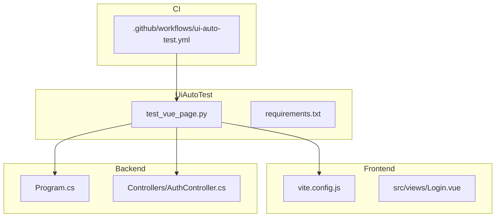
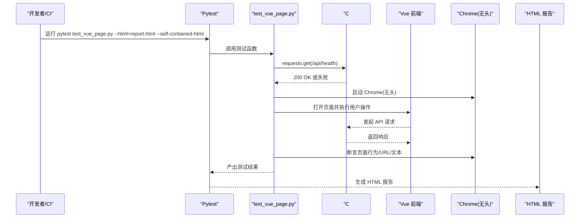
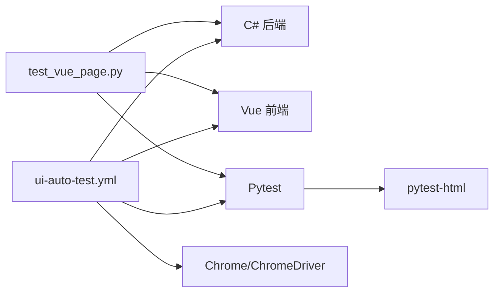

# 测试执行与报告生成

<cite>
**本文引用的文件**
- [UiAutoTest/test_vue_page.py](file://vue-csharp-ui-auto/UiAutoTest/test_vue_page.py)
- [UiAutoTest/requirements.txt](file://vue-csharp-ui-auto/UiAutoTest/requirements.txt)
- [README.md](file://vue-csharp-ui-auto/README.md)
- [.github/workflows/ui-auto-test.yml](file://.github/workflows/ui-auto-test.yml)
- [Frontend/vite.config.js](file://vue-csharp-ui-auto/Frontend/vite.config.js)
- [Backend/Program.cs](file://vue-csharp-ui-auto/Backend/Program.cs)
- [Backend/Controllers/AuthController.cs](file://vue-csharp-ui-auto/Backend/Controllers/AuthController.cs)
- [Frontend/src/views/Login.vue](file://vue-csharp-ui-auto/Frontend/src/views/Login.vue)
</cite>

## 目录
1. [简介](#简介)
2. [项目结构](#项目结构)
3. [核心组件](#核心组件)
4. [架构总览](#架构总览)
5. [详细组件分析](#详细组件分析)
6. [依赖关系分析](#依赖关系分析)
7. [性能与稳定性建议](#性能与稳定性建议)
8. [故障排查指南](#故障排查指南)
9. [结论](#结论)
10. [附录](#附录)

## 简介
本指南面向本地开发与 GitHub Actions CI/CD 环境，提供完整的测试执行与报告生成操作说明，涵盖：
- 如何通过命令行运行测试脚本
- 使用 Pytest 框架执行测试并生成 HTML 报告（依赖 pytest-html 插件）
- 查看测试结果输出、定位失败用例
- 结合 print 日志进行调试
- 本地与 CI 环境的差异与注意事项
- 优化建议：并行执行、失败重试、报告归档

## 项目结构
该仓库包含前后端应用与 UI 自动化测试脚本，测试脚本位于 UiAutoTest 目录，使用 Python+Selenium+Pytest 实现对 Vue 前端页面与 C# 后端接口的联动测试。

图表来源
- [UiAutoTest/test_vue_page.py](file://vue-csharp-ui-auto/UiAutoTest/test_vue_page.py#L1-L161)
- [UiAutoTest/requirements.txt](file://vue-csharp-ui-auto/UiAutoTest/requirements.txt#L1-L4)
- [Frontend/vite.config.js](file://vue-csharp-ui-auto/Frontend/vite.config.js#L1-L22)
- [Backend/Program.cs](file://vue-csharp-ui-auto/Backend/Program.cs#L1-L55)
- [Backend/Controllers/AuthController.cs](file://vue-csharp-ui-auto/Backend/Controllers/AuthController.cs#L1-L25)
- [.github/workflows/ui-auto-test.yml](file://.github/workflows/ui-auto-test.yml#L1-L116)

章节来源
- [README.md](file://vue-csharp-ui-auto/README.md#L1-L113)

## 核心组件
- 测试脚本：UiAutoTest/test_vue_page.py
  - 使用 Selenium 控制 Chrome（无头模式），访问 Vue 前端页面，模拟用户操作并断言结果
  - 通过 requests 预先校验 C# 后端健康检查接口，避免因后端异常导致测试失败
  - 使用 Pytest 断言与 print 输出，便于定位问题
- 依赖管理：UiAutoTest/requirements.txt
  - 包含 selenium、pytest、pytest-html、requests 等依赖
- CI 工作流：.github/workflows/ui-auto-test.yml
  - 在 Ubuntu 环境中依次启动 C# 后端、Vue 前端、安装 Chrome/ChromeDriver、Python 环境与依赖，最后执行 pytest 并上传 HTML 报告

章节来源
- [UiAutoTest/test_vue_page.py](file://vue-csharp-ui-auto/UiAutoTest/test_vue_page.py#L1-L161)
- [UiAutoTest/requirements.txt](file://vue-csharp-ui-auto/UiAutoTest/requirements.txt#L1-L4)
- [.github/workflows/ui-auto-test.yml](file://.github/workflows/ui-auto-test.yml#L1-L116)

## 架构总览
下图展示了本地与 CI 环境中测试执行的关键步骤与组件交互。

图表来源
- [UiAutoTest/test_vue_page.py](file://vue-csharp-ui-auto/UiAutoTest/test_vue_page.py#L1-L161)
- [.github/workflows/ui-auto-test.yml](file://.github/workflows/ui-auto-test.yml#L94-L107)

## 详细组件分析

### 测试脚本 test_vue_page.py
- 功能概览
  - 后端健康检查：通过 requests 访问 /api/health，断言状态码为 200
  - Chrome 驱动配置：启用无头模式、禁用沙盒、设置窗口尺寸等参数，适配 CI 无界面环境
  - 登录页面测试：打开登录页，输入测试账号，点击登录，断言跳转到首页并包含首页内容
  - 表单提交测试：打开表单页，填写数据并提交，断言返回结果展示在页面上
  - 导航测试：从首页重定向到登录页，登录后再导航到表单页，断言 URL 与页面内容
  - 资源清理：无论测试成功与否，最终都会关闭浏览器实例
  - 输出与断言：使用断言与 print 输出，便于定位失败用例
- 关键点
  - 元素定位：优先使用 data-testid/id/class 的组合，确保稳定可靠
  - 显式等待：使用 WebDriverWait + expected_conditions，提升稳定性
  - 失败处理：前置断言后端可用，避免无效的 UI 失败
  - 资源释放：finally 中统一 quit 驱动，防止资源泄漏

章节来源
- [UiAutoTest/test_vue_page.py](file://vue-csharp-ui-auto/UiAutoTest/test_vue_page.py#L1-L161)

### 依赖与环境 requirements.txt
- selenium：UI 自动化核心
- pytest：测试框架
- pytest-html：生成 HTML 报告
- requests：可选，用于预检后端健康检查

章节来源
- [UiAutoTest/requirements.txt](file://vue-csharp-ui-auto/UiAutoTest/requirements.txt#L1-L4)

### CI 工作流 .github/workflows/ui-auto-test.yml
- 步骤概览
  - 拉取代码
  - 安装 .NET SDK，编译并后台启动 C# 后端，等待健康检查通过
  - 安装 Node.js，安装前端依赖并后台启动 Vue 前端，等待启动完成
  - 安装 Chrome 与 ChromeDriver
  - 安装 Python 与测试依赖
  - 运行 pytest，生成 HTML 报告并上传为工件
- 关键配置
  - 后端绑定 0.0.0.0:5000，前端绑定 0.0.0.0:8080，确保容器内可访问
  - 使用 --self-contained-html 生成自包含 HTML 报告，便于离线查看
  - 使用 upload-artifact 上传报告，保留 7 天

章节来源
- [.github/workflows/ui-auto-test.yml](file://.github/workflows/ui-auto-test.yml#L1-L116)

### 前后端关键配置
- 前端 Vite 配置
  - server.host: 0.0.0.0，server.port: 8080
  - 代理 /api 到后端 5000 端口
- 后端 Program.cs
  - 添加 CORS 策略，允许前端访问
  - 使用内存数据库，便于测试
- 登录页面 Login.vue
  - 使用 data-testid 标识输入框与按钮，便于测试定位
  - 提交后端认证接口，成功后路由跳转到首页

章节来源
- [Frontend/vite.config.js](file://vue-csharp-ui-auto/Frontend/vite.config.js#L1-L22)
- [Backend/Program.cs](file://vue-csharp-ui-auto/Backend/Program.cs#L1-L55)
- [Frontend/src/views/Login.vue](file://vue-csharp-ui-auto/Frontend/src/views/Login.vue#L1-L80)
- [Backend/Controllers/AuthController.cs](file://vue-csharp-ui-auto/Backend/Controllers/AuthController.cs#L1-L25)

## 依赖关系分析
- 组件耦合
  - 测试脚本依赖前端页面与后端接口，且通过 requests 预检后端健康检查，降低耦合度
  - CI 工作流将后端与前端作为前置步骤，确保测试执行前环境就绪
- 外部依赖
  - Chrome/ChromeDriver 版本匹配，CI 中通过查询最新版本并安装
  - Pytest 与 pytest-html 插件用于报告生成

图表来源
- [UiAutoTest/test_vue_page.py](file://vue-csharp-ui-auto/UiAutoTest/test_vue_page.py#L1-L161)
- [.github/workflows/ui-auto-test.yml](file://.github/workflows/ui-auto-test.yml#L1-L116)

## 性能与稳定性建议
- 并行执行
  - 当前脚本为顺序执行，若需并行可在 CI 层面拆分作业或使用 pytest-xdist（需评估浏览器资源竞争）
- 失败重试
  - 可使用 pytest-rerunfailures 插件对不稳定用例进行重试
- 等待策略
  - 保持显式等待与合理超时；必要时增加隐式等待或重试逻辑
- 报告归档
  - CI 中已使用 upload-artifact 归档 HTML 报告，建议在 PR/合并后保留报告以便追溯
- 资源管理
  - 确保每个测试结束后关闭浏览器实例，避免资源泄漏

[本节为通用建议，不直接分析具体文件]

## 故障排查指南
- 本地运行
  - 确认已安装依赖：pip install -r requirements.txt
  - 启动后端与前端服务，确保 /api/health 可访问
  - 使用 python test_vue_page.py 或 pytest test_vue_page.py --html=report.html --self-contained-html
- CI 环境
  - 若健康检查失败，查看 backend.log 并确认后端已绑定 0.0.0.0:5000
  - 若前端启动缓慢，适当延长等待时间
  - 若 Chrome/ChromeDriver 不兼容，参考工作流中的版本选择逻辑
- 定位失败用例
  - 查看 HTML 报告中的失败截图与日志
  - 结合 print 输出与断言信息定位问题
- 常见问题
  - CORS 导致请求失败：确认后端已配置允许前端域名
  - 元素定位不稳定：优先使用 data-testid/id，避免使用易变 class
  - 端口冲突：确保 5000/8080 未被占用

章节来源
- [.github/workflows/ui-auto-test.yml](file://.github/workflows/ui-auto-test.yml#L28-L41)
- [README.md](file://vue-csharp-ui-auto/README.md#L66-L87)

## 结论
通过 Pytest + pytest-html，结合 Selenium 与 Chrome 无头模式，本项目实现了对 Vue 前端与 C# 后端的联动测试。本地与 CI 环境均提供了稳定的执行流程与报告归档能力。建议在 CI 中引入失败重试与并行策略，在本地使用更严格的等待与断言，持续提升测试稳定性与可维护性。

[本节为总结性内容，不直接分析具体文件]

## 附录

### 本地执行步骤
- 安装依赖
  - 在 UiAutoTest 目录执行：pip install -r requirements.txt
- 启动后端与前端
  - 后端：dotnet run（确保绑定 0.0.0.0:5000）
  - 前端：npm run serve（确保绑定 0.0.0.0:8080）
- 运行测试
  - 方式一：python test_vue_page.py
  - 方式二：pytest test_vue_page.py --html=ui-test-report.html --self-contained-html
- 查看报告
  - 在 UiAutoTest 目录打开生成的 HTML 报告文件

章节来源
- [README.md](file://vue-csharp-ui-auto/README.md#L66-L87)
- [UiAutoTest/requirements.txt](file://vue-csharp-ui-auto/UiAutoTest/requirements.txt#L1-L4)
- [.github/workflows/ui-auto-test.yml](file://.github/workflows/ui-auto-test.yml#L94-L107)

### CI 执行步骤
- 推送代码至 main 分支或 PR 合并触发工作流
- 工作流自动执行以下步骤：
  - 启动 C# 后端并等待健康检查
  - 启动 Vue 前端并等待启动完成
  - 安装 Chrome/ChromeDriver
  - 安装 Python 与测试依赖
  - 运行 pytest 并生成 HTML 报告
  - 上传报告为工件，保留 7 天

章节来源
- [.github/workflows/ui-auto-test.yml](file://.github/workflows/ui-auto-test.yml#L1-L116)

### 关键配置要点
- 前端
  - server.host: 0.0.0.0，server.port: 8080
  - 代理 /api 到后端 5000
- 后端
  - CORS 允许前端访问
  - 内存数据库用于测试
- 测试脚本
  - 使用 data-testid 标识元素
  - 无头 Chrome 驱动配置
  - 显式等待与断言

章节来源
- [Frontend/vite.config.js](file://vue-csharp-ui-auto/Frontend/vite.config.js#L1-L22)
- [Backend/Program.cs](file://vue-csharp-ui-auto/Backend/Program.cs#L1-L55)
- [Frontend/src/views/Login.vue](file://vue-csharp-ui-auto/Frontend/src/views/Login.vue#L1-L80)
- [UiAutoTest/test_vue_page.py](file://vue-csharp-ui-auto/UiAutoTest/test_vue_page.py#L1-L161)