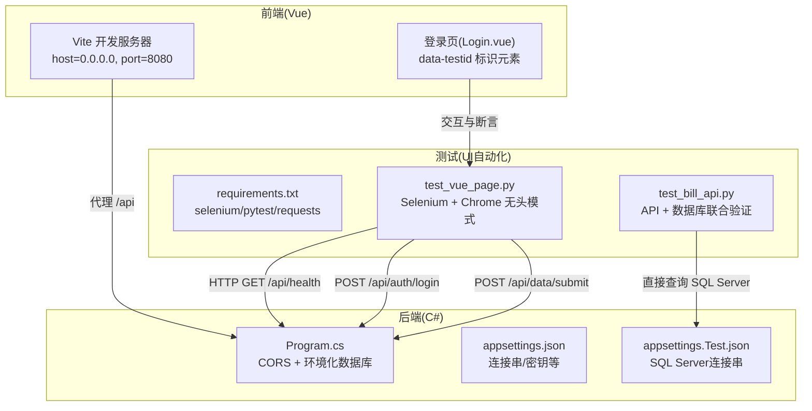
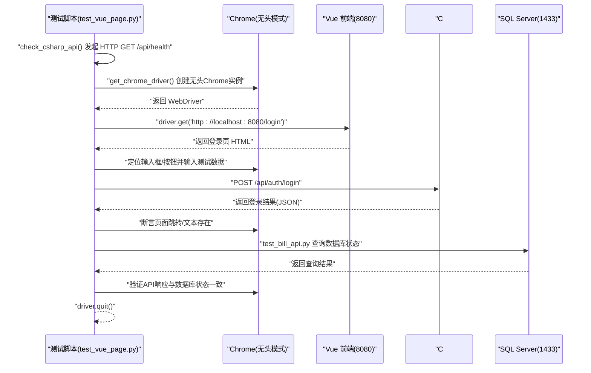
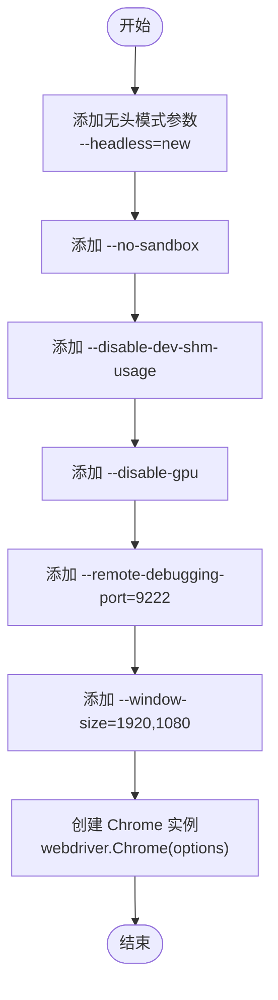
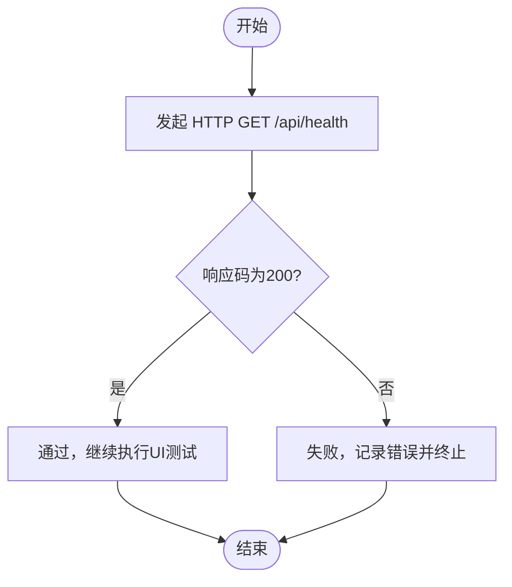
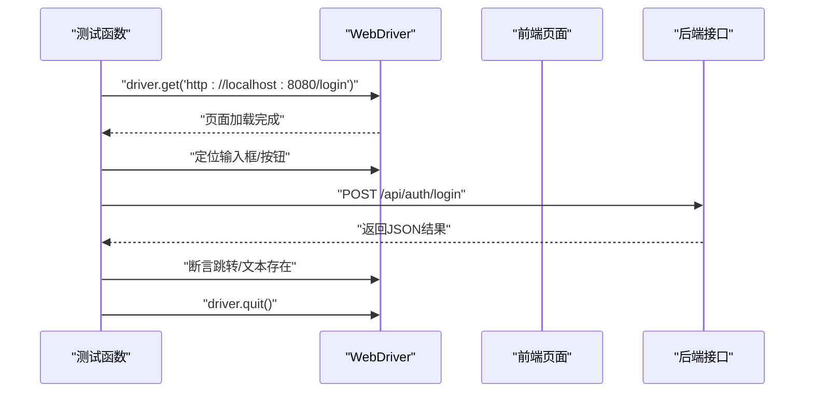
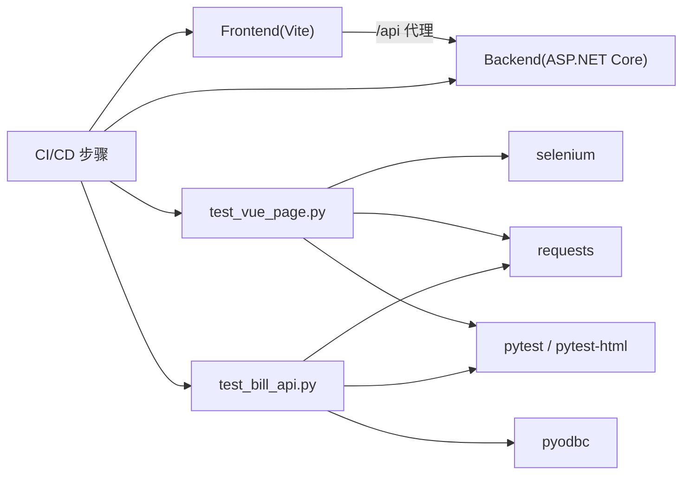

# 测试环境配置

<cite>
**本文引用的文件**
- [requirements.txt](file://vue-csharp-ui-auto/UiAutoTest/requirements.txt)
- [test_vue_page.py](file://vue-csharp-ui-auto/UiAutoTest/test_vue_page.py)
- [test_bill_api.py](file://vue-csharp-ui-auto/UiAutoTest/test_bill_api.py)
- [README.md](file://vue-csharp-ui-auto/README.md)
- [vite.config.js](file://vue-csharp-ui-auto/Frontend/vite.config.js)
- [Program.cs](file://vue-csharp-ui-auto/Backend/Program.cs)
- [appsettings.json](file://vue-csharp-ui-auto/Backend/appsettings.json)
- [appsettings.Test.json](file://vue-csharp-ui-auto/Backend/appsettings.Test.json)
- [Login.vue](file://vue-csharp-ui-auto/Frontend/src/views/Login.vue)
</cite>

## 更新摘要
**变更内容**
- 新增 **数据库配置与验证** 章节，详细说明 `appsettings.Test.json` 文件的 SQL Server 连接配置。
- 在 **详细组件分析** 中新增 **组件六：数据库状态验证**，解释如何在UI测试中集成数据库验证以确保数据持久化一致性。
- 更新 **架构总览** 序列图，增加数据库验证环节。
- 更新 **故障排查指南**，增加数据库连接与验证相关问题的解决方案。

## 目录
1. [简介](#简介)
2. [项目结构](#项目结构)
3. [核心组件](#核心组件)
4. [架构总览](#架构总览)
5. [详细组件分析](#详细组件分析)
6. [依赖关系分析](#依赖关系分析)
7. [性能考虑](#性能考虑)
8. [故障排查指南](#故障排查指南)
9. [结论](#结论)
10. [附录](#附录)

## 简介
本文件面向需要在本地或CI/CD环境中搭建UI自动化测试的工程师，围绕本仓库中的Python+Selenium测试脚本，系统梳理环境准备、依赖安装、浏览器驱动兼容性、无头模式与CI/CD关键参数配置、**新增的数据库配置与验证**、常见问题与排错方法。文中所有技术细节均来自仓库现有文件与测试脚本的实际行为，确保可操作、可复现。

## 项目结构
该仓库采用“前后端分离 + UI自动化测试”的组织方式：
- 前端（Vue3）：位于 Frontend 目录，使用 Vite 开发服务器，默认监听 0.0.0.0:8080，并通过代理将 /api 请求转发至后端。
- 后端（C# ASP.NET Core）：位于 Backend 目录，启用 CORS 允许前端访问，**根据环境变量使用不同的数据库（内存数据库或SQL Server）**。
- UI自动化测试：位于 UiAutoTest 目录，包含 Python 脚本与依赖清单，使用 Selenium 控制 Chrome 浏览器执行页面交互与断言，**并新增了直接验证数据库状态的测试脚本**。



图表来源
- [vite.config.js](file://vue-csharp-ui-auto/Frontend/vite.config.js#L1-L22)
- [Program.cs](file://vue-csharp-ui-auto/Backend/Program.cs#L1-L66)
- [appsettings.json](file://vue-csharp-ui-auto/Backend/appsettings.json#L1-L18)
- [appsettings.Test.json](file://vue-csharp-ui-auto/Backend/appsettings.Test.json#L1-L18)
- [requirements.txt](file://vue-csharp-ui-auto/UiAutoTest/requirements.txt#L1-L4)
- [test_vue_page.py](file://vue-csharp-ui-auto/UiAutoTest/test_vue_page.py#L1-L161)
- [test_bill_api.py](file://vue-csharp-ui-auto/UiAutoTest/test_bill_api.py#L1-L114)
- [Login.vue](file://vue-csharp-ui-auto/Frontend/src/views/Login.vue#L1-L80)

章节来源
- [README.md](file://vue-csharp-ui-auto/README.md#L1-L113)
- [vite.config.js](file://vue-csharp-ui-auto/Frontend/vite.config.js#L1-L22)
- [Program.cs](file://vue-csharp-ui-auto/Backend/Program.cs#L1-L66)
- [appsettings.json](file://vue-csharp-ui-auto/Backend/appsettings.json#L1-L18)
- [appsettings.Test.json](file://vue-csharp-ui-auto/Backend/appsettings.Test.json#L1-L18)
- [requirements.txt](file://vue-csharp-ui-auto/UiAutoTest/requirements.txt#L1-L4)
- [test_vue_page.py](file://vue-csharp-ui-auto/UiAutoTest/test_vue_page.py#L1-L161)
- [test_bill_api.py](file://vue-csharp-ui-auto/UiAutoTest/test_bill_api.py#L1-L114)
- [Login.vue](file://vue-csharp-ui-auto/Frontend/src/views/Login.vue#L1-L80)

## 核心组件
- 测试依赖清单：定义了 Selenium、Pytest、Requests 等版本，用于驱动浏览器、执行测试与生成报告、以及前置校验后端健康状态。
- 测试脚本：封装了 Chrome 无头模式配置、前置后端健康检查、登录页与表单页的关键交互与断言逻辑。
- 前端配置：Vite 开发服务器绑定 0.0.0.0 并代理 /api 到后端，便于测试脚本直接访问。
- 后端配置：启用 CORS 策略，允许前端域名访问；**根据环境变量动态选择内存数据库或SQL Server进行持久化**。
- **数据库配置文件**：`appsettings.Test.json` 提供了针对测试环境的 SQL Server 连接字符串。
- **数据库验证脚本**：`test_bill_api.py` 使用 `pyodbc` 直接连接数据库，验证API响应与数据库实际状态的一致性。

章节来源
- [requirements.txt](file://vue-csharp-ui-auto/UiAutoTest/requirements.txt#L1-L4)
- [test_vue_page.py](file://vue-csharp-ui-auto/UiAutoTest/test_vue_page.py#L1-L161)
- [test_bill_api.py](file://vue-csharp-ui-auto/UiAutoTest/test_bill_api.py#L1-L114)
- [vite.config.js](file://vue-csharp-ui-auto/Frontend/vite.config.js#L1-L22)
- [Program.cs](file://vue-csharp-ui-auto/Backend/Program.cs#L1-L66)
- [appsettings.Test.json](file://vue-csharp-ui-auto/Backend/appsettings.Test.json#L1-L18)

## 架构总览
下图展示了从测试脚本到前端页面再到后端接口的调用链路，以及无头模式与CI/CD关键参数在CI环境中的作用。**新增了通过直接查询数据库来验证数据持久化的环节**。



图表来源
- [test_vue_page.py](file://vue-csharp-ui-auto/UiAutoTest/test_vue_page.py#L1-L161)
- [test_bill_api.py](file://vue-csharp-ui-auto/UiAutoTest/test_bill_api.py#L1-L114)
- [vite.config.js](file://vue-csharp-ui-auto/Frontend/vite.config.js#L1-L22)
- [Program.cs](file://vue-csharp-ui-auto/Backend/Program.cs#L1-L66)

## 详细组件分析

### 组件一：依赖与环境准备
- 依赖安装
  - 在 UiAutoTest 目录下执行依赖安装命令，安装 selenium、pytest、pytest-html、requests。
  - 该命令由项目说明文档提供，确保测试环境具备必要的自动化与HTTP能力。
- 虚拟环境建议
  - 建议在项目根目录创建独立的 Python 虚拟环境，再安装依赖，避免与系统或其他项目冲突。
- 依赖清单要点
  - selenium：驱动浏览器自动化。
  - pytest + pytest-html：执行测试并生成HTML报告。
  - requests：在测试前校验后端健康状态，降低因后端异常导致的误报。

章节来源
- [README.md](file://vue-csharp-ui-auto/README.md#L81-L87)
- [requirements.txt](file://vue-csharp-ui-auto/UiAutoTest/requirements.txt#L1-L4)

### 组件二：Chrome 无头模式与CI/CD关键参数
- 无头模式
  - 测试脚本通过添加 "--headless=new" 参数启用无头模式，适用于CI/CD流水线中无图形界面的环境。
- CI/CD关键参数
  - --no-sandbox：绕过沙箱限制，提升容器化环境稳定性。
  - --disable-dev-shm-usage：避免共享内存不足导致的崩溃。
  - --disable-gpu：禁用GPU加速，减少CI环境差异。
  - --remote-debugging-port=9222：开启调试端口，便于问题排查。
  - --window-size=1920,1080：固定窗口尺寸，保证截图与布局一致性。
- 浏览器驱动兼容性
  - 测试脚本通过 webdriver.Chrome(options=...) 创建驱动实例，需确保本地Chrome浏览器与ChromeDriver版本匹配。
  - 若出现驱动不匹配导致的启动失败，请升级/降级 Chrome 或对应 ChromeDriver 版本，或使用 chromedriver-autoinstaller 自动管理驱动版本。



图表来源
- [test_vue_page.py](file://vue-csharp-ui-auto/UiAutoTest/test_vue_page.py#L22-L35)

章节来源
- [test_vue_page.py](file://vue-csharp-ui-auto/UiAutoTest/test_vue_page.py#L22-L35)

### 组件三：前置后端健康检查
- 目的：在执行任何UI测试前，先通过 HTTP GET /api/health 校验后端可用性，避免因后端异常导致的测试失败。
- 失败处理：若校验失败，测试脚本会输出错误信息并终止后续步骤，确保测试结果更可靠。



图表来源
- [test_vue_page.py](file://vue-csharp-ui-auto/UiAutoTest/test_vue_page.py#L10-L21)

章节来源
- [test_vue_page.py](file://vue-csharp-ui-auto/UiAutoTest/test_vue_page.py#L10-L21)

### 组件四：登录页与表单页测试
- 登录页测试
  - 打开前端登录页，等待特定元素出现，定位用户名/密码输入框与提交按钮，输入测试账号并点击登录。
  - 断言页面跳转到首页或包含首页相关内容。
- 表单页测试
  - 打开表单页，等待表单元素出现，填写姓名与邮箱并提交。
  - 断言页面展示提交成功的结果提示。
- 导航测试
  - 从首页重定向到登录页，登录后再导航到表单页，断言URL与页面内容。



图表来源
- [test_vue_page.py](file://vue-csharp-ui-auto/UiAutoTest/test_vue_page.py#L38-L73)
- [test_vue_page.py](file://vue-csharp-ui-auto/UiAutoTest/test_vue_page.py#L74-L109)
- [test_vue_page.py](file://vue-csharp-ui-auto/UiAutoTest/test_vue_page.py#L110-L155)

章节来源
- [test_vue_page.py](file://vue-csharp-ui-auto/UiAutoTest/test_vue_page.py#L38-L155)

### 组件五：前端与后端配置对测试的影响
- 前端
  - Vite 开发服务器绑定 0.0.0.0 并开放 8080 端口，便于测试脚本访问。
  - 通过代理将 /api 请求转发至后端，测试脚本无需关心跨域问题。
- 后端
  - 启用 CORS 策略，允许前端域名访问。
  - **根据环境变量 `ASPNETCORE_ENVIRONMENT` 动态选择数据库**：
    - 当环境为 `Test` 时，使用 `appsettings.Test.json` 中的 SQL Server 连接字符串。
    - 当环境为 `Development` 时，使用内存数据库。
  - 健康检查接口 /api/health 用于前置校验。

章节来源
- [vite.config.js](file://vue-csharp-ui-auto/Frontend/vite.config.js#L1-L22)
- [Program.cs](file://vue-csharp-ui-auto/Backend/Program.cs#L1-L66)
- [appsettings.json](file://vue-csharp-ui-auto/Backend/appsettings.json#L1-L18)
- [appsettings.Test.json](file://vue-csharp-ui-auto/Backend/appsettings.Test.json#L1-L18)

### 组件六：数据库配置与验证
**更新** 新增了数据库配置与验证的详细说明。

- **数据库配置文件 (`appsettings.Test.json`)**
  - 该文件专为测试环境设计，定义了连接到 SQL Server 的连接字符串。
  - 连接字符串包含服务器地址、数据库名、用户名、密码等关键信息，确保测试环境能访问持久化数据库。
  - **文件内容**:
    ```json
    {
      "ConnectionStrings": {
        "DefaultConnection": "Server=localhost,1433;Database=bill_test_db;User Id=sa;Password=StrongPass@123456;TrustServerCertificate=True;"
      },
      "Logging": {
        "LogLevel": {
          "Default": "Information",
          "Microsoft.AspNetCore": "Warning"
        }
      },
      "AllowedHosts": "*",
      "JwtSettings": {
        "Key": "SuperSecretKeyForTestingOnlyDontUseInProduction",
        "Issuer": "VueCSharpTestAuth",
        "Audience": "VueCSharpTestUsers",
        "ExpiryInMinutes": 60
      }
    }
    ```
- **数据库状态验证**
  - 为了确保UI操作（如表单提交）不仅在前端和API层面成功，而且数据已正确持久化到数据库，引入了直接的数据库验证。
  - `test_bill_api.py` 脚本使用 `pyodbc` 库直接连接 SQL Server，执行查询以验证数据库中的数据是否与API响应一致。
  - **验证流程**:
    1. 执行UI或API测试，触发数据变更。
    2. 使用 `pyodbc.connect()` 建立到数据库的连接。
    3. 执行SQL查询，获取数据库中的实际数据。
    4. 使用 `assert` 语句断言数据库数据与API返回的数据一致。
  - 这种双重验证机制极大地提高了测试的可靠性，能够发现API层与数据库层之间的不一致问题。

章节来源
- [appsettings.Test.json](file://vue-csharp-ui-auto/Backend/appsettings.Test.json#L1-L18)
- [Program.cs](file://vue-csharp-ui-auto/Backend/Program.cs#L24-L37)
- [test_bill_api.py](file://vue-csharp-ui-auto/UiAutoTest/test_bill_api.py#L1-L114)

## 依赖关系分析
- 测试脚本依赖
  - selenium：控制浏览器自动化。
  - requests：前置校验后端健康状态。
  - pytest + pytest-html：执行测试并生成报告。
  - pyodbc：**用于直接连接和查询SQL Server数据库，实现数据持久化验证**。
- 前后端交互
  - 前端通过代理访问后端接口，测试脚本直接调用后端接口，形成端到端验证闭环。
- CI/CD集成
  - README 提供了在CI中拉取代码、启动后端、启动前端、安装Chrome与驱动、安装Python依赖、运行测试、上传报告与日志的步骤说明。
- **数据库验证依赖**
  - `test_bill_api.py` 依赖于 `appsettings.Test.json` 中的连接信息和 `pyodbc` 库来完成数据库验证。



图表来源
- [requirements.txt](file://vue-csharp-ui-auto/UiAutoTest/requirements.txt#L1-L4)
- [test_vue_page.py](file://vue-csharp-ui-auto/UiAutoTest/test_vue_page.py#L1-L161)
- [test_bill_api.py](file://vue-csharp-ui-auto/UiAutoTest/test_bill_api.py#L1-L114)
- [vite.config.js](file://vue-csharp-ui-auto/Frontend/vite.config.js#L1-L22)
- [Program.cs](file://vue-csharp-ui-auto/Backend/Program.cs#L1-L66)
- [README.md](file://vue-csharp-ui-auto/README.md#L52-L65)

章节来源
- [requirements.txt](file://vue-csharp-ui-auto/UiAutoTest/requirements.txt#L1-L4)
- [test_vue_page.py](file://vue-csharp-ui-auto/UiAutoTest/test_vue_page.py#L1-L161)
- [test_bill_api.py](file://vue-csharp-ui-auto/UiAutoTest/test_bill_api.py#L1-L114)
- [README.md](file://vue-csharp-ui-auto/README.md#L52-L65)

## 性能考虑
- 无头模式与固定窗口尺寸
  - 无头模式减少资源占用，适合CI/CD流水线；固定窗口尺寸有助于稳定截图与布局断言。
- 隐式等待与显式等待
  - 测试脚本设置了隐式等待与显式等待，避免因页面加载延迟导致的定位失败。
- 驱动与浏览器版本匹配
  - 保持 Chrome 与 ChromeDriver 版本一致，可显著降低启动失败与不稳定问题。
- CI 环境参数
  - --no-sandbox 与 --disable-dev-shm-usage 提升容器化环境稳定性；--disable-gpu 减少图形差异。

章节来源
- [test_vue_page.py](file://vue-csharp-ui-auto/UiAutoTest/test_vue_page.py#L22-L35)
- [test_vue_page.py](file://vue-csharp-ui-auto/UiAutoTest/test_vue_page.py#L38-L73)

## 故障排查指南
- 驱动不匹配
  - 现象：启动浏览器时报错或无法打开页面。
  - 解决：确认本地Chrome版本与ChromeDriver版本一致；必要时使用自动管理驱动的工具。
- 权限错误
  - 现象：在Linux容器中启动失败。
  - 解决：添加 --no-sandbox 与 --disable-dev-shm-usage 参数；确保Chrome与驱动可执行。
- 端口与跨域问题
  - 现象：测试脚本无法访问 /api 或页面空白。
  - 解决：确认前端 Vite 已绑定 0.0.0.0 并开放 8080；后端已启用 CORS 并正确代理 /api。
- 后端不可用
  - 现象：前置健康检查失败。
  - 解决：确保后端服务已启动并监听 0.0.0.0:5000；检查 appsettings 中的连接串与密钥配置。
- 页面元素定位失败
  - 现象：找不到输入框或按钮。
  - 解决：使用 data-testid 或稳定的 id/class；增加显式等待；确认页面已完全加载。
- **数据库连接失败**
  - 现象：`test_bill_api.py` 报错无法连接SQL Server。
  - 解决：检查 `appsettings.Test.json` 中的连接字符串是否正确；确认SQL Server服务已启动且端口1433开放；检查用户名和密码。
- **数据库验证不通过**
  - 现象：API返回成功，但数据库中未找到对应数据。
  - 解决：检查后端代码中数据库上下文（`AppDbContext`）的 `SaveChanges()` 是否被正确调用；检查数据库连接是否指向正确的测试数据库。

章节来源
- [test_vue_page.py](file://vue-csharp-ui-auto/UiAutoTest/test_vue_page.py#L10-L21)
- [vite.config.js](file://vue-csharp-ui-auto/Frontend/vite.config.js#L1-L22)
- [Program.cs](file://vue-csharp-ui-auto/Backend/Program.cs#L1-L66)
- [appsettings.json](file://vue-csharp-ui-auto/Backend/appsettings.json#L1-L18)
- [appsettings.Test.json](file://vue-csharp-ui-auto/Backend/appsettings.Test.json#L1-L18)
- [test_bill_api.py](file://vue-csharp-ui-auto/UiAutoTest/test_bill_api.py#L1-L114)
- [Login.vue](file://vue-csharp-ui-auto/Frontend/src/views/Login.vue#L1-L80)

## 结论
本项目提供了完整的UI自动化测试环境配置思路：通过 requirements.txt 安装依赖，使用 Selenium + 无头模式在CI/CD中稳定运行，结合前置后端健康检查与明确的页面元素标识，实现可靠的端到端验证。**新增的 `appsettings.Test.json` 配置文件和 `test_bill_api.py` 数据库验证脚本，使得测试能够覆盖数据持久化层面，确保API响应与数据库状态的一致性**。遵循本文档的环境准备、参数配置与排错建议，可在本地与CI/CD环境中快速搭建并维护高质量的UI自动化测试。

## 附录
- 本地运行测试的推荐步骤
  - 在 UiAutoTest 目录执行依赖安装命令，再运行测试脚本。
- CI/CD 关键步骤参考
  - README 中提供了拉取代码、启动后端、启动前端、安装Chrome与驱动、安装Python依赖、运行测试、上传报告与日志的步骤说明。

章节来源
- [README.md](file://vue-csharp-ui-auto/README.md#L52-L65)
- [README.md](file://vue-csharp-ui-auto/README.md#L81-L87)