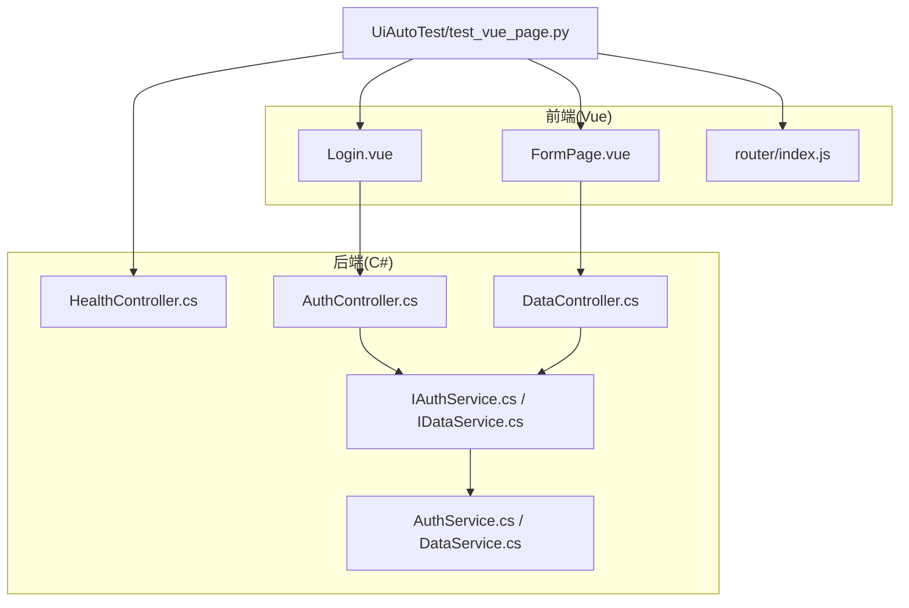
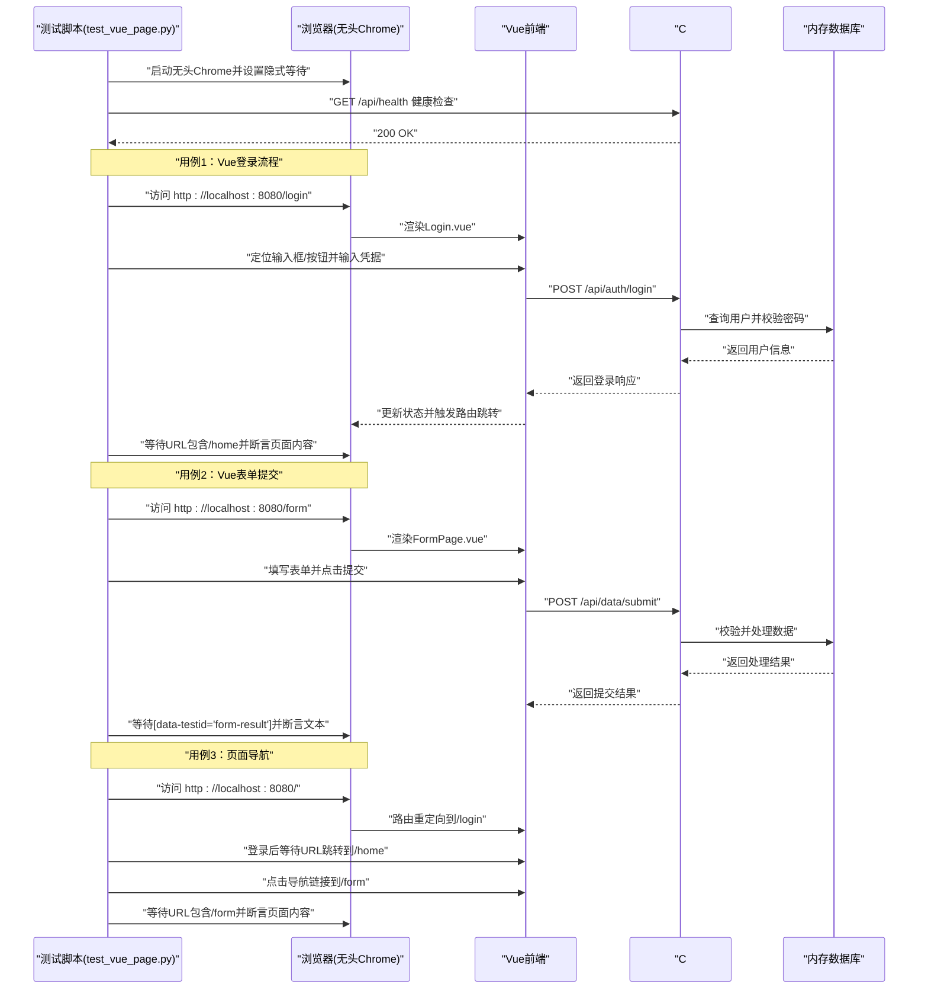
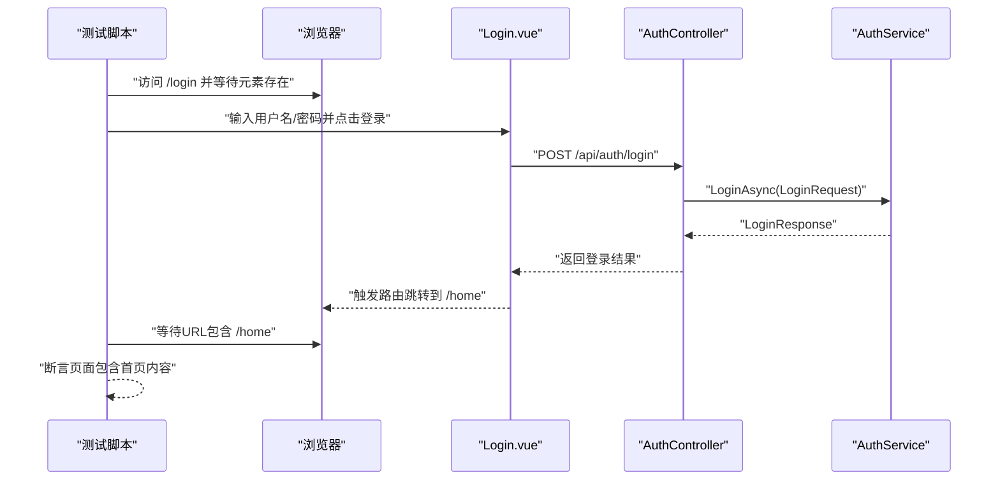
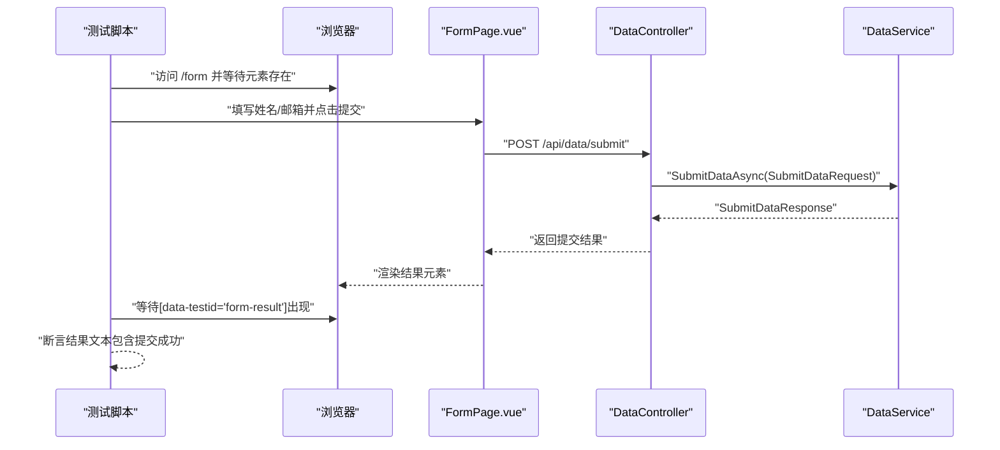
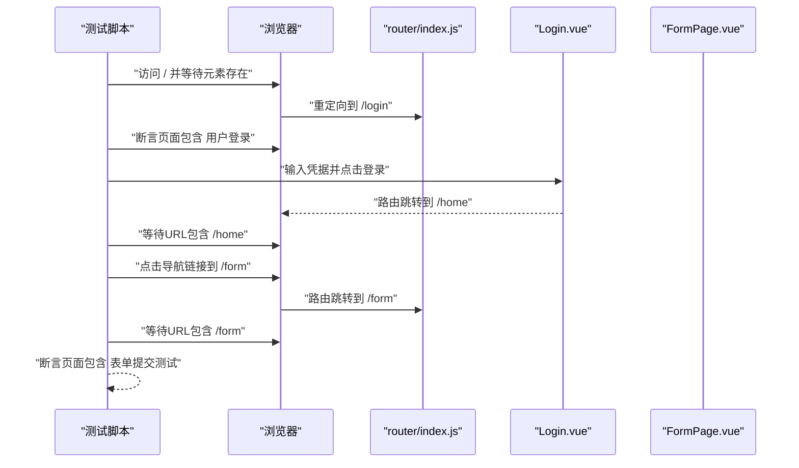
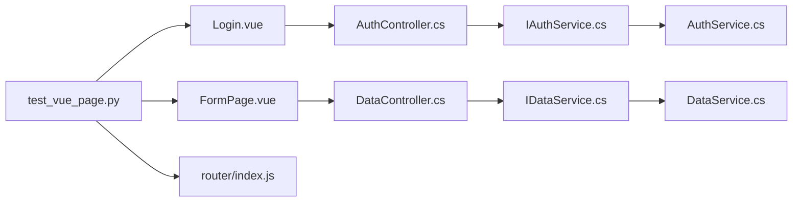

# 测试用例详解

<cite>
**本文引用的文件**
- [UiAutoTest/test_vue_page.py](file://vue-csharp-ui-auto/UiAutoTest/test_vue_page.py)
- [README.md](file://vue-csharp-ui-auto/README.md)
- [Frontend/src/views/Login.vue](file://vue-csharp-ui-auto/Frontend/src/views/Login.vue)
- [Frontend/src/views/FormPage.vue](file://vue-csharp-ui-auto/Frontend/src/views/FormPage.vue)
- [Frontend/src/router/index.js](file://vue-csharp-ui-auto/Frontend/src/router/index.js)
- [Backend/Controllers/AuthController.cs](file://vue-csharp-ui-auto/Backend/Controllers/AuthController.cs)
- [Backend/Controllers/DataController.cs](file://vue-csharp-ui-auto/Backend/Controllers/DataController.cs)
- [Backend/Controllers/HealthController.cs](file://vue-csharp-ui-auto/Backend/Controllers/HealthController.cs)
- [Backend/Models/LoginRequest.cs](file://vue-csharp-ui-auto/Backend/Models/LoginRequest.cs)
- [Backend/Services/IAuthService.cs](file://vue-csharp-ui-auto/Backend/Services/IAuthService.cs)
- [Backend/Services/AuthService.cs](file://vue-csharp-ui-auto/Backend/Services/AuthService.cs)
- [Backend/Services/IDataService.cs](file://vue-csharp-ui-auto/Backend/Services/IDataService.cs)
- [Backend/Services/DataService.cs](file://vue-csharp-ui-auto/Backend/Services/DataService.cs)
</cite>

## 目录
1. [引言](#引言)
2. [项目结构](#项目结构)
3. [核心组件](#核心组件)
4. [架构总览](#架构总览)
5. [详细组件分析](#详细组件分析)
6. [依赖分析](#依赖分析)
7. [性能考虑](#性能考虑)
8. [故障排查指南](#故障排查指南)
9. [结论](#结论)
10. [附录](#附录)

## 引言
本文件围绕三个核心UI自动化测试用例进行深入解析：Vue登录流程测试、表单提交测试与页面导航测试。我们将从业务路径、关键操作步骤（元素定位、输入、点击、等待）、断言逻辑以及与后端API的联动验证方式入手，重点阐述如何通过WebDriverWait与expected_conditions实现“智能等待”，避免因页面加载延迟导致的测试失败；同时给出各用例的执行顺序与依赖关系说明，帮助读者快速理解并复用该测试体系。

## 项目结构
该项目采用前后端分离架构：
- 前端为Vue3应用，包含登录页、首页、表单页，路由以history模式管理页面导航。
- 后端为C# ASP.NET Core应用，提供健康检查、认证与数据提交等API。
- UI自动化测试位于UiAutoTest目录，使用Python+Selenium对Vue页面进行端到端验证。

图表来源
- [UiAutoTest/test_vue_page.py](file://vue-csharp-ui-auto/UiAutoTest/test_vue_page.py#L1-L161)
- [Frontend/src/views/Login.vue](file://vue-csharp-ui-auto/Frontend/src/views/Login.vue#L1-L133)
- [Frontend/src/views/FormPage.vue](file://vue-csharp-ui-auto/Frontend/src/views/FormPage.vue#L1-L142)
- [Frontend/src/router/index.js](file://vue-csharp-ui-auto/Frontend/src/router/index.js#L1-L33)
- [Backend/Controllers/HealthController.cs](file://vue-csharp-ui-auto/Backend/Controllers/HealthController.cs#L1-L15)
- [Backend/Controllers/AuthController.cs](file://vue-csharp-ui-auto/Backend/Controllers/AuthController.cs#L1-L25)
- [Backend/Controllers/DataController.cs](file://vue-csharp-ui-auto/Backend/Controllers/DataController.cs#L1-L25)
- [Backend/Services/IAuthService.cs](file://vue-csharp-ui-auto/Backend/Services/IAuthService.cs#L1-L10)
- [Backend/Services/IDataService.cs](file://vue-csharp-ui-auto/Backend/Services/IDataService.cs#L1-L9)
- [Backend/Services/AuthService.cs](file://vue-csharp-ui-auto/Backend/Services/AuthService.cs#L1-L64)
- [Backend/Services/DataService.cs](file://vue-csharp-ui-auto/Backend/Services/DataService.cs#L1-L30)

章节来源
- [README.md](file://vue-csharp-ui-auto/README.md#L1-L113)

## 核心组件
- 测试前置校验：通过HTTP请求调用后端健康检查接口，确保后端可用后再执行UI测试，避免因后端异常导致的测试失败。
- Chrome驱动配置：启用无头模式与常用参数，提升在CI环境中的稳定性；设置隐式等待以增强元素查找的鲁棒性。
- 三大测试用例：
  - Vue登录流程测试：打开登录页，输入凭据，点击登录，等待URL跳转至首页并断言页面内容。
  - Vue表单提交测试：打开表单页，填写表单并提交，等待结果显示并断言结果文本。
  - 页面导航测试：从根路径访问，验证重定向到登录页，登录后导航到表单页并断言页面标题或内容。

章节来源
- [UiAutoTest/test_vue_page.py](file://vue-csharp-ui-auto/UiAutoTest/test_vue_page.py#L1-L161)

## 架构总览
下图展示了UI自动化测试与前后端之间的交互关系，以及测试用例的执行顺序与依赖。

图表来源
- [UiAutoTest/test_vue_page.py](file://vue-csharp-ui-auto/UiAutoTest/test_vue_page.py#L1-L161)
- [Frontend/src/views/Login.vue](file://vue-csharp-ui-auto/Frontend/src/views/Login.vue#L1-L133)
- [Frontend/src/views/FormPage.vue](file://vue-csharp-ui-auto/Frontend/src/views/FormPage.vue#L1-L142)
- [Frontend/src/router/index.js](file://vue-csharp-ui-auto/Frontend/src/router/index.js#L1-L33)
- [Backend/Controllers/AuthController.cs](file://vue-csharp-ui-auto/Backend/Controllers/AuthController.cs#L1-L25)
- [Backend/Controllers/DataController.cs](file://vue-csharp-ui-auto/Backend/Controllers/DataController.cs#L1-L25)
- [Backend/Controllers/HealthController.cs](file://vue-csharp-ui-auto/Backend/Controllers/HealthController.cs#L1-L15)
- [Backend/Services/AuthService.cs](file://vue-csharp-ui-auto/Backend/Services/AuthService.cs#L1-L64)
- [Backend/Services/DataService.cs](file://vue-csharp-ui-auto/Backend/Services/DataService.cs#L1-L30)

## 详细组件分析

### Vue登录流程测试
- 业务路径
  - 启动后端健康检查，确认服务可用。
  - 打开登录页，输入用户名与密码，点击登录按钮。
  - 等待路由跳转到首页，断言页面包含首页内容。
- 关键操作步骤
  - 元素定位：使用data-testid属性定位用户名、密码输入框与登录按钮。
  - 输入与点击：向输入框发送测试凭据，点击登录按钮。
  - 等待策略：使用WebDriverWait与url_contains条件等待跳转完成。
- 断言逻辑
  - URL包含“/home”作为跳转成功的判定依据。
  - 断言页面源码包含“首页”字样，确保页面内容正确渲染。
- 与后端API联动
  - 前端Login.vue通过Axios调用后端认证接口，返回成功时触发路由跳转。
  - 后端AuthController接收请求，AuthService进行用户校验，返回登录响应。
- 智能等待实现
  - 使用WebDriverWait与expected_conditions的presence_of_element_located与url_contains，避免硬编码sleep导致的不稳定。
- 执行顺序与依赖
  - 必须先通过健康检查，再打开登录页并执行登录流程。
  - 依赖路由配置将“/”重定向到“/login”。

图表来源
- [UiAutoTest/test_vue_page.py](file://vue-csharp-ui-auto/UiAutoTest/test_vue_page.py#L37-L73)
- [Frontend/src/views/Login.vue](file://vue-csharp-ui-auto/Frontend/src/views/Login.vue#L1-L133)
- [Backend/Controllers/AuthController.cs](file://vue-csharp-ui-auto/Backend/Controllers/AuthController.cs#L1-L25)
- [Backend/Services/AuthService.cs](file://vue-csharp-ui-auto/Backend/Services/AuthService.cs#L1-L64)

章节来源
- [UiAutoTest/test_vue_page.py](file://vue-csharp-ui-auto/UiAutoTest/test_vue_page.py#L37-L73)
- [Frontend/src/views/Login.vue](file://vue-csharp-ui-auto/Frontend/src/views/Login.vue#L1-L133)
- [Frontend/src/router/index.js](file://vue-csharp-ui-auto/Frontend/src/router/index.js#L1-L33)
- [Backend/Controllers/AuthController.cs](file://vue-csharp-ui-auto/Backend/Controllers/AuthController.cs#L1-L25)
- [Backend/Services/IAuthService.cs](file://vue-csharp-ui-auto/Backend/Services/IAuthService.cs#L1-L10)
- [Backend/Services/AuthService.cs](file://vue-csharp-ui-auto/Backend/Services/AuthService.cs#L1-L64)
- [Backend/Models/LoginRequest.cs](file://vue-csharp-ui-auto/Backend/Models/LoginRequest.cs#L1-L28)

### Vue表单提交测试
- 业务路径
  - 打开表单页，填写姓名与邮箱，点击提交按钮。
  - 等待后端返回的提交结果在页面上显示，断言结果文本。
- 关键操作步骤
  - 元素定位：使用id定位表单字段，使用类名定位提交按钮。
  - 输入与点击：向输入框填入测试数据，点击提交按钮。
  - 等待策略：使用WebDriverWait与presence_of_element_located等待结果元素出现。
- 断言逻辑
  - 断言包含“提交成功”的文本，确保后端返回的消息被正确展示。
- 与后端API联动
  - 前端FormPage.vue通过Axios调用后端数据提交接口，返回成功时在页面展示消息。
  - 后端DataController接收请求，DataService进行数据校验与处理，返回提交结果。
- 智能等待实现
  - 使用WebDriverWait与expected_conditions的presence_of_element_located，确保结果元素可见后再断言。

图表来源
- [UiAutoTest/test_vue_page.py](file://vue-csharp-ui-auto/UiAutoTest/test_vue_page.py#L74-L109)
- [Frontend/src/views/FormPage.vue](file://vue-csharp-ui-auto/Frontend/src/views/FormPage.vue#L1-L142)
- [Backend/Controllers/DataController.cs](file://vue-csharp-ui-auto/Backend/Controllers/DataController.cs#L1-L25)
- [Backend/Services/DataService.cs](file://vue-csharp-ui-auto/Backend/Services/DataService.cs#L1-L30)
- [Backend/Models/LoginRequest.cs](file://vue-csharp-ui-auto/Backend/Models/LoginRequest.cs#L1-L28)

章节来源
- [UiAutoTest/test_vue_page.py](file://vue-csharp-ui-auto/UiAutoTest/test_vue_page.py#L74-L109)
- [Frontend/src/views/FormPage.vue](file://vue-csharp-ui-auto/Frontend/src/views/FormPage.vue#L1-L142)
- [Backend/Controllers/DataController.cs](file://vue-csharp-ui-auto/Backend/Controllers/DataController.cs#L1-L25)
- [Backend/Services/IDataService.cs](file://vue-csharp-ui-auto/Backend/Services/IDataService.cs#L1-L9)
- [Backend/Services/DataService.cs](file://vue-csharp-ui-auto/Backend/Services/DataService.cs#L1-L30)

### 页面导航测试
- 业务路径
  - 访问根路径，验证自动重定向到登录页。
  - 在登录页输入凭据并登录，等待跳转到首页。
  - 点击导航链接进入表单页，等待URL跳转并断言页面内容。
- 关键操作步骤
  - 元素定位：使用标签名定位页面标题，使用部分链接文本定位导航链接。
  - 等待策略：使用WebDriverWait与element_to_be_clickable等待可点击状态，使用url_contains等待跳转。
- 断言逻辑
  - 断言页面包含“用户登录”、“表单提交测试”等文本，确保导航链路正确。
- 与后端API联动
  - 登录流程与表单提交测试相同，导航测试主要验证前端路由与页面跳转。
- 智能等待实现
  - 使用WebDriverWait与expected_conditions的element_to_be_clickable与url_contains，确保交互元素可用且URL变化符合预期。

图表来源
- [UiAutoTest/test_vue_page.py](file://vue-csharp-ui-auto/UiAutoTest/test_vue_page.py#L110-L155)
- [Frontend/src/router/index.js](file://vue-csharp-ui-auto/Frontend/src/router/index.js#L1-L33)
- [Frontend/src/views/Login.vue](file://vue-csharp-ui-auto/Frontend/src/views/Login.vue#L1-L133)
- [Frontend/src/views/FormPage.vue](file://vue-csharp-ui-auto/Frontend/src/views/FormPage.vue#L1-L142)

章节来源
- [UiAutoTest/test_vue_page.py](file://vue-csharp-ui-auto/UiAutoTest/test_vue_page.py#L110-L155)
- [Frontend/src/router/index.js](file://vue-csharp-ui-auto/Frontend/src/router/index.js#L1-L33)

### 智能等待与expected_conditions使用要点
- 使用WebDriverWait与expected_conditions的组合，可以基于“条件”而非“固定时长”等待页面状态变化，显著降低测试波动性。
- 常用条件包括：
  - presence_of_element_located：等待元素出现在DOM中。
  - url_contains：等待URL包含特定片段，常用于路由跳转验证。
  - element_to_be_clickable：等待元素可点击，常用于导航链接或按钮。
- 与隐式等待配合：隐式等待为元素查找提供基础超时，WebDriverWait提供更精确的条件等待，二者结合可覆盖大多数等待场景。

章节来源
- [UiAutoTest/test_vue_page.py](file://vue-csharp-ui-auto/UiAutoTest/test_vue_page.py#L22-L36)
- [UiAutoTest/test_vue_page.py](file://vue-csharp-ui-auto/UiAutoTest/test_vue_page.py#L47-L73)
- [UiAutoTest/test_vue_page.py](file://vue-csharp-ui-auto/UiAutoTest/test_vue_page.py#L84-L109)
- [UiAutoTest/test_vue_page.py](file://vue-csharp-ui-auto/UiAutoTest/test_vue_page.py#L118-L155)

## 依赖分析
- 组件耦合与内聚
  - 测试脚本与前端页面通过data-testid与id等稳定选择器解耦，降低样式或类名变更对测试的影响。
  - 前端通过Axios与后端API通信，后端控制器依赖服务层进行业务处理，职责清晰。
- 外部依赖与集成点
  - Selenium WebDriver与Chrome驱动用于浏览器自动化。
  - Python requests用于后端健康检查。
  - Vue Router负责前端路由与页面跳转。
- 可能的循环依赖
  - 本项目采用分层设计，控制器依赖服务接口，服务实现依赖数据上下文，不存在循环依赖风险。
- 接口契约与实现细节
  - 认证接口：POST /api/auth/login，请求体为LoginRequest，响应为LoginResponse。
  - 数据提交接口：POST /api/data/submit，请求体为SubmitDataRequest，响应为SubmitDataResponse。
  - 健康检查接口：GET /api/health，返回服务状态。

图表来源
- [UiAutoTest/test_vue_page.py](file://vue-csharp-ui-auto/UiAutoTest/test_vue_page.py#L1-L161)
- [Frontend/src/views/Login.vue](file://vue-csharp-ui-auto/Frontend/src/views/Login.vue#L1-L133)
- [Frontend/src/views/FormPage.vue](file://vue-csharp-ui-auto/Frontend/src/views/FormPage.vue#L1-L142)
- [Frontend/src/router/index.js](file://vue-csharp-ui-auto/Frontend/src/router/index.js#L1-L33)
- [Backend/Controllers/AuthController.cs](file://vue-csharp-ui-auto/Backend/Controllers/AuthController.cs#L1-L25)
- [Backend/Controllers/DataController.cs](file://vue-csharp-ui-auto/Backend/Controllers/DataController.cs#L1-L25)
- [Backend/Services/IAuthService.cs](file://vue-csharp-ui-auto/Backend/Services/IAuthService.cs#L1-L10)
- [Backend/Services/IDataService.cs](file://vue-csharp-ui-auto/Backend/Services/IDataService.cs#L1-L9)
- [Backend/Services/AuthService.cs](file://vue-csharp-ui-auto/Backend/Services/AuthService.cs#L1-L64)
- [Backend/Services/DataService.cs](file://vue-csharp-ui-auto/Backend/Services/DataService.cs#L1-L30)

章节来源
- [Backend/Controllers/AuthController.cs](file://vue-csharp-ui-auto/Backend/Controllers/AuthController.cs#L1-L25)
- [Backend/Controllers/DataController.cs](file://vue-csharp-ui-auto/Backend/Controllers/DataController.cs#L1-L25)
- [Backend/Controllers/HealthController.cs](file://vue-csharp-ui-auto/Backend/Controllers/HealthController.cs#L1-L15)
- [Backend/Models/LoginRequest.cs](file://vue-csharp-ui-auto/Backend/Models/LoginRequest.cs#L1-L28)

## 性能考虑
- 无头模式与窗口尺寸：启用无头模式与固定窗口尺寸，减少渲染开销并提升稳定性。
- 隐式等待与显式等待：合理设置隐式等待与WebDriverWait超时，避免过短导致频繁失败，过长导致测试耗时增加。
- 元素定位策略：优先使用id与data-testid，其次使用CSS选择器，尽量避免使用易变的class或层级选择器。
- CI环境适配：在CI中使用无头模式与沙箱参数，确保容器环境下的兼容性。

章节来源
- [UiAutoTest/test_vue_page.py](file://vue-csharp-ui-auto/UiAutoTest/test_vue_page.py#L22-L36)
- [README.md](file://vue-csharp-ui-auto/README.md#L109-L113)

## 故障排查指南
- 后端不可用
  - 症状：健康检查失败，测试提前终止。
  - 排查：确认后端服务已启动并监听0.0.0.0:5000，检查CORS配置与内存数据库初始化。
- 页面元素找不到
  - 症状：定位不到输入框、按钮或结果元素。
  - 排查：确认元素选择器是否正确（id/data-testid），等待条件是否匹配，必要时调整WebDriverWait超时。
- 路由跳转不生效
  - 症状：URL未跳转或页面未更新。
  - 排查：检查前端路由配置与重定向规则，确认登录成功后的路由跳转逻辑是否触发。
- 提交结果未显示
  - 症状：点击提交后页面无提示。
  - 排查：确认后端数据提交接口返回值，检查前端Axios请求与错误处理分支。

章节来源
- [UiAutoTest/test_vue_page.py](file://vue-csharp-ui-auto/UiAutoTest/test_vue_page.py#L1-L21)
- [UiAutoTest/test_vue_page.py](file://vue-csharp-ui-auto/UiAutoTest/test_vue_page.py#L47-L73)
- [UiAutoTest/test_vue_page.py](file://vue-csharp-ui-auto/UiAutoTest/test_vue_page.py#L84-L109)
- [UiAutoTest/test_vue_page.py](file://vue-csharp-ui-auto/UiAutoTest/test_vue_page.py#L118-L155)
- [Frontend/src/router/index.js](file://vue-csharp-ui-auto/Frontend/src/router/index.js#L1-L33)
- [Backend/Controllers/HealthController.cs](file://vue-csharp-ui-auto/Backend/Controllers/HealthController.cs#L1-L15)

## 结论
本测试体系通过明确的业务路径、稳定的元素定位策略与智能等待机制，有效验证了Vue前端与C#后端的端到端联动。三大用例分别覆盖登录、表单提交与页面导航，彼此独立但共享健康检查前置校验，形成可靠的自动化测试闭环。建议在实际项目中持续优化等待条件与断言粒度，以进一步提升测试稳定性与可维护性。

## 附录
- 执行顺序与依赖关系
  - 健康检查前置：所有用例均依赖后端健康检查通过。
  - 用例顺序：登录流程测试 → 表单提交测试 → 页面导航测试。
  - 依赖说明：导航测试依赖路由配置与登录流程；表单提交测试依赖数据提交接口；登录流程测试依赖认证接口与路由跳转。
- 关键API定义
  - GET /api/health：健康检查。
  - POST /api/auth/login：登录认证。
  - POST /api/data/submit：数据提交。

章节来源
- [UiAutoTest/test_vue_page.py](file://vue-csharp-ui-auto/UiAutoTest/test_vue_page.py#L1-L161)
- [Backend/Controllers/HealthController.cs](file://vue-csharp-ui-auto/Backend/Controllers/HealthController.cs#L1-L15)
- [Backend/Controllers/AuthController.cs](file://vue-csharp-ui-auto/Backend/Controllers/AuthController.cs#L1-L25)
- [Backend/Controllers/DataController.cs](file://vue-csharp-ui-auto/Backend/Controllers/DataController.cs#L1-L25)
- [Frontend/src/router/index.js](file://vue-csharp-ui-auto/Frontend/src/router/index.js#L1-L33)