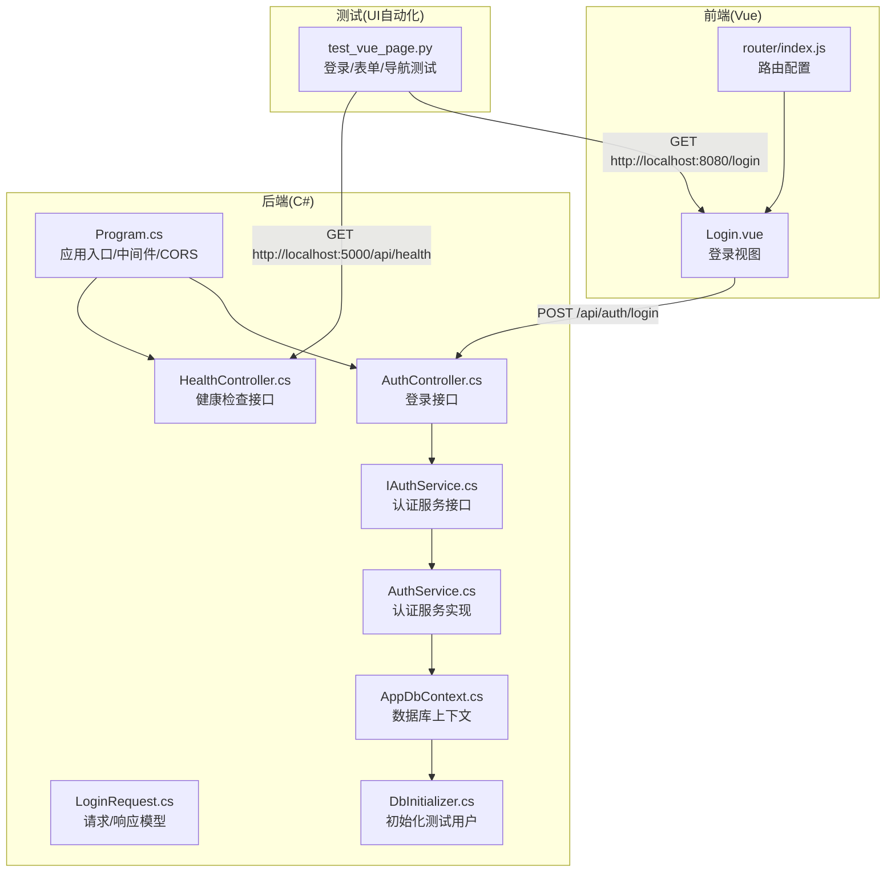
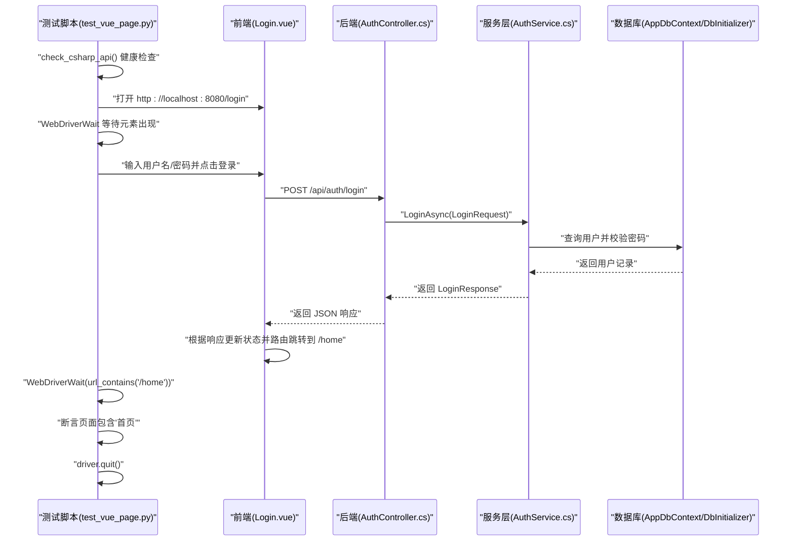
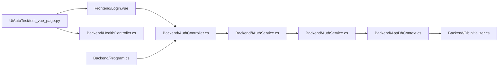

# 登录流程测试

<cite>
**本文引用的文件**
- [UiAutoTest/test_vue_page.py](file://vue-csharp-ui-auto/UiAutoTest/test_vue_page.py)
- [Backend/Controllers/AuthController.cs](file://vue-csharp-ui-auto/Backend/Controllers/AuthController.cs)
- [Backend/Controllers/HealthController.cs](file://vue-csharp-ui-auto/Backend/Controllers/HealthController.cs)
- [Backend/Services/IAuthService.cs](file://vue-csharp-ui-auto/Backend/Services/IAuthService.cs)
- [Backend/Services/AuthService.cs](file://vue-csharp-ui-auto/Backend/Services/AuthService.cs)
- [Backend/Models/LoginRequest.cs](file://vue-csharp-ui-auto/Backend/Models/LoginRequest.cs)
- [Backend/Models/User.cs](file://vue-csharp-ui-auto/Backend/Models/User.cs)
- [Backend/Models/AppDbContext.cs](file://vue-csharp-ui-auto/Backend/Models/AppDbContext.cs)
- [Backend/Models/DbInitializer.cs](file://vue-csharp-ui-auto/Backend/Models/DbInitializer.cs)
- [Backend/Program.cs](file://vue-csharp-ui-auto/Backend/Program.cs)
- [Frontend/src/views/Login.vue](file://vue-csharp-ui-auto/Frontend/src/views/Login.vue)
- [Frontend/src/router/index.js](file://vue-csharp-ui-auto/Frontend/src/router/index.js)
</cite>

## 目录
1. [简介](#简介)
2. [项目结构](#项目结构)
3. [核心组件](#核心组件)
4. [架构总览](#架构总览)
5. [详细组件分析](#详细组件分析)
6. [依赖关系分析](#依赖关系分析)
7. [性能考量](#性能考量)
8. [故障排查指南](#故障排查指南)
9. [结论](#结论)
10. [附录](#附录)

## 简介
本文件围绕 test_vue_login_with_csharp_api 测试用例展开，系统性解析其测试前置条件（后端健康检查）、Chrome 无头模式配置、页面加载等待机制（WebDriverWait 与 expected_conditions）、元素定位策略（基于 data-testid 属性）、登录表单数据输入（用户名 test_user、密码 test_pass123）以及登录成功后的断言验证（URL 跳转至 /home、页面内容包含“首页”）。同时阐明该测试如何验证 Vue 前端与 C# 后端 /api/auth/login 接口的联动正确性，并解释 driver.quit() 在 finally 块中的资源清理作用。最后给出测试失败的常见原因及排查方法，如后端未启动、元素定位失败、等待超时等。

## 项目结构
该项目采用前后端分离架构：
- 前端为 Vue 应用，位于 Frontend 目录，包含登录页、首页、表单页与路由配置。
- 后端为 C# ASP.NET Core 应用，位于 Backend 目录，包含控制器、服务、模型与数据库上下文。
- 自动化测试位于 UiAutoTest 目录，使用 Python+Selenium 编写。

图表来源
- [UiAutoTest/test_vue_page.py](file://vue-csharp-ui-auto/UiAutoTest/test_vue_page.py#L1-L161)
- [Backend/Controllers/HealthController.cs](file://vue-csharp-ui-auto/Backend/Controllers/HealthController.cs#L1-L15)
- [Backend/Controllers/AuthController.cs](file://vue-csharp-ui-auto/Backend/Controllers/AuthController.cs#L1-L25)
- [Backend/Services/IAuthService.cs](file://vue-csharp-ui-auto/Backend/Services/IAuthService.cs#L1-L10)
- [Backend/Services/AuthService.cs](file://vue-csharp-ui-auto/Backend/Services/AuthService.cs#L1-L64)
- [Backend/Models/LoginRequest.cs](file://vue-csharp-ui-auto/Backend/Models/LoginRequest.cs#L1-L28)
- [Backend/Models/AppDbContext.cs](file://vue-csharp-ui-auto/Backend/Models/AppDbContext.cs#L1-L24)
- [Backend/Models/DbInitializer.cs](file://vue-csharp-ui-auto/Backend/Models/DbInitializer.cs#L1-L40)
- [Backend/Program.cs](file://vue-csharp-ui-auto/Backend/Program.cs#L1-L55)
- [Frontend/src/views/Login.vue](file://vue-csharp-ui-auto/Frontend/src/views/Login.vue#L1-L133)
- [Frontend/src/router/index.js](file://vue-csharp-ui-auto/Frontend/src/router/index.js#L1-L33)

章节来源
- [UiAutoTest/test_vue_page.py](file://vue-csharp-ui-auto/UiAutoTest/test_vue_page.py#L1-L161)
- [Backend/Program.cs](file://vue-csharp-ui-auto/Backend/Program.cs#L1-L55)

## 核心组件
- 测试前置条件：通过 requests 发起 GET 请求到后端健康检查接口，确保后端可用后再执行 UI 测试，避免因后端问题导致测试失败。
- Chrome 无头模式：使用 Options 配置 headless、窗口大小、禁用沙箱与 GPU 等参数，适配 CI 环境；并设置隐式等待提升稳定性。
- 页面加载等待：使用 WebDriverWait 与 expected_conditions 的 url_contains、presence_of_element_located 等条件，保证元素出现或 URL 变化后再进行交互。
- 元素定位策略：优先使用 data-testid 属性选择器，提高定位稳定性与可维护性；同时在其他测试中也展示了 ID、CSS、CLASS、LINK_TEXT 等多种定位方式。
- 登录表单数据输入：在登录页输入用户名 test_user、密码 test_pass123，点击登录按钮触发前端发起 /api/auth/login 请求。
- 成功断言：等待 URL 包含 /home 并断言页面源码包含“首页”，验证前端路由跳转与后端返回逻辑正确。
- 资源清理：在 finally 块中调用 driver.quit()，确保无论测试成功与否都会释放浏览器进程与资源。

章节来源
- [UiAutoTest/test_vue_page.py](file://vue-csharp-ui-auto/UiAutoTest/test_vue_page.py#L1-L161)

## 架构总览
下图展示从 UI 自动化测试到前端、后端与数据库的完整调用链路，以及登录成功后的路由跳转过程。

图表来源
- [UiAutoTest/test_vue_page.py](file://vue-csharp-ui-auto/UiAutoTest/test_vue_page.py#L37-L73)
- [Frontend/src/views/Login.vue](file://vue-csharp-ui-auto/Frontend/src/views/Login.vue#L52-L77)
- [Backend/Controllers/AuthController.cs](file://vue-csharp-ui-auto/Backend/Controllers/AuthController.cs#L18-L23)
- [Backend/Services/AuthService.cs](file://vue-csharp-ui-auto/Backend/Services/AuthService.cs#L15-L48)
- [Backend/Models/AppDbContext.cs](file://vue-csharp-ui-auto/Backend/Models/AppDbContext.cs#L1-L24)
- [Backend/Models/DbInitializer.cs](file://vue-csharp-ui-auto/Backend/Models/DbInitializer.cs#L1-L40)

## 详细组件分析

### 测试前置条件：后端健康检查
- 目标：在执行任何 UI 测试前，先确认后端服务处于健康状态，避免因后端未启动或异常导致测试误判。
- 实现：通过 requests.get 访问后端健康检查接口，断言状态码为 200；若失败则打印错误信息并返回 False，测试函数中使用断言终止后续步骤。
- 关联文件：
  - 健康检查接口定义：[HealthController.cs](file://vue-csharp-ui-auto/Backend/Controllers/HealthController.cs#L1-L15)
  - 测试脚本中的健康检查调用与断言：[test_vue_page.py](file://vue-csharp-ui-auto/UiAutoTest/test_vue_page.py#L10-L21)

章节来源
- [UiAutoTest/test_vue_page.py](file://vue-csharp-ui-auto/UiAutoTest/test_vue_page.py#L10-L21)
- [Backend/Controllers/HealthController.cs](file://vue-csharp-ui-auto/Backend/Controllers/HealthController.cs#L1-L15)

### Chrome 无头模式配置与隐式等待
- 目标：在 CI 环境中稳定运行 UI 测试，减少图形界面依赖。
- 实现：通过 Options 添加 headless、窗口尺寸、禁用沙箱与 GPU 等参数；设置 driver.implicitly_wait(10) 提升元素查找稳定性。
- 关联文件：
  - Chrome 驱动配置与隐式等待：[test_vue_page.py](file://vue-csharp-ui-auto/UiAutoTest/test_vue_page.py#L23-L35)

章节来源
- [UiAutoTest/test_vue_page.py](file://vue-csharp-ui-auto/UiAutoTest/test_vue_page.py#L23-L35)

### 页面加载等待机制：WebDriverWait 与 expected_conditions
- 目标：避免 UI 自动化测试中的竞态条件，确保元素存在或 URL 变化后再进行下一步操作。
- 实现：使用 WebDriverWait(driver, timeout) 与 EC.presence_of_element_located、EC.url_contains 等条件组合，等待登录页元素出现与跳转发生。
- 关联文件：
  - 登录页等待与断言：[test_vue_page.py](file://vue-csharp-ui-auto/UiAutoTest/test_vue_page.py#L47-L69)

章节来源
- [UiAutoTest/test_vue_page.py](file://vue-csharp-ui-auto/UiAutoTest/test_vue_page.py#L47-L69)

### 元素定位策略：基于 data-testid 属性
- 目标：以稳定的 data-testid 作为测试定位依据，降低样式或类名变化对测试的影响。
- 实现：在登录页模板中为用户名、密码与提交按钮添加 data-testid 属性；测试脚本使用 CSS 选择器按 data-testid 定位元素。
- 关联文件：
  - 登录页模板中的 data-testid：[Login.vue](file://vue-csharp-ui-auto/Frontend/src/views/Login.vue#L10-L27)
  - 测试脚本中的定位与交互：[test_vue_page.py](file://vue-csharp-ui-auto/UiAutoTest/test_vue_page.py#L52-L60)

章节来源
- [Frontend/src/views/Login.vue](file://vue-csharp-ui-auto/Frontend/src/views/Login.vue#L10-L27)
- [UiAutoTest/test_vue_page.py](file://vue-csharp-ui-auto/UiAutoTest/test_vue_page.py#L52-L60)

### 登录表单数据输入与后端联动
- 目标：验证前端登录表单与后端 /api/auth/login 接口的正确联动。
- 实现：
  - 前端：用户输入 test_user/test_pass123，提交后 axios 发送 POST 到 /api/auth/login，成功后前端通过路由跳转到 /home。
  - 后端：AuthController 接收请求，调用 IAuthService.LoginAsync，AuthService 查询用户并校验密码，返回 LoginResponse。
  - 测试：等待 URL 包含 /home 并断言页面包含“首页”。
- 关联文件：
  - 前端登录处理与路由跳转：[Login.vue](file://vue-csharp-ui-auto/Frontend/src/views/Login.vue#L52-L77)
  - 后端登录接口定义：[AuthController.cs](file://vue-csharp-ui-auto/Backend/Controllers/AuthController.cs#L18-L23)
  - 认证服务接口与实现：[IAuthService.cs](file://vue-csharp-ui-auto/Backend/Services/IAuthService.cs#L1-L10)、[AuthService.cs](file://vue-csharp-ui-auto/Backend/Services/AuthService.cs#L15-L48)
  - 登录请求/响应模型：[LoginRequest.cs](file://vue-csharp-ui-auto/Backend/Models/LoginRequest.cs#L1-L28)
  - 用户模型与数据库上下文：[User.cs](file://vue-csharp-ui-auto/Backend/Models/User.cs#L1-L11)、[AppDbContext.cs](file://vue-csharp-ui-auto/Backend/Models/AppDbContext.cs#L1-L24)
  - 数据库初始化（包含 test_user/test_pass123）：[DbInitializer.cs](file://vue-csharp-ui-auto/Backend/Models/DbInitializer.cs#L16-L31)
  - CORS 与路由配置（确保前端可访问后端）：[Program.cs](file://vue-csharp-ui-auto/Backend/Program.cs#L13-L22)、[router/index.js](file://vue-csharp-ui-auto/Frontend/src/router/index.js#L1-L33)

章节来源
- [Frontend/src/views/Login.vue](file://vue-csharp-ui-auto/Frontend/src/views/Login.vue#L52-L77)
- [Backend/Controllers/AuthController.cs](file://vue-csharp-ui-auto/Backend/Controllers/AuthController.cs#L18-L23)
- [Backend/Services/IAuthService.cs](file://vue-csharp-ui-auto/Backend/Services/IAuthService.cs#L1-L10)
- [Backend/Services/AuthService.cs](file://vue-csharp-ui-auto/Backend/Services/AuthService.cs#L15-L48)
- [Backend/Models/LoginRequest.cs](file://vue-csharp-ui-auto/Backend/Models/LoginRequest.cs#L1-L28)
- [Backend/Models/User.cs](file://vue-csharp-ui-auto/Backend/Models/User.cs#L1-L11)
- [Backend/Models/AppDbContext.cs](file://vue-csharp-ui-auto/Backend/Models/AppDbContext.cs#L1-L24)
- [Backend/Models/DbInitializer.cs](file://vue-csharp-ui-auto/Backend/Models/DbInitializer.cs#L16-L31)
- [Backend/Program.cs](file://vue-csharp-ui-auto/Backend/Program.cs#L13-L22)
- [Frontend/src/router/index.js](file://vue-csharp-ui-auto/Frontend/src/router/index.js#L1-L33)

### 登录成功后的断言验证
- 目标：验证登录成功后的 URL 跳转与页面内容。
- 实现：等待 URL 包含 /home，断言页面源码包含“首页”，确保前端路由与后端返回逻辑一致。
- 关联文件：
  - 断言与 URL 等待：[test_vue_page.py](file://vue-csharp-ui-auto/UiAutoTest/test_vue_page.py#L62-L69)

章节来源
- [UiAutoTest/test_vue_page.py](file://vue-csharp-ui-auto/UiAutoTest/test_vue_page.py#L62-L69)

### driver.quit() 在 finally 块中的资源清理
- 目标：确保无论测试成功或失败，都会释放浏览器进程与相关资源，避免资源泄漏。
- 实现：在每个测试函数的 finally 块中调用 driver.quit()。
- 关联文件：
  - 登录测试的 finally 清理：[test_vue_page.py](file://vue-csharp-ui-auto/UiAutoTest/test_vue_page.py#L71-L73)
  - 表单测试的 finally 清理：[test_vue_page.py](file://vue-csharp-ui-auto/UiAutoTest/test_vue_page.py#L107-L109)
  - 导航测试的 finally 清理：[test_vue_page.py](file://vue-csharp-ui-auto/UiAutoTest/test_vue_page.py#L153-L155)

章节来源
- [UiAutoTest/test_vue_page.py](file://vue-csharp-ui-auto/UiAutoTest/test_vue_page.py#L71-L73)
- [UiAutoTest/test_vue_page.py](file://vue-csharp-ui-auto/UiAutoTest/test_vue_page.py#L107-L109)
- [UiAutoTest/test_vue_page.py](file://vue-csharp-ui-auto/UiAutoTest/test_vue_page.py#L153-L155)

## 依赖关系分析
- 前端依赖后端接口：Login.vue 通过 axios 调用 /api/auth/login，返回成功后前端路由跳转。
- 后端依赖服务层与数据库：AuthController 依赖 IAuthService，AuthService 查询 AppDbContext 中的用户并校验密码。
- 测试依赖前端与后端：test_vue_page.py 依赖前端页面与后端接口，先进行健康检查，再进行 UI 交互与断言。
- CORS 配置：后端 Program.cs 中配置 AllowVueApp 策略，允许前端本地开发服务器访问后端 API。

图表来源
- [UiAutoTest/test_vue_page.py](file://vue-csharp-ui-auto/UiAutoTest/test_vue_page.py#L1-L161)
- [Frontend/src/views/Login.vue](file://vue-csharp-ui-auto/Frontend/src/views/Login.vue#L52-L77)
- [Backend/Controllers/AuthController.cs](file://vue-csharp-ui-auto/Backend/Controllers/AuthController.cs#L18-L23)
- [Backend/Services/IAuthService.cs](file://vue-csharp-ui-auto/Backend/Services/IAuthService.cs#L1-L10)
- [Backend/Services/AuthService.cs](file://vue-csharp-ui-auto/Backend/Services/AuthService.cs#L15-L48)
- [Backend/Models/AppDbContext.cs](file://vue-csharp-ui-auto/Backend/Models/AppDbContext.cs#L1-L24)
- [Backend/Models/DbInitializer.cs](file://vue-csharp-ui-auto/Backend/Models/DbInitializer.cs#L1-L40)
- [Backend/Controllers/HealthController.cs](file://vue-csharp-ui-auto/Backend/Controllers/HealthController.cs#L1-L15)
- [Backend/Program.cs](file://vue-csharp-ui-auto/Backend/Program.cs#L13-L22)

章节来源
- [UiAutoTest/test_vue_page.py](file://vue-csharp-ui-auto/UiAutoTest/test_vue_page.py#L1-L161)
- [Backend/Program.cs](file://vue-csharp-ui-auto/Backend/Program.cs#L13-L22)

## 性能考量
- 等待策略：合理设置显式等待（WebDriverWait）与隐式等待（implicitly_wait），避免过短导致不稳定、过长导致测试时间拉长。
- 无头模式：headless 模式减少图形开销，适合 CI 环境；但可能无法完全模拟真实浏览器行为，建议在关键场景结合有头模式进行回归。
- 超时与重试：对于网络波动或后端延迟，可在测试框架层面增加重试与更长超时，但需平衡测试时长与稳定性。
- 资源管理：及时 quit 驱动，避免多线程或并发测试下的资源泄漏。

## 故障排查指南
- 后端未启动或不可达
  - 现象：健康检查失败，测试直接终止。
  - 排查：确认后端已启动并监听 5000 端口；检查 Program.cs 中的 CORS 配置是否允许前端访问。
  - 关联文件：[HealthController.cs](file://vue-csharp-ui-auto/Backend/Controllers/HealthController.cs#L1-L15)、[Program.cs](file://vue-csharp-ui-auto/Backend/Program.cs#L13-L22)
- 元素定位失败
  - 现象：找不到 data-testid 对应的输入框或按钮。
  - 排查：确认前端模板中 data-testid 是否正确；检查页面是否已渲染；适当延长等待时间；必要时切换为更稳定的定位策略。
  - 关联文件：[Login.vue](file://vue-csharp-ui-auto/Frontend/src/views/Login.vue#L10-L27)、[test_vue_page.py](file://vue-csharp-ui-auto/UiAutoTest/test_vue_page.py#L47-L60)
- 等待超时
  - 现象：WebDriverWait 超时，URL 未跳转或元素未出现。
  - 排查：增大等待超时；确认后端响应是否正常；检查前端路由跳转逻辑是否被拦截或延迟。
  - 关联文件：[test_vue_page.py](file://vue-csharp-ui-auto/UiAutoTest/test_vue_page.py#L47-L69)、[Login.vue](file://vue-csharp-ui-auto/Frontend/src/views/Login.vue#L62-L69)
- 登录失败或密码错误
  - 现象：后端返回失败消息或前端显示错误提示。
  - 排查：确认用户名/密码是否与 DbInitializer 初始化的数据一致；检查 AuthService 中的密码校验逻辑。
  - 关联文件：[DbInitializer.cs](file://vue-csharp-ui-auto/Backend/Models/DbInitializer.cs#L16-L31)、[AuthService.cs](file://vue-csharp-ui-auto/Backend/Services/AuthService.cs#L29-L48)
- 路由未跳转或页面不包含“首页”
  - 现象：URL 未跳转到 /home 或页面源码不含“首页”。
  - 排查：确认前端路由配置；检查 Login.vue 中的路由跳转逻辑；确认后端返回的响应字段与前端判断一致。
  - 关联文件：[router/index.js](file://vue-csharp-ui-auto/Frontend/src/router/index.js#L1-L33)、[Login.vue](file://vue-csharp-ui-auto/Frontend/src/views/Login.vue#L62-L69)、[test_vue_page.py](file://vue-csharp-ui-auto/UiAutoTest/test_vue_page.py#L62-L69)

## 结论
test_vue_login_with_csharp_api 测试用例通过“后端健康检查 + Chrome 无头模式 + 显式等待 + data-testid 定位 + 登录表单输入 + URL/内容断言”的完整流程，有效验证了 Vue 前端与 C# 后端 /api/auth/login 接口的联动正确性。测试还体现了良好的资源管理实践（finally 中 quit 驱动），并在断言中覆盖了路由跳转与页面内容的关键点。针对常见失败原因提供了系统化的排查路径，有助于快速定位并解决问题。

## 附录
- 测试数据与用户初始化
  - 测试用户：用户名 test_user，密码 test_pass123（用于测试目的的简化校验）。
  - 初始化位置：[DbInitializer.cs](file://vue-csharp-ui-auto/Backend/Models/DbInitializer.cs#L16-L31)
- 前端路由与登录页
  - 登录页路由与跳转：[router/index.js](file://vue-csharp-ui-auto/Frontend/src/router/index.js#L1-L33)、[Login.vue](file://vue-csharp-ui-auto/Frontend/src/views/Login.vue#L62-L69)
- 后端接口与服务
  - 登录接口定义：[AuthController.cs](file://vue-csharp-ui-auto/Backend/Controllers/AuthController.cs#L18-L23)
  - 认证服务接口与实现：[IAuthService.cs](file://vue-csharp-ui-auto/Backend/Services/IAuthService.cs#L1-L10)、[AuthService.cs](file://vue-csharp-ui-auto/Backend/Services/AuthService.cs#L15-L48)
  - 登录请求/响应模型：[LoginRequest.cs](file://vue-csharp-ui-auto/Backend/Models/LoginRequest.cs#L1-L28)