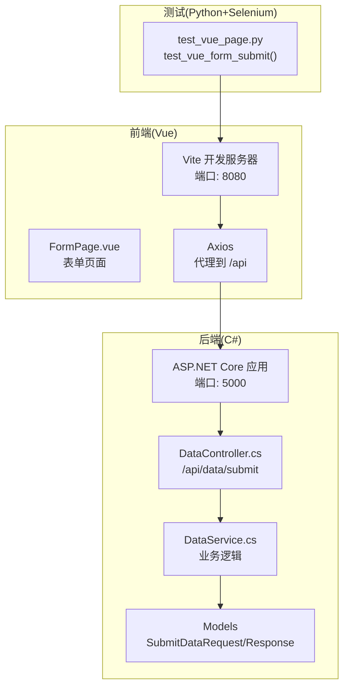
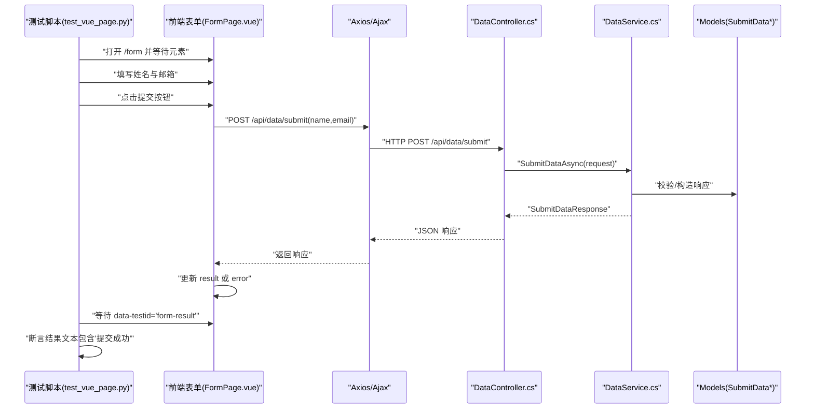
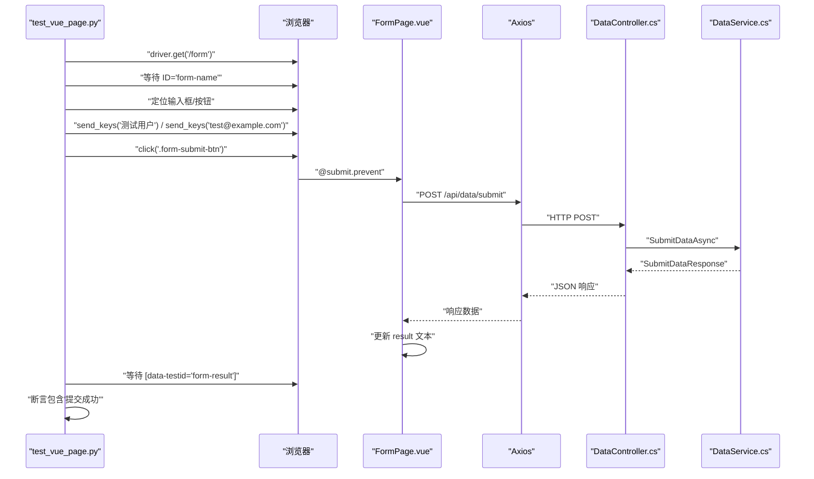
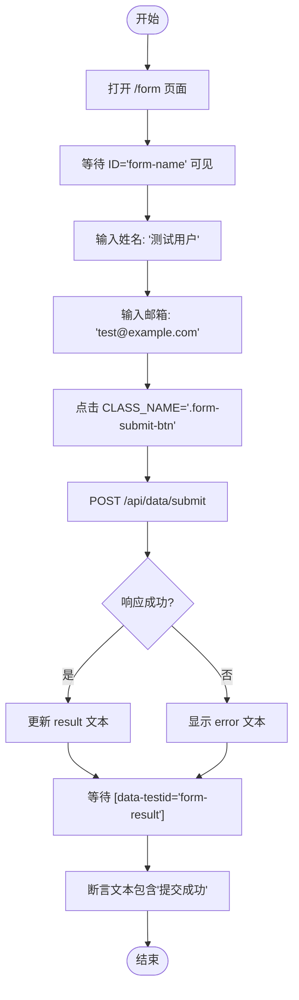
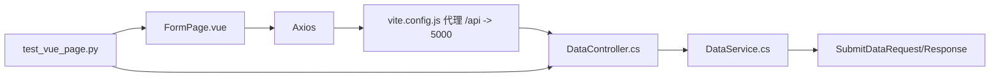

# 表单提交测试

<cite>
**本文引用的文件**
- [UiAutoTest/test_vue_page.py](file://vue-csharp-ui-auto/UiAutoTest/test_vue_page.py)
- [Frontend/src/views/FormPage.vue](file://vue-csharp-ui-auto/Frontend/src/views/FormPage.vue)
- [Backend/Controllers/DataController.cs](file://vue-csharp-ui-auto/Backend/Controllers/DataController.cs)
- [Backend/Services/DataService.cs](file://vue-csharp-ui-auto/Backend/Services/DataService.cs)
- [Backend/Models/LoginRequest.cs](file://vue-csharp-ui-auto/Backend/Models/LoginRequest.cs)
- [Backend/Program.cs](file://vue-csharp-ui-auto/Backend/Program.cs)
- [Frontend/vite.config.js](file://vue-csharp-ui-auto/Frontend/vite.config.js)
- [README.md](file://vue-csharp-ui-auto/README.md)
</cite>

## 目录
1. [简介](#简介)
2. [项目结构](#项目结构)
3. [核心组件](#核心组件)
4. [架构总览](#架构总览)
5. [详细组件分析](#详细组件分析)
6. [依赖关系分析](#依赖关系分析)
7. [性能考虑](#性能考虑)
8. [故障排查指南](#故障排查指南)
9. [结论](#结论)

## 简介
本文件围绕“test_vue_form_submit”测试用例展开，系统性梳理从表单页面访问、元素等待与定位、测试数据填充、提交按钮触发，到异步响应处理与结果断言的完整流程。重点解释如何通过 data-testid='form-result' 定位结果展示区域，并验证返回文本包含“提交成功”，从而确认 C# 后端 /api/data/submit 接口的正确响应。同时，阐述该测试如何模拟真实用户操作并验证前后端数据交互的完整性，并列举常见异常场景与调试建议。

## 项目结构
该项目采用前后端分离架构：
- 前端为 Vue3 应用，使用 Vite 开发服务器，默认监听 8080 端口；通过代理将 /api 请求转发至后端 5000 端口。
- 后端为 ASP.NET Core 控制器，提供健康检查与数据提交接口；启用 CORS 以允许前端访问。
- UI 自动化测试使用 Python+Selenium，分别对登录、表单提交与页面导航进行端到端验证。

图表来源
- [Frontend/vite.config.js](file://vue-csharp-ui-auto/Frontend/vite.config.js#L1-L22)
- [Backend/Program.cs](file://vue-csharp-ui-auto/Backend/Program.cs#L1-L55)
- [Backend/Controllers/DataController.cs](file://vue-csharp-ui-auto/Backend/Controllers/DataController.cs#L1-L25)
- [Backend/Services/DataService.cs](file://vue-csharp-ui-auto/Backend/Services/DataService.cs#L1-L30)
- [Backend/Models/LoginRequest.cs](file://vue-csharp-ui-auto/Backend/Models/LoginRequest.cs#L1-L28)
- [UiAutoTest/test_vue_page.py](file://vue-csharp-ui-auto/UiAutoTest/test_vue_page.py#L74-L109)

章节来源
- [README.md](file://vue-csharp-ui-auto/README.md#L1-L113)
- [Frontend/vite.config.js](file://vue-csharp-ui-auto/Frontend/vite.config.js#L1-L22)
- [Backend/Program.cs](file://vue-csharp-ui-auto/Backend/Program.cs#L1-L55)

## 核心组件
- 表单页面组件：负责渲染表单项、提交事件处理、loading 状态、结果与错误展示。
- 数据提交控制器：接收前端 POST /api/data/submit，调用业务服务并返回 JSON 响应。
- 业务服务：执行数据校验与处理，返回统一的响应对象。
- UI 自动化测试：通过 Selenium 访问表单页面，等待元素、填写数据、点击提交、断言结果。

章节来源
- [Frontend/src/views/FormPage.vue](file://vue-csharp-ui-auto/Frontend/src/views/FormPage.vue#L1-L80)
- [Backend/Controllers/DataController.cs](file://vue-csharp-ui-auto/Backend/Controllers/DataController.cs#L1-L25)
- [Backend/Services/DataService.cs](file://vue-csharp-ui-auto/Backend/Services/DataService.cs#L1-L30)
- [UiAutoTest/test_vue_page.py](file://vue-csharp-ui-auto/UiAutoTest/test_vue_page.py#L74-L109)

## 架构总览
下图展示从 UI 触发到后端响应再到页面结果展示的端到端流程。

图表来源
- [UiAutoTest/test_vue_page.py](file://vue-csharp-ui-auto/UiAutoTest/test_vue_page.py#L74-L109)
- [Frontend/src/views/FormPage.vue](file://vue-csharp-ui-auto/Frontend/src/views/FormPage.vue#L40-L78)
- [Backend/Controllers/DataController.cs](file://vue-csharp-ui-auto/Backend/Controllers/DataController.cs#L18-L24)
- [Backend/Services/DataService.cs](file://vue-csharp-ui-auto/Backend/Services/DataService.cs#L1-L30)
- [Backend/Models/LoginRequest.cs](file://vue-csharp-ui-auto/Backend/Models/LoginRequest.cs#L17-L28)

## 详细组件分析

### 表单页面组件(FormPage.vue)
- 渲染姓名与邮箱输入框，提交按钮根据 loading 状态禁用或启用。
- 提交事件通过 axios 发起 POST 请求到 /api/data/submit，携带 name 与 email 字段。
- 成功时将 result 设置为“提交成功: + message”，失败时设置 error。
- 结果展示容器带有 data-testid='form-result'，便于测试脚本定位。

章节来源
- [Frontend/src/views/FormPage.vue](file://vue-csharp-ui-auto/Frontend/src/views/FormPage.vue#L1-L80)

### 数据提交控制器(DataController.cs)
- 路由定义为 api/data/submit，接收 SubmitDataRequest，调用 IDataService.SubmitDataAsync 并返回 Ok 响应。

章节来源
- [Backend/Controllers/DataController.cs](file://vue-csharp-ui-auto/Backend/Controllers/DataController.cs#L18-L24)

### 业务服务(DataService.cs)
- 校验请求字段非空，返回统一的 SubmitDataResponse 对象，包含 Success 与 Message。
- 成功时返回包含姓名与邮箱的提示消息；失败时返回错误原因。

章节来源
- [Backend/Services/DataService.cs](file://vue-csharp-ui-auto/Backend/Services/DataService.cs#L1-L30)
- [Backend/Models/LoginRequest.cs](file://vue-csharp-ui-auto/Backend/Models/LoginRequest.cs#L17-L28)

### UI 自动化测试(test_vue_page.py)
- 后端可用性检查：先请求 /api/health，确保后端正常后再执行 UI 测试。
- 打开表单页面 http://localhost:8080/form，等待 ID 为 form-name 的输入框出现。
- 使用 ID 定位姓名与邮箱输入框，使用 CLASS_NAME 定位提交按钮。
- 填充测试数据：姓名“测试用户”，邮箱“test@example.com”，点击提交。
- 等待 data-testid='form-result' 出现，断言其文本包含“提交成功”。

章节来源
- [UiAutoTest/test_vue_page.py](file://vue-csharp-ui-auto/UiAutoTest/test_vue_page.py#L74-L109)

### 提交流程时序图

图表来源
- [UiAutoTest/test_vue_page.py](file://vue-csharp-ui-auto/UiAutoTest/test_vue_page.py#L74-L109)
- [Frontend/src/views/FormPage.vue](file://vue-csharp-ui-auto/Frontend/src/views/FormPage.vue#L40-L78)
- [Backend/Controllers/DataController.cs](file://vue-csharp-ui-auto/Backend/Controllers/DataController.cs#L18-L24)
- [Backend/Services/DataService.cs](file://vue-csharp-ui-auto/Backend/Services/DataService.cs#L1-L30)

### 表单提交算法流程图

图表来源
- [UiAutoTest/test_vue_page.py](file://vue-csharp-ui-auto/UiAutoTest/test_vue_page.py#L74-L109)
- [Frontend/src/views/FormPage.vue](file://vue-csharp-ui-auto/Frontend/src/views/FormPage.vue#L40-L78)

## 依赖关系分析
- 前端依赖
  - axios：用于向后端发送请求。
  - vite.config.js：配置代理，将 /api 请求转发到后端 5000 端口。
- 后端依赖
  - Program.cs：启用 CORS 策略 AllowVueApp，允许前端访问。
  - DataController.cs：映射 /api/data/submit。
  - DataService.cs：实现 SubmitDataAsync，返回 SubmitDataResponse。
- 测试依赖
  - test_vue_page.py：使用 Selenium 定位元素、等待条件、断言结果。

图表来源
- [Frontend/vite.config.js](file://vue-csharp-ui-auto/Frontend/vite.config.js#L1-L22)
- [Backend/Controllers/DataController.cs](file://vue-csharp-ui-auto/Backend/Controllers/DataController.cs#L18-L24)
- [Backend/Services/DataService.cs](file://vue-csharp-ui-auto/Backend/Services/DataService.cs#L1-L30)
- [Backend/Models/LoginRequest.cs](file://vue-csharp-ui-auto/Backend/Models/LoginRequest.cs#L17-L28)
- [UiAutoTest/test_vue_page.py](file://vue-csharp-ui-auto/UiAutoTest/test_vue_page.py#L74-L109)

章节来源
- [Frontend/vite.config.js](file://vue-csharp-ui-auto/Frontend/vite.config.js#L1-L22)
- [Backend/Program.cs](file://vue-csharp-ui-auto/Backend/Program.cs#L1-L55)
- [Backend/Controllers/DataController.cs](file://vue-csharp-ui-auto/Backend/Controllers/DataController.cs#L18-L24)
- [Backend/Services/DataService.cs](file://vue-csharp-ui-auto/Backend/Services/DataService.cs#L1-L30)
- [UiAutoTest/test_vue_page.py](file://vue-csharp-ui-auto/UiAutoTest/test_vue_page.py#L74-L109)

## 性能考虑
- 等待策略：使用显式等待等待元素出现，避免硬编码 sleep 导致不稳定。
- 超时设置：WebDriverWait 的超时时间可根据网络与服务启动速度调整。
- 代理延迟：前端代理到后端可能引入额外延迟，建议在 CI 中适当增加等待时间。
- 资源释放：测试结束后及时关闭浏览器实例，避免资源泄漏。

## 故障排查指南
- 接口超时
  - 现象：等待 data-testid='form-result' 超时或断言失败。
  - 排查：确认后端 /api/health 可用；检查 /api/data/submit 是否可达；查看代理配置。
  - 建议：在测试前置条件中增加后端可用性检查；在 CI 环境中延长等待时间。
- 输入框不可交互
  - 现象：无法输入或点击提交按钮。
  - 排查：确认页面已加载完成；检查 ID 与 CLASS_NAME 是否匹配；确认元素未被遮挡或禁用。
  - 建议：使用显式等待直到元素可交互；必要时加入滚动到可视区域的逻辑。
- 结果元素未更新
  - 现象：页面未显示 result 文本或 error 文本。
  - 排查：确认 axios 请求已发送且响应成功；检查前端逻辑是否更新 result/error。
  - 建议：在断言前增加对 result 文本的显式等待；打印页面源码辅助定位。
- CORS 错误
  - 现象：浏览器控制台报跨域错误。
  - 排查：确认后端已启用 CORS 策略并允许前端域名；确认代理配置正确。
  - 建议：核对 Program.cs 中的 AllowVueApp 策略与前端访问域名一致。
- 数据校验失败
  - 现象：后端返回失败消息，前端显示 error。
  - 排查：检查 SubmitDataRequest 字段是否为空；确认前端传参格式正确。
  - 建议：在测试中使用有效数据；必要时扩展断言覆盖错误分支。

章节来源
- [UiAutoTest/test_vue_page.py](file://vue-csharp-ui-auto/UiAutoTest/test_vue_page.py#L1-L21)
- [Backend/Program.cs](file://vue-csharp-ui-auto/Backend/Program.cs#L13-L22)
- [Frontend/src/views/FormPage.vue](file://vue-csharp-ui-auto/Frontend/src/views/FormPage.vue#L40-L78)
- [Backend/Services/DataService.cs](file://vue-csharp-ui-auto/Backend/Services/DataService.cs#L1-L30)

## 结论
test_vue_form_submit 用例完整地模拟了真实用户从访问表单、填写数据、提交请求到接收响应并断言结果的过程。通过 data-testid='form-result' 精确定位结果展示区域，结合后端 /api/data/submit 的响应，验证了前后端数据交互的完整性。测试还体现了良好的等待策略与断言设计，能够稳定地检测提交流程的正确性。针对可能出现的超时、元素不可交互、结果未更新等问题，提供了清晰的排查思路与改进建议。