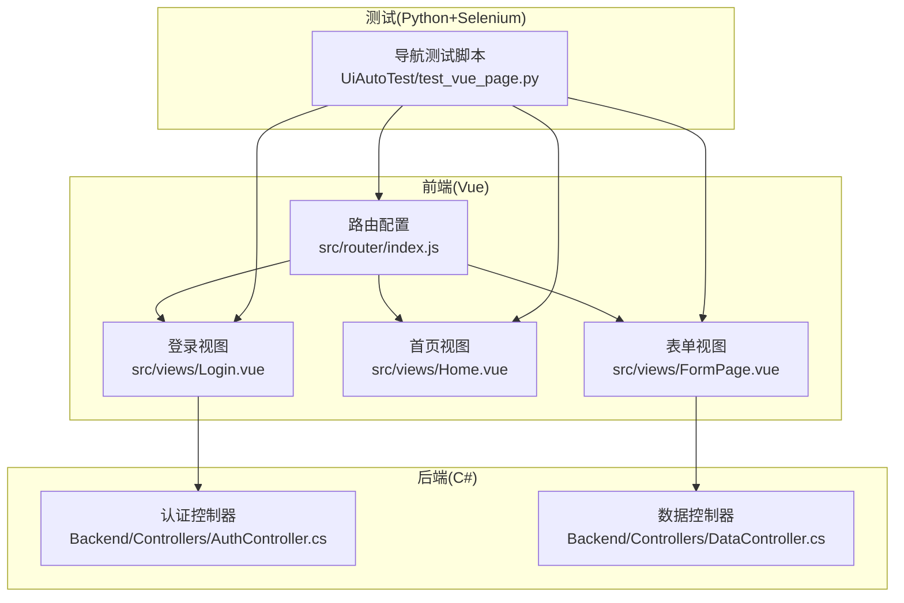
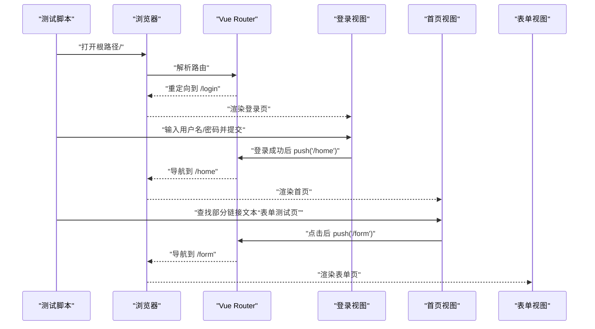
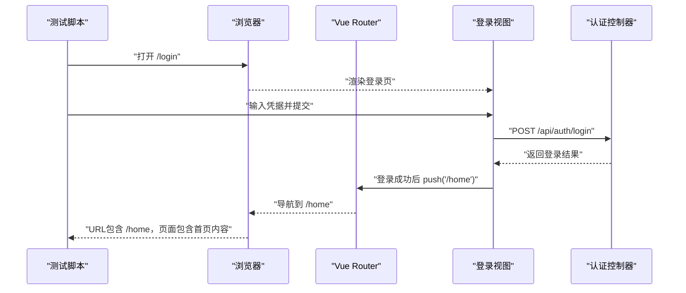
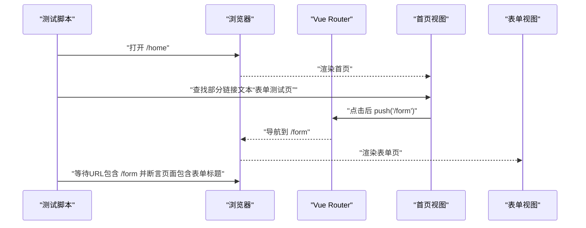
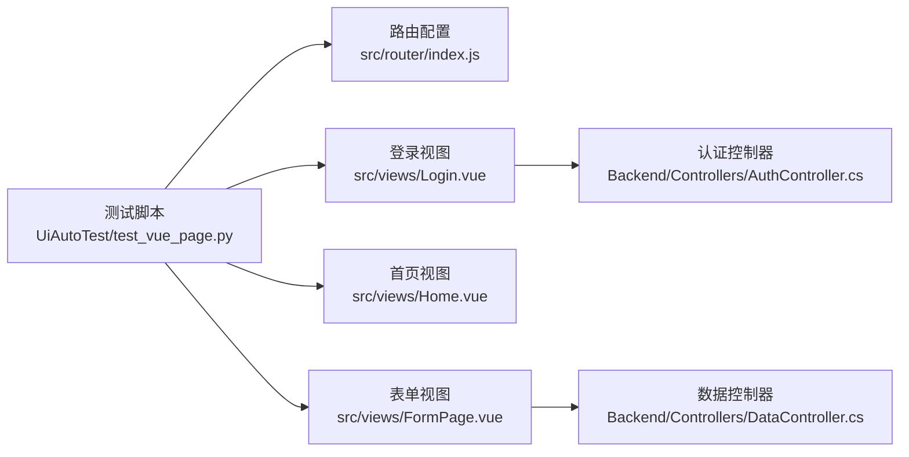

# 页面导航测试

<cite>
**本文引用的文件**
- [UiAutoTest/test_vue_page.py](file://vue-csharp-ui-auto/UiAutoTest/test_vue_page.py)
- [Frontend/src/router/index.js](file://vue-csharp-ui-auto/Frontend/src/router/index.js)
- [Frontend/src/views/Login.vue](file://vue-csharp-ui-auto/Frontend/src/views/Login.vue)
- [Frontend/src/views/Home.vue](file://vue-csharp-ui-auto/Frontend/src/views/Home.vue)
- [Frontend/src/views/FormPage.vue](file://vue-csharp-ui-auto/Frontend/src/views/FormPage.vue)
- [Backend/Controllers/AuthController.cs](file://vue-csharp-ui-auto/Backend/Controllers/AuthController.cs)
- [Backend/Controllers/DataController.cs](file://vue-csharp-ui-auto/Backend/Controllers/DataController.cs)
- [README.md](file://vue-csharp-ui-auto/README.md)
</cite>

## 目录
1. [引言](#引言)
2. [项目结构](#项目结构)
3. [核心组件](#核心组件)
4. [架构总览](#架构总览)
5. [详细组件分析](#详细组件分析)
6. [依赖关系分析](#依赖关系分析)
7. [性能考虑](#性能考虑)
8. [故障排查指南](#故障排查指南)
9. [结论](#结论)
10. [附录](#附录)

## 引言
本文件围绕“页面导航测试”这一核心目标，系统阐述测试用例的设计目的与实现细节，覆盖以下关键场景：
- 初始访问根路径（/）触发重定向至登录页的验证
- 登录流程的自动化执行与登录后跳转至首页（/home）的确认
- 通过部分链接文本（“表单测试页”）导航至表单页面（/form）的完整路径验证
- 如何利用WebDriverWait确保页面状态同步，避免因Vue路由异步加载导致的断言失败
- 测试对前端路由配置（Vue Router）与整体用户旅程连贯性的保障作用
- 面向未来变更（链接文本、路由路径等）的测试维护策略

## 项目结构
该项目采用前后端分离架构，前端为Vue3应用，后端为C# ASP.NET Core应用，配合Python+Selenium的UI自动化测试脚本，形成端到端的用户旅程验证闭环。

图表来源
- [Frontend/src/router/index.js](file://vue-csharp-ui-auto/Frontend/src/router/index.js#L1-L33)
- [Frontend/src/views/Login.vue](file://vue-csharp-ui-auto/Frontend/src/views/Login.vue#L1-L80)
- [Frontend/src/views/Home.vue](file://vue-csharp-ui-auto/Frontend/src/views/Home.vue#L1-L23)
- [Frontend/src/views/FormPage.vue](file://vue-csharp-ui-auto/Frontend/src/views/FormPage.vue#L1-L78)
- [Backend/Controllers/AuthController.cs](file://vue-csharp-ui-auto/Backend/Controllers/AuthController.cs#L1-L25)
- [Backend/Controllers/DataController.cs](file://vue-csharp-ui-auto/Backend/Controllers/DataController.cs#L1-L25)
- [UiAutoTest/test_vue_page.py](file://vue-csharp-ui-auto/UiAutoTest/test_vue_page.py#L110-L155)

章节来源
- [README.md](file://vue-csharp-ui-auto/README.md#L1-L113)

## 核心组件
- 路由配置：定义根路径重定向、登录页、首页、表单页的路径映射，确保用户旅程的可预测性与一致性。
- 登录视图：提供用户名/密码输入与提交逻辑，调用后端认证接口并在成功后通过路由跳转至首页。
- 首页视图：包含指向表单页的导航链接，作为后续页面导航测试的入口。
- 表单视图：提供表单提交能力，调用后端数据提交接口并将结果回显至页面。
- 导航测试脚本：以端到端方式验证用户旅程，包括根路径重定向、登录跳转、以及基于链接文本的页面导航。

章节来源
- [Frontend/src/router/index.js](file://vue-csharp-ui-auto/Frontend/src/router/index.js#L1-L33)
- [Frontend/src/views/Login.vue](file://vue-csharp-ui-auto/Frontend/src/views/Login.vue#L1-L80)
- [Frontend/src/views/Home.vue](file://vue-csharp-ui-auto/Frontend/src/views/Home.vue#L1-L23)
- [Frontend/src/views/FormPage.vue](file://vue-csharp-ui-auto/Frontend/src/views/FormPage.vue#L1-L78)
- [UiAutoTest/test_vue_page.py](file://vue-csharp-ui-auto/UiAutoTest/test_vue_page.py#L110-L155)

## 架构总览
下图展示了“页面导航测试”的端到端流程：测试脚本驱动浏览器访问根路径，触发前端路由重定向；随后执行登录流程并等待跳转至首页；最后通过部分链接文本定位并点击，验证跳转至表单页。

图表来源
- [UiAutoTest/test_vue_page.py](file://vue-csharp-ui-auto/UiAutoTest/test_vue_page.py#L110-L155)
- [Frontend/src/router/index.js](file://vue-csharp-ui-auto/Frontend/src/router/index.js#L1-L33)
- [Frontend/src/views/Login.vue](file://vue-csharp-ui-auto/Frontend/src/views/Login.vue#L1-L80)
- [Frontend/src/views/Home.vue](file://vue-csharp-ui-auto/Frontend/src/views/Home.vue#L1-L23)
- [Frontend/src/views/FormPage.vue](file://vue-csharp-ui-auto/Frontend/src/views/FormPage.vue#L1-L78)

## 详细组件分析

### 设计目的与测试范围
- 根路径重定向验证：确保用户首次访问时被正确引导至登录页，避免直接进入受保护页面。
- 登录流程自动化：模拟真实用户输入，调用后端认证接口，验证登录成功后的路由跳转。
- 页面导航验证：通过部分链接文本定位导航链接，验证最终跳转路径与页面内容。
- 状态同步与稳定性：使用WebDriverWait等待关键元素出现或URL变化，规避Vue路由异步加载导致的断言失败。

章节来源
- [UiAutoTest/test_vue_page.py](file://vue-csharp-ui-auto/UiAutoTest/test_vue_page.py#L110-L155)
- [README.md](file://vue-csharp-ui-auto/README.md#L46-L51)

### 根路径重定向与登录流程
- 根路径重定向：前端路由配置将“/”重定向至“/login”，测试脚本打开“/”后断言页面包含登录标题，从而确认重定向生效。
- 登录流程：测试脚本在登录页输入凭据并点击提交按钮，随后使用WebDriverWait等待URL包含“/home”，断言页面包含首页内容，确保登录成功且路由跳转正常。

图表来源
- [Frontend/src/router/index.js](file://vue-csharp-ui-auto/Frontend/src/router/index.js#L1-L33)
- [Frontend/src/views/Login.vue](file://vue-csharp-ui-auto/Frontend/src/views/Login.vue#L1-L80)
- [Backend/Controllers/AuthController.cs](file://vue-csharp-ui-auto/Backend/Controllers/AuthController.cs#L1-L25)
- [UiAutoTest/test_vue_page.py](file://vue-csharp-ui-auto/UiAutoTest/test_vue_page.py#L38-L73)

章节来源
- [UiAutoTest/test_vue_page.py](file://vue-csharp-ui-auto/UiAutoTest/test_vue_page.py#L38-L73)
- [Frontend/src/router/index.js](file://vue-csharp-ui-auto/Frontend/src/router/index.js#L1-L33)
- [Frontend/src/views/Login.vue](file://vue-csharp-ui-auto/Frontend/src/views/Login.vue#L1-L80)
- [Backend/Controllers/AuthController.cs](file://vue-csharp-ui-auto/Backend/Controllers/AuthController.cs#L1-L25)

### 基于部分链接文本的导航验证
- 链接定位：在首页视图中，存在指向“/form”的导航链接，测试脚本通过“部分链接文本”定位该链接，避免硬编码完整链接。
- 跳转验证：点击后使用WebDriverWait等待URL包含“/form”，并断言页面包含表单页标题，确保导航链路完整。

图表来源
- [UiAutoTest/test_vue_page.py](file://vue-csharp-ui-auto/UiAutoTest/test_vue_page.py#L110-L155)
- [Frontend/src/views/Home.vue](file://vue-csharp-ui-auto/Frontend/src/views/Home.vue#L1-L23)
- [Frontend/src/router/index.js](file://vue-csharp-ui-auto/Frontend/src/router/index.js#L1-L33)

章节来源
- [UiAutoTest/test_vue_page.py](file://vue-csharp-ui-auto/UiAutoTest/test_vue_page.py#L110-L155)
- [Frontend/src/views/Home.vue](file://vue-csharp-ui-auto/Frontend/src/views/Home.vue#L1-L23)

### 状态同步与断言策略
- 显式等待：测试脚本广泛使用WebDriverWait与期望条件（如元素可见、URL包含特定字符串），确保在DOM或路由状态稳定后再进行断言。
- URL断言：通过url_contains进行路径级断言，避免依赖页面内容的不确定性。
- 元素定位：优先使用data-testid或明确的ID/标签选择器，减少因样式或类名变化导致的定位失败。

章节来源
- [UiAutoTest/test_vue_page.py](file://vue-csharp-ui-auto/UiAutoTest/test_vue_page.py#L110-L155)

### 对前端路由配置与用户旅程的保障作用
- 路由一致性：根路径重定向与各页面路径定义保证了用户旅程的确定性，测试用例直接映射到路由配置，确保配置变更能被及时发现。
- 旅程连贯性：从重定向、登录、再到导航的完整链路，测试用例覆盖了关键用户路径，有助于在重构或新增页面时保持连贯性。

章节来源
- [Frontend/src/router/index.js](file://vue-csharp-ui-auto/Frontend/src/router/index.js#L1-L33)
- [README.md](file://vue-csharp-ui-auto/README.md#L30-L51)

### 面向变更的测试维护策略
- 链接文本变更：若导航链接文本发生变化，应同步更新测试中的部分链接文本匹配策略，必要时引入更稳定的data-testid或ID定位。
- 路由路径调整：若“/form”或“/home”等路径发生变更，需同步修改测试脚本中的URL断言与链接点击逻辑。
- 元素定位健壮性：建议优先使用data-testid或唯一ID，减少对动态类名或文本的依赖，提升测试鲁棒性。
- 等待策略优化：根据页面复杂度适当调整等待超时时间，避免过短导致误判，过长影响效率。

章节来源
- [UiAutoTest/test_vue_page.py](file://vue-csharp-ui-auto/UiAutoTest/test_vue_page.py#L110-L155)
- [README.md](file://vue-csharp-ui-auto/README.md#L108-L113)

## 依赖关系分析
- 前端依赖：页面导航依赖于路由配置与视图组件；登录视图依赖认证控制器；表单视图依赖数据控制器。
- 测试依赖：测试脚本依赖浏览器驱动、路由配置、视图组件以及后端接口的可用性。

图表来源
- [UiAutoTest/test_vue_page.py](file://vue-csharp-ui-auto/UiAutoTest/test_vue_page.py#L110-L155)
- [Frontend/src/router/index.js](file://vue-csharp-ui-auto/Frontend/src/router/index.js#L1-L33)
- [Frontend/src/views/Login.vue](file://vue-csharp-ui-auto/Frontend/src/views/Login.vue#L1-L80)
- [Frontend/src/views/Home.vue](file://vue-csharp-ui-auto/Frontend/src/views/Home.vue#L1-L23)
- [Frontend/src/views/FormPage.vue](file://vue-csharp-ui-auto/Frontend/src/views/FormPage.vue#L1-L78)
- [Backend/Controllers/AuthController.cs](file://vue-csharp-ui-auto/Backend/Controllers/AuthController.cs#L1-L25)
- [Backend/Controllers/DataController.cs](file://vue-csharp-ui-auto/Backend/Controllers/DataController.cs#L1-L25)

## 性能考虑
- 等待策略：合理设置WebDriverWait超时时间，避免过长等待影响整体测试时长；对于简单页面可缩短等待时间。
- 元素定位：优先使用稳定的选择器（ID、data-testid），减少DOM扫描成本。
- 浏览器配置：在CI环境中使用无头模式与固定窗口尺寸，提高稳定性与速度。
- 后端可用性前置检查：在测试开始前校验后端健康状态，避免无效等待与失败重试。

章节来源
- [UiAutoTest/test_vue_page.py](file://vue-csharp-ui-auto/UiAutoTest/test_vue_page.py#L1-L36)
- [README.md](file://vue-csharp-ui-auto/README.md#L66-L87)

## 故障排查指南
- 根路径未重定向：检查路由配置是否正确，确认测试访问的是根路径而非登录页。
- 登录后未跳转首页：确认登录凭据正确、后端认证接口可用、前端路由push逻辑正常。
- 链接点击无效：检查链接文本是否变更、是否使用了正确的部分链接文本匹配策略。
- URL断言失败：确认等待策略是否充分，适当增加超时时间或改用更稳定的断言条件。
- CI环境问题：确保前后端服务均绑定0.0.0.0并开放端口，浏览器与驱动版本兼容。

章节来源
- [UiAutoTest/test_vue_page.py](file://vue-csharp-ui-auto/UiAutoTest/test_vue_page.py#L1-L36)
- [README.md](file://vue-csharp-ui-auto/README.md#L108-L113)

## 结论
本测试用例通过端到端验证，确保了从根路径重定向、登录流程到页面导航的完整用户旅程稳定可靠。其设计强调显式等待与稳健的元素定位策略，有效规避了Vue路由异步加载带来的断言风险。同时，测试与前端路由配置紧密耦合，能够快速暴露配置变更引发的问题，为持续集成与交付提供了坚实保障。

## 附录
- 测试脚本入口与组织：测试脚本包含多个独立测试函数，分别覆盖登录联动、表单提交与页面导航，便于按需执行与定位问题。
- 后端接口参考：认证接口用于登录流程，数据提交接口用于表单提交，两者均在README中有明确说明。

章节来源
- [UiAutoTest/test_vue_page.py](file://vue-csharp-ui-auto/UiAutoTest/test_vue_page.py#L1-L161)
- [README.md](file://vue-csharp-ui-auto/README.md#L30-L51)