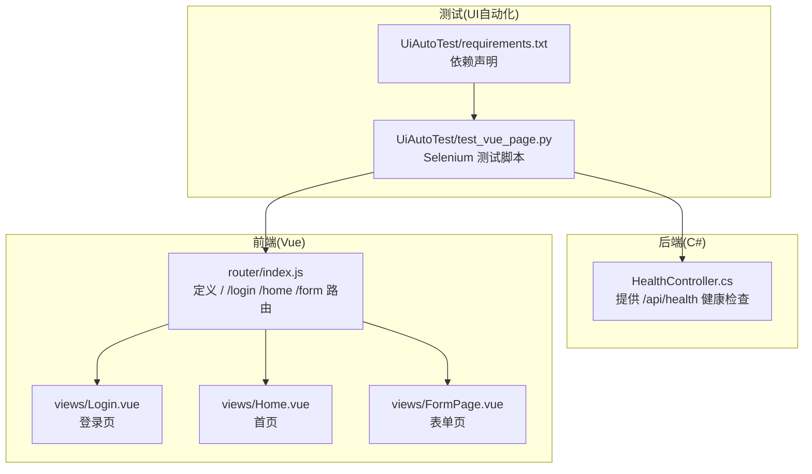
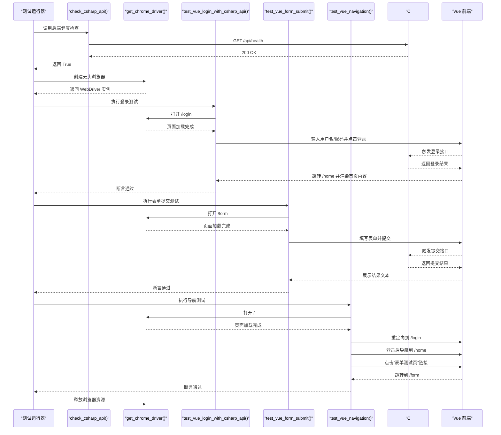
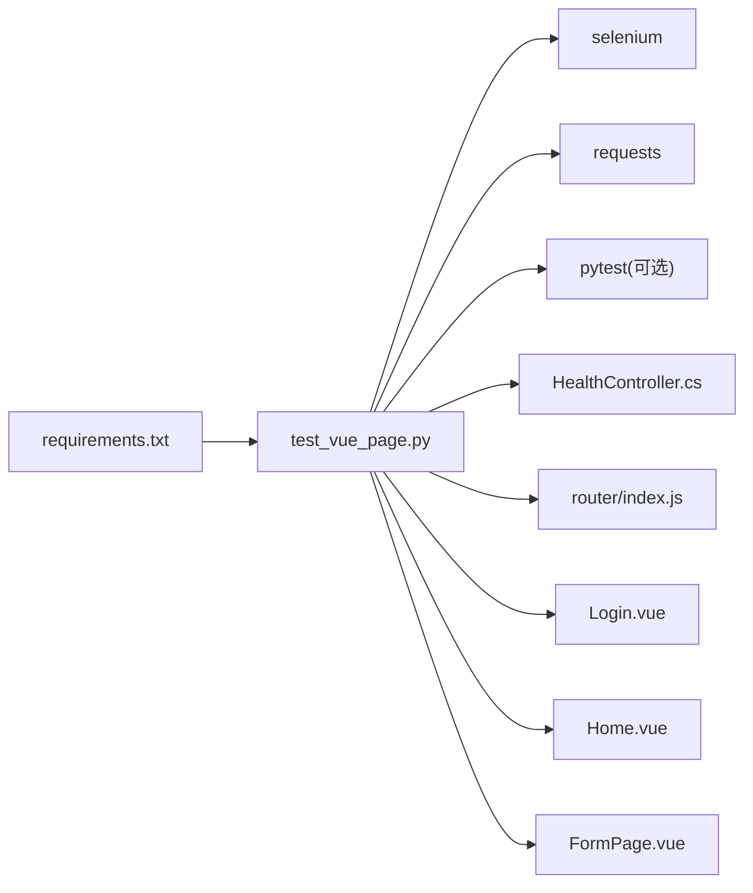

# 测试脚本结构解析

<cite>
**本文引用的文件**
- [test_vue_page.py](file://vue-csharp-ui-auto/UiAutoTest/test_vue_page.py)
- [requirements.txt](file://vue-csharp-ui-auto/UiAutoTest/requirements.txt)
- [HealthController.cs](file://vue-csharp-ui-auto/Backend/Controllers/HealthController.cs)
- [Login.vue](file://vue-csharp-ui-auto/Frontend/src/views/Login.vue)
- [FormPage.vue](file://vue-csharp-ui-auto/Frontend/src/views/FormPage.vue)
- [Home.vue](file://vue-csharp-ui-auto/Frontend/src/views/Home.vue)
- [index.js](file://vue-csharp-ui-auto/Frontend/src/router/index.js)
</cite>

## 目录
1. [引言](#引言)
2. [项目结构](#项目结构)
3. [核心组件](#核心组件)
4. [架构总览](#架构总览)
5. [详细组件分析](#详细组件分析)
6. [依赖关系分析](#依赖关系分析)
7. [性能考虑](#性能考虑)
8. [故障排查指南](#故障排查指南)
9. [结论](#结论)

## 引言
本文件面向测试工程师与开发人员，系统解析 UI 自动化测试脚本 test_vue_page.py 的代码结构与执行流程。重点说明脚本如何划分“后端健康检查”“WebDriver 配置”“三大测试用例（登录、表单提交、导航）”和“主执行逻辑”。同时，解释每个函数的职责：check_csharp_api 负责前置接口验证，get_chrome_driver 实现无头浏览器配置，各 test_* 函数封装独立测试场景，并强调测试用例之间的独立性与可复用性设计，以及 finally 块中 driver.quit() 对资源释放的重要性。

## 项目结构
该仓库采用前后端分离架构：
- 后端（C#）提供健康检查接口与业务接口，供前端调用。
- 前端（Vue）提供登录页、首页与表单页，页面间通过路由进行导航。
- UI 自动化测试位于 UiAutoTest 目录，使用 Selenium 控制 Chrome 浏览器，模拟用户操作并断言结果。

图表来源
- [HealthController.cs](file://vue-csharp-ui-auto/Backend/Controllers/HealthController.cs#L1-L15)
- [index.js](file://vue-csharp-ui-auto/Frontend/src/router/index.js#L1-L33)
- [Login.vue](file://vue-csharp-ui-auto/Frontend/src/views/Login.vue#L1-L80)
- [Home.vue](file://vue-csharp-ui-auto/Frontend/src/views/Home.vue#L1-L23)
- [FormPage.vue](file://vue-csharp-ui-auto/Frontend/src/views/FormPage.vue#L1-L38)
- [test_vue_page.py](file://vue-csharp-ui-auto/UiAutoTest/test_vue_page.py#L1-L161)
- [requirements.txt](file://vue-csharp-ui-auto/UiAutoTest/requirements.txt#L1-L4)

章节来源
- [test_vue_page.py](file://vue-csharp-ui-auto/UiAutoTest/test_vue_page.py#L1-L161)
- [requirements.txt](file://vue-csharp-ui-auto/UiAutoTest/requirements.txt#L1-L4)

## 核心组件
- 后端健康检查函数：check_csharp_api
  - 职责：通过 HTTP 请求访问后端健康检查接口，断言状态码为 200，确保测试前 C# 服务可用。
  - 关键点：异常捕获与失败提示，保证测试前置条件。
- WebDriver 配置函数：get_chrome_driver
  - 职责：创建无头 Chrome 浏览器实例，设置常用参数（headless、窗口大小、禁用沙箱等），并启用隐式等待。
  - 关键点：适配 CI 环境（如 GitHub Actions）的无界面需求；统一隐式等待提升稳定性。
- 登录测试用例：test_vue_login_with_csharp_api
  - 职责：打开登录页，定位输入框与按钮，输入测试凭据并点击登录，断言跳转至首页并包含首页内容。
  - 关键点：依赖后端健康检查；使用显式等待确保元素存在；finally 中释放浏览器。
- 表单提交测试用例：test_vue_form_submit
  - 职责：打开表单页，填写姓名与邮箱并提交，断言后端返回结果在页面中展示。
  - 关键点：使用 data-testid 标识结果容器，便于稳定定位；断言包含“提交成功”文本。
- 导航测试用例：test_vue_navigation
  - 职责：从根路径访问，验证自动重定向到登录页；登录后导航到首页，再从首页导航到表单页并断言跳转成功。
  - 关键点：使用部分链接文本定位导航链接；断言 URL 包含目标路径与页面标题。
- 主执行逻辑：if __name__ == "__main__"
  - 职责：顺序执行三大测试用例，最后输出整体通过提示。

章节来源
- [test_vue_page.py](file://vue-csharp-ui-auto/UiAutoTest/test_vue_page.py#L10-L21)
- [test_vue_page.py](file://vue-csharp-ui-auto/UiAutoTest/test_vue_page.py#L23-L35)
- [test_vue_page.py](file://vue-csharp-ui-auto/UiAutoTest/test_vue_page.py#L38-L73)
- [test_vue_page.py](file://vue-csharp-ui-auto/UiAutoTest/test_vue_page.py#L75-L109)
- [test_vue_page.py](file://vue-csharp-ui-auto/UiAutoTest/test_vue_page.py#L111-L155)
- [test_vue_page.py](file://vue-csharp-ui-auto/UiAutoTest/test_vue_page.py#L156-L161)

## 架构总览
下图展示了 UI 自动化测试的整体调用链路与依赖关系：

图表来源
- [test_vue_page.py](file://vue-csharp-ui-auto/UiAutoTest/test_vue_page.py#L10-L21)
- [test_vue_page.py](file://vue-csharp-ui-auto/UiAutoTest/test_vue_page.py#L23-L35)
- [test_vue_page.py](file://vue-csharp-ui-auto/UiAutoTest/test_vue_page.py#L38-L73)
- [test_vue_page.py](file://vue-csharp-ui-auto/UiAutoTest/test_vue_page.py#L75-L109)
- [test_vue_page.py](file://vue-csharp-ui-auto/UiAutoTest/test_vue_page.py#L111-L155)
- [HealthController.cs](file://vue-csharp-ui-auto/Backend/Controllers/HealthController.cs#L1-L15)
- [index.js](file://vue-csharp-ui-auto/Frontend/src/router/index.js#L1-L33)
- [Login.vue](file://vue-csharp-ui-auto/Frontend/src/views/Login.vue#L1-L80)
- [FormPage.vue](file://vue-csharp-ui-auto/Frontend/src/views/FormPage.vue#L1-L38)
- [Home.vue](file://vue-csharp-ui-auto/Frontend/src/views/Home.vue#L1-L23)

## 详细组件分析

### 后端健康检查：check_csharp_api
- 职责与行为
  - 发起 HTTP 请求到后端健康检查接口。
  - 断言响应状态码为 200，否则记录失败原因并返回 False。
  - 成功时打印通过日志。
- 设计要点
  - 将“后端可用性”作为所有 UI 测试的前置条件，避免因后端异常导致测试误判。
  - 使用异常捕获处理网络或服务不可达情况，保证测试流程可控。
- 复杂度与性能
  - 时间复杂度 O(1)，仅一次 HTTP 请求；空间复杂度 O(1)。
  - 适合在每次测试前快速验证后端状态。

章节来源
- [test_vue_page.py](file://vue-csharp-ui-auto/UiAutoTest/test_vue_page.py#L10-L21)
- [HealthController.cs](file://vue-csharp-ui-auto/Backend/Controllers/HealthController.cs#L1-L15)

### WebDriver 配置：get_chrome_driver
- 职责与行为
  - 初始化 Chrome 选项，启用 headless 新模式、禁用沙箱、禁用 GPU、设置调试端口与窗口尺寸。
  - 创建 WebDriver 实例并设置隐式等待时间。
- 设计要点
  - 无头模式适配 CI 环境，避免需要图形界面。
  - 统一隐式等待减少显式等待的重复代码，提高稳定性。
- 复杂度与性能
  - 初始化成本与浏览器启动相关，通常为一次性开销；后续操作受页面加载与网络影响。

章节来源
- [test_vue_page.py](file://vue-csharp-ui-auto/UiAutoTest/test_vue_page.py#L23-L35)
- [requirements.txt](file://vue-csharp-ui-auto/UiAutoTest/requirements.txt#L1-L4)

### 登录测试用例：test_vue_login_with_csharp_api
- 职责与行为
  - 先调用后端健康检查。
  - 打开登录页，等待用户名/密码输入框与登录按钮出现。
  - 输入测试凭据并点击登录。
  - 等待 URL 包含首页路径并断言页面包含首页内容。
  - finally 中释放浏览器资源。
- 设计要点
  - 使用 data-testid 属性定位关键元素，降低选择器脆弱性。
  - 显式等待确保页面与元素加载完成后再进行交互。
  - 断言覆盖跳转 URL 与页面内容，双重保障。
- 复杂度与性能
  - 页面加载与网络请求为主要耗时因素；隐式等待与显式等待共同提升稳定性。

章节来源
- [test_vue_page.py](file://vue-csharp-ui-auto/UiAutoTest/test_vue_page.py#L38-L73)
- [Login.vue](file://vue-csharp-ui-auto/Frontend/src/views/Login.vue#L1-L80)
- [index.js](file://vue-csharp-ui-auto/Frontend/src/router/index.js#L1-L33)

### 表单提交测试用例：test_vue_form_submit
- 职责与行为
  - 先调用后端健康检查。
  - 打开表单页，等待表单字段与提交按钮出现。
  - 填写姓名与邮箱并提交。
  - 等待结果容器出现并断言包含“提交成功”文本。
  - finally 中释放浏览器资源。
- 设计要点
  - 使用 data-testid 标识结果容器，便于稳定断言。
  - 断言结果文本而非 HTML 结构，增强健壮性。
- 复杂度与性能
  - 与网络请求和页面渲染相关；隐式等待与显式等待配合提升可靠性。

章节来源
- [test_vue_page.py](file://vue-csharp-ui-auto/UiAutoTest/test_vue_page.py#L75-L109)
- [FormPage.vue](file://vue-csharp-ui-auto/Frontend/src/views/FormPage.vue#L1-L38)
- [index.js](file://vue-csharp-ui-auto/Frontend/src/router/index.js#L1-L33)

### 导航测试用例：test_vue_navigation
- 职责与行为
  - 打开根路径，等待页面加载并断言重定向到登录页。
  - 登录后等待跳转到首页并断言页面内容。
  - 点击“表单测试页”链接，等待 URL 包含表单路径并断言页面标题。
  - finally 中释放浏览器资源。
- 设计要点
  - 使用部分链接文本定位导航链接，避免硬编码完整链接。
  - 断言 URL 与页面内容，确保路由与页面渲染均正常。
- 复杂度与性能
  - 路由切换与页面渲染为主要耗时；显式等待确保导航完成。

章节来源
- [test_vue_page.py](file://vue-csharp-ui-auto/UiAutoTest/test_vue_page.py#L111-L155)
- [Home.vue](file://vue-csharp-ui-auto/Frontend/src/views/Home.vue#L1-L23)
- [index.js](file://vue-csharp-ui-auto/Frontend/src/router/index.js#L1-L33)

### 主执行逻辑：if __name__ == "__main__"
- 职责与行为
  - 顺序调用三大测试用例，最后输出整体通过提示。
- 设计要点
  - 作为脚本直接运行的入口，便于本地调试与快速验证。
  - 若需更严格的测试框架集成，可结合 pytest 使用。

章节来源
- [test_vue_page.py](file://vue-csharp-ui-auto/UiAutoTest/test_vue_page.py#L156-L161)

## 依赖关系分析
- 外部依赖
  - requests：用于后端健康检查。
  - selenium：用于浏览器自动化与页面交互。
  - pytest：用于测试框架与报告生成（可选）。
- 内部依赖
  - test_vue_page.py 依赖 Vue 路由与页面元素标识（data-testid）。
  - 后端 HealthController 提供健康检查接口。
- 耦合与内聚
  - 各测试用例相互独立，仅共享通用的 WebDriver 配置与后端健康检查。
  - 页面元素通过 data-testid 标识，降低选择器耦合风险。
- 循环依赖
  - 不存在循环依赖，测试脚本不依赖前端或后端源码，仅依赖接口与页面结构。

图表来源
- [requirements.txt](file://vue-csharp-ui-auto/UiAutoTest/requirements.txt#L1-L4)
- [test_vue_page.py](file://vue-csharp-ui-auto/UiAutoTest/test_vue_page.py#L1-L161)
- [HealthController.cs](file://vue-csharp-ui-auto/Backend/Controllers/HealthController.cs#L1-L15)
- [index.js](file://vue-csharp-ui-auto/Frontend/src/router/index.js#L1-L33)
- [Login.vue](file://vue-csharp-ui-auto/Frontend/src/views/Login.vue#L1-L80)
- [Home.vue](file://vue-csharp-ui-auto/Frontend/src/views/Home.vue#L1-L23)
- [FormPage.vue](file://vue-csharp-ui-auto/Frontend/src/views/FormPage.vue#L1-L38)

章节来源
- [requirements.txt](file://vue-csharp-ui-auto/UiAutoTest/requirements.txt#L1-L4)
- [test_vue_page.py](file://vue-csharp-ui-auto/UiAutoTest/test_vue_page.py#L1-L161)

## 性能考虑
- 浏览器启动与页面加载
  - 无头模式减少图形开销，但页面渲染仍受网络与后端响应影响。
  - 统一隐式等待有助于减少频繁的显式等待，但应避免过长等待导致测试时间拉长。
- 等待策略
  - 使用显式等待（WebDriverWait + EC）定位关键元素与 URL 变化，避免忙等。
  - 在断言前确保页面已加载完成，减少误判。
- 资源管理
  - 每个测试用例结束后务必调用 driver.quit()，防止浏览器进程残留与内存泄漏。
- 并发与隔离
  - 当前脚本顺序执行三大用例；若扩展为并发，需确保每个用例独立初始化 WebDriver 并互不干扰。

[本节为通用建议，无需列出具体文件来源]

## 故障排查指南
- 后端不可用
  - 现象：后端健康检查失败，测试提前终止。
  - 排查：确认后端服务已启动且 /api/health 可访问；检查防火墙与端口映射。
  - 参考
    - [HealthController.cs](file://vue-csharp-ui-auto/Backend/Controllers/HealthController.cs#L1-L15)
    - [test_vue_page.py](file://vue-csharp-ui-auto/UiAutoTest/test_vue_page.py#L10-L21)
- 页面元素找不到
  - 现象：定位不到输入框、按钮或结果容器。
  - 排查：确认 data-testid 或选择器是否正确；检查页面是否已加载完成；适当增加等待时间。
  - 参考
    - [Login.vue](file://vue-csharp-ui-auto/Frontend/src/views/Login.vue#L1-L80)
    - [FormPage.vue](file://vue-csharp-ui-auto/Frontend/src/views/FormPage.vue#L1-L38)
    - [test_vue_page.py](file://vue-csharp-ui-auto/UiAutoTest/test_vue_page.py#L38-L73)
- URL 跳转失败
  - 现象：断言 URL 不包含目标路径或页面未跳转。
  - 排查：确认路由配置正确；检查前端路由与后端接口是否返回预期结果；断言前增加显式等待。
  - 参考
    - [index.js](file://vue-csharp-ui-auto/Frontend/src/router/index.js#L1-L33)
    - [Home.vue](file://vue-csharp-ui-auto/Frontend/src/views/Home.vue#L1-L23)
    - [test_vue_page.py](file://vue-csharp-ui-auto/UiAutoTest/test_vue_page.py#L111-L155)
- 浏览器资源未释放
  - 现象：测试结束后浏览器进程未退出，占用内存。
  - 排查：确认每个测试用例 finally 块中都调用了 driver.quit()。
  - 参考
    - [test_vue_page.py](file://vue-csharp-ui-auto/UiAutoTest/test_vue_page.py#L71-L73)
    - [test_vue_page.py](file://vue-csharp-ui-auto/UiAutoTest/test_vue_page.py#L107-L109)
    - [test_vue_page.py](file://vue-csharp-ui-auto/UiAutoTest/test_vue_page.py#L153-L155)

章节来源
- [HealthController.cs](file://vue-csharp-ui-auto/Backend/Controllers/HealthController.cs#L1-L15)
- [Login.vue](file://vue-csharp-ui-auto/Frontend/src/views/Login.vue#L1-L80)
- [FormPage.vue](file://vue-csharp-ui-auto/Frontend/src/views/FormPage.vue#L1-L38)
- [Home.vue](file://vue-csharp-ui-auto/Frontend/src/views/Home.vue#L1-L23)
- [index.js](file://vue-csharp-ui-auto/Frontend/src/router/index.js#L1-L33)
- [test_vue_page.py](file://vue-csharp-ui-auto/UiAutoTest/test_vue_page.py#L38-L73)
- [test_vue_page.py](file://vue-csharp-ui-auto/UiAutoTest/test_vue_page.py#L75-L109)
- [test_vue_page.py](file://vue-csharp-ui-auto/UiAutoTest/test_vue_page.py#L111-L155)

## 结论
test_vue_page.py 以清晰的模块化方式组织 UI 自动化测试：通过 check_csharp_api 确保后端可用性，通过 get_chrome_driver 统一浏览器配置，三大测试用例分别覆盖登录、表单提交与导航，彼此独立且可复用。finally 块中的 driver.quit() 是资源释放的关键，有助于避免 CI 环境中的资源泄漏。建议在团队中推广 data-testid 的使用与显式等待策略，持续提升测试稳定性与可维护性。