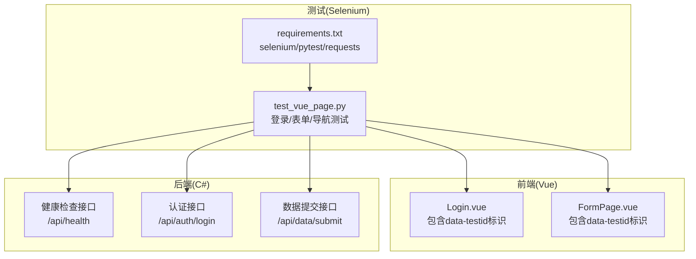
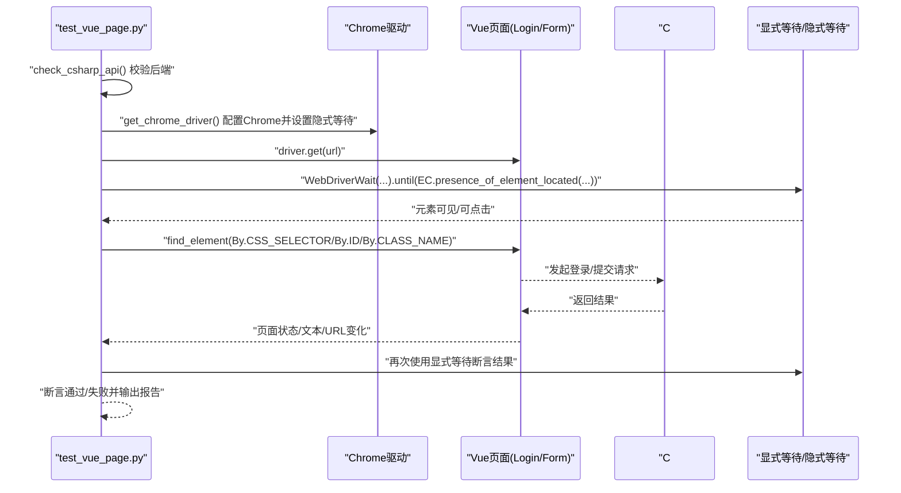
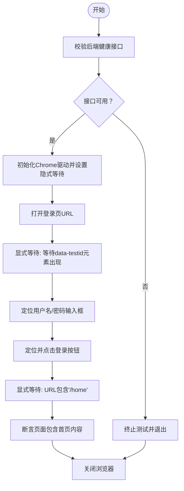
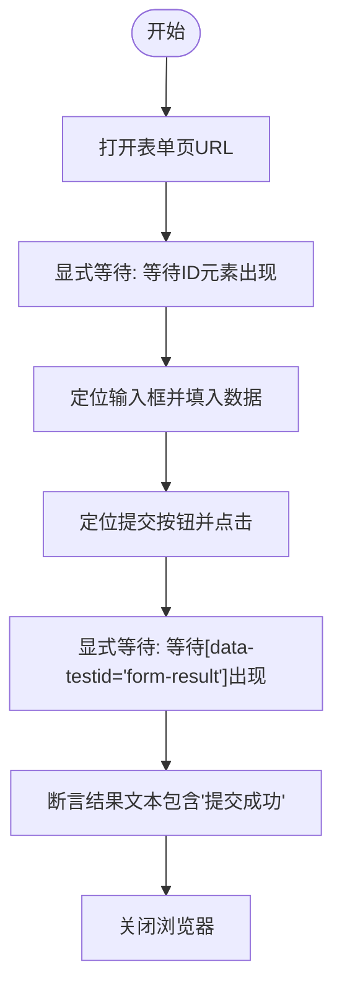
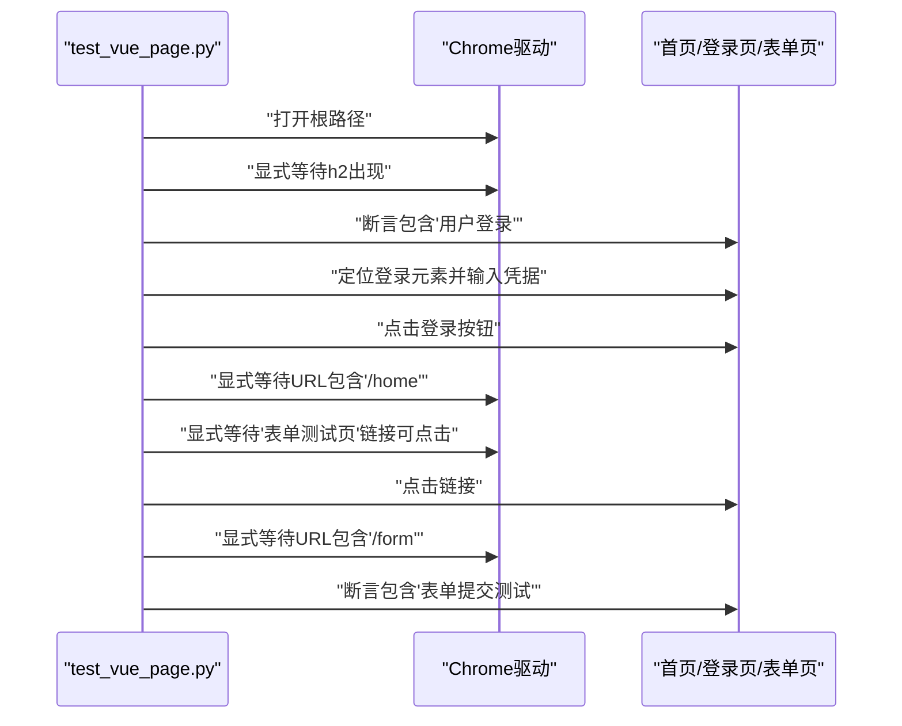
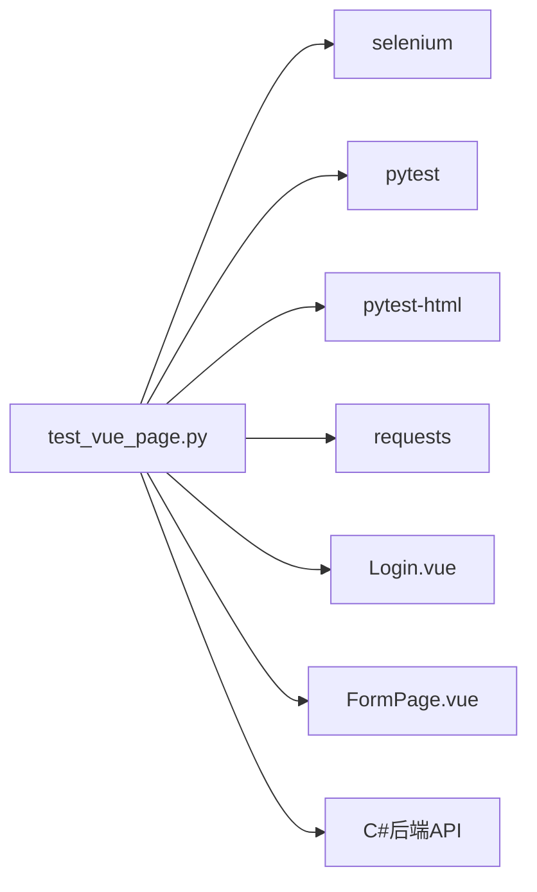

# 页面元素定位策略

<cite>
**本文引用的文件**
- [test_vue_page.py](file://vue-csharp-ui-auto/UiAutoTest/test_vue_page.py)
- [requirements.txt](file://vue-csharp-ui-auto/UiAutoTest/requirements.txt)
- [Login.vue](file://vue-csharp-ui-auto/Frontend/src/views/Login.vue)
- [FormPage.vue](file://vue-csharp-ui-auto/Frontend/src/views/FormPage.vue)
- [README.md](file://vue-csharp-ui-auto/README.md)
</cite>

## 目录
1. [引言](#引言)
2. [项目结构](#项目结构)
3. [核心组件](#核心组件)
4. [架构总览](#架构总览)
5. [详细组件分析](#详细组件分析)
6. [依赖关系分析](#依赖关系分析)
7. [性能考虑](#性能考虑)
8. [故障排查指南](#故障排查指南)
9. [结论](#结论)
10. [附录](#附录)

## 引言
本文件围绕UI自动化测试中的“元素定位方法与最佳实践”展开，结合项目中的实际代码，系统说明：
- 如何通过data-testid属性进行稳定可靠的元素定位，避免受样式或结构变化影响；
- 对比CSS选择器、ID、类名等不同定位方式的适用场景；
- 如何借助开发者工具调试定位表达式；
- 显式等待与隐式等待的结合策略，以提升测试稳定性。

## 项目结构
该项目由三部分组成：前端Vue应用、后端C#应用、以及基于Selenium的UI自动化测试脚本。测试脚本通过Selenium驱动浏览器，访问前端页面并与后端API交互，验证登录、表单提交与页面导航等功能。

图表来源
- [test_vue_page.py](file://vue-csharp-ui-auto/UiAutoTest/test_vue_page.py#L1-L161)
- [requirements.txt](file://vue-csharp-ui-auto/UiAutoTest/requirements.txt#L1-L4)
- [Login.vue](file://vue-csharp-ui-auto/Frontend/src/views/Login.vue#L1-L35)
- [FormPage.vue](file://vue-csharp-ui-auto/Frontend/src/views/FormPage.vue#L1-L38)

章节来源
- [README.md](file://vue-csharp-ui-auto/README.md#L1-L113)

## 核心组件
- 测试脚本(test_vue_page.py)：封装了Chrome驱动配置、前置后端接口校验、登录/表单/导航三大测试用例，并统一使用显式等待与隐式等待策略。
- 前端页面(Login.vue、FormPage.vue)：为关键交互元素添加data-testid，确保测试定位稳定可靠。
- 依赖文件(requirements.txt)：声明Selenium、pytest、pytest-html、requests等依赖，支撑自动化测试执行与报告生成。

章节来源
- [test_vue_page.py](file://vue-csharp-ui-auto/UiAutoTest/test_vue_page.py#L1-L161)
- [requirements.txt](file://vue-csharp-ui-auto/UiAutoTest/requirements.txt#L1-L4)
- [Login.vue](file://vue-csharp-ui-auto/Frontend/src/views/Login.vue#L1-L35)
- [FormPage.vue](file://vue-csharp-ui-auto/Frontend/src/views/FormPage.vue#L1-L38)

## 架构总览
下图展示了从测试脚本到前端页面再到后端接口的调用链路，以及元素定位策略在其中的应用点。

图表来源
- [test_vue_page.py](file://vue-csharp-ui-auto/UiAutoTest/test_vue_page.py#L1-L161)
- [Login.vue](file://vue-csharp-ui-auto/Frontend/src/views/Login.vue#L1-L35)
- [FormPage.vue](file://vue-csharp-ui-auto/Frontend/src/views/FormPage.vue#L1-L38)

## 详细组件分析

### 元素定位策略与最佳实践
- data-testid定位优先
  - 在登录页与表单页的关键输入框与按钮上均设置了data-testid，测试脚本通过CSS选择器配合该属性进行定位，能有效避免因样式类名或结构变化导致的定位失败。
  - 示例参考：登录页用户名、密码输入框与登录按钮；表单页结果容器等。
- 多种定位方式的适用场景
  - ID：唯一且稳定，适合页面级唯一元素，如表单页的输入框ID。
  - 类名：适合批量筛选或通用样式元素，但易受样式变更影响，应谨慎使用。
  - CSS选择器：灵活强大，可组合多种条件，推荐与data-testid联用，兼顾稳定性与灵活性。
  - 标签名/链接文本：用于页面骨架或导航元素，如等待标题标签出现或点击“表单测试页”链接。
- 调试定位表达式
  - 在浏览器开发者工具控制台中直接使用类似CSS选择器的语法进行验证，确认元素存在且可被Selenium识别。
  - 若定位不稳定，优先引入data-testid或增加更精确的选择条件（如父节点、属性组合）。
- 等待策略
  - 隐式等待：在创建驱动时设置，提高查找元素的容错率，减少频繁轮询。
  - 显式等待：针对特定条件（元素出现、可点击、URL变化、文本出现等）进行精准等待，避免盲目sleep。
  - 结合策略：全局设置隐式等待，对关键步骤使用显式等待，既能提升稳定性又能控制超时时间。

章节来源
- [test_vue_page.py](file://vue-csharp-ui-auto/UiAutoTest/test_vue_page.py#L22-L35)
- [test_vue_page.py](file://vue-csharp-ui-auto/UiAutoTest/test_vue_page.py#L38-L73)
- [test_vue_page.py](file://vue-csharp-ui-auto/UiAutoTest/test_vue_page.py#L75-L109)
- [test_vue_page.py](file://vue-csharp-ui-auto/UiAutoTest/test_vue_page.py#L111-L155)
- [Login.vue](file://vue-csharp-ui-auto/Frontend/src/views/Login.vue#L1-L35)
- [FormPage.vue](file://vue-csharp-ui-auto/Frontend/src/views/FormPage.vue#L1-L38)
- [README.md](file://vue-csharp-ui-auto/README.md#L110-L113)

### 登录页面元素定位与等待流程
- 前置校验：先通过HTTP请求校验后端健康接口，避免因后端异常导致测试失败。
- 打开页面：访问登录页URL。
- 等待元素：使用显式等待确保目标输入框出现后再进行下一步操作。
- 定位与交互：通过data-testid定位用户名、密码输入框与登录按钮，输入测试数据并点击。
- 断言与清理：等待URL跳转至首页并断言页面包含首页内容，最后关闭浏览器。

图表来源
- [test_vue_page.py](file://vue-csharp-ui-auto/UiAutoTest/test_vue_page.py#L1-L21)
- [test_vue_page.py](file://vue-csharp-ui-auto/UiAutoTest/test_vue_page.py#L38-L73)
- [Login.vue](file://vue-csharp-ui-auto/Frontend/src/views/Login.vue#L1-L35)

章节来源
- [test_vue_page.py](file://vue-csharp-ui-auto/UiAutoTest/test_vue_page.py#L1-L21)
- [test_vue_page.py](file://vue-csharp-ui-auto/UiAutoTest/test_vue_page.py#L38-L73)

### 表单提交页面元素定位与等待流程
- 打开表单页：访问表单页URL。
- 等待元素：使用显式等待确保表单输入框出现。
- 定位与交互：通过ID定位输入框，通过类名定位提交按钮，输入数据并点击。
- 结果断言：使用显式等待等待data-testid结果容器出现，并断言包含“提交成功”。

图表来源
- [test_vue_page.py](file://vue-csharp-ui-auto/UiAutoTest/test_vue_page.py#L75-L109)
- [FormPage.vue](file://vue-csharp-ui-auto/Frontend/src/views/FormPage.vue#L1-L38)

章节来源
- [test_vue_page.py](file://vue-csharp-ui-auto/UiAutoTest/test_vue_page.py#L75-L109)
- [FormPage.vue](file://vue-csharp-ui-auto/Frontend/src/views/FormPage.vue#L1-L38)

### 页面导航与链接定位
- 首页访问：打开根路径，等待页面中出现标题标签。
- 导航断言：断言页面包含“用户登录”，验证重定向逻辑。
- 登录后导航：通过data-testid定位登录元素，输入凭据并点击登录。
- 跳转验证：使用显式等待URL包含“/home”，再通过部分链接文本定位“表单测试页”并点击。
- 最终断言：等待URL包含“/form”，断言页面包含“表单提交测试”。

图表来源
- [test_vue_page.py](file://vue-csharp-ui-auto/UiAutoTest/test_vue_page.py#L111-L155)

章节来源
- [test_vue_page.py](file://vue-csharp-ui-auto/UiAutoTest/test_vue_page.py#L111-L155)

### 元素定位方法对比与适用场景
- data-testid
  - 优势：明确用于测试，不受样式与结构变化影响；便于团队协作与维护。
  - 场景：登录页用户名/密码输入框、登录按钮、表单结果容器等。
- ID
  - 优势：唯一性强，定位快速稳定。
  - 场景：表单页输入框ID等页面级唯一元素。
- 类名
  - 优势：可批量筛选，适合通用样式元素。
  - 注意：易受样式变更影响，建议配合其他条件使用。
- CSS选择器
  - 优势：灵活强大，支持组合条件与层级关系。
  - 场景：与data-testid组合使用，或在ID/类名不足时作为补充。
- 标签名/链接文本
  - 优势：简单直观，适合骨架元素与导航。
  - 场景：等待标题标签出现、点击部分链接文本等。

章节来源
- [test_vue_page.py](file://vue-csharp-ui-auto/UiAutoTest/test_vue_page.py#L38-L73)
- [test_vue_page.py](file://vue-csharp-ui-auto/UiAutoTest/test_vue_page.py#L75-L109)
- [test_vue_page.py](file://vue-csharp-ui-auto/UiAutoTest/test_vue_page.py#L111-L155)
- [Login.vue](file://vue-csharp-ui-auto/Frontend/src/views/Login.vue#L1-L35)
- [FormPage.vue](file://vue-csharp-ui-auto/Frontend/src/views/FormPage.vue#L1-L38)
- [README.md](file://vue-csharp-ui-auto/README.md#L110-L113)

## 依赖关系分析
- 测试脚本依赖Selenium进行浏览器自动化，依赖pytest生成HTML报告，依赖requests进行后端接口校验。
- 前端页面通过data-testid暴露稳定的测试标识，供测试脚本定位。
- 后端提供健康检查与业务接口，测试脚本通过HTTP请求与页面交互共同验证功能。

图表来源
- [test_vue_page.py](file://vue-csharp-ui-auto/UiAutoTest/test_vue_page.py#L1-L161)
- [requirements.txt](file://vue-csharp-ui-auto/UiAutoTest/requirements.txt#L1-L4)
- [Login.vue](file://vue-csharp-ui-auto/Frontend/src/views/Login.vue#L1-L35)
- [FormPage.vue](file://vue-csharp-ui-auto/Frontend/src/views/FormPage.vue#L1-L38)

章节来源
- [requirements.txt](file://vue-csharp-ui-auto/UiAutoTest/requirements.txt#L1-L4)
- [test_vue_page.py](file://vue-csharp-ui-auto/UiAutoTest/test_vue_page.py#L1-L161)

## 性能考虑
- 隐式等待设置：在驱动初始化时设置隐式等待，可减少频繁轮询带来的性能损耗，同时提升查找元素的成功率。
- 显式等待精准控制：仅在关键步骤使用显式等待，避免不必要的长时间等待，缩短整体测试时长。
- 无头模式与窗口尺寸：使用无头模式与固定窗口尺寸，适配CI环境并减少资源占用。
- 依赖安装与版本：确保依赖版本与项目兼容，避免重复下载与冲突。

章节来源
- [test_vue_page.py](file://vue-csharp-ui-auto/UiAutoTest/test_vue_page.py#L22-L35)
- [requirements.txt](file://vue-csharp-ui-auto/UiAutoTest/requirements.txt#L1-L4)

## 故障排查指南
- 后端接口不可用
  - 现象：前置校验失败，测试终止。
  - 处理：检查后端服务是否启动、端口是否正确、CORS配置是否允许前端访问。
- 元素定位失败
  - 现象：显式等待超时或找不到元素。
  - 处理：确认data-testid是否存在、CSS选择器是否正确、是否需要增加等待条件或更精确的选择器。
- URL跳转断言失败
  - 现象：登录后未跳转到首页或导航到表单页失败。
  - 处理：检查路由配置、等待条件是否合理、链接文本是否匹配。
- CI环境问题
  - 现象：无头模式下页面渲染差异或资源加载缓慢。
  - 处理：适当增加等待时间、固定窗口尺寸、确保Chrome与驱动版本匹配。

章节来源
- [test_vue_page.py](file://vue-csharp-ui-auto/UiAutoTest/test_vue_page.py#L1-L21)
- [test_vue_page.py](file://vue-csharp-ui-auto/UiAutoTest/test_vue_page.py#L38-L73)
- [test_vue_page.py](file://vue-csharp-ui-auto/UiAutoTest/test_vue_page.py#L75-L109)
- [test_vue_page.py](file://vue-csharp-ui-auto/UiAutoTest/test_vue_page.py#L111-L155)
- [README.md](file://vue-csharp-ui-auto/README.md#L108-L113)

## 结论
- data-testid是UI自动化测试中稳定定位的关键手段，能有效规避样式与结构变化带来的定位风险。
- 将隐式等待与显式等待结合使用，既能提升查找效率，又能确保关键步骤的准确性。
- 在实际工程中，应根据元素特性选择合适的定位方式，并通过开发者工具与日志进行调试与优化。
- 本项目的测试脚本与前端页面协同良好，为后续扩展更多页面与功能提供了清晰的实践范式。

## 附录
- 关键定位示例参考
  - 登录页：用户名/密码输入框与登录按钮的data-testid定位。
  - 表单页：输入框ID与提交按钮类名定位，结果容器data-testid定位。
- 等待策略参考
  - 页面骨架元素：等待标签出现。
  - 交互元素：等待元素可点击或可见。
  - 导航与跳转：等待URL包含特定路径。

章节来源
- [test_vue_page.py](file://vue-csharp-ui-auto/UiAutoTest/test_vue_page.py#L38-L73)
- [test_vue_page.py](file://vue-csharp-ui-auto/UiAutoTest/test_vue_page.py#L75-L109)
- [test_vue_page.py](file://vue-csharp-ui-auto/UiAutoTest/test_vue_page.py#L111-L155)
- [Login.vue](file://vue-csharp-ui-auto/Frontend/src/views/Login.vue#L1-L35)
- [FormPage.vue](file://vue-csharp-ui-auto/Frontend/src/views/FormPage.vue#L1-L38)