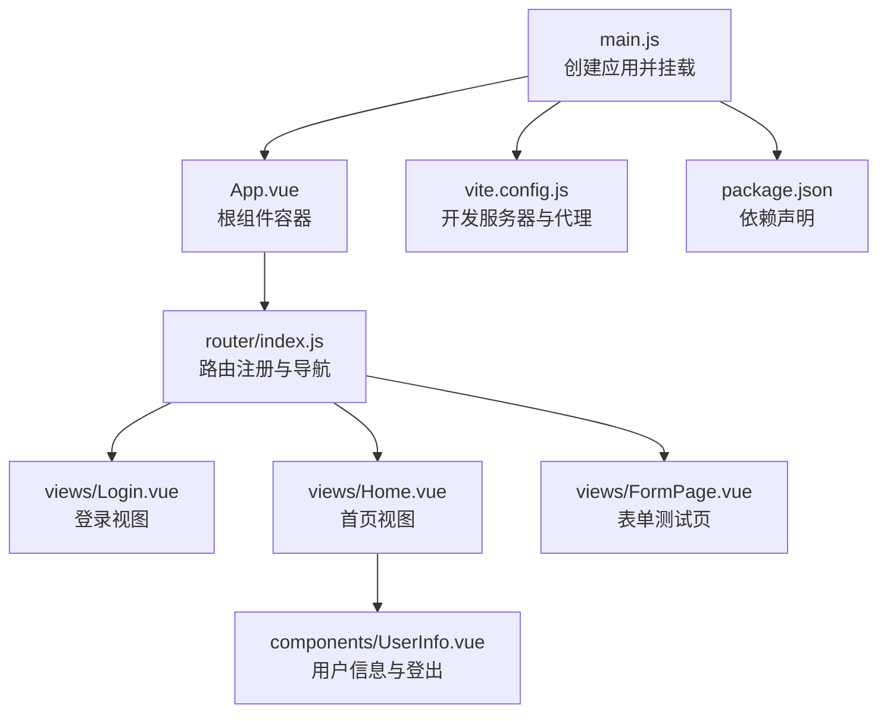
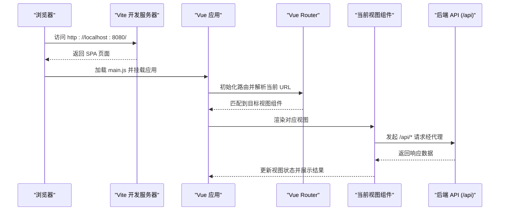
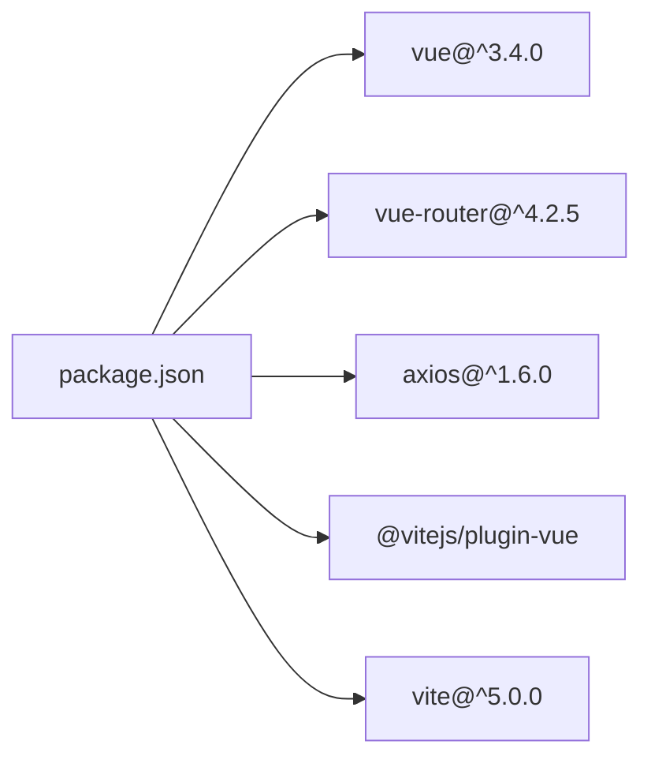

# 前端架构

<cite>
**本文引用的文件**
- [main.js](file://vue-csharp-ui-auto/Frontend/src/main.js)
- [App.vue](file://vue-csharp-ui-auto/Frontend/src/App.vue)
- [router/index.js](file://vue-csharp-ui-auto/Frontend/src/router/index.js)
- [views/Login.vue](file://vue-csharp-ui-auto/Frontend/src/views/Login.vue)
- [views/Home.vue](file://vue-csharp-ui-auto/Frontend/src/views/Home.vue)
- [views/FormPage.vue](file://vue-csharp-ui-auto/Frontend/src/views/FormPage.vue)
- [components/UserInfo.vue](file://vue-csharp-ui-auto/Frontend/src/components/UserInfo.vue)
- [vite.config.js](file://vue-csharp-ui-auto/Frontend/vite.config.js)
- [package.json](file://vue-csharp-ui-auto/Frontend/package.json)
</cite>

## 目录
1. [引言](#引言)
2. [项目结构](#项目结构)
3. [核心组件](#核心组件)
4. [架构总览](#架构总览)
5. [详细组件分析](#详细组件分析)
6. [依赖分析](#依赖分析)
7. [性能考虑](#性能考虑)
8. [故障排查指南](#故障排查指南)
9. [结论](#结论)
10. [附录](#附录)

## 引言
本文件系统性梳理智能体项目前端架构，覆盖从应用初始化到组件交互的全流程。重点解释 main.js 如何引导 Vue 应用启动并挂载到 DOM，App.vue 作为根组件的布局结构，以及 Login.vue、Home.vue、FormPage.vue 三个视图组件的功能与路由映射关系。同时剖析 UserInfo.vue 的状态管理逻辑（登录状态检测、本地存储操作与路由跳转），并说明 vite.config.js 中代理配置如何在开发环境下解决跨域问题，使前端能顺利调用后端 API。文末提供基于源码路径的组件间通信模式与 Axios 请求集成方式示例，帮助读者快速定位实现细节。

## 项目结构
前端采用典型的 Vue 3 单页应用（SPA）组织方式：
- 入口文件 main.js 负责创建应用实例、安装路由并挂载到 DOM。
- 根组件 App.vue 使用 <router-view /> 渲染当前路由对应的视图。
- 路由定义位于 router/index.js，包含登录、首页、表单测试页等页面映射。
- 视图组件 views/Login.vue、views/Home.vue、views/FormPage.vue 分别承担登录、首页导航与表单提交功能。
- 组件 components/UserInfo.vue 提供用户信息展示与登出控制。
- 构建工具 vite.config.js 配置开发服务器与 API 代理，解决跨域问题。
- 依赖声明于 package.json，使用 Vue 3、Vue Router 4、Axios 等核心库。

图表来源
- [main.js](file://vue-csharp-ui-auto/Frontend/src/main.js#L1-L8)
- [App.vue](file://vue-csharp-ui-auto/Frontend/src/App.vue#L1-L12)
- [router/index.js](file://vue-csharp-ui-auto/Frontend/src/router/index.js#L1-L33)
- [views/Login.vue](file://vue-csharp-ui-auto/Frontend/src/views/Login.vue#L1-L80)
- [views/Home.vue](file://vue-csharp-ui-auto/Frontend/src/views/Home.vue#L1-L51)
- [views/FormPage.vue](file://vue-csharp-ui-auto/Frontend/src/views/FormPage.vue#L1-L79)
- [components/UserInfo.vue](file://vue-csharp-ui-auto/Frontend/src/components/UserInfo.vue#L1-L53)
- [vite.config.js](file://vue-csharp-ui-auto/Frontend/vite.config.js#L1-L22)
- [package.json](file://vue-csharp-ui-auto/Frontend/package.json#L1-L19)

章节来源
- [main.js](file://vue-csharp-ui-auto/Frontend/src/main.js#L1-L8)
- [App.vue](file://vue-csharp-ui-auto/Frontend/src/App.vue#L1-L22)
- [router/index.js](file://vue-csharp-ui-auto/Frontend/src/router/index.js#L1-L33)
- [vite.config.js](file://vue-csharp-ui-auto/Frontend/vite.config.js#L1-L22)
- [package.json](file://vue-csharp-ui-auto/Frontend/package.json#L1-L19)

## 核心组件
- 应用入口与挂载：main.js 创建 Vue 应用实例，引入根组件 App.vue 与路由模块，随后通过 mount 将应用挂载到 DOM 容器。
- 根组件布局：App.vue 仅包含一个 <router-view />，用于渲染当前激活的路由视图，整体样式集中在该文件内。
- 路由系统：router/index.js 定义了四条路由规则，其中根路径重定向至登录页；其余路径分别映射到 Login、Home、FormPage 三个视图组件。
- 视图组件：Login.vue 实现表单输入与登录请求；Home.vue 展示欢迎信息与导航链接；FormPage.vue 实现表单提交与结果反馈。
- 用户信息组件：UserInfo.vue 在挂载时检查本地存储中的登录令牌，根据状态显示“已登录/未登录”，并提供登出按钮以清除本地存储并跳转登录页。
- 开发代理：vite.config.js 在开发服务器上启用代理，将 /api 前缀的请求转发到后端服务地址，避免跨域问题。

章节来源
- [main.js](file://vue-csharp-ui-auto/Frontend/src/main.js#L1-L8)
- [App.vue](file://vue-csharp-ui-auto/Frontend/src/App.vue#L1-L22)
- [router/index.js](file://vue-csharp-ui-auto/Frontend/src/router/index.js#L1-L33)
- [views/Login.vue](file://vue-csharp-ui-auto/Frontend/src/views/Login.vue#L1-L80)
- [views/Home.vue](file://vue-csharp-ui-auto/Frontend/src/views/Home.vue#L1-L51)
- [views/FormPage.vue](file://vue-csharp-ui-auto/Frontend/src/views/FormPage.vue#L1-L79)
- [components/UserInfo.vue](file://vue-csharp-ui-auto/Frontend/src/components/UserInfo.vue#L1-L53)
- [vite.config.js](file://vue-csharp-ui-auto/Frontend/vite.config.js#L1-L22)

## 架构总览
下图展示了从前端应用初始化到页面导航与请求处理的整体流程，包括路由切换、组件渲染、Axios 请求与代理转发。

图表来源
- [main.js](file://vue-csharp-ui-auto/Frontend/src/main.js#L1-L8)
- [router/index.js](file://vue-csharp-ui-auto/Frontend/src/router/index.js#L1-L33)
- [views/Login.vue](file://vue-csharp-ui-auto/Frontend/src/views/Login.vue#L1-L80)
- [views/FormPage.vue](file://vue-csharp-ui-auto/Frontend/src/views/FormPage.vue#L1-L79)
- [vite.config.js](file://vue-csharp-ui-auto/Frontend/vite.config.js#L1-L22)

## 详细组件分析

### 应用初始化与挂载（main.js）
- 功能要点
  - 使用 createApp 创建应用实例。
  - 导入根组件 App.vue 与路由模块 router/index.js。
  - 通过 app.use(router) 安装路由插件。
  - 使用 app.mount('#app') 将应用挂载到 DOM 容器。
- 关键路径
  - [应用创建与挂载](file://vue-csharp-ui-auto/Frontend/src/main.js#L1-L8)

章节来源
- [main.js](file://vue-csharp-ui-auto/Frontend/src/main.js#L1-L8)

### 根组件布局（App.vue）
- 功能要点
  - 顶层模板仅包含 <router-view />，用于承载当前路由对应的视图。
  - 内联样式设置字体、对齐与顶部间距，提升基础视觉效果。
- 关键路径
  - [根组件模板与样式](file://vue-csharp-ui-auto/Frontend/src/App.vue#L1-L22)

章节来源
- [App.vue](file://vue-csharp-ui-auto/Frontend/src/App.vue#L1-L22)

### 路由系统与页面导航（router/index.js）
- 路由规则
  - 根路径 '/' 重定向到 '/login'。
  - '/login' 映射到 Login.vue。
  - '/home' 映射到 Home.vue。
  - '/form' 映射到 FormPage.vue。
- 初始化
  - 使用 createRouter 与 createWebHistory 创建历史模式路由实例。
- 关键路径
  - [路由定义与导出](file://vue-csharp-ui-auto/Frontend/src/router/index.js#L1-L33)

章节来源
- [router/index.js](file://vue-csharp-ui-auto/Frontend/src/router/index.js#L1-L33)

### 登录视图（views/Login.vue）
- 功能要点
  - 表单绑定用户名与密码字段，支持提交事件拦截。
  - 使用 Axios 向 /api/auth/login 发送登录请求。
  - 成功时显示成功消息并延时跳转到 '/home'。
  - 失败时显示错误消息；异常捕获统一处理。
- 请求与导航
  - Axios 请求路径：/api/auth/login。
  - 成功后通过 this.$router.push('/home') 进行路由跳转。
- 关键路径
  - [登录表单与提交逻辑](file://vue-csharp-ui-auto/Frontend/src/views/Login.vue#L1-L80)

章节来源
- [views/Login.vue](file://vue-csharp-ui-auto/Frontend/src/views/Login.vue#L1-L80)

### 首页视图（views/Home.vue）
- 功能要点
  - 展示欢迎信息与当前用户名占位。
  - 提供到表单测试页的导航链接（<router-link to="/form" />）。
- 关键路径
  - [首页模板与数据](file://vue-csharp-ui-auto/Frontend/src/views/Home.vue#L1-L51)

章节来源
- [views/Home.vue](file://vue-csharp-ui-auto/Frontend/src/views/Home.vue#L1-L51)

### 表单测试页（views/FormPage.vue）
- 功能要点
  - 表单包含姓名与邮箱字段，支持提交事件拦截。
  - 使用 Axios 向 /api/data/submit 发送数据。
  - 成功时显示成功消息，失败或异常时显示错误提示。
- 关键路径
  - [表单提交与结果反馈](file://vue-csharp-ui-auto/Frontend/src/views/FormPage.vue#L1-L79)

章节来源
- [views/FormPage.vue](file://vue-csharp-ui-auto/Frontend/src/views/FormPage.vue#L1-L79)

### 用户信息组件（components/UserInfo.vue）
- 状态管理
  - mounted 生命周期中检查本地存储是否存在认证令牌，若存在则标记为已登录并读取用户名。
  - 提供 handleLogout 方法：移除本地存储中的令牌与用户名，重置状态，并通过 $router.push('/login') 跳转登录页。
- 关键路径
  - [登录状态检查与登出逻辑](file://vue-csharp-ui-auto/Frontend/src/components/UserInfo.vue#L1-L53)

章节来源
- [components/UserInfo.vue](file://vue-csharp-ui-auto/Frontend/src/components/UserInfo.vue#L1-L53)

### Axios 请求与组件通信模式
- 请求集成
  - Login.vue 与 FormPage.vue 均通过 Axios 发起 POST 请求，分别指向 /api/auth/login 与 /api/data/submit。
  - 两个组件均采用 try/catch/finally 结构处理异步请求，统一更新 loading、error、result 状态。
- 组件间通信
  - UserInfo.vue 通过 $router.push 执行导航，影响当前路由视图的渲染。
  - Home.vue 使用 <router-link> 导航到表单页，体现声明式导航。
- 关键路径
  - [Login.vue 请求与导航](file://vue-csharp-ui-auto/Frontend/src/views/Login.vue#L1-L80)
  - [FormPage.vue 请求与反馈](file://vue-csharp-ui-auto/Frontend/src/views/FormPage.vue#L1-L79)
  - [Home.vue 导航链接](file://vue-csharp-ui-auto/Frontend/src/views/Home.vue#L1-L51)
  - [UserInfo.vue 登出与跳转](file://vue-csharp-ui-auto/Frontend/src/components/UserInfo.vue#L1-L53)

章节来源
- [views/Login.vue](file://vue-csharp-ui-auto/Frontend/src/views/Login.vue#L1-L80)
- [views/FormPage.vue](file://vue-csharp-ui-auto/Frontend/src/views/FormPage.vue#L1-L79)
- [views/Home.vue](file://vue-csharp-ui-auto/Frontend/src/views/Home.vue#L1-L51)
- [components/UserInfo.vue](file://vue-csharp-ui-auto/Frontend/src/components/UserInfo.vue#L1-L53)

## 依赖分析
- 核心依赖
  - vue：框架核心，提供组件化与响应式能力。
  - vue-router：路由管理，负责页面导航与视图切换。
  - axios：HTTP 客户端，封装 API 请求与响应处理。
- 开发依赖
  - @vitejs/plugin-vue：Vite 插件，支持 Vue SFC 编译。
  - vite：现代化构建工具与开发服务器。
- 关系图

图表来源
- [package.json](file://vue-csharp-ui-auto/Frontend/package.json#L1-L19)

章节来源
- [package.json](file://vue-csharp-ui-auto/Frontend/package.json#L1-L19)

## 性能考虑
- 路由懒加载（建议）
  - 当前路由直接导入视图组件，可考虑在大型项目中采用动态导入以实现按需加载，减少首屏体积。
- 组件拆分与复用
  - UserInfo.vue 可抽取为更通用的用户态组件，便于在多个页面共享登录状态与登出逻辑。
- Axios 配置优化（建议）
  - 可在全局配置默认 baseURL 与超时时间，简化各组件中的请求路径书写。
- 样式与资源
  - App.vue 的样式集中管理，有助于统一风格；建议在大型项目中拆分样式文件并启用 CSS 模块化。

## 故障排查指南
- 跨域问题（开发环境）
  - 现象：前端发起 /api/* 请求时报跨域错误。
  - 解决：确认 vite.config.js 已配置代理，将 /api 前缀转发到后端地址。
  - 关键路径
    - [代理配置](file://vue-csharp-ui-auto/Frontend/vite.config.js#L1-L22)
- 登录失败或异常
  - 现象：登录页显示错误消息或按钮禁用状态未恢复。
  - 排查：检查 Login.vue 的请求处理逻辑与 Axios 错误捕获分支。
  - 关键路径
    - [登录请求与错误处理](file://vue-csharp-ui-auto/Frontend/src/views/Login.vue#L1-L80)
- 表单提交失败
  - 现象：表单页显示错误消息或无响应。
  - 排查：检查 FormPage.vue 的请求路径与响应处理分支。
  - 关键路径
    - [表单提交与错误处理](file://vue-csharp-ui-auto/Frontend/src/views/FormPage.vue#L1-L79)
- 登出后仍显示已登录
  - 现象：UserInfo.vue 未正确清除本地存储或未触发路由跳转。
  - 排查：确认 handleLogout 是否移除了本地存储并执行了 $router.push('/login')。
  - 关键路径
    - [登出逻辑](file://vue-csharp-ui-auto/Frontend/src/components/UserInfo.vue#L1-L53)

章节来源
- [vite.config.js](file://vue-csharp-ui-auto/Frontend/vite.config.js#L1-L22)
- [views/Login.vue](file://vue-csharp-ui-auto/Frontend/src/views/Login.vue#L1-L80)
- [views/FormPage.vue](file://vue-csharp-ui-auto/Frontend/src/views/FormPage.vue#L1-L79)
- [components/UserInfo.vue](file://vue-csharp-ui-auto/Frontend/src/components/UserInfo.vue#L1-L53)

## 结论
本前端架构以 Vue 3 为核心，配合 Vue Router 实现清晰的页面导航，通过 Axios 统一处理 API 请求，并在开发阶段借助 Vite 代理解决跨域问题。Login.vue、Home.vue、FormPage.vue 三类视图分别承担认证、导航与数据提交职责；UserInfo.vue 提供用户态管理与登出控制。整体结构简洁、职责明确，适合进一步扩展与维护。

## 附录
- 路由映射一览
  - '/' -> '/login'
  - '/login' -> Login.vue
  - '/home' -> Home.vue
  - '/form' -> FormPage.vue
- 关键实现路径汇总
  - [main.js](file://vue-csharp-ui-auto/Frontend/src/main.js#L1-L8)
  - [App.vue](file://vue-csharp-ui-auto/Frontend/src/App.vue#L1-L22)
  - [router/index.js](file://vue-csharp-ui-auto/Frontend/src/router/index.js#L1-L33)
  - [views/Login.vue](file://vue-csharp-ui-auto/Frontend/src/views/Login.vue#L1-L80)
  - [views/Home.vue](file://vue-csharp-ui-auto/Frontend/src/views/Home.vue#L1-L51)
  - [views/FormPage.vue](file://vue-csharp-ui-auto/Frontend/src/views/FormPage.vue#L1-L79)
  - [components/UserInfo.vue](file://vue-csharp-ui-auto/Frontend/src/components/UserInfo.vue#L1-L53)
  - [vite.config.js](file://vue-csharp-ui-auto/Frontend/vite.config.js#L1-L22)
  - [package.json](file://vue-csharp-ui-auto/Frontend/package.json#L1-L19)