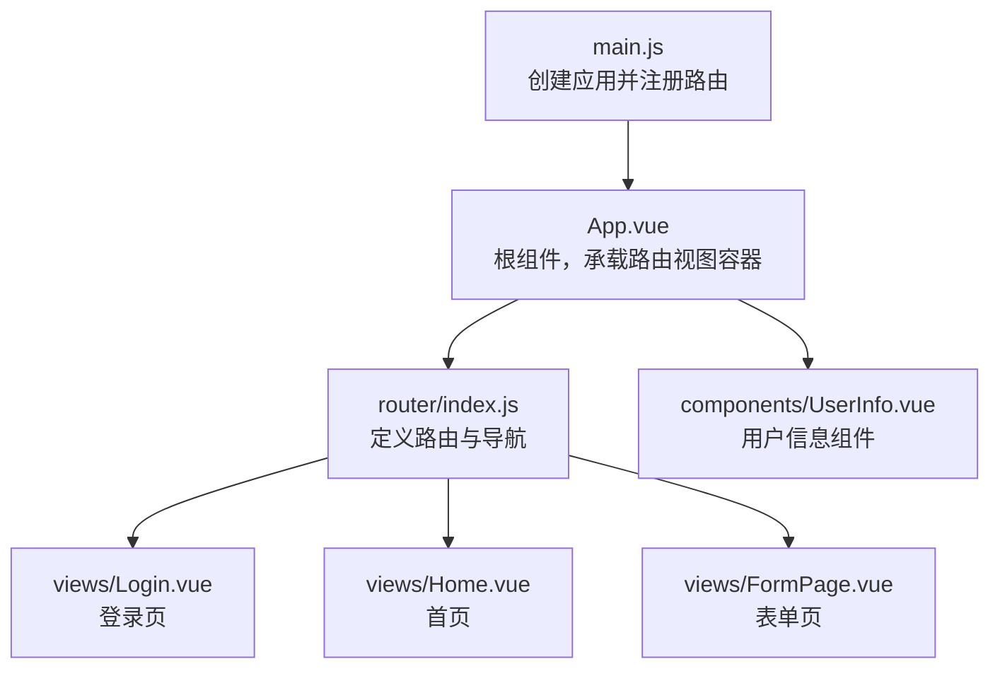
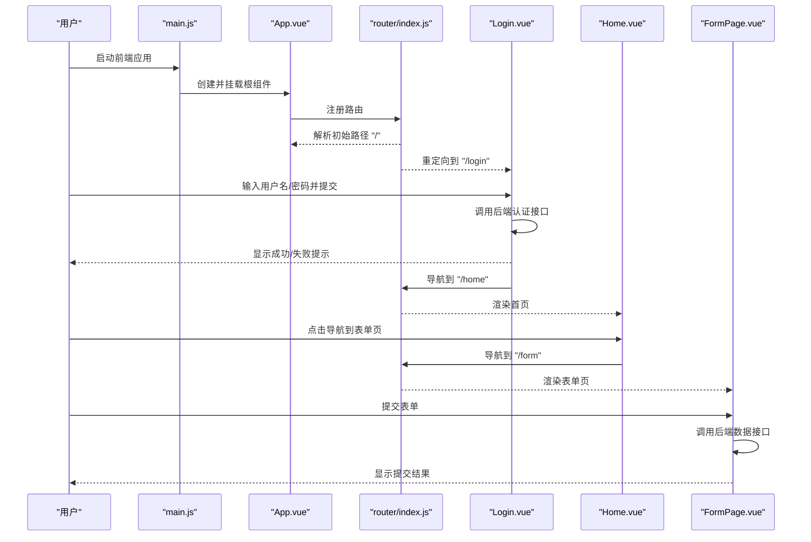
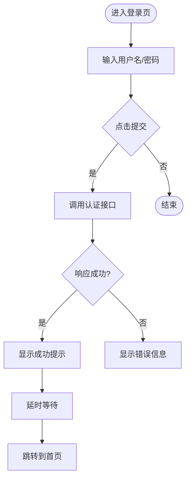
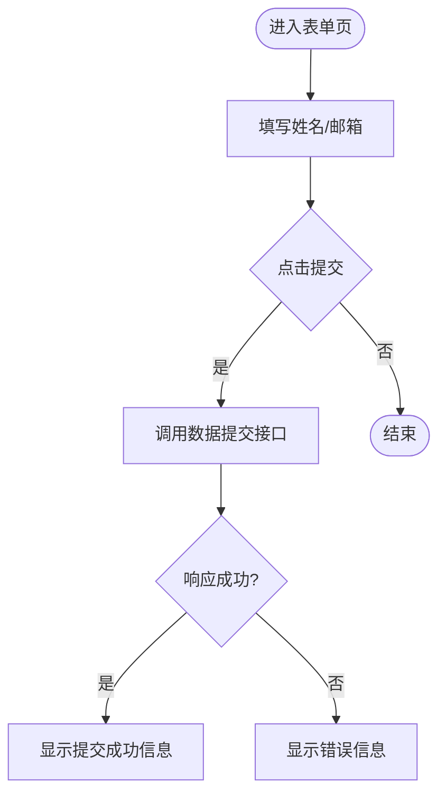
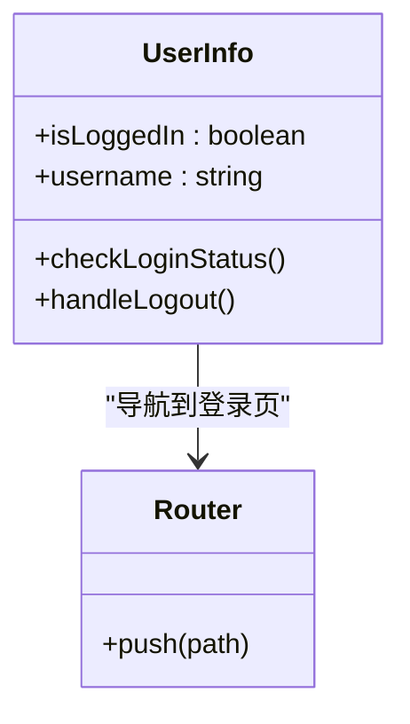
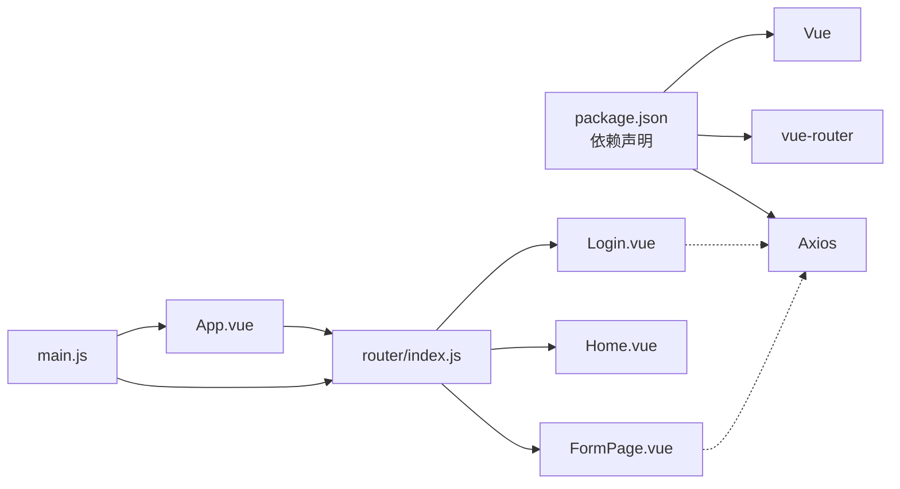

# 前端组件结构

<cite>
**本文引用的文件**
- [App.vue](file://vue-csharp-ui-auto/Frontend/src/App.vue)
- [main.js](file://vue-csharp-ui-auto/Frontend/src/main.js)
- [router/index.js](file://vue-csharp-ui-auto/Frontend/src/router/index.js)
- [views/Login.vue](file://vue-csharp-ui-auto/Frontend/src/views/Login.vue)
- [views/Home.vue](file://vue-csharp-ui-auto/Frontend/src/views/Home.vue)
- [views/FormPage.vue](file://vue-csharp-ui-auto/Frontend/src/views/FormPage.vue)
- [components/UserInfo.vue](file://vue-csharp-ui-auto/Frontend/src/components/UserInfo.vue)
- [package.json](file://vue-csharp-ui-auto/Frontend/package.json)
- [README.md](file://vue-csharp-ui-auto/README.md)
</cite>

## 目录
1. [简介](#简介)
2. [项目结构](#项目结构)
3. [核心组件](#核心组件)
4. [架构总览](#架构总览)
5. [组件详解](#组件详解)
6. [依赖关系分析](#依赖关系分析)
7. [性能与可维护性建议](#性能与可维护性建议)
8. [故障排查指南](#故障排查指南)
9. [结论](#结论)
10. [附录](#附录)

## 简介
本文件聚焦于前端组件树的结构与职责划分，围绕根组件 App.vue 如何通过路由视图容器动态渲染子视图展开；同时深入分析 Login.vue、Home.vue、FormPage.vue 的模板结构、数据绑定与用户交互行为，并结合代码片段路径说明其在典型用户工作流中的作用。此外，对 UserInfo.vue 的条件渲染与状态管理机制进行剖析，总结样式设计原则与响应式布局策略，并给出组件嵌套最佳实践与可复用性优化建议。

## 项目结构
前端采用 Vue 3 + vue-router + Axios 架构，入口为 main.js 创建应用实例并挂载到 DOM；路由定义位于 router/index.js，页面视图存放在 views 目录，通用 UI 组件置于 components 目录。整体结构清晰，遵循“按功能分层”的组织方式，便于扩展与测试。

图表来源
- [main.js](file://vue-csharp-ui-auto/Frontend/src/main.js#L1-L8)
- [App.vue](file://vue-csharp-ui-auto/Frontend/src/App.vue#L1-L12)
- [router/index.js](file://vue-csharp-ui-auto/Frontend/src/router/index.js#L1-L33)
- [views/Login.vue](file://vue-csharp-ui-auto/Frontend/src/views/Login.vue#L1-L133)
- [views/Home.vue](file://vue-csharp-ui-auto/Frontend/src/views/Home.vue#L1-L51)
- [views/FormPage.vue](file://vue-csharp-ui-auto/Frontend/src/views/FormPage.vue#L1-L142)
- [components/UserInfo.vue](file://vue-csharp-ui-auto/Frontend/src/components/UserInfo.vue#L1-L81)

章节来源
- [main.js](file://vue-csharp-ui-auto/Frontend/src/main.js#L1-L8)
- [router/index.js](file://vue-csharp-ui-auto/Frontend/src/router/index.js#L1-L33)
- [README.md](file://vue-csharp-ui-auto/README.md#L1-L113)

## 核心组件
- 根组件 App.vue：仅包含一个路由视图容器，负责承载当前路由对应的页面组件，保持顶层结构简洁。
- 路由系统 router/index.js：集中定义登录、首页、表单页三条路由，设置默认重定向至登录页，保证初始导航一致性。
- 视图组件：
  - Login.vue：处理用户凭据输入、表单校验、调用后端认证接口、状态反馈与路由跳转。
  - Home.vue：展示当前用户信息与导航链接，引导进入表单页。
  - FormPage.vue：收集用户输入，提交到后端数据接口，展示结果或错误信息。
- 通用组件 UserInfo.vue：根据登录状态显示欢迎信息或引导登录，提供退出登录能力。

章节来源
- [App.vue](file://vue-csharp-ui-auto/Frontend/src/App.vue#L1-L12)
- [router/index.js](file://vue-csharp-ui-auto/Frontend/src/router/index.js#L1-L33)
- [views/Login.vue](file://vue-csharp-ui-auto/Frontend/src/views/Login.vue#L1-L133)
- [views/Home.vue](file://vue-csharp-ui-auto/Frontend/src/views/Home.vue#L1-L51)
- [views/FormPage.vue](file://vue-csharp-ui-auto/Frontend/src/views/FormPage.vue#L1-L142)
- [components/UserInfo.vue](file://vue-csharp-ui-auto/Frontend/src/components/UserInfo.vue#L1-L81)

## 架构总览
下图展示从应用启动到页面渲染的关键流程，以及组件间的依赖关系。

图表来源
- [main.js](file://vue-csharp-ui-auto/Frontend/src/main.js#L1-L8)
- [App.vue](file://vue-csharp-ui-auto/Frontend/src/App.vue#L1-L12)
- [router/index.js](file://vue-csharp-ui-auto/Frontend/src/router/index.js#L1-L33)
- [views/Login.vue](file://vue-csharp-ui-auto/Frontend/src/views/Login.vue#L1-L133)
- [views/Home.vue](file://vue-csharp-ui-auto/Frontend/src/views/Home.vue#L1-L51)
- [views/FormPage.vue](file://vue-csharp-ui-auto/Frontend/src/views/FormPage.vue#L1-L142)

## 组件详解

### 根组件 App.vue 与路由视图容器
- 结构职责：作为应用外壳，仅包含一个路由视图容器，用于承载当前激活的页面组件。
- 控制流：由路由系统决定渲染哪个视图，App.vue 不直接参与页面逻辑，保持高内聚低耦合。
- 样式原则：全局基础样式集中在根节点，保证统一字体、颜色与间距基准。

章节来源
- [App.vue](file://vue-csharp-ui-auto/Frontend/src/App.vue#L1-L12)

### 路由系统 router/index.js
- 路由定义：包含登录、首页、表单页三类页面路由，设置根路径重定向至登录页，确保首次访问一致性。
- 历史模式：使用 HTML5 History 模式，配合后端部署时需正确配置回退。
- 可扩展性：新增页面只需在此处注册，无需改动其他模块。

章节来源
- [router/index.js](file://vue-csharp-ui-auto/Frontend/src/router/index.js#L1-L33)

### 登录页 Login.vue
- 模板结构：包含标题、用户名与密码输入框、提交按钮、错误与成功提示区域。
- 数据绑定：使用双向绑定收集用户输入；按钮禁用态与文案随加载状态变化。
- 用户交互：表单提交触发登录流程，成功后延时跳转首页，失败或异常时显示相应消息。
- 与后端集成：通过 Axios 发起认证请求，读取响应并更新本地状态。
- 可测试性：关键元素带有测试标识，便于自动化测试定位。

图表来源
- [views/Login.vue](file://vue-csharp-ui-auto/Frontend/src/views/Login.vue#L1-L133)

章节来源
- [views/Login.vue](file://vue-csharp-ui-auto/Frontend/src/views/Login.vue#L1-L133)

### 首页 Home.vue
- 模板结构：展示欢迎语、当前用户信息与导航链接。
- 数据绑定：用户名来自组件内部状态（演示用途），实际项目中应从全局状态或后端获取。
- 导航行为：通过路由链接跳转到表单页，形成基本的工作流闭环。
- 样式策略：容器最大宽度限制、卡片式背景与圆角边框，提升可读性与层级感。

章节来源
- [views/Home.vue](file://vue-csharp-ui-auto/Frontend/src/views/Home.vue#L1-L51)

### 表单页 FormPage.vue
- 模板结构：包含姓名与邮箱输入项、提交按钮、结果与错误提示区域。
- 数据绑定：双向绑定收集表单数据；按钮禁用态与文案随加载状态变化。
- 用户交互：提交后调用数据提交接口，成功显示结果，失败或异常显示错误信息。
- 与后端集成：通过 Axios 发起数据提交请求，读取响应并更新本地状态。
- 可测试性：结果区域带有测试标识，便于断言。

图表来源
- [views/FormPage.vue](file://vue-csharp-ui-auto/Frontend/src/views/FormPage.vue#L1-L142)

章节来源
- [views/FormPage.vue](file://vue-csharp-ui-auto/Frontend/src/views/FormPage.vue#L1-L142)

### 用户信息组件 UserInfo.vue
- 条件渲染：根据登录状态显示“已登录”或“未登录”两种视图；已登录时提供退出登录按钮。
- 状态管理：组件内部维护登录状态与用户名；挂载时检查本地存储以恢复状态；退出登录时清理本地存储并返回登录页。
- 交互行为：点击退出登录按钮触发状态变更与路由跳转。
- 复用性：该组件可作为顶部栏的一部分被多个页面复用，实现统一的登录态展示与切换。

图表来源
- [components/UserInfo.vue](file://vue-csharp-ui-auto/Frontend/src/components/UserInfo.vue#L1-L81)

章节来源
- [components/UserInfo.vue](file://vue-csharp-ui-auto/Frontend/src/components/UserInfo.vue#L1-L81)

## 依赖关系分析
- 应用入口依赖：main.js 依赖 App.vue 与 router/index.js，负责应用初始化与挂载。
- 组件依赖：App.vue 依赖 router/index.js 提供的路由视图容器；各页面组件独立，仅通过路由系统相互切换。
- 外部库依赖：package.json 中声明 Vue、vue-router、Axios，支撑组件框架、路由与网络请求。
- 可能的循环依赖：当前结构无明显循环依赖，组件间均为单向依赖（入口 -> 根组件 -> 路由 -> 页面）。

图表来源
- [package.json](file://vue-csharp-ui-auto/Frontend/package.json#L1-L19)
- [main.js](file://vue-csharp-ui-auto/Frontend/src/main.js#L1-L8)
- [router/index.js](file://vue-csharp-ui-auto/Frontend/src/router/index.js#L1-L33)
- [views/Login.vue](file://vue-csharp-ui-auto/Frontend/src/views/Login.vue#L1-L133)
- [views/FormPage.vue](file://vue-csharp-ui-auto/Frontend/src/views/FormPage.vue#L1-L142)

章节来源
- [package.json](file://vue-csharp-ui-auto/Frontend/package.json#L1-L19)
- [main.js](file://vue-csharp-ui-auto/Frontend/src/main.js#L1-L8)
- [router/index.js](file://vue-csharp-ui-auto/Frontend/src/router/index.js#L1-L33)

## 性能与可维护性建议
- 状态管理：当前页面组件使用本地状态，建议在复杂场景引入集中式状态管理（如 Pinia）以提升可维护性与共享状态一致性。
- 组件拆分：UserInfo.vue 可进一步拆分为 LoginBar 与 UserMenu 子组件，增强关注点分离。
- 样式体系：统一使用 CSS 变量与设计令牌，减少重复样式；为移动端提供媒体查询与弹性布局策略。
- 错误边界：为关键网络请求增加统一的错误拦截与重试机制，提升用户体验。
- 可测试性：继续完善 data-testid 标识，补充单元测试与端到端测试覆盖。

[本节为通用建议，不直接分析具体文件]

## 故障排查指南
- 登录失败：检查后端认证接口是否可达、请求参数是否正确、响应格式是否符合预期。
- 表单提交失败：确认数据提交接口可用、必填字段已填写、网络请求未被拦截。
- 路由跳转异常：核对路由配置与导航链接，确保路径一致且无大小写问题。
- 登录态丢失：检查本地存储键值是否存在与有效期，必要时清理缓存后重试。
- 样式错位：检查 scoped 样式是否影响到子组件、媒体查询是否生效、容器宽度是否受限。

章节来源
- [views/Login.vue](file://vue-csharp-ui-auto/Frontend/src/views/Login.vue#L1-L133)
- [views/FormPage.vue](file://vue-csharp-ui-auto/Frontend/src/views/FormPage.vue#L1-L142)
- [components/UserInfo.vue](file://vue-csharp-ui-auto/Frontend/src/components/UserInfo.vue#L1-L81)

## 结论
该前端组件树以 App.vue 为核心容器，通过 router/index.js 实现页面级路由切换，Login.vue、Home.vue、FormPage.vue 分别承担登录、首页与表单提交三大核心功能。UserInfo.vue 提供登录态展示与切换能力，具备良好的可复用性。整体结构清晰、职责明确，适合进一步引入状态管理与测试体系以提升可维护性与可靠性。

[本节为总结性内容，不直接分析具体文件]

## 附录
- 用户工作流参考：登录页 -> 首页 -> 表单页 -> 返回首页（或退出登录）
- 测试标识：登录页与表单页均提供 data-testid，便于自动化测试定位元素

章节来源
- [README.md](file://vue-csharp-ui-auto/README.md#L1-L113)