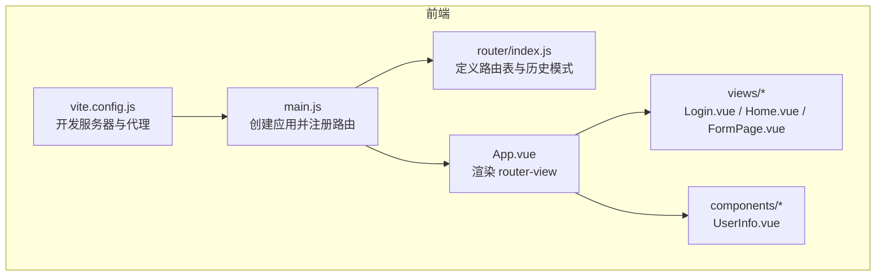
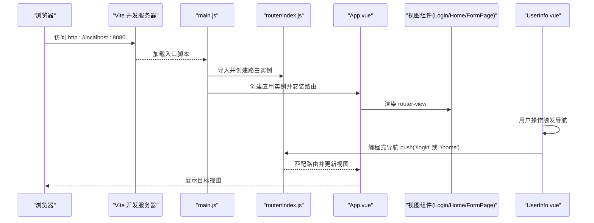
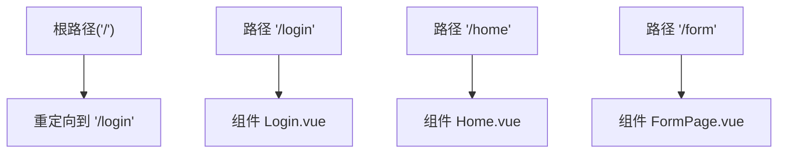
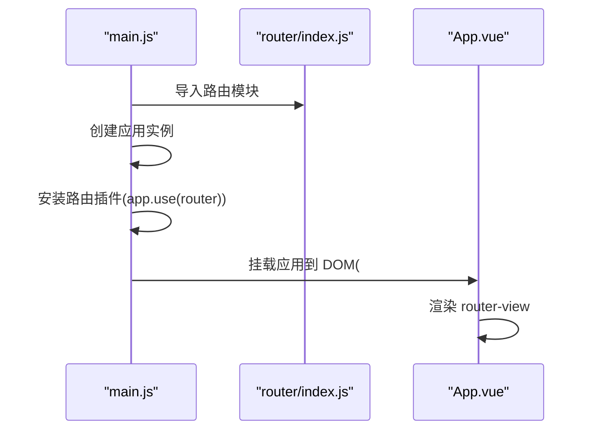
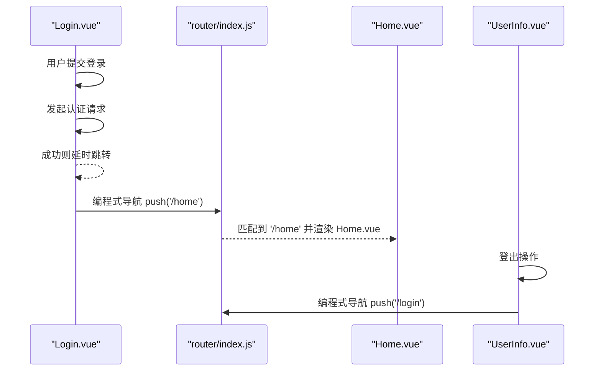
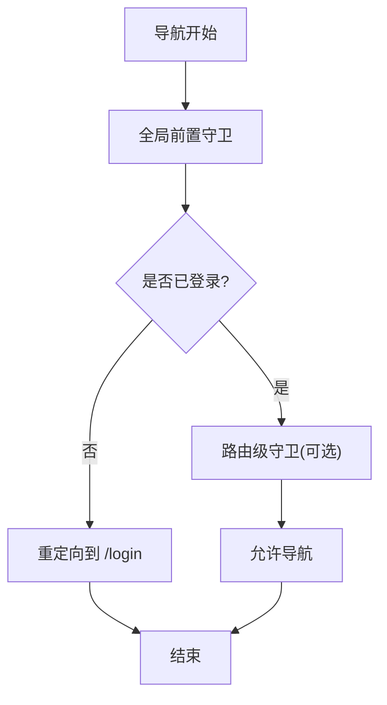
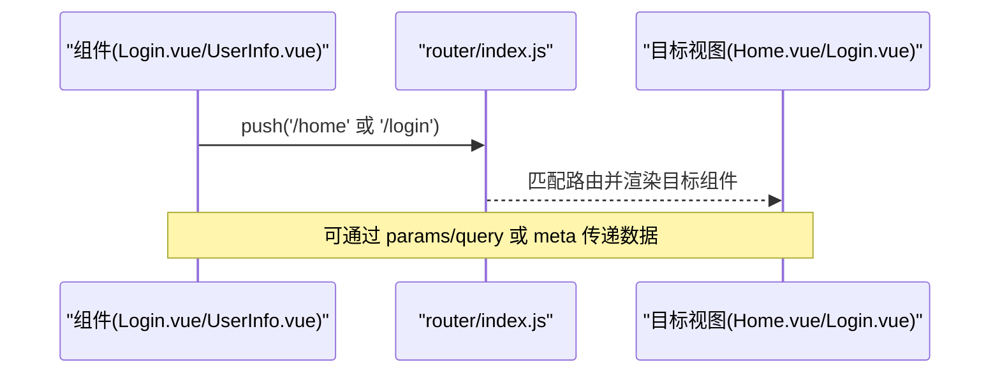
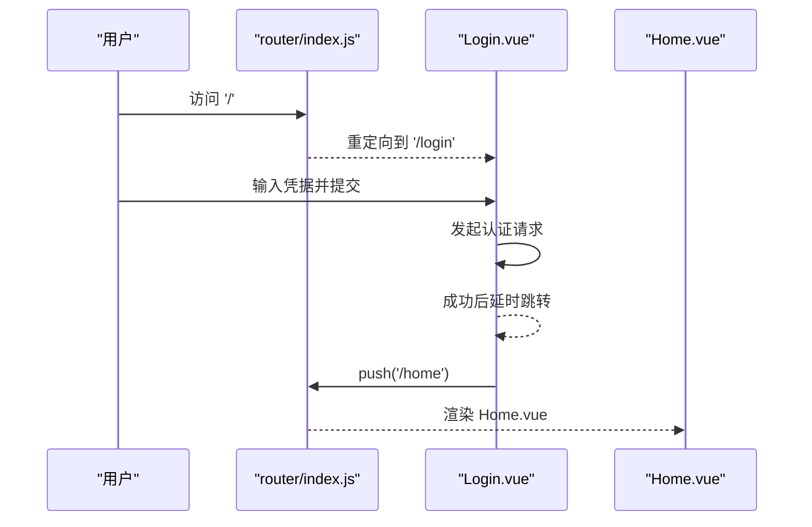
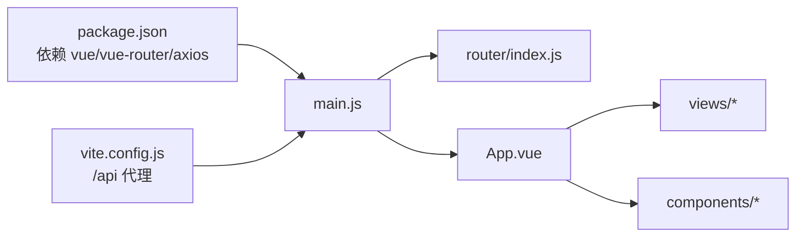

# 前端路由机制

<cite>
**本文引用的文件**
- [vue-csharp-ui-auto/Frontend/src/router/index.js](file://vue-csharp-ui-auto/Frontend/src/router/index.js)
- [vue-csharp-ui-auto/Frontend/src/main.js](file://vue-csharp-ui-auto/Frontend/src/main.js)
- [vue-csharp-ui-auto/Frontend/src/App.vue](file://vue-csharp-ui-auto/Frontend/src/App.vue)
- [vue-csharp-ui-auto/Frontend/src/views/Login.vue](file://vue-csharp-ui-auto/Frontend/src/views/Login.vue)
- [vue-csharp-ui-auto/Frontend/src/views/Home.vue](file://vue-csharp-ui-auto/Frontend/src/views/Home.vue)
- [vue-csharp-ui-auto/Frontend/src/views/FormPage.vue](file://vue-csharp-ui-auto/Frontend/src/views/FormPage.vue)
- [vue-csharp-ui-auto/Frontend/src/components/UserInfo.vue](file://vue-csharp-ui-auto/Frontend/src/components/UserInfo.vue)
- [vue-csharp-ui-auto/Frontend/vite.config.js](file://vue-csharp-ui-auto/Frontend/vite.config.js)
- [vue-csharp-ui-auto/Frontend/package.json](file://vue-csharp-ui-auto/Frontend/package.json)
</cite>

## 目录
1. [引言](#引言)
2. [项目结构](#项目结构)
3. [核心组件](#核心组件)
4. [架构总览](#架构总览)
5. [详细组件分析](#详细组件分析)
6. [依赖关系分析](#依赖关系分析)
7. [性能考虑](#性能考虑)
8. [故障排查指南](#故障排查指南)
9. [结论](#结论)

## 引言
本文件围绕 Vue Router 在项目中的配置与运行机制展开，基于路由定义文件与应用入口，系统性说明路径与视图组件的映射关系、路由插件初始化流程、导航守卫的扩展点、编程式导航的使用方式，并结合“登录后跳转首页”的典型用户路径，演示路由参数传递与导航守卫的应用场景，最后提供常见路由错误（如 404 未匹配）的调试方法与解决方案。

## 项目结构
前端采用 Vite 构建，Vue 3 + Vue Router 4 的组合；路由定义集中于路由模块，应用入口负责挂载路由插件，视图组件位于 views 目录，通用组件位于 components 目录。Vite 配置包含本地开发服务器与 API 代理，便于前后端联调。

图表来源
- [vue-csharp-ui-auto/Frontend/src/main.js](file://vue-csharp-ui-auto/Frontend/src/main.js#L1-L8)
- [vue-csharp-ui-auto/Frontend/src/router/index.js](file://vue-csharp-ui-auto/Frontend/src/router/index.js#L1-L33)
- [vue-csharp-ui-auto/Frontend/src/App.vue](file://vue-csharp-ui-auto/Frontend/src/App.vue#L1-L22)
- [vue-csharp-ui-auto/Frontend/vite.config.js](file://vue-csharp-ui-auto/Frontend/vite.config.js#L1-L22)

章节来源
- [vue-csharp-ui-auto/Frontend/src/main.js](file://vue-csharp-ui-auto/Frontend/src/main.js#L1-L8)
- [vue-csharp-ui-auto/Frontend/src/router/index.js](file://vue-csharp-ui-auto/Frontend/src/router/index.js#L1-L33)
- [vue-csharp-ui-auto/Frontend/src/App.vue](file://vue-csharp-ui-auto/Frontend/src/App.vue#L1-L22)
- [vue-csharp-ui-auto/Frontend/vite.config.js](file://vue-csharp-ui-auto/Frontend/vite.config.js#L1-L22)

## 核心组件
- 路由定义与历史模式：路由表包含根路径重定向、登录页、首页与表单页；使用 HTML5 历史模式，利于 SEO 与刷新体验。
- 应用入口与插件注册：在应用实例上安装路由插件，随后挂载到 DOM。
- 视图组件：Login.vue、Home.vue、FormPage.vue 分别承载登录、首页与表单提交功能。
- 通用组件：UserInfo.vue 提供登录状态显示与登出跳转，内部使用编程式导航进行页面跳转。
- 开发服务器与代理：Vite 将 /api 请求代理至后端服务，便于前端联调。

章节来源
- [vue-csharp-ui-auto/Frontend/src/router/index.js](file://vue-csharp-ui-auto/Frontend/src/router/index.js#L1-L33)
- [vue-csharp-ui-auto/Frontend/src/main.js](file://vue-csharp-ui-auto/Frontend/src/main.js#L1-L8)
- [vue-csharp-ui-auto/Frontend/src/views/Login.vue](file://vue-csharp-ui-auto/Frontend/src/views/Login.vue#L1-L133)
- [vue-csharp-ui-auto/Frontend/src/views/Home.vue](file://vue-csharp-ui-auto/Frontend/src/views/Home.vue#L1-L51)
- [vue-csharp-ui-auto/Frontend/src/views/FormPage.vue](file://vue-csharp-ui-auto/Frontend/src/views/FormPage.vue#L1-L142)
- [vue-csharp-ui-auto/Frontend/src/components/UserInfo.vue](file://vue-csharp-ui-auto/Frontend/src/components/UserInfo.vue#L1-L81)
- [vue-csharp-ui-auto/Frontend/vite.config.js](file://vue-csharp-ui-auto/Frontend/vite.config.js#L1-L22)

## 架构总览
下图展示了从应用启动到路由渲染的关键交互链路，包括路由初始化、视图渲染与导航触发。

图表来源
- [vue-csharp-ui-auto/Frontend/src/main.js](file://vue-csharp-ui-auto/Frontend/src/main.js#L1-L8)
- [vue-csharp-ui-auto/Frontend/src/router/index.js](file://vue-csharp-ui-auto/Frontend/src/router/index.js#L1-L33)
- [vue-csharp-ui-auto/Frontend/src/App.vue](file://vue-csharp-ui-auto/Frontend/src/App.vue#L1-L22)
- [vue-csharp-ui-auto/Frontend/src/components/UserInfo.vue](file://vue-csharp-ui-auto/Frontend/src/components/UserInfo.vue#L1-L81)

## 详细组件分析

### 路由定义与映射关系
- 根路径重定向：根路径被重定向到登录页，确保首次访问进入登录流程。
- 登录页：路径 /login 对应 Login.vue 组件，用于用户认证。
- 首页：路径 /home 对应 Home.vue 组件，展示用户信息与导航链接。
- 表单页：路径 /form 对应 FormPage.vue 组件，提供数据提交能力。

图表来源
- [vue-csharp-ui-auto/Frontend/src/router/index.js](file://vue-csharp-ui-auto/Frontend/src/router/index.js#L1-L33)

章节来源
- [vue-csharp-ui-auto/Frontend/src/router/index.js](file://vue-csharp-ui-auto/Frontend/src/router/index.js#L1-L33)

### 应用初始化与路由插件注册
- 应用入口通过创建应用实例并安装路由插件完成初始化。
- 安装后，应用挂载到 DOM，开始响应路由变化。

图表来源
- [vue-csharp-ui-auto/Frontend/src/main.js](file://vue-csharp-ui-auto/Frontend/src/main.js#L1-L8)
- [vue-csharp-ui-auto/Frontend/src/router/index.js](file://vue-csharp-ui-auto/Frontend/src/router/index.js#L1-L33)
- [vue-csharp-ui-auto/Frontend/src/App.vue](file://vue-csharp-ui-auto/Frontend/src/App.vue#L1-L22)

章节来源
- [vue-csharp-ui-auto/Frontend/src/main.js](file://vue-csharp-ui-auto/Frontend/src/main.js#L1-L8)
- [vue-csharp-ui-auto/Frontend/src/App.vue](file://vue-csharp-ui-auto/Frontend/src/App.vue#L1-L22)

### 视图组件与导航
- Login.vue：处理登录表单提交，成功后通过编程式导航跳转到首页。
- Home.vue：展示用户信息，并提供到表单页的导航链接。
- FormPage.vue：处理表单提交，展示结果或错误信息。
- UserInfo.vue：根据登录状态显示不同内容，并在登出时通过编程式导航跳转到登录页。

图表来源
- [vue-csharp-ui-auto/Frontend/src/views/Login.vue](file://vue-csharp-ui-auto/Frontend/src/views/Login.vue#L1-L133)
- [vue-csharp-ui-auto/Frontend/src/router/index.js](file://vue-csharp-ui-auto/Frontend/src/router/index.js#L1-L33)
- [vue-csharp-ui-auto/Frontend/src/views/Home.vue](file://vue-csharp-ui-auto/Frontend/src/views/Home.vue#L1-L51)
- [vue-csharp-ui-auto/Frontend/src/components/UserInfo.vue](file://vue-csharp-ui-auto/Frontend/src/components/UserInfo.vue#L1-L81)

章节来源
- [vue-csharp-ui-auto/Frontend/src/views/Login.vue](file://vue-csharp-ui-auto/Frontend/src/views/Login.vue#L1-L133)
- [vue-csharp-ui-auto/Frontend/src/views/Home.vue](file://vue-csharp-ui-auto/Frontend/src/views/Home.vue#L1-L51)
- [vue-csharp-ui-auto/Frontend/src/views/FormPage.vue](file://vue-csharp-ui-auto/Frontend/src/views/FormPage.vue#L1-L142)
- [vue-csharp-ui-auto/Frontend/src/components/UserInfo.vue](file://vue-csharp-ui-auto/Frontend/src/components/UserInfo.vue#L1-L81)

### 导航守卫的潜在扩展点
当前路由定义未显式声明导航守卫。可按以下思路扩展：
- 全局前置守卫：在路由实例上添加全局前置守卫，统一校验登录状态与权限。
- 路由级守卫：为特定路由（如 /home、/form）添加路由级守卫，实现细粒度控制。
- 全局后置钩子：用于统计、埋点或页面标题更新。

图表来源
- [vue-csharp-ui-auto/Frontend/src/router/index.js](file://vue-csharp-ui-auto/Frontend/src/router/index.js#L1-L33)

章节来源
- [vue-csharp-ui-auto/Frontend/src/router/index.js](file://vue-csharp-ui-auto/Frontend/src/router/index.js#L1-L33)

### 编程式导航与参数传递
- 编程式导航：组件通过 $router.push 进行页面跳转，如登录成功后跳转首页、登出后返回登录页。
- 参数传递：可通过路由参数、查询参数或路由元信息传递数据；在需要时可在路由定义中声明参数占位符并在组件中读取。

图表来源
- [vue-csharp-ui-auto/Frontend/src/views/Login.vue](file://vue-csharp-ui-auto/Frontend/src/views/Login.vue#L1-L133)
- [vue-csharp-ui-auto/Frontend/src/components/UserInfo.vue](file://vue-csharp-ui-auto/Frontend/src/components/UserInfo.vue#L1-L81)
- [vue-csharp-ui-auto/Frontend/src/router/index.js](file://vue-csharp-ui-auto/Frontend/src/router/index.js#L1-L33)

章节来源
- [vue-csharp-ui-auto/Frontend/src/views/Login.vue](file://vue-csharp-ui-auto/Frontend/src/views/Login.vue#L1-L133)
- [vue-csharp-ui-auto/Frontend/src/components/UserInfo.vue](file://vue-csharp-ui-auto/Frontend/src/components/UserInfo.vue#L1-L81)

### 用户路径示例：登录后跳转首页
- 用户访问根路径，被重定向到登录页。
- 用户在登录页提交凭据，成功后延时跳转首页。
- 首页提供到表单页的导航链接，用户可继续访问其他受控页面。

图表来源
- [vue-csharp-ui-auto/Frontend/src/router/index.js](file://vue-csharp-ui-auto/Frontend/src/router/index.js#L1-L33)
- [vue-csharp-ui-auto/Frontend/src/views/Login.vue](file://vue-csharp-ui-auto/Frontend/src/views/Login.vue#L1-L133)
- [vue-csharp-ui-auto/Frontend/src/views/Home.vue](file://vue-csharp-ui-auto/Frontend/src/views/Home.vue#L1-L51)

章节来源
- [vue-csharp-ui-auto/Frontend/src/router/index.js](file://vue-csharp-ui-auto/Frontend/src/router/index.js#L1-L33)
- [vue-csharp-ui-auto/Frontend/src/views/Login.vue](file://vue-csharp-ui-auto/Frontend/src/views/Login.vue#L1-L133)
- [vue-csharp-ui-auto/Frontend/src/views/Home.vue](file://vue-csharp-ui-auto/Frontend/src/views/Home.vue#L1-L51)

## 依赖关系分析
- 路由依赖：路由模块依赖 Vue Router；应用入口依赖路由模块；App.vue 依赖 router-view。
- 视图依赖：各视图组件独立，但通过路由与导航相互连接。
- 代理依赖：Vite 代理将 /api 请求转发至后端服务，保证前端联调顺畅。

图表来源
- [vue-csharp-ui-auto/Frontend/package.json](file://vue-csharp-ui-auto/Frontend/package.json#L1-L19)
- [vue-csharp-ui-auto/Frontend/src/main.js](file://vue-csharp-ui-auto/Frontend/src/main.js#L1-L8)
- [vue-csharp-ui-auto/Frontend/src/router/index.js](file://vue-csharp-ui-auto/Frontend/src/router/index.js#L1-L33)
- [vue-csharp-ui-auto/Frontend/src/App.vue](file://vue-csharp-ui-auto/Frontend/src/App.vue#L1-L22)
- [vue-csharp-ui-auto/Frontend/vite.config.js](file://vue-csharp-ui-auto/Frontend/vite.config.js#L1-L22)

章节来源
- [vue-csharp-ui-auto/Frontend/package.json](file://vue-csharp-ui-auto/Frontend/package.json#L1-L19)
- [vue-csharp-ui-auto/Frontend/vite.config.js](file://vue-csharp-ui-auto/Frontend/vite.config.js#L1-L22)

## 性能考虑
- 路由懒加载：对大型视图组件可采用动态导入以减少首屏体积。
- 历史模式：使用 HTML5 History 模式提升用户体验，注意服务端需正确配置回退。
- 组件缓存：对频繁切换的视图可结合 keep-alive 减少重复渲染。
- 代理优化：开发阶段合理设置代理规则，避免不必要的跨域与额外请求。

## 故障排查指南
- 404 未匹配路径
  - 症状：访问不存在的路由时页面空白或报错。
  - 排查：确认路由表中是否存在该路径；检查是否有通配符路由兜底；核对路径大小写与拼写。
  - 解决：在路由表末尾添加通配符兜底路由，或修正路径定义。
- 刷新后回到首页
  - 症状：刷新页面后回到根路径而非当前页。
  - 排查：确认是否使用了根路径重定向；检查服务端回退配置。
  - 解决：在服务端配置正确的回退策略，或调整根路径重定向逻辑。
- 导航不生效
  - 症状：点击链接或调用编程式导航无反应。
  - 排查：确认路由实例已安装；检查组件内是否正确注入 $router；核对目标路径是否存在。
  - 解决：确保在组件生命周期内执行导航；修正路径或路由定义。
- 登录状态异常
  - 症状：登录成功仍停留在登录页或无法跳转。
  - 排查：检查登录成功后的导航逻辑；确认本地存储的令牌与用户名状态。
  - 解决：在登录成功后设置必要的本地存储并在延时后执行导航；必要时添加全局守卫进行统一拦截。

章节来源
- [vue-csharp-ui-auto/Frontend/src/router/index.js](file://vue-csharp-ui-auto/Frontend/src/router/index.js#L1-L33)
- [vue-csharp-ui-auto/Frontend/src/views/Login.vue](file://vue-csharp-ui-auto/Frontend/src/views/Login.vue#L1-L133)
- [vue-csharp-ui-auto/Frontend/src/components/UserInfo.vue](file://vue-csharp-ui-auto/Frontend/src/components/UserInfo.vue#L1-L81)

## 结论
本项目采用简洁清晰的路由配置与应用初始化流程，Login.vue 与 UserInfo.vue 展示了编程式导航的实际用法。通过根路径重定向与视图组件配合，实现了从登录到首页再到表单页的典型用户路径。若需增强安全性与可控性，可在路由层引入全局前置守卫与路由级守卫，并结合本地存储与后端接口完善认证流程。同时，借助 Vite 代理与合理的回退配置，可有效提升开发与调试效率。