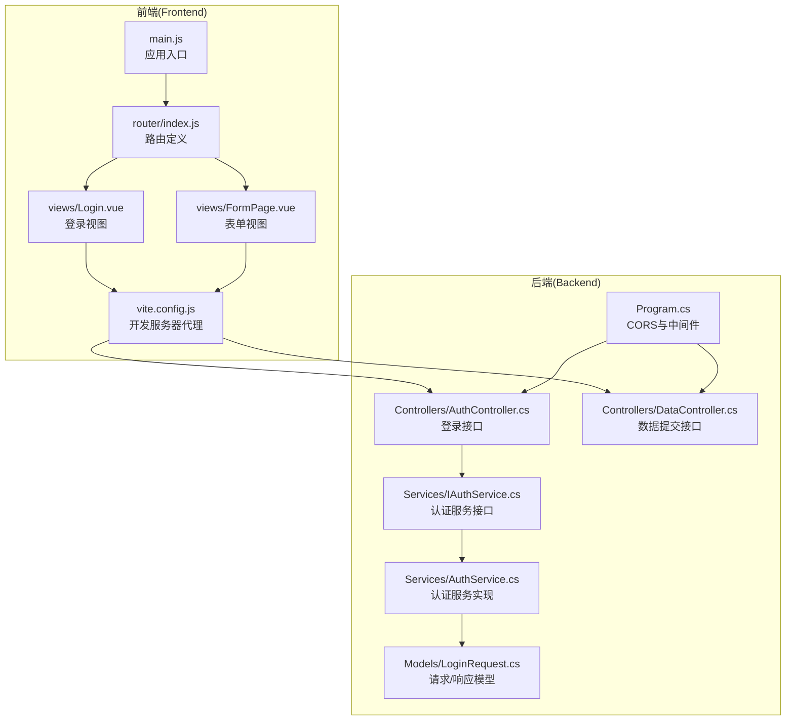
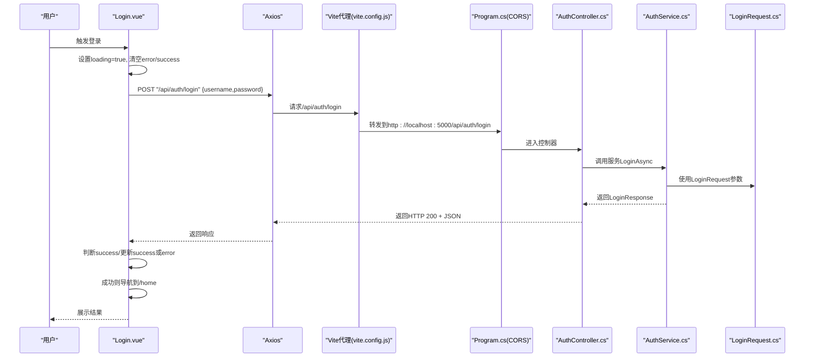
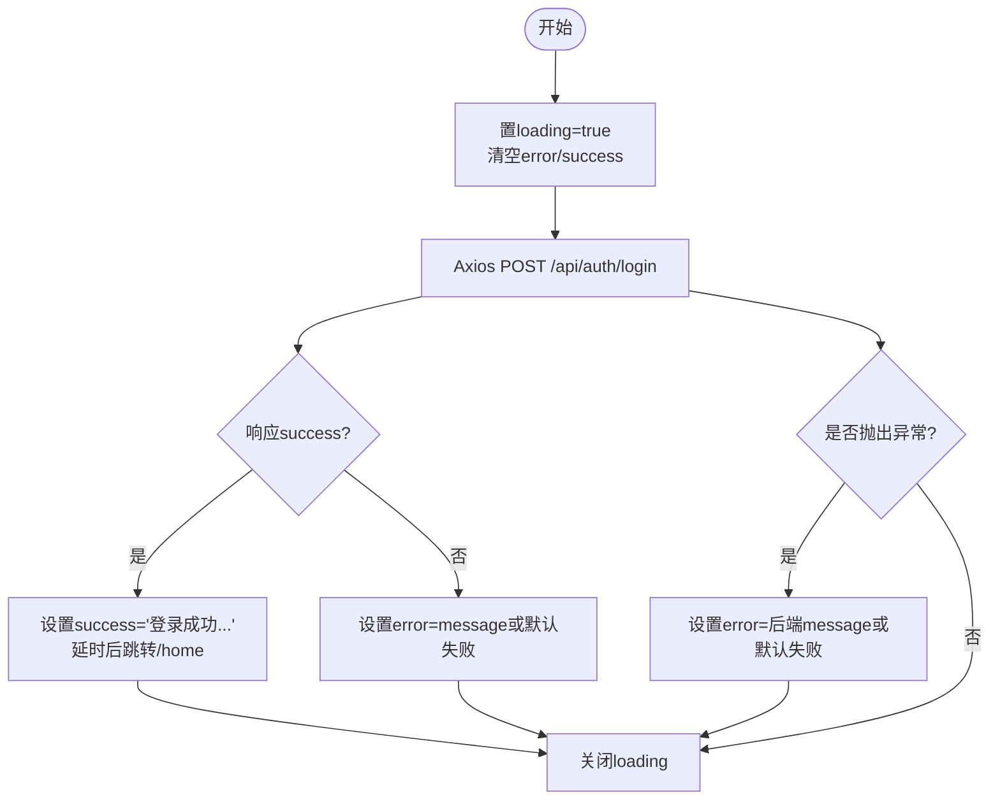
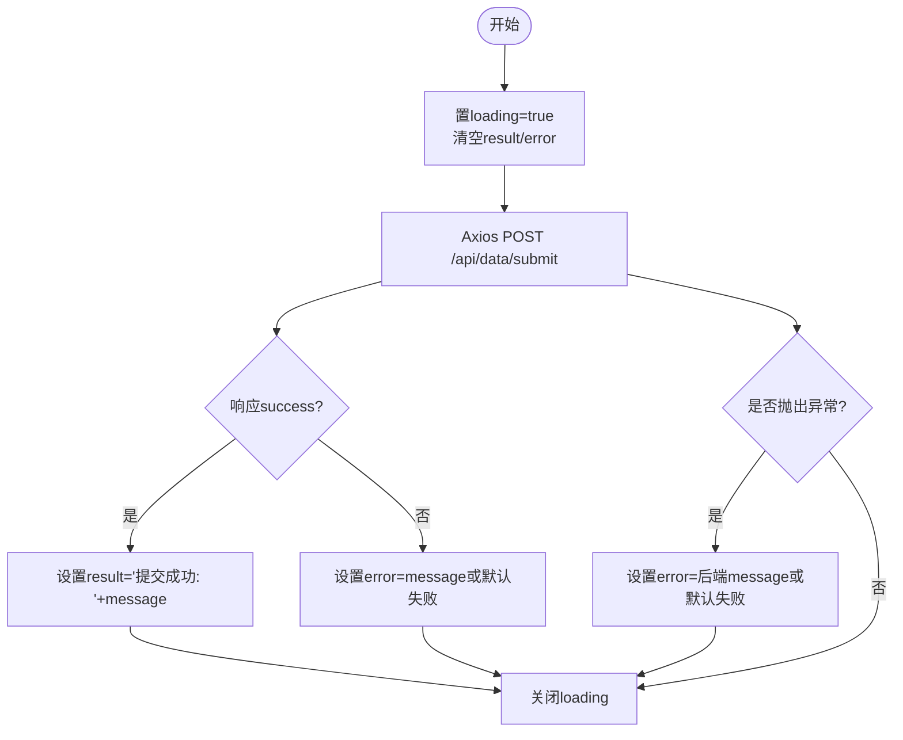
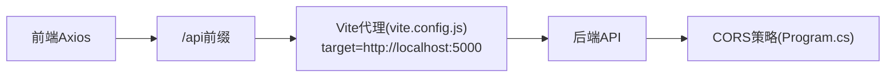
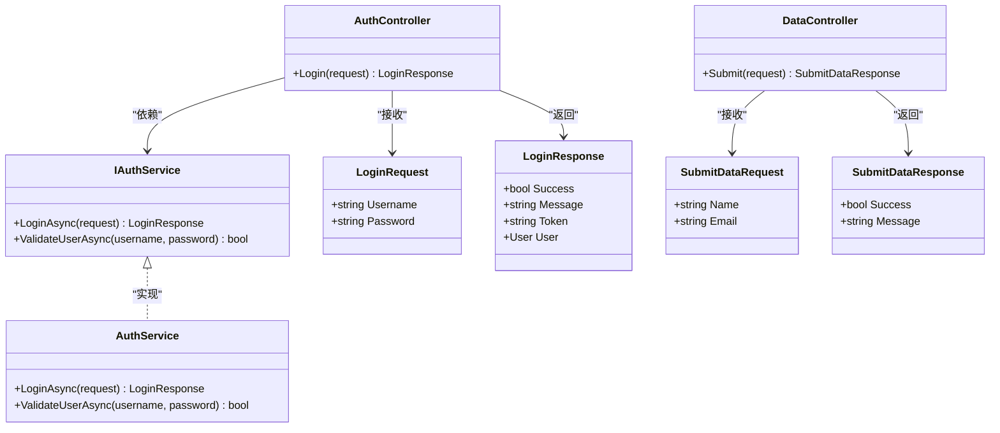
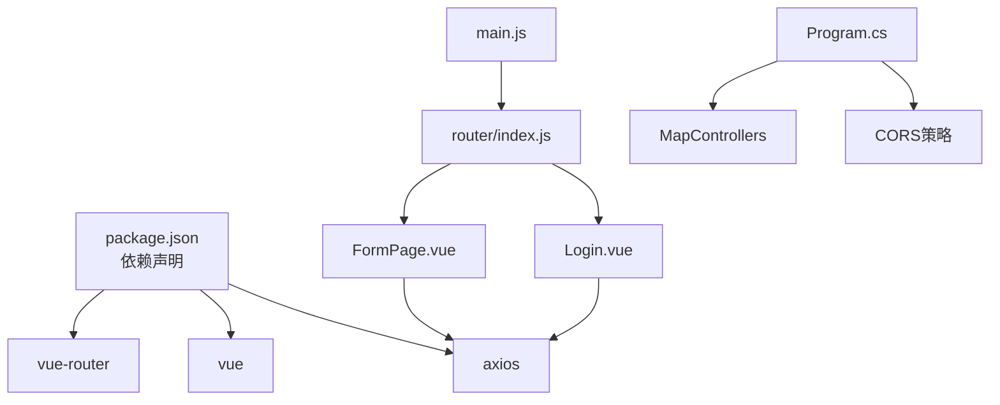

# 状态管理与API集成

<cite>
**本文引用的文件**
- [Login.vue](file://vue-csharp-ui-auto/Frontend/src/views/Login.vue)
- [FormPage.vue](file://vue-csharp-ui-auto/Frontend/src/views/FormPage.vue)
- [vite.config.js](file://vue-csharp-ui-auto/Frontend/vite.config.js)
- [AuthController.cs](file://vue-csharp-ui-auto/Backend/Controllers/AuthController.cs)
- [DataController.cs](file://vue-csharp-ui-auto/Backend/Controllers/DataController.cs)
- [IAuthService.cs](file://vue-csharp-ui-auto/Backend/Services/IAuthService.cs)
- [AuthService.cs](file://vue-csharp-ui-auto/Backend/Services/AuthService.cs)
- [LoginRequest.cs](file://vue-csharp-ui-auto/Backend/Models/LoginRequest.cs)
- [Program.cs](file://vue-csharp-ui-auto/Backend/Program.cs)
- [main.js](file://vue-csharp-ui-auto/Frontend/src/main.js)
- [router/index.js](file://vue-csharp-ui-auto/Frontend/src/router/index.js)
- [package.json](file://vue-csharp-ui-auto/Frontend/package.json)
</cite>

## 目录
1. [引言](#引言)
2. [项目结构](#项目结构)
3. [核心组件](#核心组件)
4. [架构总览](#架构总览)
5. [详细组件分析](#详细组件分析)
6. [依赖关系分析](#依赖关系分析)
7. [性能考量](#性能考量)
8. [故障排查指南](#故障排查指南)
9. [结论](#结论)
10. [附录](#附录)

## 引言
本文件聚焦于前端状态管理与后端API的集成方式，围绕以下目标展开：
- 解析前端Login.vue如何通过Axios向后端/api/auth/login发起POST请求，并在本地完成请求状态、错误与成功反馈的更新。
- 解析前端FormPage.vue的表单异步提交流程与成功反馈机制。
- 说明开发环境下Vite代理配置如何将/api前缀请求转发至后端5000端口，从而解决跨域问题。
- 提供Axios实例封装建议、请求重试策略与加载状态管理的最佳实践，以提升用户体验。

## 项目结构
前端采用Vue 3 + Vite，后端采用ASP.NET Core。前端通过Axios调用后端控制器，Vite在开发时使用代理将/api请求转发到后端服务，避免跨域问题；后端启用CORS策略允许前端访问。

图表来源
- [main.js](file://vue-csharp-ui-auto/Frontend/src/main.js#L1-L8)
- [router/index.js](file://vue-csharp-ui-auto/Frontend/src/router/index.js#L1-L33)
- [Login.vue](file://vue-csharp-ui-auto/Frontend/src/views/Login.vue#L1-L80)
- [FormPage.vue](file://vue-csharp-ui-auto/Frontend/src/views/FormPage.vue#L1-L78)
- [vite.config.js](file://vue-csharp-ui-auto/Frontend/vite.config.js#L1-L22)
- [Program.cs](file://vue-csharp-ui-auto/Backend/Program.cs#L1-L55)
- [AuthController.cs](file://vue-csharp-ui-auto/Backend/Controllers/AuthController.cs#L1-L25)
- [DataController.cs](file://vue-csharp-ui-auto/Backend/Controllers/DataController.cs#L1-L25)
- [IAuthService.cs](file://vue-csharp-ui-auto/Backend/Services/IAuthService.cs#L1-L10)
- [AuthService.cs](file://vue-csharp-ui-auto/Backend/Services/AuthService.cs#L1-L64)
- [LoginRequest.cs](file://vue-csharp-ui-auto/Backend/Models/LoginRequest.cs#L1-L28)

章节来源
- [main.js](file://vue-csharp-ui-auto/Frontend/src/main.js#L1-L8)
- [router/index.js](file://vue-csharp-ui-auto/Frontend/src/router/index.js#L1-L33)
- [vite.config.js](file://vue-csharp-ui-auto/Frontend/vite.config.js#L1-L22)
- [Program.cs](file://vue-csharp-ui-auto/Backend/Program.cs#L1-L55)

## 核心组件
- 前端登录组件(Login.vue)：负责收集用户名/密码，发起登录请求，更新loading/error/success状态，并在成功后导航到首页。
- 前端表单组件(FormPage.vue)：负责收集姓名/邮箱，发起提交请求，更新loading/result/error状态。
- Vite开发代理(vite.config.js)：将/api前缀请求代理到后端5000端口，解决跨域。
- 后端控制器(AuthController.cs, DataController.cs)：暴露/api/auth/login与/api/data/submit接口，返回标准化响应。
- 后端服务与模型(IAuthService.cs, AuthService.cs, LoginRequest.cs)：定义认证服务契约与实现，以及请求/响应模型。

章节来源
- [Login.vue](file://vue-csharp-ui-auto/Frontend/src/views/Login.vue#L1-L80)
- [FormPage.vue](file://vue-csharp-ui-auto/Frontend/src/views/FormPage.vue#L1-L78)
- [vite.config.js](file://vue-csharp-ui-auto/Frontend/vite.config.js#L1-L22)
- [AuthController.cs](file://vue-csharp-ui-auto/Backend/Controllers/AuthController.cs#L1-L25)
- [DataController.cs](file://vue-csharp-ui-auto/Backend/Controllers/DataController.cs#L1-L25)
- [IAuthService.cs](file://vue-csharp-ui-auto/Backend/Services/IAuthService.cs#L1-L10)
- [AuthService.cs](file://vue-csharp-ui-auto/Backend/Services/AuthService.cs#L1-L64)
- [LoginRequest.cs](file://vue-csharp-ui-auto/Backend/Models/LoginRequest.cs#L1-L28)

## 架构总览
下图展示了从前端到后端的完整调用链路，包括代理与CORS配置的作用。

图表来源
- [Login.vue](file://vue-csharp-ui-auto/Frontend/src/views/Login.vue#L52-L77)
- [vite.config.js](file://vue-csharp-ui-auto/Frontend/vite.config.js#L11-L16)
- [Program.cs](file://vue-csharp-ui-auto/Backend/Program.cs#L13-L22)
- [AuthController.cs](file://vue-csharp-ui-auto/Backend/Controllers/AuthController.cs#L18-L23)
- [AuthService.cs](file://vue-csharp-ui-auto/Backend/Services/AuthService.cs#L15-L48)
- [LoginRequest.cs](file://vue-csharp-ui-auto/Backend/Models/LoginRequest.cs#L1-L15)

## 详细组件分析

### 登录组件(Login.vue)的状态管理与API集成
- 数据状态
  - username/password：表单输入绑定。
  - loading：提交期间禁用按钮并显示“登录中…”。
  - error/success：错误与成功提示信息。
- 行为流程
  - 用户点击登录后，组件置loading为true，清空错误与成功消息。
  - 使用Axios向/api/auth/login发送POST请求，携带用户名与密码。
  - 若响应中的success为真，则设置成功消息并在短暂延迟后导航到/home。
  - 若响应中的success为假，则从响应体提取message作为错误提示。
  - 捕获异常时，优先展示后端返回的message，否则提示“登录请求失败”。
  - finally中统一关闭loading。
- 错误处理
  - 通过try/catch捕获网络或后端异常，从err.response.data.message读取后端错误信息。
  - 未拿到后端message时回退为通用提示。
- 加载状态
  - 通过按钮禁用与文案切换提升交互反馈。
- 导航
  - 成功后通过$router.push跳转到/home。

图表来源
- [Login.vue](file://vue-csharp-ui-auto/Frontend/src/views/Login.vue#L52-L77)

章节来源
- [Login.vue](file://vue-csharp-ui-auto/Frontend/src/views/Login.vue#L1-L80)

### 表单页面(FormPage.vue)的异步提交与反馈
- 数据状态
  - name/email：表单输入绑定。
  - loading：提交期间禁用按钮并显示“提交中…”。
  - result/error：成功与错误提示信息。
- 行为流程
  - 用户点击提交后，组件置loading为true，清空result与error。
  - 使用Axios向/api/data/submit发送POST请求，携带姓名与邮箱。
  - 若响应中的success为真，则拼接message作为result展示。
  - 若响应中的success为假，则从响应体提取message作为error提示。
  - 捕获异常时，优先展示后端返回的message，否则提示“提交请求失败”。
  - finally中统一关闭loading。
- 错误处理
  - 与登录一致，优先使用后端message，异常兜底为通用提示。
- 成功反馈
  - 成功时以result区域展示后端返回的消息，便于用户确认。

图表来源
- [FormPage.vue](file://vue-csharp-ui-auto/Frontend/src/views/FormPage.vue#L55-L77)

章节来源
- [FormPage.vue](file://vue-csharp-ui-auto/Frontend/src/views/FormPage.vue#L1-L78)

### 开发环境代理与跨域解决方案
- Vite代理配置
  - 将/api前缀的请求代理到http://localhost:5000，changeOrigin=true，secure=false。
  - 前端Axios直接使用相对路径/api/*，无需手动拼接完整URL。
- 后端CORS策略
  - 在Program.cs中添加名为“AllowVueApp”的CORS策略，允许来自http://localhost:8080等源的请求。
  - 在管道中启用UseCors，使策略生效。
- 效果
  - 前端在开发时通过代理访问后端API，避免浏览器同源策略限制，实现无缝联调。

图表来源
- [vite.config.js](file://vue-csharp-ui-auto/Frontend/vite.config.js#L11-L16)
- [Program.cs](file://vue-csharp-ui-auto/Backend/Program.cs#L13-L22)

章节来源
- [vite.config.js](file://vue-csharp-ui-auto/Frontend/vite.config.js#L1-L22)
- [Program.cs](file://vue-csharp-ui-auto/Backend/Program.cs#L1-L55)

### 后端API设计与契约
- 登录接口
  - 控制器：AuthController.cs，路由/api/auth/login，接收LoginRequest，返回LoginResponse。
  - 服务：AuthService.cs，根据用户名查询用户，简单比对密码，返回包含Success/Message/User的LoginResponse。
- 数据提交接口
  - 控制器：DataController.cs，路由/api/data/submit，接收SubmitDataRequest，返回SubmitDataResponse。
- 模型
  - LoginRequest/LoginResponse/SubmitDataRequest/SubmitDataResponse定义了前后端约定的数据结构。

图表来源
- [AuthController.cs](file://vue-csharp-ui-auto/Backend/Controllers/AuthController.cs#L18-L23)
- [DataController.cs](file://vue-csharp-ui-auto/Backend/Controllers/DataController.cs#L18-L23)
- [IAuthService.cs](file://vue-csharp-ui-auto/Backend/Services/IAuthService.cs#L1-L10)
- [AuthService.cs](file://vue-csharp-ui-auto/Backend/Services/AuthService.cs#L15-L64)
- [LoginRequest.cs](file://vue-csharp-ui-auto/Backend/Models/LoginRequest.cs#L1-L28)

章节来源
- [AuthController.cs](file://vue-csharp-ui-auto/Backend/Controllers/AuthController.cs#L1-L25)
- [DataController.cs](file://vue-csharp-ui-auto/Backend/Controllers/DataController.cs#L1-L25)
- [IAuthService.cs](file://vue-csharp-ui-auto/Backend/Services/IAuthService.cs#L1-L10)
- [AuthService.cs](file://vue-csharp-ui-auto/Backend/Services/AuthService.cs#L1-L64)
- [LoginRequest.cs](file://vue-csharp-ui-auto/Backend/Models/LoginRequest.cs#L1-L28)

## 依赖关系分析
- 前端依赖
  - Vue 3、vue-router、axios。
  - main.js挂载应用并注册路由；router/index.js定义登录、首页、表单页路由。
- 后端依赖
  - ASP.NET Core、Entity Framework In-Memory Database、Swagger。
  - Program.cs配置CORS、Swagger、数据库初始化与控制器映射。
- 前后端通信
  - 前端通过Axios调用/api/*，由Vite代理转发到后端5000端口；后端启用CORS允许前端访问。

图表来源
- [package.json](file://vue-csharp-ui-auto/Frontend/package.json#L1-L19)
- [main.js](file://vue-csharp-ui-auto/Frontend/src/main.js#L1-L8)
- [router/index.js](file://vue-csharp-ui-auto/Frontend/src/router/index.js#L1-L33)
- [Login.vue](file://vue-csharp-ui-auto/Frontend/src/views/Login.vue#L1-L80)
- [FormPage.vue](file://vue-csharp-ui-auto/Frontend/src/views/FormPage.vue#L1-L78)
- [Program.cs](file://vue-csharp-ui-auto/Backend/Program.cs#L1-L55)

章节来源
- [package.json](file://vue-csharp-ui-auto/Frontend/package.json#L1-L19)
- [main.js](file://vue-csharp-ui-auto/Frontend/src/main.js#L1-L8)
- [router/index.js](file://vue-csharp-ui-auto/Frontend/src/router/index.js#L1-L33)
- [Program.cs](file://vue-csharp-ui-auto/Backend/Program.cs#L1-L55)

## 性能考量
- 请求并发控制
  - 对于高频操作（如搜索、自动补全），可引入节流/防抖，减少不必要的请求。
- 缓存策略
  - 对只读数据或不频繁变更的数据，可在前端进行内存缓存，降低重复请求次数。
- 重试与超时
  - 对幂等请求可增加有限次重试，结合超时控制避免长时间阻塞。
- 加载体验
  - 使用骨架屏、占位符与进度指示，改善长请求的感知性能。
- 代理与CORS
  - 开发阶段使用Vite代理，生产阶段确保后端正确配置CORS，避免额外的网络往返。

## 故障排查指南
- 登录失败
  - 检查用户名是否存在与密码是否匹配（测试用例中密码为固定值）。
  - 查看后端返回的message，定位具体原因。
- 表单提交失败
  - 确认必填字段已填写且格式正确。
  - 查看后端返回的message，定位业务校验失败点。
- 跨域问题
  - 确认Vite代理已启用且target指向后端5000端口。
  - 确认后端Program.cs已启用CORS策略并允许前端源。
- 网络异常
  - 检查后端服务是否启动、端口是否被占用。
  - 检查防火墙或代理设置是否阻止请求。

章节来源
- [Login.vue](file://vue-csharp-ui-auto/Frontend/src/views/Login.vue#L52-L77)
- [FormPage.vue](file://vue-csharp-ui-auto/Frontend/src/views/FormPage.vue#L55-L77)
- [vite.config.js](file://vue-csharp-ui-auto/Frontend/vite.config.js#L11-L16)
- [Program.cs](file://vue-csharp-ui-auto/Backend/Program.cs#L13-L22)

## 结论
本项目通过清晰的前后端职责划分与合理的开发工具配置，实现了简洁可靠的状态管理与API集成：
- 前端Login.vue与FormPage.vue分别承担登录与表单提交的用户交互与状态更新。
- Axios统一发起请求，遵循后端标准化响应结构，保证错误与成功反馈的一致性。
- Vite代理与后端CORS共同解决开发环境跨域问题，保障联调顺畅。
- 建议在生产环境中进一步封装Axios实例、引入重试与超时策略，并完善全局状态管理方案，以提升稳定性与可维护性。

## 附录
- Axios实例封装建议
  - 创建独立的axios实例，集中配置baseURL、timeout、headers与拦截器。
  - 在请求拦截器中注入token（如已登录）、统一处理loading状态。
  - 在响应拦截器中统一解析错误与业务错误码，减少各组件重复逻辑。
- 请求重试策略
  - 对GET与幂等POST进行有限次重试（指数退避），对非幂等请求谨慎重试。
  - 避免无限重试导致雪崩效应，结合用户可感知的错误提示。
- 加载状态管理最佳实践
  - 组件内局部loading，避免全局loading造成卡顿感。
  - 对批量请求采用合并loading，减少UI闪烁。
  - 在列表/表格场景使用骨架屏与分页，优化长列表体验。