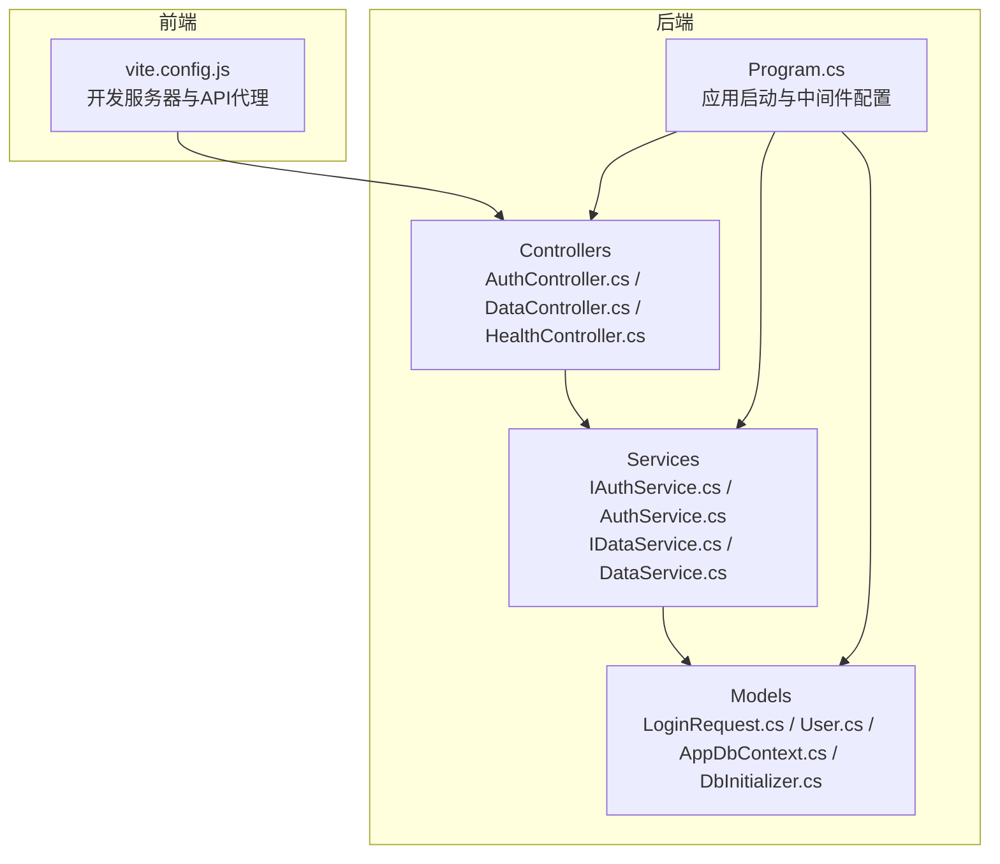
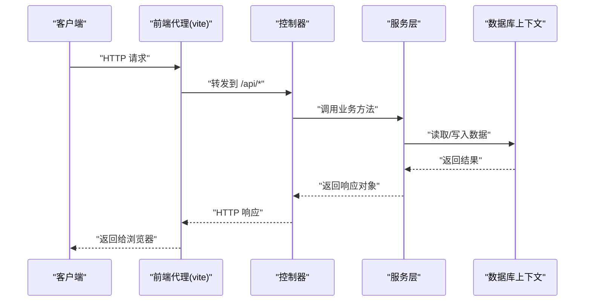
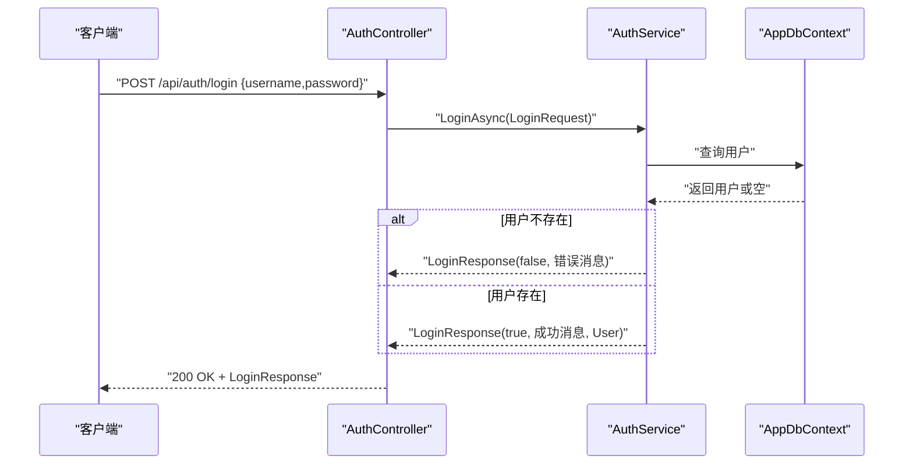
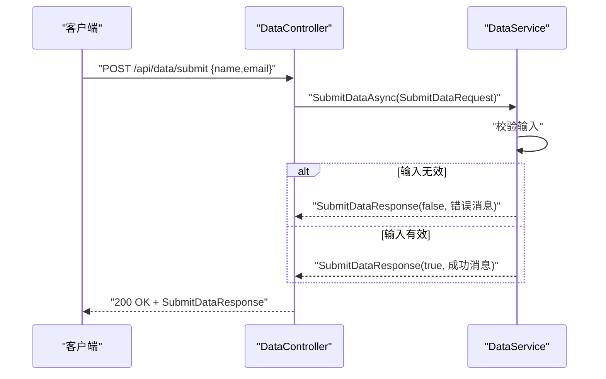
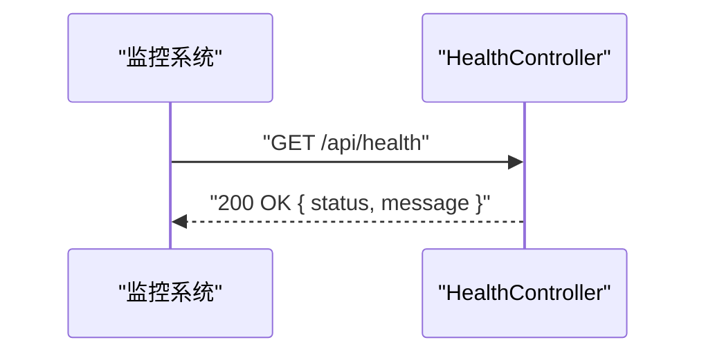
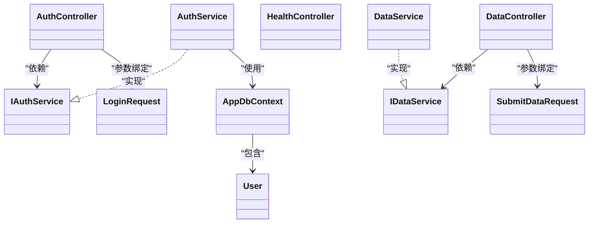

# API端点参考

<cite>
**本文引用的文件**
- [AuthController.cs](file://vue-csharp-ui-auto/Backend/Controllers/AuthController.cs)
- [DataController.cs](file://vue-csharp-ui-auto/Backend/Controllers/DataController.cs)
- [HealthController.cs](file://vue-csharp-ui-auto/Backend/Controllers/HealthController.cs)
- [LoginRequest.cs](file://vue-csharp-ui-auto/Backend/Models/LoginRequest.cs)
- [User.cs](file://vue-csharp-ui-auto/Backend/Models/User.cs)
- [AuthService.cs](file://vue-csharp-ui-auto/Backend/Services/AuthService.cs)
- [DataService.cs](file://vue-csharp-ui-auto/Backend/Services/DataService.cs)
- [IAuthService.cs](file://vue-csharp-ui-auto/Backend/Services/IAuthService.cs)
- [IDataService.cs](file://vue-csharp-ui-auto/Backend/Services/IDataService.cs)
- [Program.cs](file://vue-csharp-ui-auto/Backend/Program.cs)
- [AppDbContext.cs](file://vue-csharp-ui-auto/Backend/Models/AppDbContext.cs)
- [DbInitializer.cs](file://vue-csharp-ui-auto/Backend/Models/DbInitializer.cs)
- [vite.config.js](file://vue-csharp-ui-auto/Frontend/vite.config.js)
</cite>

## 目录
1. [简介](#简介)
2. [项目结构](#项目结构)
3. [核心组件](#核心组件)
4. [架构总览](#架构总览)
5. [详细组件分析](#详细组件分析)
6. [依赖关系分析](#依赖关系分析)
7. [性能考虑](#性能考虑)
8. [故障排查指南](#故障排查指南)
9. [结论](#结论)
10. [附录：调用示例与扩展指南](#附录调用示例与扩展指南)

## 简介
本文件为智能体项目的后端API端点完整参考，覆盖以下接口：
- 认证接口：POST /api/auth/login
- 数据提交接口：POST /api/data/submit
- 健康检查接口：GET /api/health

文档详细说明每个端点的请求头要求、请求体结构、成功与错误响应格式、数据验证规则、调用方式（C# HttpClient与curl），以及路由属性与扩展新端点的方法。

## 项目结构
后端采用ASP.NET Core MVC风格，控制器位于 Controllers 目录，业务逻辑封装在 Services 中，数据模型位于 Models 目录。前端通过Vite代理访问后端API。

图表来源
- [Program.cs](file://vue-csharp-ui-auto/Backend/Program.cs#L1-L55)
- [AuthController.cs](file://vue-csharp-ui-auto/Backend/Controllers/AuthController.cs#L1-L25)
- [DataController.cs](file://vue-csharp-ui-auto/Backend/Controllers/DataController.cs#L1-L25)
- [HealthController.cs](file://vue-csharp-ui-auto/Backend/Controllers/HealthController.cs#L1-L15)
- [AuthService.cs](file://vue-csharp-ui-auto/Backend/Services/AuthService.cs#L1-L64)
- [DataService.cs](file://vue-csharp-ui-auto/Backend/Services/DataService.cs#L1-L30)
- [LoginRequest.cs](file://vue-csharp-ui-auto/Backend/Models/LoginRequest.cs#L1-L28)
- [User.cs](file://vue-csharp-ui-auto/Backend/Models/User.cs#L1-L11)
- [AppDbContext.cs](file://vue-csharp-ui-auto/Backend/Models/AppDbContext.cs#L1-L24)
- [DbInitializer.cs](file://vue-csharp-ui-auto/Backend/Models/DbInitializer.cs#L1-L40)
- [vite.config.js](file://vue-csharp-ui-auto/Frontend/vite.config.js#L1-L22)

章节来源
- [Program.cs](file://vue-csharp-ui-auto/Backend/Program.cs#L1-L55)
- [vite.config.js](file://vue-csharp-ui-auto/Frontend/vite.config.js#L1-L22)

## 核心组件
- 控制器层：负责接收HTTP请求、绑定模型、调用服务层并返回响应。
- 服务层：封装业务逻辑，如认证校验、数据提交处理。
- 模型层：定义请求/响应模型与数据库上下文。
- 应用启动：注册服务、启用Swagger、CORS、HTTPS重定向、授权与控制器映射。

章节来源
- [AuthController.cs](file://vue-csharp-ui-auto/Backend/Controllers/AuthController.cs#L1-L25)
- [DataController.cs](file://vue-csharp-ui-auto/Backend/Controllers/DataController.cs#L1-L25)
- [HealthController.cs](file://vue-csharp-ui-auto/Backend/Controllers/HealthController.cs#L1-L15)
- [AuthService.cs](file://vue-csharp-ui-auto/Backend/Services/AuthService.cs#L1-L64)
- [DataService.cs](file://vue-csharp-ui-auto/Backend/Services/DataService.cs#L1-L30)
- [LoginRequest.cs](file://vue-csharp-ui-auto/Backend/Models/LoginRequest.cs#L1-L28)
- [User.cs](file://vue-csharp-ui-auto/Backend/Models/User.cs#L1-L11)
- [Program.cs](file://vue-csharp-ui-auto/Backend/Program.cs#L1-L55)

## 架构总览
下图展示了从客户端到控制器、服务与数据层的整体交互流程。

图表来源
- [Program.cs](file://vue-csharp-ui-auto/Backend/Program.cs#L1-L55)
- [AuthController.cs](file://vue-csharp-ui-auto/Backend/Controllers/AuthController.cs#L1-L25)
- [DataController.cs](file://vue-csharp-ui-auto/Backend/Controllers/DataController.cs#L1-L25)
- [HealthController.cs](file://vue-csharp-ui-auto/Backend/Controllers/HealthController.cs#L1-L15)
- [AuthService.cs](file://vue-csharp-ui-auto/Backend/Services/AuthService.cs#L1-L64)
- [DataService.cs](file://vue-csharp-ui-auto/Backend/Services/DataService.cs#L1-L30)
- [AppDbContext.cs](file://vue-csharp-ui-auto/Backend/Models/AppDbContext.cs#L1-L24)

## 详细组件分析

### 认证接口：POST /api/auth/login
- 路由与方法
  - 控制器：AuthController
  - 路由属性：[Route("api/[controller]")] 生成基础路径 api/auth
  - 动作方法：[HttpPost("login")] 映射到 api/auth/login
- 请求头要求
  - Content-Type: application/json
  - 其他头部按需添加（如Authorization）
- 请求体结构（LoginRequest）
  - 字段：Username（字符串）、Password（字符串）
- 成功与错误响应（LoginResponse）
  - 成功：Success=true，Message包含成功信息，User包含用户信息（可选Token字段存在但当前实现未生成）
  - 失败：Success=false，Message包含失败原因（用户名不存在或密码错误）
- 数据验证与处理
  - 服务层根据用户名查询用户；若不存在则返回失败
  - 若存在，当前实现对密码进行简单比较（测试用途），匹配则返回成功及用户信息，否则返回失败
- 调用方式
  - C# HttpClient 示例路径：见“附录：调用示例与扩展指南”
  - curl 示例路径：见“附录：调用示例与扩展指南”

图表来源
- [AuthController.cs](file://vue-csharp-ui-auto/Backend/Controllers/AuthController.cs#L1-L25)
- [AuthService.cs](file://vue-csharp-ui-auto/Backend/Services/AuthService.cs#L1-L64)
- [AppDbContext.cs](file://vue-csharp-ui-auto/Backend/Models/AppDbContext.cs#L1-L24)
- [LoginRequest.cs](file://vue-csharp-ui-auto/Backend/Models/LoginRequest.cs#L1-L28)

章节来源
- [AuthController.cs](file://vue-csharp-ui-auto/Backend/Controllers/AuthController.cs#L1-L25)
- [AuthService.cs](file://vue-csharp-ui-auto/Backend/Services/AuthService.cs#L1-L64)
- [LoginRequest.cs](file://vue-csharp-ui-auto/Backend/Models/LoginRequest.cs#L1-L28)
- [User.cs](file://vue-csharp-ui-auto/Backend/Models/User.cs#L1-L11)

### 数据提交接口：POST /api/data/submit
- 路由与方法
  - 控制器：DataController
  - 路由属性：[Route("api/[controller]")] 生成基础路径 api/data
  - 动作方法：[HttpPost("submit")] 映射到 api/data/submit
- 请求头要求
  - Content-Type: application/json
- 请求体结构（SubmitDataRequest）
  - 字段：Name（字符串）、Email（字符串）
- 成功与错误响应（SubmitDataResponse）
  - 成功：Success=true，Message包含成功信息
  - 失败：Success=false，Message包含失败原因（姓名和邮箱不能为空）
- 数据验证与处理
  - 服务层对Name与Email进行非空校验，任一为空则返回失败
  - 否则返回成功与处理后的消息
- 调用方式
  - C# HttpClient 示例路径：见“附录：调用示例与扩展指南”
  - curl 示例路径：见“附录：调用示例与扩展指南”

图表来源
- [DataController.cs](file://vue-csharp-ui-auto/Backend/Controllers/DataController.cs#L1-L25)
- [DataService.cs](file://vue-csharp-ui-auto/Backend/Services/DataService.cs#L1-L30)
- [LoginRequest.cs](file://vue-csharp-ui-auto/Backend/Models/LoginRequest.cs#L1-L28)

章节来源
- [DataController.cs](file://vue-csharp-ui-auto/Backend/Controllers/DataController.cs#L1-L25)
- [DataService.cs](file://vue-csharp-ui-auto/Backend/Services/DataService.cs#L1-L30)
- [LoginRequest.cs](file://vue-csharp-ui-auto/Backend/Models/LoginRequest.cs#L1-L28)

### 健康检查接口：GET /api/health
- 路由与方法
  - 控制器：HealthController
  - 路由属性：[Route("api/[controller]")] 生成基础路径 api/health
  - 动作方法：[HttpGet] 映射到 api/health
- 返回内容
  - JSON对象：包含status与message字段，用于指示服务健康状态
- 监控用途
  - 可被Kubernetes、Prometheus等监控系统定期探测，快速发现服务异常

图表来源
- [HealthController.cs](file://vue-csharp-ui-auto/Backend/Controllers/HealthController.cs#L1-L15)

章节来源
- [HealthController.cs](file://vue-csharp-ui-auto/Backend/Controllers/HealthController.cs#L1-L15)

## 依赖关系分析
- 控制器依赖服务接口，服务依赖数据库上下文与实体模型
- 应用启动时注册控制器、Swagger、CORS、HTTPS重定向、授权与控制器映射
- 前端通过Vite代理将 /api 前缀请求转发至后端

图表来源
- [AuthController.cs](file://vue-csharp-ui-auto/Backend/Controllers/AuthController.cs#L1-L25)
- [DataController.cs](file://vue-csharp-ui-auto/Backend/Controllers/DataController.cs#L1-L25)
- [HealthController.cs](file://vue-csharp-ui-auto/Backend/Controllers/HealthController.cs#L1-L15)
- [IAuthService.cs](file://vue-csharp-ui-auto/Backend/Services/IAuthService.cs#L1-L10)
- [AuthService.cs](file://vue-csharp-ui-auto/Backend/Services/AuthService.cs#L1-L64)
- [IDataService.cs](file://vue-csharp-ui-auto/Backend/Services/IDataService.cs#L1-L9)
- [DataService.cs](file://vue-csharp-ui-auto/Backend/Services/DataService.cs#L1-L30)
- [AppDbContext.cs](file://vue-csharp-ui-auto/Backend/Models/AppDbContext.cs#L1-L24)
- [User.cs](file://vue-csharp-ui-auto/Backend/Models/User.cs#L1-L11)
- [LoginRequest.cs](file://vue-csharp-ui-auto/Backend/Models/LoginRequest.cs#L1-L28)

章节来源
- [Program.cs](file://vue-csharp-ui-auto/Backend/Program.cs#L1-L55)
- [vite.config.js](file://vue-csharp-ui-auto/Frontend/vite.config.js#L1-L22)

## 性能考虑
- 使用异步方法避免阻塞线程池
- 在生产环境启用HTTPS与严格的CORS策略
- 对数据库操作使用EF Core的异步API
- 避免在控制器中直接执行复杂业务逻辑，保持控制器薄层
- 对外部依赖（如第三方API）设置合理的超时与重试策略

## 故障排查指南
- 404 Not Found
  - 检查路由是否正确（控制器名与动作名大小写、路径拼接）
  - 确认已启用MapControllers
- 401/403 Unauthorized
  - 确认已启用Authorization中间件
  - 如需令牌，请在请求头添加Authorization
- 500 Internal Server Error
  - 查看服务日志与异常堆栈
  - 确认数据库连接字符串与上下文初始化
- CORS错误
  - 确认前端代理配置与后端CORS策略允许的源
- Swagger不可用
  - 确认开发环境且已启用Swagger与SwaggerUI

章节来源
- [Program.cs](file://vue-csharp-ui-auto/Backend/Program.cs#L1-L55)
- [vite.config.js](file://vue-csharp-ui-auto/Frontend/vite.config.js#L1-L22)

## 结论
本项目提供了简洁清晰的API端点设计：认证、数据提交与健康检查三类常用场景。通过路由属性与控制器薄层设计，配合服务层封装业务逻辑，便于扩展与维护。建议在生产环境中补充密码哈希、JWT令牌签发、输入校验增强与更完善的错误处理。

## 附录：调用示例与扩展指南

### 路由属性与扩展新端点
- 路由属性作用机制
  - [Route("api/[controller]")] 将控制器名转为小写作为基础路径，例如 AuthController -> api/auth
  - [HttpPost("login")] 在基础路径上追加动作名，形成最终路由 api/auth/login
- 扩展新端点步骤
  - 在控制器中添加新动作方法，标注相应HTTP动词与路由
  - 在服务层新增接口与实现，处理业务逻辑
  - 在Program.cs中注册服务（如需要）
  - 如需跨域访问，确保CORS策略允许前端源

章节来源
- [AuthController.cs](file://vue-csharp-ui-auto/Backend/Controllers/AuthController.cs#L1-L25)
- [DataController.cs](file://vue-csharp-ui-auto/Backend/Controllers/DataController.cs#L1-L25)
- [HealthController.cs](file://vue-csharp-ui-auto/Backend/Controllers/HealthController.cs#L1-L15)
- [Program.cs](file://vue-csharp-ui-auto/Backend/Program.cs#L1-L55)

### C# HttpClient 调用示例
- 认证接口
  - 方法路径：[AuthController.cs](file://vue-csharp-ui-auto/Backend/Controllers/AuthController.cs#L18-L23)
  - 请求体模型：[LoginRequest.cs](file://vue-csharp-ui-auto/Backend/Models/LoginRequest.cs#L1-L16)
  - 响应模型：[LoginRequest.cs](file://vue-csharp-ui-auto/Backend/Models/LoginRequest.cs#L9-L15)
- 数据提交接口
  - 方法路径：[DataController.cs](file://vue-csharp-ui-auto/Backend/Controllers/DataController.cs#L18-L23)
  - 请求体模型：[LoginRequest.cs](file://vue-csharp-ui-auto/Backend/Models/LoginRequest.cs#L17-L21)
  - 响应模型：[LoginRequest.cs](file://vue-csharp-ui-auto/Backend/Models/LoginRequest.cs#L23-L28)
- 健康检查接口
  - 方法路径：[HealthController.cs](file://vue-csharp-ui-auto/Backend/Controllers/HealthController.cs#L9-L13)

### curl 命令行示例
- 认证接口
  - curl -X POST http://localhost:5000/api/auth/login -H "Content-Type: application/json" -d '{"username":"test_user","password":"test_pass123"}'
- 数据提交接口
  - curl -X POST http://localhost:5000/api/data/submit -H "Content-Type: application/json" -d '{"name":"张三","email":"zhangsan@example.com"}'
- 健康检查接口
  - curl http://localhost:5000/api/health

说明
- 以上示例中的URL端口与主机可根据实际部署调整
- 建议在生产环境使用HTTPS与安全的凭据管理