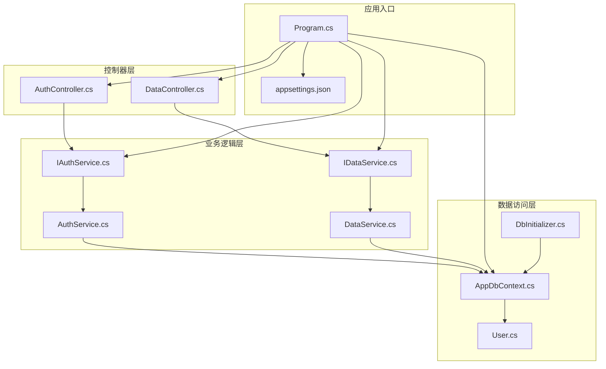
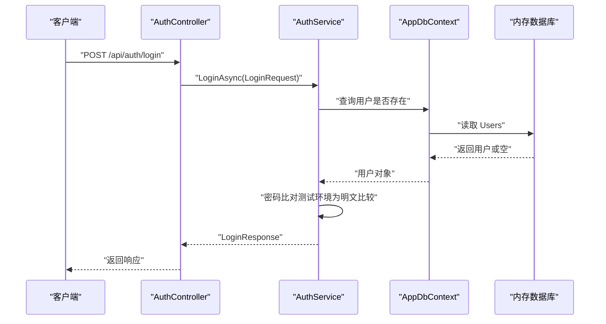
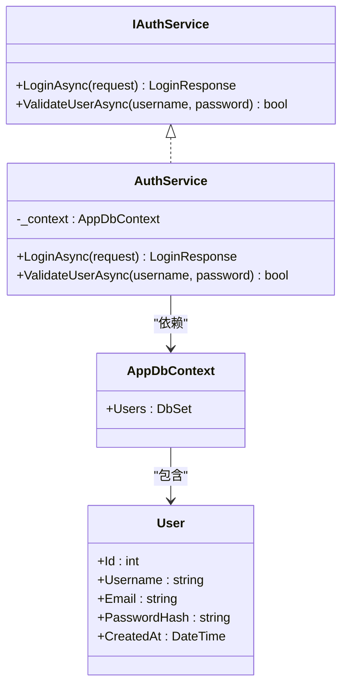
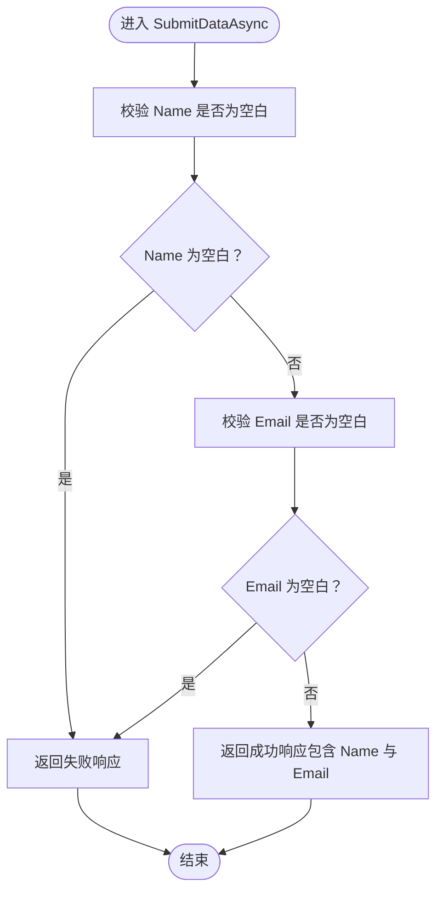
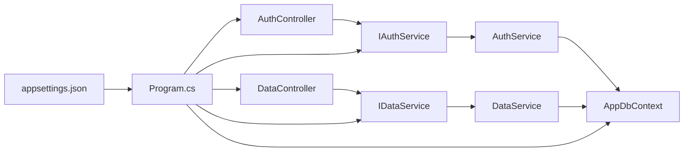

# 业务逻辑层设计

<cite>
**本文引用的文件列表**
- [Program.cs](file://vue-csharp-ui-auto/Backend/Program.cs)
- [AuthController.cs](file://vue-csharp-ui-auto/Backend/Controllers/AuthController.cs)
- [DataController.cs](file://vue-csharp-ui-auto/Backend/Controllers/DataController.cs)
- [IAuthService.cs](file://vue-csharp-ui-auto/Backend/Services/IAuthService.cs)
- [AuthService.cs](file://vue-csharp-ui-auto/Backend/Services/AuthService.cs)
- [IDataService.cs](file://vue-csharp-ui-auto/Backend/Services/IDataService.cs)
- [DataService.cs](file://vue-csharp-ui-auto/Backend/Services/DataService.cs)
- [AppDbContext.cs](file://vue-csharp-ui-auto/Backend/Models/AppDbContext.cs)
- [User.cs](file://vue-csharp-ui-auto/Backend/Models/User.cs)
- [LoginRequest.cs](file://vue-csharp-ui-auto/Backend/Models/LoginRequest.cs)
- [DbInitializer.cs](file://vue-csharp-ui-auto/Backend/Models/DbInitializer.cs)
- [appsettings.json](file://vue-csharp-ui-auto/Backend/appsettings.json)
</cite>

## 目录
1. [引言](#引言)
2. [项目结构](#项目结构)
3. [核心组件](#核心组件)
4. [架构总览](#架构总览)
5. [详细组件分析](#详细组件分析)
6. [依赖关系分析](#依赖关系分析)
7. [性能考量](#性能考量)
8. [故障排查指南](#故障排查指南)
9. [结论](#结论)
10. [附录](#附录)

## 引言
本文件聚焦于智能体项目的后端业务逻辑层设计与实现，围绕以下目标展开：
- 深入解析 AuthService 如何通过依赖注入获取 AppDbContext 实例，并在 LoginAsync 方法中实现用户认证流程（先查用户名存在性，再进行密码比对）。
- 阐述 ValidateUserAsync 的异步验证机制及其在扩展 JWT 认证时的潜在用途。
- 解释 DataService 处理表单提交的业务规则与数据校验流程。
- 明确 IAuthService 与 IDataService 接口契约的作用，以及 AddScoped 服务注册如何保证请求级实例生命周期。
- 提供服务层单元测试的编写建议。

## 项目结构
后端采用经典的分层架构：控制器层负责接收请求并返回响应；业务逻辑层封装领域规则；数据访问层由 Entity Framework Core 提供支持。关键文件分布如下：
- 控制器：AuthController、DataController
- 业务服务：AuthService、DataService 及其接口 IAuthService、IDataService
- 数据模型与上下文：User、AppDbContext、DbInitializer
- 应用入口与服务注册：Program.cs
- 配置：appsettings.json

图表来源
- [Program.cs](file://vue-csharp-ui-auto/Backend/Program.cs#L1-L55)
- [AuthController.cs](file://vue-csharp-ui-auto/Backend/Controllers/AuthController.cs#L1-L25)
- [DataController.cs](file://vue-csharp-ui-auto/Backend/Controllers/DataController.cs#L1-L25)
- [IAuthService.cs](file://vue-csharp-ui-auto/Backend/Services/IAuthService.cs#L1-L10)
- [AuthService.cs](file://vue-csharp-ui-auto/Backend/Services/AuthService.cs#L1-L64)
- [IDataService.cs](file://vue-csharp-ui-auto/Backend/Services/IDataService.cs#L1-L9)
- [DataService.cs](file://vue-csharp-ui-auto/Backend/Services/DataService.cs#L1-L30)
- [AppDbContext.cs](file://vue-csharp-ui-auto/Backend/Models/AppDbContext.cs#L1-L24)
- [User.cs](file://vue-csharp-ui-auto/Backend/Models/User.cs#L1-L11)
- [DbInitializer.cs](file://vue-csharp-ui-auto/Backend/Models/DbInitializer.cs#L1-L40)
- [appsettings.json](file://vue-csharp-ui-auto/Backend/appsettings.json#L1-L18)

章节来源
- [Program.cs](file://vue-csharp-ui-auto/Backend/Program.cs#L1-L55)
- [AuthController.cs](file://vue-csharp-ui-auto/Backend/Controllers/AuthController.cs#L1-L25)
- [DataController.cs](file://vue-csharp-ui-auto/Backend/Controllers/DataController.cs#L1-L25)
- [IAuthService.cs](file://vue-csharp-ui-auto/Backend/Services/IAuthService.cs#L1-L10)
- [AuthService.cs](file://vue-csharp-ui-auto/Backend/Services/AuthService.cs#L1-L64)
- [IDataService.cs](file://vue-csharp-ui-auto/Backend/Services/IDataService.cs#L1-L9)
- [DataService.cs](file://vue-csharp-ui-auto/Backend/Services/DataService.cs#L1-L30)
- [AppDbContext.cs](file://vue-csharp-ui-auto/Backend/Models/AppDbContext.cs#L1-L24)
- [User.cs](file://vue-csharp-ui-auto/Backend/Models/User.cs#L1-L11)
- [DbInitializer.cs](file://vue-csharp-ui-auto/Backend/Models/DbInitializer.cs#L1-L40)
- [appsettings.json](file://vue-csharp-ui-auto/Backend/appsettings.json#L1-L18)

## 核心组件
- IAuthService 与 AuthService：定义并实现用户认证契约，包含 LoginAsync 与 ValidateUserAsync 两个关键方法，均基于 AppDbContext 进行异步查询与验证。
- IDataService 与 DataService：定义并实现表单提交的业务处理，包含 SubmitDataAsync，执行输入校验并返回统一响应。
- AppDbContext：EF Core 上下文，暴露 Users 集合并定义实体约束。
- 控制器：AuthController 与 DataController 通过构造函数注入对应服务接口，面向接口编程，便于替换与测试。
- 程序入口：Program.cs 完成服务注册（AddScoped）、数据库配置（In-Memory）、CORS、Swagger 等基础设施设置。

章节来源
- [IAuthService.cs](file://vue-csharp-ui-auto/Backend/Services/IAuthService.cs#L1-L10)
- [AuthService.cs](file://vue-csharp-ui-auto/Backend/Services/AuthService.cs#L1-L64)
- [IDataService.cs](file://vue-csharp-ui-auto/Backend/Services/IDataService.cs#L1-L9)
- [DataService.cs](file://vue-csharp-ui-auto/Backend/Services/DataService.cs#L1-L30)
- [AppDbContext.cs](file://vue-csharp-ui-auto/Backend/Models/AppDbContext.cs#L1-L24)
- [AuthController.cs](file://vue-csharp-ui-auto/Backend/Controllers/AuthController.cs#L1-L25)
- [DataController.cs](file://vue-csharp-ui-auto/Backend/Controllers/DataController.cs#L1-L25)
- [Program.cs](file://vue-csharp-ui-auto/Backend/Program.cs#L1-L55)

## 架构总览
业务逻辑层通过依赖注入解耦控制器与具体实现，控制器仅依赖接口，服务层依赖 EF Core 上下文完成数据访问。程序入口集中配置服务生命周期与基础设施。

图表来源
- [AuthController.cs](file://vue-csharp-ui-auto/Backend/Controllers/AuthController.cs#L1-L25)
- [AuthService.cs](file://vue-csharp-ui-auto/Backend/Services/AuthService.cs#L1-L64)
- [AppDbContext.cs](file://vue-csharp-ui-auto/Backend/Models/AppDbContext.cs#L1-L24)
- [Program.cs](file://vue-csharp-ui-auto/Backend/Program.cs#L1-L55)

## 详细组件分析

### 认证服务：AuthService
AuthService 实现 IAuthService，承担用户登录与通用用户验证职责：
- 依赖注入：通过构造函数注入 AppDbContext，使用私有字段持有上下文实例，用于后续异步查询。
- LoginAsync 流程：
  - 查询用户名是否存在：基于 EF Core 异步查询 Users 集合，FirstOrDefaultAsync 返回用户或空。
  - 用户不存在：返回失败响应，消息提示“用户名不存在”。
  - 用户存在：在测试环境下直接进行明文密码比较；匹配则返回成功响应并携带用户信息，否则返回失败响应。
- ValidateUserAsync 流程：
  - 异步查询用户是否存在。
  - 用户不存在返回 false。
  - 用户存在时进行明文密码比较，返回布尔结果。
- 设计要点：
  - 面向接口编程，便于替换实现与单元测试。
  - 使用异步模式避免阻塞线程，提升并发能力。
  - 在测试环境中采用明文比较，实际项目应改为哈希比对。

图表来源
- [IAuthService.cs](file://vue-csharp-ui-auto/Backend/Services/IAuthService.cs#L1-L10)
- [AuthService.cs](file://vue-csharp-ui-auto/Backend/Services/AuthService.cs#L1-L64)
- [AppDbContext.cs](file://vue-csharp-ui-auto/Backend/Models/AppDbContext.cs#L1-L24)
- [User.cs](file://vue-csharp-ui-auto/Backend/Models/User.cs#L1-L11)

章节来源
- [AuthService.cs](file://vue-csharp-ui-auto/Backend/Services/AuthService.cs#L1-L64)
- [IAuthService.cs](file://vue-csharp-ui-auto/Backend/Services/IAuthService.cs#L1-L10)
- [AppDbContext.cs](file://vue-csharp-ui-auto/Backend/Models/AppDbContext.cs#L1-L24)
- [User.cs](file://vue-csharp-ui-auto/Backend/Models/User.cs#L1-L11)

### 表单提交服务：DataService
DataService 实现 IDataService，负责处理前端提交的数据：
- SubmitDataAsync：
  - 输入校验：检查名称与邮箱是否为空白，若为空则返回失败响应。
  - 成功处理：返回成功响应，消息包含提交的名称与邮箱信息。
- 设计要点：
  - 保持简单清晰的业务规则，便于扩展与维护。
  - 统一响应结构，便于前端处理。

图表来源
- [DataService.cs](file://vue-csharp-ui-auto/Backend/Services/DataService.cs#L1-L30)
- [LoginRequest.cs](file://vue-csharp-ui-auto/Backend/Models/LoginRequest.cs#L1-L28)

章节来源
- [DataService.cs](file://vue-csharp-ui-auto/Backend/Services/DataService.cs#L1-L30)
- [LoginRequest.cs](file://vue-csharp-ui-auto/Backend/Models/LoginRequest.cs#L1-L28)

### 控制器层：AuthController 与 DataController
- AuthController：
  - 通过构造函数注入 IAuthService。
  - 提供 /api/auth/login 接口，接收 LoginRequest，调用服务并返回 LoginResponse。
- DataController：
  - 通过构造函数注入 IDataService。
  - 提供 /api/data/submit 接口，接收 SubmitDataRequest，调用服务并返回 SubmitDataResponse。
- 设计要点：
  - 控制器仅负责编排与响应，不包含业务逻辑，符合关注点分离原则。
  - 基于接口编程，便于替换实现与测试。

章节来源
- [AuthController.cs](file://vue-csharp-ui-auto/Backend/Controllers/AuthController.cs#L1-L25)
- [DataController.cs](file://vue-csharp-ui-auto/Backend/Controllers/DataController.cs#L1-L25)

### 数据访问层：AppDbContext 与 User
- AppDbContext：
  - 继承 DbContext，暴露 Users 集合。
  - 在 OnModelCreating 中定义 User 实体的主键、必填属性与长度限制。
- User：
  - 包含 Id、Username、Email、PasswordHash、CreatedAt 等属性。
- DbInitializer：
  - 初始化内存数据库，创建用户种子数据，确保首次运行可用。

章节来源
- [AppDbContext.cs](file://vue-csharp-ui-auto/Backend/Models/AppDbContext.cs#L1-L24)
- [User.cs](file://vue-csharp-ui-auto/Backend/Models/User.cs#L1-L11)
- [DbInitializer.cs](file://vue-csharp-ui-auto/Backend/Models/DbInitializer.cs#L1-L40)

### 服务注册与生命周期：AddScoped
- Program.cs 中通过 AddScoped 将 IAuthService 注册为 AuthService，IDataService 注册为 DataService。
- AddScoped 的含义：
  - 在每个 HTTP 请求范围内创建一个服务实例，同一请求内共享该实例。
  - 适合需要跨多个服务调用但又需隔离请求状态的场景。
- 与 EF Core 上下文的关系：
  - AppDbContext 默认以 Scoped 生命周期注册，与业务服务一致，避免跨请求共享状态。
- 配置要点：
  - 添加 In-Memory 数据库用于测试。
  - 启用 CORS 允许前端访问。
  - 配置 Swagger 开发调试。

章节来源
- [Program.cs](file://vue-csharp-ui-auto/Backend/Program.cs#L1-L55)
- [AppDbContext.cs](file://vue-csharp-ui-auto/Backend/Models/AppDbContext.cs#L1-L24)

## 依赖关系分析
- 控制器依赖接口（IAuthService、IDataService），实现与接口解耦。
- 业务服务依赖 AppDbContext，通过 EF Core 异步查询 Users。
- 程序入口集中管理服务注册、数据库与基础设施配置。
- 配置文件 appsettings.json 提供 JWT 相关参数（用于后续扩展 JWT 认证）。

图表来源
- [AuthController.cs](file://vue-csharp-ui-auto/Backend/Controllers/AuthController.cs#L1-L25)
- [DataController.cs](file://vue-csharp-ui-auto/Backend/Controllers/DataController.cs#L1-L25)
- [IAuthService.cs](file://vue-csharp-ui-auto/Backend/Services/IAuthService.cs#L1-L10)
- [AuthService.cs](file://vue-csharp-ui-auto/Backend/Services/AuthService.cs#L1-L64)
- [IDataService.cs](file://vue-csharp-ui-auto/Backend/Services/IDataService.cs#L1-L9)
- [DataService.cs](file://vue-csharp-ui-auto/Backend/Services/DataService.cs#L1-L30)
- [AppDbContext.cs](file://vue-csharp-ui-auto/Backend/Models/AppDbContext.cs#L1-L24)
- [Program.cs](file://vue-csharp-ui-auto/Backend/Program.cs#L1-L55)
- [appsettings.json](file://vue-csharp-ui-auto/Backend/appsettings.json#L1-L18)

章节来源
- [Program.cs](file://vue-csharp-ui-auto/Backend/Program.cs#L1-L55)
- [AuthController.cs](file://vue-csharp-ui-auto/Backend/Controllers/AuthController.cs#L1-L25)
- [DataController.cs](file://vue-csharp-ui-auto/Backend/Controllers/DataController.cs#L1-L25)
- [AuthService.cs](file://vue-csharp-ui-auto/Backend/Services/AuthService.cs#L1-L64)
- [DataService.cs](file://vue-csharp-ui-auto/Backend/Services/DataService.cs#L1-L30)
- [AppDbContext.cs](file://vue-csharp-ui-auto/Backend/Models/AppDbContext.cs#L1-L24)
- [appsettings.json](file://vue-csharp-ui-auto/Backend/appsettings.json#L1-L18)

## 性能考量
- 异步查询：AuthService 使用异步方法避免阻塞，提高吞吐量。
- EF Core 查询：FirstOrDefaultAsync 仅返回单条记录，减少不必要的数据传输。
- 内存数据库：开发与测试阶段使用 In-Memory Database，降低 IO 开销。
- 生命周期：AddScoped 保证请求级实例，避免跨请求共享状态带来的竞争问题。
- 建议优化：
  - 生产环境替换为真实数据库（如 SQL Server），并启用连接池与索引。
  - 对用户密码采用安全哈希算法存储与比对。
  - 对高频查询添加索引（如 Username）。
  - 对长耗时操作引入超时控制与重试策略。

## 故障排查指南
- 登录失败：
  - 检查用户名是否存在：确认数据库中是否存在该用户。
  - 密码比对：当前测试环境为明文比较，生产应改为哈希比对。
- 表单提交失败：
  - 校验输入：确认 Name 与 Email 均非空白。
- 数据库初始化：
  - 确认 DbInitializer 已执行，内存数据库中存在种子数据。
- CORS 与 Swagger：
  - 确认已启用 CORS 并允许前端访问。
  - 开发环境可访问 Swagger UI 进行接口调试。

章节来源
- [AuthService.cs](file://vue-csharp-ui-auto/Backend/Services/AuthService.cs#L1-L64)
- [DataService.cs](file://vue-csharp-ui-auto/Backend/Services/DataService.cs#L1-L30)
- [DbInitializer.cs](file://vue-csharp-ui-auto/Backend/Models/DbInitializer.cs#L1-L40)
- [Program.cs](file://vue-csharp-ui-auto/Backend/Program.cs#L1-L55)

## 结论
本项目在业务逻辑层实现了清晰的接口与实现分离，通过依赖注入与 AddScoped 生命周期管理，使控制器与服务解耦，易于测试与扩展。AuthService 的登录流程与 ValidateUserAsync 的异步验证机制为后续集成 JWT 认证提供了良好基础；DataService 的输入校验与统一响应结构便于前端交互。建议在生产环境中完善安全与性能细节，以满足更严格的业务需求。

## 附录

### 服务层单元测试编写建议
- AuthService 测试要点：
  - 依赖注入：使用内存数据库或模拟上下文，注入到 AuthService。
  - 登录成功：准备已存在的用户名与正确密码，断言返回成功且包含用户信息。
  - 登录失败（用户名不存在）：断言返回失败且消息提示用户名不存在。
  - 登录失败（密码错误）：断言返回失败且消息提示密码错误。
  - ValidateUserAsync：断言存在用户时返回 true，不存在用户时返回 false。
- DataService 测试要点：
  - SubmitDataAsync：断言空 Name 或空 Email 返回失败；断言有效输入返回成功并包含预期消息。
- 测试框架与工具：
  - 单元测试框架：xUnit 或 NUnit。
  - 模拟框架：Moq 或 NSubstitute。
  - 数据库：使用 In-Memory Database 或 SQLite 进行集成测试。
- 最佳实践：
  - 针对每种分支路径编写独立用例。
  - 使用参数化测试覆盖边界条件。
  - 保持测试用例独立，避免相互依赖。
  - 对异步方法使用 Assert.True(await Task) 或等效断言。