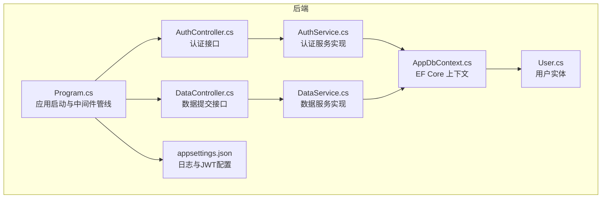
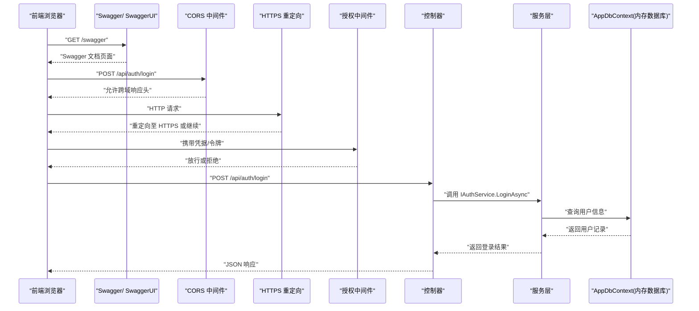
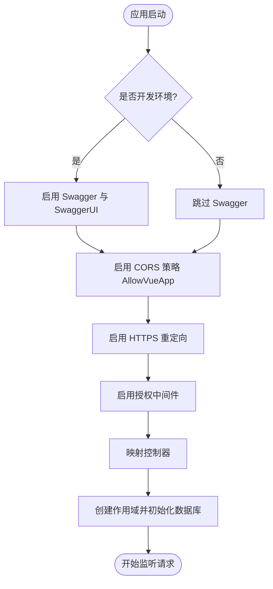
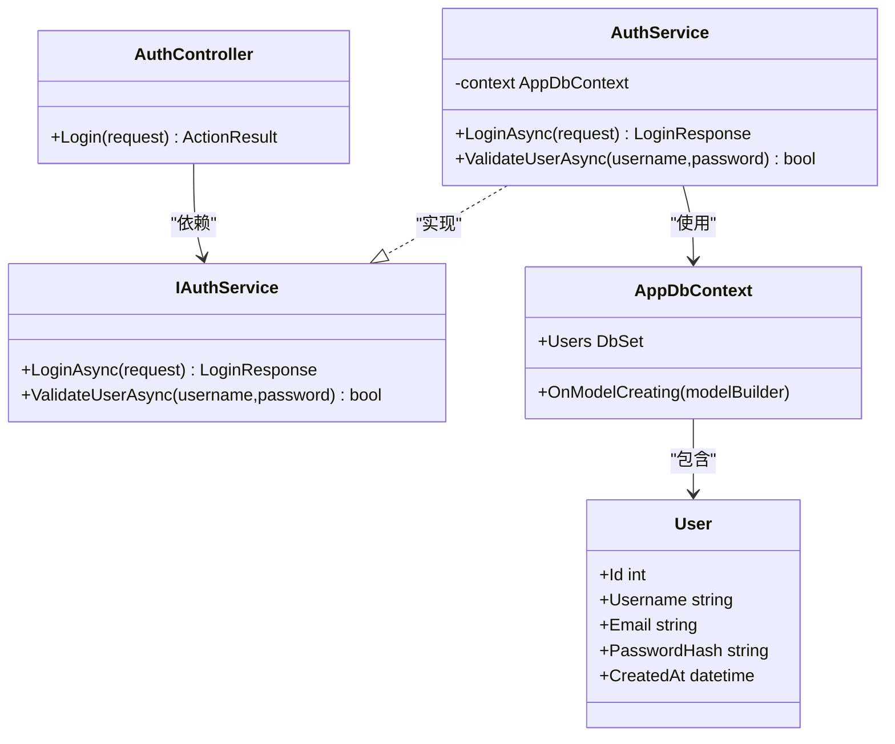
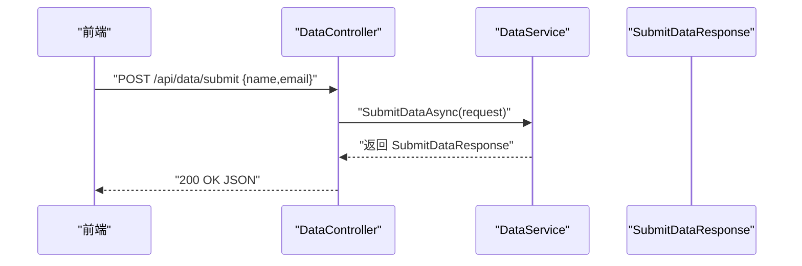
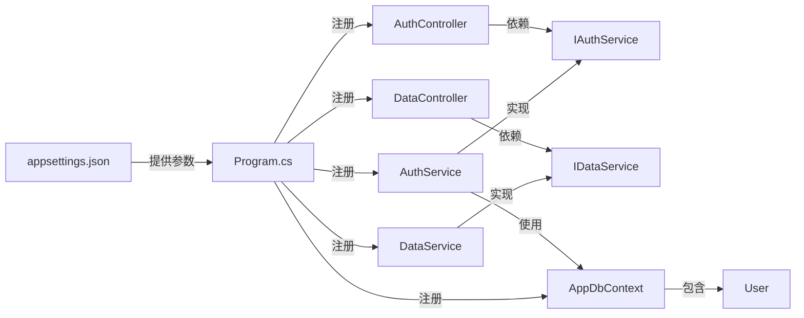

# 中间件与服务配置

<cite>
**本文引用的文件**
- [Program.cs](file://vue-csharp-ui-auto/Backend/Program.cs)
- [appsettings.json](file://vue-csharp-ui-auto/Backend/appsettings.json)
- [AppDbContext.cs](file://vue-csharp-ui-auto/Backend/Models/AppDbContext.cs)
- [AuthController.cs](file://vue-csharp-ui-auto/Backend/Controllers/AuthController.cs)
- [AuthService.cs](file://vue-csharp-ui-auto/Backend/Services/AuthService.cs)
- [IAuthService.cs](file://vue-csharp-ui-auto/Backend/Services/IAuthService.cs)
- [DataController.cs](file://vue-csharp-ui-auto/Backend/Controllers/DataController.cs)
- [DataService.cs](file://vue-csharp-ui-auto/Backend/Services/DataService.cs)
- [IDataService.cs](file://vue-csharp-ui-auto/Backend/Services/IDataService.cs)
- [User.cs](file://vue-csharp-ui-auto/Backend/Models/User.cs)
- [LoginRequest.cs](file://vue-csharp-ui-auto/Backend/Models/LoginRequest.cs)
</cite>

## 目录
1. [简介](#简介)
2. [项目结构](#项目结构)
3. [核心组件](#核心组件)
4. [架构总览](#架构总览)
5. [详细组件分析](#详细组件分析)
6. [依赖关系分析](#依赖关系分析)
7. [性能考量](#性能考量)
8. [故障排查指南](#故障排查指南)
9. [结论](#结论)

## 简介
本文件系统化梳理智能体项目后端的启动配置与中间件流水线，重点围绕以下主题展开：
- 在 Program.cs 中通过 WebApplicationBuilder 的服务注册阶段完成 MVC、Swagger、CORS、Entity Framework In-Memory Database、以及自定义服务的注入。
- 运行时管道中中间件的执行顺序与职责，包括 Swagger、CORS、HTTPS 重定向、授权与控制器映射。
- 结合 appsettings.json 的日志级别与 JWT 设置，说明其在安全认证与调试中的潜在应用路径。

## 项目结构
后端采用 ASP.NET Core Minimal API 风格的 Program.cs 启动入口，按层组织代码：
- 控制器层：处理 API 请求，如认证与数据提交。
- 服务层：封装业务逻辑，如认证服务与数据服务。
- 模型层：包含 EF Core 上下文与实体模型。
- 配置文件：appsettings.json 提供日志与 JWT 配置。

图表来源
- [Program.cs](file://vue-csharp-ui-auto/Backend/Program.cs#L1-L55)
- [AuthController.cs](file://vue-csharp-ui-auto/Backend/Controllers/AuthController.cs#L1-L25)
- [DataController.cs](file://vue-csharp-ui-auto/Backend/Controllers/DataController.cs#L1-L25)
- [AuthService.cs](file://vue-csharp-ui-auto/Backend/Services/AuthService.cs#L1-L64)
- [DataService.cs](file://vue-csharp-ui-auto/Backend/Services/DataService.cs#L1-L30)
- [AppDbContext.cs](file://vue-csharp-ui-auto/Backend/Models/AppDbContext.cs#L1-L24)
- [User.cs](file://vue-csharp-ui-auto/Backend/Models/User.cs#L1-L11)
- [appsettings.json](file://vue-csharp-ui-auto/Backend/appsettings.json#L1-L18)

章节来源
- [Program.cs](file://vue-csharp-ui-auto/Backend/Program.cs#L1-L55)
- [appsettings.json](file://vue-csharp-ui-auto/Backend/appsettings.json#L1-L18)

## 核心组件
- 服务注册阶段（Program.cs）
  - 添加 MVC 控制器支持，启用基于属性的路由与模型绑定。
  - 注册 OpenAPI/Swagger 文档生成能力，便于前后端联调与接口测试。
  - 配置 CORS 策略 AllowVueApp，允许本地开发环境的前端源访问 API，开放任意头与方法。
  - 注册内存数据库上下文 AppDbContext，并使用内存数据库进行测试。
  - 注入自定义服务 IAuthService、IDataService 及其实现类。
- 运行时中间件管线（Program.cs）
  - 开发环境下启用 Swagger 与 SwaggerUI。
  - 启用 CORS 放行策略 AllowVueApp。
  - 启用 HTTPS 重定向、授权中间件与控制器映射。
  - 应用启动后立即初始化数据库上下文。
- 配置文件（appsettings.json）
  - 日志级别：默认为 Information，Microsoft.AspNetCore 为 Warning。
  - JWT 设置：包含密钥、签发者、受众与过期时间（分钟），用于后续安全认证扩展。

章节来源
- [Program.cs](file://vue-csharp-ui-auto/Backend/Program.cs#L1-L55)
- [appsettings.json](file://vue-csharp-ui-auto/Backend/appsettings.json#L1-L18)

## 架构总览
下图展示从请求进入应用到返回响应的关键流程，以及各中间件在管线中的位置与职责。

图表来源
- [Program.cs](file://vue-csharp-ui-auto/Backend/Program.cs#L35-L46)
- [AuthController.cs](file://vue-csharp-ui-auto/Backend/Controllers/AuthController.cs#L1-L25)
- [AuthService.cs](file://vue-csharp-ui-auto/Backend/Services/AuthService.cs#L1-L64)
- [AppDbContext.cs](file://vue-csharp-ui-auto/Backend/Models/AppDbContext.cs#L1-L24)

## 详细组件分析

### 服务注册阶段（Program.cs）
- MVC 与 Swagger
  - 添加控制器以启用基于特性的路由与模型绑定；添加端点探索与 Swagger 生成，便于接口文档化与调试。
- CORS 策略 AllowVueApp
  - 允许本地开发的多种前端源（含 http/https 与不同主机名），开放任意头与方法，满足 Vue 前端联调需求。
- EF Core 内存数据库
  - 注册 AppDbContext 并使用内存数据库，适合单元测试与快速原型验证。
- 自定义服务注入
  - 注入 IAuthService 与 IDataService 接口及其具体实现，确保控制器通过接口编程，提升可测试性与可替换性。

章节来源
- [Program.cs](file://vue-csharp-ui-auto/Backend/Program.cs#L8-L31)
- [AppDbContext.cs](file://vue-csharp-ui-auto/Backend/Models/AppDbContext.cs#L1-L24)
- [IAuthService.cs](file://vue-csharp-ui-auto/Backend/Services/IAuthService.cs#L1-L10)
- [IDataService.cs](file://vue-csharp-ui-auto/Backend/Services/IDataService.cs#L1-L9)

### 运行时中间件流水线（Program.cs）
- 开发环境下的 Swagger
  - 当环境为开发时，启用 Swagger 与 SwaggerUI，便于查看与测试 API。
- CORS
  - 使用 AllowVueApp 策略，使前端在本地开发时可以跨域访问后端 API。
- 安全与路由
  - 启用 HTTPS 重定向，确保生产环境流量走加密通道。
  - 启用授权中间件，为后续 JWT 认证与授权提供基础。
  - 映射控制器，使基于特性路由的 API 能被正确识别与分发。
- 数据库初始化
  - 应用启动后创建作用域，解析 AppDbContext 并执行初始化逻辑，保证数据库结构与种子数据可用。

图表来源
- [Program.cs](file://vue-csharp-ui-auto/Backend/Program.cs#L35-L55)

章节来源
- [Program.cs](file://vue-csharp-ui-auto/Backend/Program.cs#L35-L55)

### 配置文件与安全认证路径（appsettings.json）
- 日志级别
  - 默认日志级别为 Information，Microsoft.AspNetCore 为 Warning，有助于在开发阶段获得更详细的日志输出，同时避免框架日志污染。
- JWT 设置
  - 包含 Key、Issuer、Audience 与 ExpiryInMinutes 字段，为后续引入 JWT 认证与授权提供参数来源。这些值可用于：
    - 生成与验证签名令牌；
    - 校验签发者与受众一致性；
    - 控制令牌有效期，配合授权中间件实现受保护资源访问。

章节来源
- [appsettings.json](file://vue-csharp-ui-auto/Backend/appsettings.json#L1-L18)

### 控制器与服务交互（认证流程）
- AuthController
  - 通过构造函数注入 IAuthService，提供 /api/auth/login 接口，接收 LoginRequest 并返回 LoginResponse。
- AuthService
  - 通过 AppDbContext 查询用户，进行简单校验（示例中为明文对比，实际项目需改为哈希比对）。
  - 返回登录结果，包含成功标志、消息与用户信息（示例未包含 Token 字段，后续可扩展）。
- AppDbContext 与 User
  - AppDbContext 继承 DbContext，定义 Users 集合并在 OnModelCreating 中约束字段长度与必填项。

图表来源
- [AuthController.cs](file://vue-csharp-ui-auto/Backend/Controllers/AuthController.cs#L1-L25)
- [IAuthService.cs](file://vue-csharp-ui-auto/Backend/Services/IAuthService.cs#L1-L10)
- [AuthService.cs](file://vue-csharp-ui-auto/Backend/Services/AuthService.cs#L1-L64)
- [AppDbContext.cs](file://vue-csharp-ui-auto/Backend/Models/AppDbContext.cs#L1-L24)
- [User.cs](file://vue-csharp-ui-auto/Backend/Models/User.cs#L1-L11)

章节来源
- [AuthController.cs](file://vue-csharp-ui-auto/Backend/Controllers/AuthController.cs#L1-L25)
- [AuthService.cs](file://vue-csharp-ui-auto/Backend/Services/AuthService.cs#L1-L64)
- [AppDbContext.cs](file://vue-csharp-ui-auto/Backend/Models/AppDbContext.cs#L1-L24)
- [User.cs](file://vue-csharp-ui-auto/Backend/Models/User.cs#L1-L11)

### 控制器与服务交互（数据提交流程）
- DataController
  - 通过构造函数注入 IDataService，提供 /api/data/submit 接口，接收 SubmitDataRequest 并返回 SubmitDataResponse。
- DataService
  - 执行输入校验与模拟处理，返回统一格式的响应对象。
- 依赖关系
  - 控制器依赖接口编程，服务层不直接依赖 EF Core，便于替换实现与测试。

图表来源
- [DataController.cs](file://vue-csharp-ui-auto/Backend/Controllers/DataController.cs#L1-L25)
- [DataService.cs](file://vue-csharp-ui-auto/Backend/Services/DataService.cs#L1-L30)
- [IDataService.cs](file://vue-csharp-ui-auto/Backend/Services/IDataService.cs#L1-L9)

章节来源
- [DataController.cs](file://vue-csharp-ui-auto/Backend/Controllers/DataController.cs#L1-L25)
- [DataService.cs](file://vue-csharp-ui-auto/Backend/Services/DataService.cs#L1-L30)
- [IDataService.cs](file://vue-csharp-ui-auto/Backend/Services/IDataService.cs#L1-L9)

## 依赖关系分析
- 控制器到服务
  - AuthController 依赖 IAuthService；DataController 依赖 IDataService。
- 服务到数据访问
  - AuthService 依赖 AppDbContext；DataService 为纯业务逻辑，不直接依赖数据访问层。
- 数据访问层
  - AppDbContext 定义 Users 集合并约束实体属性。
- 配置与中间件
  - Program.cs 注入服务与中间件；appsettings.json 提供日志与 JWT 参数。

图表来源
- [Program.cs](file://vue-csharp-ui-auto/Backend/Program.cs#L8-L31)
- [AuthController.cs](file://vue-csharp-ui-auto/Backend/Controllers/AuthController.cs#L1-L25)
- [DataController.cs](file://vue-csharp-ui-auto/Backend/Controllers/DataController.cs#L1-L25)
- [AuthService.cs](file://vue-csharp-ui-auto/Backend/Services/AuthService.cs#L1-L64)
- [DataService.cs](file://vue-csharp-ui-auto/Backend/Services/DataService.cs#L1-L30)
- [AppDbContext.cs](file://vue-csharp-ui-auto/Backend/Models/AppDbContext.cs#L1-L24)
- [User.cs](file://vue-csharp-ui-auto/Backend/Models/User.cs#L1-L11)
- [appsettings.json](file://vue-csharp-ui-auto/Backend/appsettings.json#L1-L18)

章节来源
- [Program.cs](file://vue-csharp-ui-auto/Backend/Program.cs#L8-L31)
- [AuthController.cs](file://vue-csharp-ui-auto/Backend/Controllers/AuthController.cs#L1-L25)
- [DataController.cs](file://vue-csharp-ui-auto/Backend/Controllers/DataController.cs#L1-L25)
- [AuthService.cs](file://vue-csharp-ui-auto/Backend/Services/AuthService.cs#L1-L64)
- [DataService.cs](file://vue-csharp-ui-auto/Backend/Services/DataService.cs#L1-L30)
- [AppDbContext.cs](file://vue-csharp-ui-auto/Backend/Models/AppDbContext.cs#L1-L24)
- [User.cs](file://vue-csharp-ui-auto/Backend/Models/User.cs#L1-L11)
- [appsettings.json](file://vue-csharp-ui-auto/Backend/appsettings.json#L1-L18)

## 性能考量
- 中间件顺序
  - CORS 应尽量靠前，避免不必要的后续处理；HTTPS 重定向应在授权之前，确保所有请求均走加密通道。
- Swagger
  - 仅在开发环境启用，避免在生产环境暴露 API 文档。
- EF Core 内存数据库
  - 适合测试与开发，生产环境建议切换到持久化数据库并优化索引与查询。
- 日志级别
  - 适度的日志级别有助于问题定位，但过多日志会带来 IO 压力，建议在生产环境根据需要调整。

## 故障排查指南
- 跨域问题
  - 若前端无法访问后端 API，检查 CORS 策略是否包含当前前端源地址与协议（http/https），以及是否启用了 AllowAnyHeader 与 AllowAnyMethod。
- 授权失败
  - 若出现 401/403，确认授权中间件已启用且后续将引入的 JWT 中间件配置正确。
- 数据库未初始化
  - 确认应用启动后执行了数据库初始化逻辑，确保 Users 表存在并可查询。
- 日志输出异常
  - 检查 appsettings.json 中的日志级别配置，必要时临时提高日志级别以便定位问题。

章节来源
- [Program.cs](file://vue-csharp-ui-auto/Backend/Program.cs#L35-L55)
- [appsettings.json](file://vue-csharp-ui-auto/Backend/appsettings.json#L1-L18)

## 结论
本项目通过 Program.cs 将服务注册与中间件管线清晰地组织起来：MVC、Swagger、CORS、EF Core 内存数据库与自定义服务在启动阶段完成装配；运行时中间件按照合理顺序执行，保障开发体验与安全基础。结合 appsettings.json 的日志与 JWT 配置，为后续引入 JWT 认证与授权提供了明确的参数来源与扩展路径。建议在生产环境中：
- 仅在开发环境启用 Swagger；
- 切换到持久化数据库并优化查询；
- 引入 JWT 中间件与授权策略，完善认证与授权链路；
- 根据实际场景调整日志级别与采样策略。