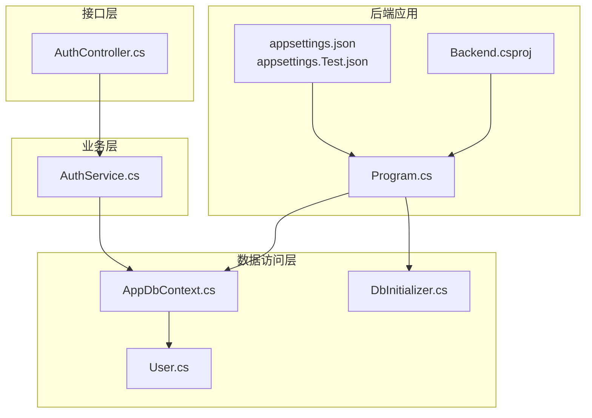
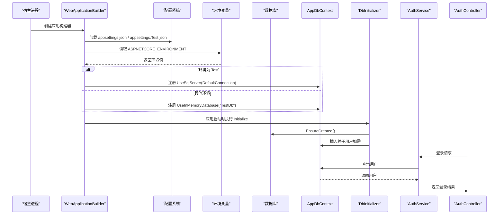
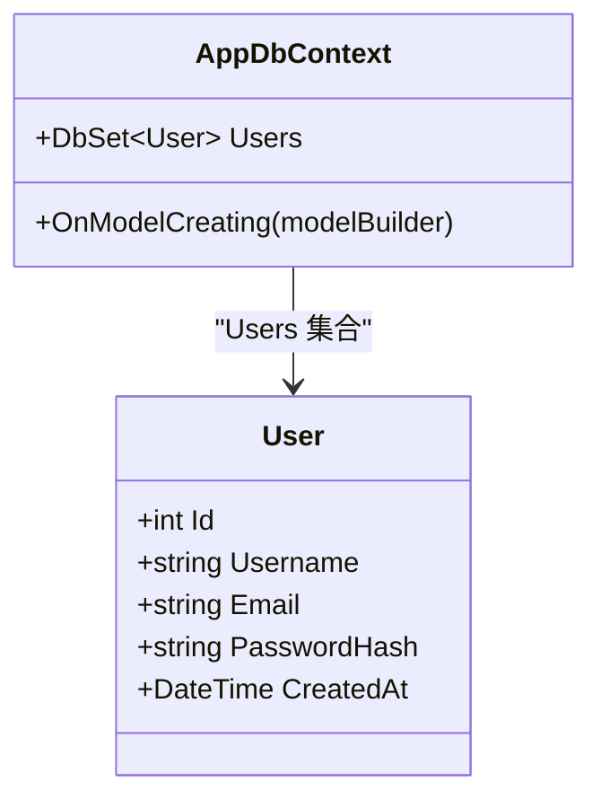
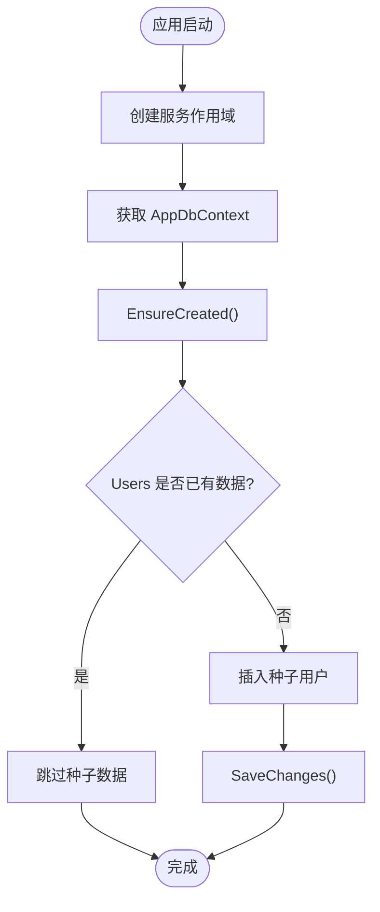
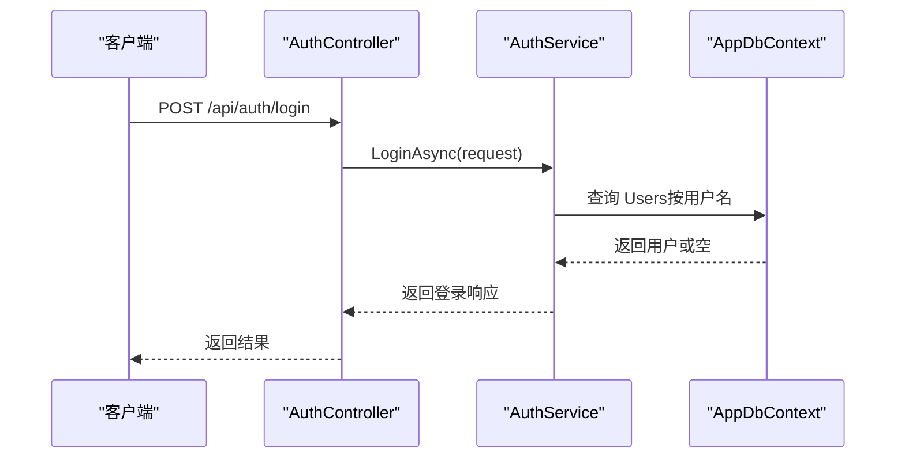
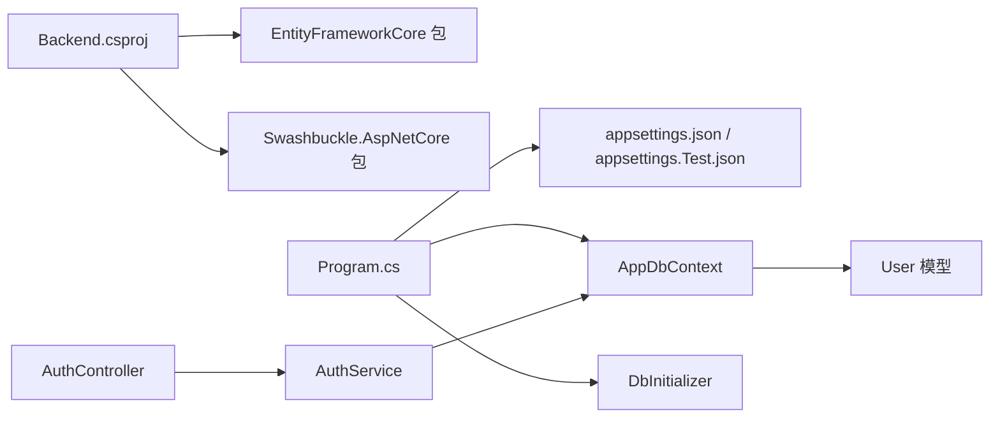

# 后端数据库配置

<cite>
**本文引用的文件**
- [Program.cs](file://vue-csharp-ui-auto/Backend/Program.cs)
- [appsettings.json](file://vue-csharp-ui-auto/Backend/appsettings.json)
- [appsettings.Test.json](file://vue-csharp-ui-auto/Backend/appsettings.Test.json)
- [Backend.csproj](file://vue-csharp-ui-auto/Backend/Backend.csproj)
- [AppDbContext.cs](file://vue-csharp-ui-auto/Backend/Models/AppDbContext.cs)
- [User.cs](file://vue-csharp-ui-auto/Backend/Models/User.cs)
- [DbInitializer.cs](file://vue-csharp-ui-auto/Backend/Models/DbInitializer.cs)
- [AuthService.cs](file://vue-csharp-ui-auto/Backend/Services/AuthService.cs)
- [AuthController.cs](file://vue-csharp-ui-auto/Backend/Controllers/AuthController.cs)
</cite>

## 目录
1. [简介](#简介)
2. [项目结构](#项目结构)
3. [核心组件](#核心组件)
4. [架构总览](#架构总览)
5. [详细组件分析](#详细组件分析)
6. [依赖关系分析](#依赖关系分析)
7. [性能考虑](#性能考虑)
8. [故障排查指南](#故障排查指南)
9. [结论](#结论)

## 简介
本文件聚焦于后端数据库配置与实现，涵盖连接字符串管理、实体框架上下文、开发与测试环境差异、初始化流程以及与认证服务的交互方式。目标是帮助开发者快速理解如何在不同环境中切换数据库（本地内存数据库与 SQL Server），以及如何通过配置文件与代码逻辑正确加载数据库连接。

## 项目结构
后端采用 ASP.NET Core + Entity Framework Core 架构，数据库配置主要分布在以下位置：
- 配置文件：appsettings.json（默认开发）、appsettings.Test.json（测试环境）
- 数据库上下文：AppDbContext
- 实体模型：User
- 初始化器：DbInitializer
- 控制器与服务：AuthController、AuthService（演示数据库读取）

图表来源
- [Program.cs](file://vue-csharp-ui-auto/Backend/Program.cs#L1-L66)
- [appsettings.json](file://vue-csharp-ui-auto/Backend/appsettings.json#L1-L18)
- [appsettings.Test.json](file://vue-csharp-ui-auto/Backend/appsettings.Test.json#L1-L18)
- [Backend.csproj](file://vue-csharp-ui-auto/Backend/Backend.csproj#L1-L18)
- [AppDbContext.cs](file://vue-csharp-ui-auto/Backend/Models/AppDbContext.cs#L1-L24)
- [User.cs](file://vue-csharp-ui-auto/Backend/Models/User.cs#L1-L11)
- [DbInitializer.cs](file://vue-csharp-ui-auto/Backend/Models/DbInitializer.cs#L1-L40)
- [AuthService.cs](file://vue-csharp-ui-auto/Backend/Services/AuthService.cs#L1-L64)
- [AuthController.cs](file://vue-csharp-ui-auto/Backend/Controllers/AuthController.cs#L1-L25)

章节来源
- [Program.cs](file://vue-csharp-ui-auto/Backend/Program.cs#L1-L66)
- [appsettings.json](file://vue-csharp-ui-auto/Backend/appsettings.json#L1-L18)
- [appsettings.Test.json](file://vue-csharp-ui-auto/Backend/appsettings.Test.json#L1-L18)
- [Backend.csproj](file://vue-csharp-ui-auto/Backend/Backend.csproj#L1-L18)

## 核心组件
- 连接字符串与环境选择
  - 默认开发使用本地 SQL Server LocalDB 连接字符串。
  - 测试环境（Test）使用 SQL Server 实例连接字符串。
  - 本地开发默认使用内存数据库以简化启动与调试。
- 数据库上下文与模型
  - AppDbContext 提供 Users 集合，并在 OnModelCreating 中定义主键与字段约束。
  - User 模型包含标识、用户名、邮箱、密码哈希与创建时间等属性。
- 初始化器
  - DbInitializer 在应用启动时确保数据库存在并进行种子数据插入（若表为空）。
- 认证服务与控制器
  - AuthService 通过 AppDbContext 查询用户信息，演示数据库读取。
  - AuthController 将登录请求交由 AuthService 处理。

章节来源
- [Program.cs](file://vue-csharp-ui-auto/Backend/Program.cs#L24-L37)
- [appsettings.json](file://vue-csharp-ui-auto/Backend/appsettings.json#L9-L11)
- [appsettings.Test.json](file://vue-csharp-ui-auto/Backend/appsettings.Test.json#L1-L4)
- [AppDbContext.cs](file://vue-csharp-ui-auto/Backend/Models/AppDbContext.cs#L1-L24)
- [User.cs](file://vue-csharp-ui-auto/Backend/Models/User.cs#L1-L11)
- [DbInitializer.cs](file://vue-csharp-ui-auto/Backend/Models/DbInitializer.cs#L1-L40)
- [AuthService.cs](file://vue-csharp-ui-auto/Backend/Services/AuthService.cs#L1-L64)
- [AuthController.cs](file://vue-csharp-ui-auto/Backend/Controllers/AuthController.cs#L1-L25)

## 架构总览
下图展示从程序入口到数据库的调用链路，包括环境变量驱动的数据库选择、连接字符串加载、上下文初始化与服务调用。

图表来源
- [Program.cs](file://vue-csharp-ui-auto/Backend/Program.cs#L24-L66)
- [appsettings.json](file://vue-csharp-ui-auto/Backend/appsettings.json#L1-L18)
- [appsettings.Test.json](file://vue-csharp-ui-auto/Backend/appsettings.Test.json#L1-L18)
- [DbInitializer.cs](file://vue-csharp-ui-auto/Backend/Models/DbInitializer.cs#L1-L40)
- [AuthService.cs](file://vue-csharp-ui-auto/Backend/Services/AuthService.cs#L1-L64)
- [AuthController.cs](file://vue-csharp-ui-auto/Backend/Controllers/AuthController.cs#L1-L25)

## 详细组件分析

### 连接字符串与环境选择
- 默认开发连接字符串指向本地 SQL Server LocalDB。
- 测试环境连接字符串指向指定 SQL Server 实例（含凭据与信任证书选项）。
- 程序入口根据 ASPNETCORE_ENVIRONMENT 切换数据库提供者：
  - Test 环境使用 SQL Server。
  - 其他环境使用内存数据库（便于本地开发与快速启动）。

章节来源
- [appsettings.json](file://vue-csharp-ui-auto/Backend/appsettings.json#L9-L11)
- [appsettings.Test.json](file://vue-csharp-ui-auto/Backend/appsettings.Test.json#L1-L4)
- [Program.cs](file://vue-csharp-ui-auto/Backend/Program.cs#L24-L37)

### 数据库上下文与模型映射
- AppDbContext 继承 DbContext，构造函数注入 DbContextOptions 并暴露 Users 集合。
- OnModelCreating 中对 User 实体设置主键与字段长度/必填约束。
- User 模型包含标识、用户名、邮箱、密码哈希与创建时间等字段。

图表来源
- [AppDbContext.cs](file://vue-csharp-ui-auto/Backend/Models/AppDbContext.cs#L1-L24)
- [User.cs](file://vue-csharp-ui-auto/Backend/Models/User.cs#L1-L11)

章节来源
- [AppDbContext.cs](file://vue-csharp-ui-auto/Backend/Models/AppDbContext.cs#L1-L24)
- [User.cs](file://vue-csharp-ui-auto/Backend/Models/User.cs#L1-L11)

### 初始化流程与种子数据
- 应用启动时通过作用域获取 AppDbContext，调用 DbInitializer.Initialize。
- EnsureCreated 确保数据库存在；若 Users 表为空则插入预设用户。
- 该流程在开发与测试环境均适用，但数据库类型由环境决定。

图表来源
- [Program.cs](file://vue-csharp-ui-auto/Backend/Program.cs#L60-L64)
- [DbInitializer.cs](file://vue-csharp-ui-auto/Backend/Models/DbInitializer.cs#L1-L40)

章节来源
- [Program.cs](file://vue-csharp-ui-auto/Backend/Program.cs#L60-L64)
- [DbInitializer.cs](file://vue-csharp-ui-auto/Backend/Models/DbInitializer.cs#L1-L40)

### 认证服务与数据库查询
- AuthController 接收登录请求并委派给 AuthService。
- AuthService 通过 AppDbContext 查询用户，返回登录响应。
- 该流程展示了实体查询与依赖注入的基本模式。

图表来源
- [AuthController.cs](file://vue-csharp-ui-auto/Backend/Controllers/AuthController.cs#L1-L25)
- [AuthService.cs](file://vue-csharp-ui-auto/Backend/Services/AuthService.cs#L1-L64)
- [AppDbContext.cs](file://vue-csharp-ui-auto/Backend/Models/AppDbContext.cs#L1-L24)

章节来源
- [AuthController.cs](file://vue-csharp-ui-auto/Backend/Controllers/AuthController.cs#L1-L25)
- [AuthService.cs](file://vue-csharp-ui-auto/Backend/Services/AuthService.cs#L1-L64)
- [AppDbContext.cs](file://vue-csharp-ui-auto/Backend/Models/AppDbContext.cs#L1-L24)

## 依赖关系分析
- 包依赖
  - 使用 Microsoft.EntityFrameworkCore.InMemory 与 Microsoft.EntityFrameworkCore.SqlServer，支持内存数据库与 SQL Server。
  - 使用 Swashbuckle.AspNetCore 提供 API 文档。
- 运行时依赖
  - Program.cs 基于 ASPNETCORE_ENVIRONMENT 决定数据库提供者。
  - appsettings.json 与 appsettings.Test.json 提供连接字符串与日志、JWT 等配置。

图表来源
- [Backend.csproj](file://vue-csharp-ui-auto/Backend/Backend.csproj#L1-L18)
- [Program.cs](file://vue-csharp-ui-auto/Backend/Program.cs#L1-L66)
- [appsettings.json](file://vue-csharp-ui-auto/Backend/appsettings.json#L1-L18)
- [appsettings.Test.json](file://vue-csharp-ui-auto/Backend/appsettings.Test.json#L1-L18)
- [AppDbContext.cs](file://vue-csharp-ui-auto/Backend/Models/AppDbContext.cs#L1-L24)
- [User.cs](file://vue-csharp-ui-auto/Backend/Models/User.cs#L1-L11)
- [DbInitializer.cs](file://vue-csharp-ui-auto/Backend/Models/DbInitializer.cs#L1-L40)
- [AuthController.cs](file://vue-csharp-ui-auto/Backend/Controllers/AuthController.cs#L1-L25)
- [AuthService.cs](file://vue-csharp-ui-auto/Backend/Services/AuthService.cs#L1-L64)

章节来源
- [Backend.csproj](file://vue-csharp-ui-auto/Backend/Backend.csproj#L1-L18)
- [Program.cs](file://vue-csharp-ui-auto/Backend/Program.cs#L1-L66)

## 性能考虑
- 内存数据库适合本地开发与单元测试，避免外部依赖，启动速度快。
- SQL Server 连接需要网络与实例可用性，建议在 CI/CD 或生产环境使用。
- EnsureCreated 在生产中应谨慎使用，推荐使用迁移脚本管理数据库版本。
- 查询性能：当前示例查询简单，建议在实际项目中为常用查询建立索引与优化查询条件。

## 故障排查指南
- 环境变量未设置导致数据库类型不符
  - 症状：本地启动使用内存数据库，期望使用 SQL Server。
  - 处理：设置 ASPNETCORE_ENVIRONMENT 为 Test 或其他非默认值。
- 连接字符串无效
  - 症状：无法连接 SQL Server 或 LocalDB。
  - 处理：检查 appsettings.json 与 appsettings.Test.json 的连接字符串是否正确，确认实例名称、端口、凭据与信任证书设置。
- 数据库未创建或无种子数据
  - 症状：首次运行无用户数据。
  - 处理：确认 DbInitializer.Initialize 已执行；检查 Users 表是否为空。
- 跨域与 HTTPS
  - 症状：前端无法访问后端 API。
  - 处理：确认 Program.cs 中 CORS 策略与 HTTPS 重定向配置。

章节来源
- [Program.cs](file://vue-csharp-ui-auto/Backend/Program.cs#L13-L22)
- [Program.cs](file://vue-csharp-ui-auto/Backend/Program.cs#L52-L58)
- [DbInitializer.cs](file://vue-csharp-ui-auto/Backend/Models/DbInitializer.cs#L1-L40)
- [appsettings.json](file://vue-csharp-ui-auto/Backend/appsettings.json#L9-L11)
- [appsettings.Test.json](file://vue-csharp-ui-auto/Backend/appsettings.Test.json#L1-L4)

## 结论
本项目的数据库配置通过环境变量与配置文件实现了灵活切换：开发与测试可分别使用内存数据库与 SQL Server。连接字符串集中管理，初始化器负责数据库创建与种子数据填充，认证服务演示了基于数据库的用户查询流程。建议在生产中使用迁移脚本替代 EnsureCreated，并完善连接字符串与安全配置。