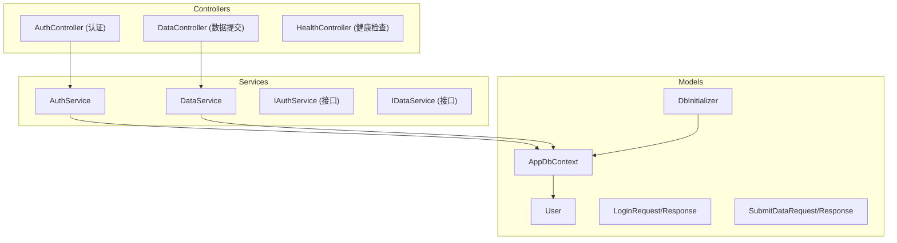
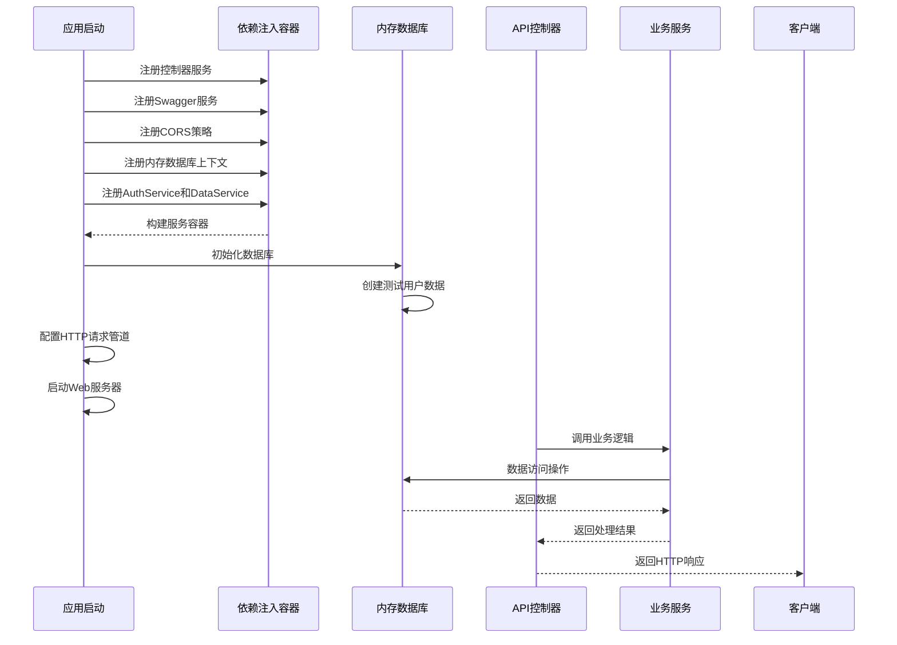
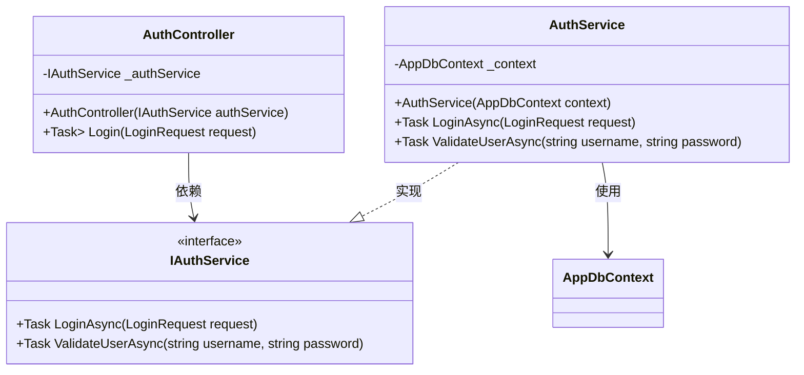
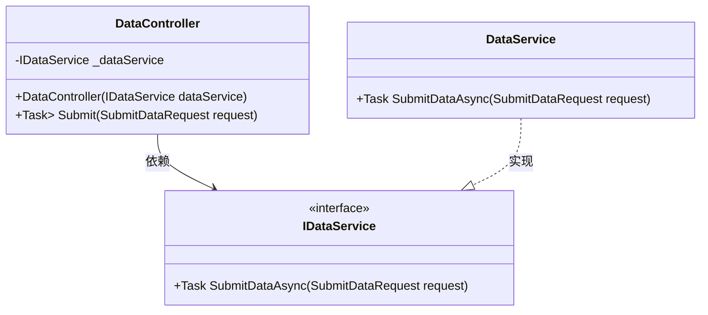
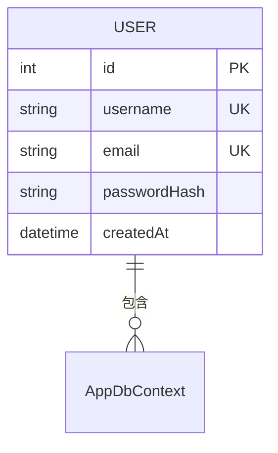
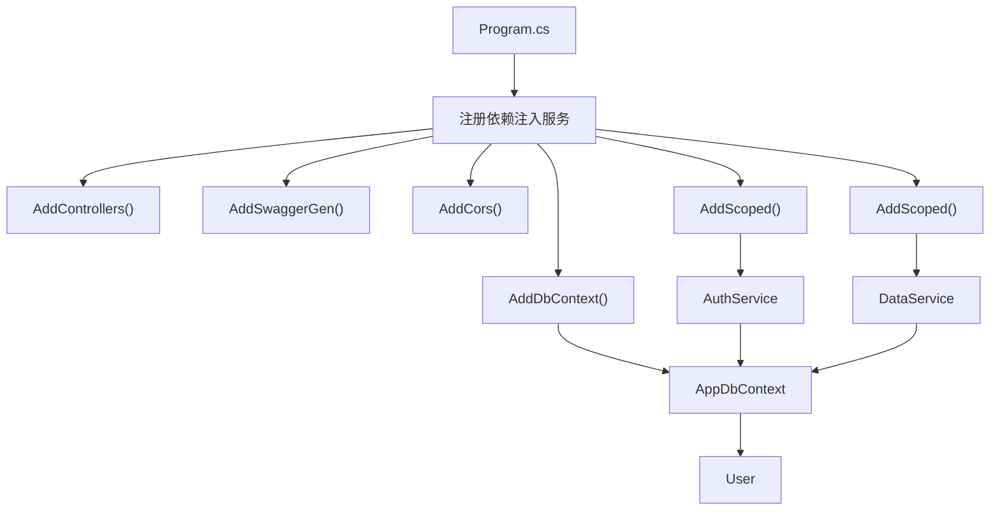
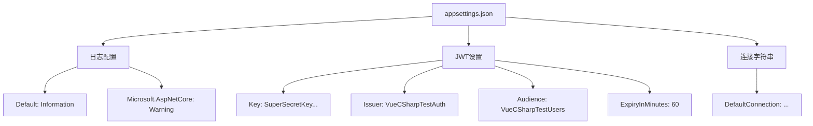

# 后端架构

<cite>
**本文档中引用的文件**   
- [Program.cs](file://Backend/Program.cs)
- [appsettings.json](file://Backend/appsettings.json)
- [AuthController.cs](file://Backend/Controllers/AuthController.cs)
- [DataController.cs](file://Backend/Controllers/DataController.cs)
- [HealthController.cs](file://Backend/Controllers/HealthController.cs)
- [AuthService.cs](file://Backend/Services/AuthService.cs)
- [DataService.cs](file://Backend/Services/DataService.cs)
- [IAuthService.cs](file://Backend/Services/IAuthService.cs)
- [IDataService.cs](file://Backend/Services/IDataService.cs)
- [AppDbContext.cs](file://Backend/Models/AppDbContext.cs)
- [User.cs](file://Backend/Models/User.cs)
- [DbInitializer.cs](file://Backend/Models/DbInitializer.cs)
- [LoginRequest.cs](file://Backend/Models/LoginRequest.cs)
</cite>

## 目录
1. [项目结构](#项目结构)
2. [核心组件](#核心组件)
3. [架构概述](#架构概述)
4. [详细组件分析](#详细组件分析)
5. [依赖关系分析](#依赖关系分析)
6. [性能与配置](#性能与配置)
7. [结论](#结论)

## 项目结构

该项目采用典型的分层架构设计，后端基于ASP.NET Core构建RESTful API服务。项目结构清晰地划分为Controllers（控制器）、Models（模型）和Services（服务）三个主要层次，遵循关注点分离原则。



**Diagram sources**
- [Controllers/AuthController.cs](file://Backend/Controllers/AuthController.cs#L7-L25)
- [Controllers/DataController.cs](file://Backend/Controllers/DataController.cs#L7-L25)
- [Services/AuthService.cs](file://Backend/Services/AuthService.cs#L6-L64)
- [Services/DataService.cs](file://Backend/Services/DataService.cs#L5-L30)
- [Models/AppDbContext.cs](file://Backend/Models/AppDbContext.cs#L5-L24)

**Section sources**
- [Backend](file://Backend)
- [Controllers](file://Backend/Controllers)
- [Services](file://Backend/Services)
- [Models](file://Backend/Models)

## 核心组件

本系统的核心组件包括API控制器层、业务服务层、数据访问层和配置管理层。API控制器负责接收HTTP请求并返回响应；业务服务层封装核心业务逻辑；数据访问层通过Entity Framework Core实现与内存数据库的交互；配置管理层则通过`appsettings.json`文件集中管理应用配置。

**Section sources**
- [AuthController.cs](file://Backend/Controllers/AuthController.cs#L1-L25)
- [AuthService.cs](file://Backend/Services/AuthService.cs#L1-L64)
- [AppDbContext.cs](file://Backend/Models/AppDbContext.cs#L1-L24)
- [appsettings.json](file://Backend/appsettings.json#L1-L18)

## 架构概述

系统采用基于ASP.NET Core的现代化Web API架构，实现了清晰的分层设计和依赖注入机制。整个应用启动流程在`Program.cs`中定义，通过链式调用配置服务注册、中间件管道和应用配置。



**Diagram sources**
- [Program.cs](file://Backend/Program.cs#L5-L55)
- [DbInitializer.cs](file://Backend/Models/DbInitializer.cs#L7-L40)
- [AppDbContext.cs](file://Backend/Models/AppDbContext.cs#L5-L24)

## 详细组件分析

### 认证控制器分析

`AuthController`是系统的主要认证入口点，负责处理用户登录请求。该控制器通过依赖注入获取`IAuthService`实例，实现了职责分离的设计模式。



**Diagram sources**
- [AuthController.cs](file://Backend/Controllers/AuthController.cs#L7-L25)
- [IAuthService.cs](file://Backend/Services/IAuthService.cs#L5-L10)
- [AuthService.cs](file://Backend/Services/AuthService.cs#L6-L64)

**Section sources**
- [AuthController.cs](file://Backend/Controllers/AuthController.cs#L1-L25)
- [AuthService.cs](file://Backend/Services/AuthService.cs#L1-L64)
- [IAuthService.cs](file://Backend/Services/IAuthService.cs#L1-L10)

### 数据控制器分析

`DataController`负责处理前端提交的数据请求，体现了RESTful API设计原则。该控制器通过`IDataService`接口与业务逻辑层解耦，提高了系统的可测试性和可维护性。



**Diagram sources**
- [DataController.cs](file://Backend/Controllers/DataController.cs#L7-L25)
- [IDataService.cs](file://Backend/Services/IDataService.cs#L5-L9)
- [DataService.cs](file://Backend/Services/DataService.cs#L5-L30)

**Section sources**
- [DataController.cs](file://Backend/Controllers/DataController.cs#L1-L25)
- [DataService.cs](file://Backend/Services/DataService.cs#L1-L30)
- [IDataService.cs](file://Backend/Services/IDataService.cs#L1-L9)

### 健康检查控制器分析

`HealthController`提供了一个简单的健康检查端点，用于监控后端服务的运行状态。该控制器返回一个包含状态信息的JSON响应，便于前端或运维系统进行服务健康监测。

```mermaid
flowchart TD
Start([HTTP GET /api/health]) --> ReturnResponse["返回JSON响应"]
ReturnResponse --> End([{ status: 'healthy', message: 'C#后端服务运行正常' }])
```

**Diagram sources**
- [HealthController.cs](file://Backend/Controllers/HealthController.cs#L7-L15)

**Section sources**
- [HealthController.cs](file://Backend/Controllers/HealthController.cs#L1-L15)

### 数据模型分析

系统使用Entity Framework Core作为ORM框架，`AppDbContext`类定义了与数据库的连接和实体映射关系。`User`实体类通过数据注解和Fluent API配置了字段约束和主键。



**Diagram sources**
- [AppDbContext.cs](file://Backend/Models/AppDbContext.cs#L5-L24)
- [User.cs](file://Backend/Models/User.cs#L3-L11)

**Section sources**
- [AppDbContext.cs](file://Backend/Models/AppDbContext.cs#L1-L24)
- [User.cs](file://Backend/Models/User.cs#L1-L11)

## 依赖关系分析

系统通过ASP.NET Core内置的依赖注入容器管理组件间的依赖关系。所有服务均在`Program.cs`文件中注册，采用作用域生命周期（Scoped），确保每个请求获得独立的服务实例。



**Diagram sources**
- [Program.cs](file://Backend/Program.cs#L8-L30)
- [AppDbContext.cs](file://Backend/Models/AppDbContext.cs#L5-L24)
- [AuthService.cs](file://Backend/Services/AuthService.cs#L6-L64)
- [DataService.cs](file://Backend/Services/DataService.cs#L5-L30)

**Section sources**
- [Program.cs](file://Backend/Program.cs#L1-L55)
- [AppDbContext.cs](file://Backend/Models/AppDbContext.cs#L1-L24)

## 性能与配置

系统通过`appsettings.json`文件集中管理配置信息，包括日志级别设置和JWT认证参数。开发环境启用了Swagger文档生成，便于API测试和文档查阅。



**Diagram sources**
- [appsettings.json](file://Backend/appsettings.json#L1-L18)

**Section sources**
- [appsettings.json](file://Backend/appsettings.json#L1-L18)
- [Program.cs](file://Backend/Program.cs#L35-L39)

## 结论

该智能体项目后端架构采用了现代化的ASP.NET Core技术栈，实现了清晰的分层设计和良好的代码组织。通过依赖注入机制实现了组件间的松耦合，提高了系统的可维护性和可测试性。内存数据库的使用使得系统在开发和测试阶段能够快速启动，而无需依赖外部数据库服务。CORS策略的配置确保了与Vue前端的无缝集成，Swagger的集成则提供了完善的API文档支持。整体架构设计合理，符合RESTful API最佳实践，为后续功能扩展奠定了坚实的基础。