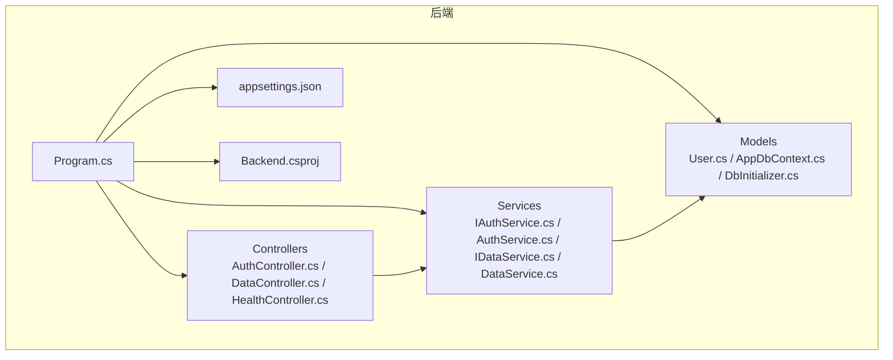
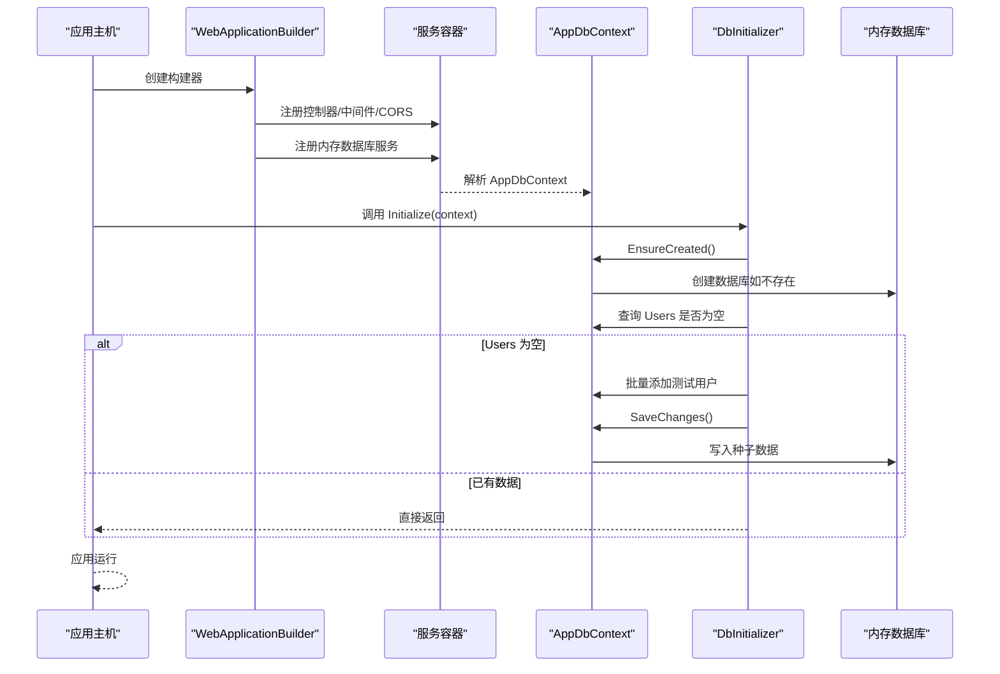
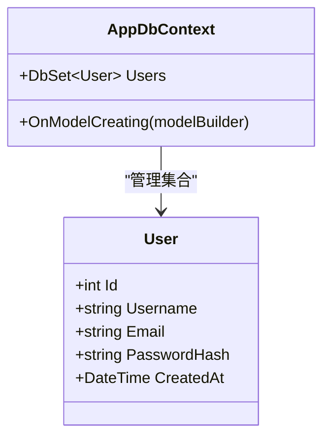
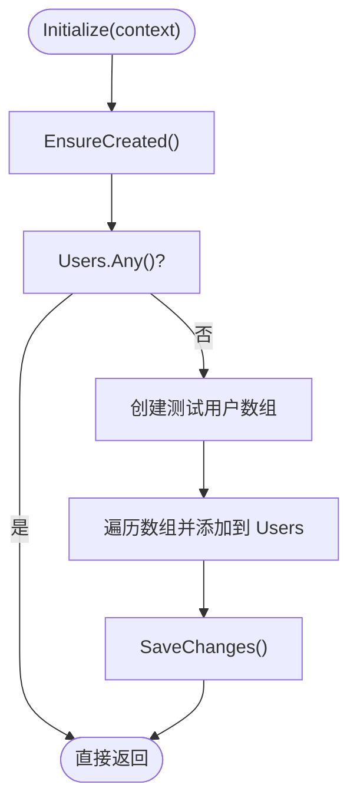
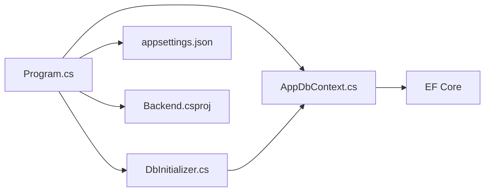

# 数据模型与ORM映射

<cite>
**本文引用的文件**
- [User.cs](file://vue-csharp-ui-auto/Backend/Models/User.cs)
- [AppDbContext.cs](file://vue-csharp-ui-auto/Backend/Models/AppDbContext.cs)
- [DbInitializer.cs](file://vue-csharp-ui-auto/Backend/Models/DbInitializer.cs)
- [Program.cs](file://vue-csharp-ui-auto/Backend/Program.cs)
- [appsettings.json](file://vue-csharp-ui-auto/Backend/appsettings.json)
- [Backend.csproj](file://vue-csharp-ui-auto/Backend/Backend.csproj)
</cite>

## 目录
1. [简介](#简介)
2. [项目结构](#项目结构)
3. [核心组件](#核心组件)
4. [架构总览](#架构总览)
5. [详细组件分析](#详细组件分析)
6. [依赖关系分析](#依赖关系分析)
7. [性能考量](#性能考量)
8. [故障排查指南](#故障排查指南)
9. [结论](#结论)
10. [附录：EF Core 迁移命令示例](#附录ef-core-迁移命令示例)

## 简介
本文件聚焦于智能体项目后端的数据模型与 ORM 映射实现，围绕以下目标展开：
- 深入解析 User 实体类的字段定义、数据类型与业务含义
- 解释 AppDbContext 中 DbSet<User> 的集合管理能力与 OnModelCreating 的 Fluent API 配置（主键、必填、长度限制等）
- 阐述内存数据库在测试环境中的优势与局限性
- 描述 DbInitializer 在应用启动时如何初始化测试用户数据，并说明 EnsureCreated() 的执行逻辑
- 提供 EF Core 迁移命令示例，为未来向真实持久化数据库演进提供路径

## 项目结构
后端位于 vue-csharp-ui-auto/Backend 目录，采用经典的分层组织方式：
- Models：数据模型与上下文（User、AppDbContext、DbInitializer）
- Services：服务接口与实现（认证、数据访问）
- Controllers：HTTP 控制器（鉴权、数据、健康检查）
- Program.cs：应用入口，注册服务、配置中间件与数据库
- appsettings.json：应用配置（连接字符串、JWT 设置）
- Backend.csproj：NuGet 包引用（包含 EF Core InMemory 与 SqlServer）

图表来源
- [Program.cs](file://vue-csharp-ui-auto/Backend/Program.cs#L1-L55)
- [Backend.csproj](file://vue-csharp-ui-auto/Backend/Backend.csproj#L1-L18)

章节来源
- [Program.cs](file://vue-csharp-ui-auto/Backend/Program.cs#L1-L55)
- [Backend.csproj](file://vue-csharp-ui-auto/Backend/Backend.csproj#L1-L18)

## 核心组件
本节从数据模型与 ORM 映射角度，系统梳理 User 实体、AppDbContext 上下文与 DbInitializer 初始化流程。

- User 实体
  - 字段与类型：Id（整型）、Username（字符串）、Email（字符串）、PasswordHash（字符串）、CreatedAt（日期时间）
  - 默认值与可空性：Username、Email、PasswordHash 具有默认空字符串；CreatedAt 默认为 UTC 当前时间
  - 业务含义：标识用户、用户名、邮箱、密码哈希、创建时间戳

- AppDbContext
  - 集合管理：通过 DbSet<User> 暴露 Users 集合，用于查询、添加、更新、删除用户
  - Fluent API 配置：在 OnModelCreating 中设置主键、字段必填与最大长度约束
  - 关系与索引：当前未声明外键或索引，实体间无显式关系

- DbInitializer
  - EnsureCreated：确保数据库已创建（若不存在则创建）
  - 种子数据：若 Users 表为空，则批量插入两条测试用户记录
  - SaveChanges：一次性提交种子数据

章节来源
- [User.cs](file://vue-csharp-ui-auto/Backend/Models/User.cs#L1-L11)
- [AppDbContext.cs](file://vue-csharp-ui-auto/Backend/Models/AppDbContext.cs#L1-L24)
- [DbInitializer.cs](file://vue-csharp-ui-auto/Backend/Models/DbInitializer.cs#L1-L40)

## 架构总览
下图展示应用启动时，Program.cs 如何注册内存数据库、构建应用并调用 DbInitializer 初始化数据流。

图表来源
- [Program.cs](file://vue-csharp-ui-auto/Backend/Program.cs#L1-L55)
- [DbInitializer.cs](file://vue-csharp-ui-auto/Backend/Models/DbInitializer.cs#L1-L40)
- [AppDbContext.cs](file://vue-csharp-ui-auto/Backend/Models/AppDbContext.cs#L1-L24)

## 详细组件分析

### User 实体类
- 字段定义与业务含义
  - Id：用户唯一标识，整型主键
  - Username：用户名，字符串，默认空串
  - Email：邮箱，字符串，默认空串
  - PasswordHash：密码哈希，字符串，默认空串
  - CreatedAt：创建时间，UTC 时间，默认当前时间
- 设计要点
  - 使用 UTC 时间统一存储，便于跨时区一致性
  - 默认值避免 null，简化上层处理
  - 未包含明文密码字段，仅保存哈希，符合安全最佳实践

章节来源
- [User.cs](file://vue-csharp-ui-auto/Backend/Models/User.cs#L1-L11)

### AppDbContext 上下文与 Fluent API 配置
- 集合管理
  - Users：公开的 DbSet<User>，支持 LINQ 查询、Add/Update/Remove 等操作
- 实体配置（OnModelCreating）
  - 主键：Id 设置为主键
  - 字段约束：
    - Username：必填、最大长度 50
    - Email：必填、最大长度 100
    - PasswordHash：必填
  - 其他：未声明索引或外键关系，实体间无显式关联

图表来源
- [User.cs](file://vue-csharp-ui-auto/Backend/Models/User.cs#L1-L11)
- [AppDbContext.cs](file://vue-csharp-ui-auto/Backend/Models/AppDbContext.cs#L1-L24)

章节来源
- [AppDbContext.cs](file://vue-csharp-ui-auto/Backend/Models/AppDbContext.cs#L1-L24)

### DbInitializer 初始化流程
- EnsureCreated：确保数据库存在，若不存在则按模型创建表结构
- 种子数据策略：仅当 Users 为空时插入两条测试用户（test_user/admin）
- 提交策略：批量添加后一次性 SaveChanges，减少事务开销

图表来源
- [DbInitializer.cs](file://vue-csharp-ui-auto/Backend/Models/DbInitializer.cs#L1-L40)

章节来源
- [DbInitializer.cs](file://vue-csharp-ui-auto/Backend/Models/DbInitializer.cs#L1-L40)

### 测试环境中的内存数据库
- 优势
  - 启动快速、无需外部数据库实例
  - 支持并发测试隔离（每个测试使用独立内存数据库名称）
  - 适合单元测试与集成测试，便于断言数据状态
- 局限性
  - 不支持 SQL Server 特性（如存储过程、全文索引、某些 T-SQL 功能）
  - 无法模拟真实数据库的性能与锁行为
  - 无法进行数据库迁移与版本演进（迁移工具通常针对真实提供程序）

章节来源
- [Program.cs](file://vue-csharp-ui-auto/Backend/Program.cs#L24-L26)
- [Backend.csproj](file://vue-csharp-ui-auto/Backend/Backend.csproj#L10-L16)

### 应用启动与初始化顺序
- Program.cs 在开发环境下注册内存数据库服务
- 构建应用后，进入作用域，解析 AppDbContext 并调用 DbInitializer.Initialize
- EnsureCreated 保证数据库存在，随后根据 Users 是否为空决定是否写入种子数据

章节来源
- [Program.cs](file://vue-csharp-ui-auto/Backend/Program.cs#L1-L55)
- [DbInitializer.cs](file://vue-csharp-ui-auto/Backend/Models/DbInitializer.cs#L1-L40)

## 依赖关系分析
- 组件耦合
  - Program.cs 依赖 DbInitializer 与 AppDbContext
  - DbInitializer 依赖 AppDbContext 与 EF Core 的 EnsureCreated/SaveChanges
  - AppDbContext 依赖 EF Core 的 DbContext/ModelBuilder
- 外部依赖
  - EF Core InMemory：用于测试环境
  - EF Core SqlServer：用于生产数据库（通过连接字符串与迁移）
  - Swashbuckle：API 文档
- 可能的循环依赖
  - 当前结构无循环依赖，各层职责清晰

图表来源
- [Program.cs](file://vue-csharp-ui-auto/Backend/Program.cs#L1-L55)
- [DbInitializer.cs](file://vue-csharp-ui-auto/Backend/Models/DbInitializer.cs#L1-L40)
- [AppDbContext.cs](file://vue-csharp-ui-auto/Backend/Models/AppDbContext.cs#L1-L24)
- [appsettings.json](file://vue-csharp-ui-auto/Backend/appsettings.json#L1-L18)
- [Backend.csproj](file://vue-csharp-ui-auto/Backend/Backend.csproj#L1-L18)

章节来源
- [Program.cs](file://vue-csharp-ui-auto/Backend/Program.cs#L1-L55)
- [DbInitializer.cs](file://vue-csharp-ui-auto/Backend/Models/DbInitializer.cs#L1-L40)
- [AppDbContext.cs](file://vue-csharp-ui-auto/Backend/Models/AppDbContext.cs#L1-L24)
- [appsettings.json](file://vue-csharp-ui-auto/Backend/appsettings.json#L1-L18)
- [Backend.csproj](file://vue-csharp-ui-auto/Backend/Backend.csproj#L1-L18)

## 性能考量
- 内存数据库
  - 读写速度快，适合测试场景
  - 不反映真实数据库的并发与锁竞争
- 种子数据
  - 单次 SaveChanges 减少事务往返
  - 若种子数据量增大，建议分批插入并控制事务范围
- 查询与约束
  - Fluent API 已设置必填与长度约束，有助于减少无效数据与后续校验成本

[本节为通用指导，不直接分析具体文件]

## 故障排查指南
- 数据库未创建
  - 现象：首次运行报错或查询不到数据
  - 排查：确认 EnsureCreated 是否被调用；检查内存数据库名称是否正确
- 种子数据未写入
  - 现象：Users 已存在但无测试数据
  - 排查：确认 Users.Any() 判断逻辑；检查 Initialize 调用链
- 连接字符串与提供程序
  - 现象：切换到真实数据库后迁移失败
  - 排查：确认 appsettings.json 中连接字符串；确保安装了对应 EF Core 提供程序包

章节来源
- [DbInitializer.cs](file://vue-csharp-ui-auto/Backend/Models/DbInitializer.cs#L1-L40)
- [Program.cs](file://vue-csharp-ui-auto/Backend/Program.cs#L24-L26)
- [appsettings.json](file://vue-csharp-ui-auto/Backend/appsettings.json#L1-L18)

## 结论
本项目的数据模型与 ORM 映射简洁清晰：User 实体定义明确，AppDbContext 通过 Fluent API 完成基础约束配置，DbInitializer 在应用启动时负责数据库创建与种子数据注入。测试环境采用内存数据库，具备快速与易用的优势，但在真实数据库迁移与性能特性方面存在局限。通过合理的迁移策略与配置管理，可平滑过渡到生产数据库。

[本节为总结性内容，不直接分析具体文件]

## 附录：EF Core 迁移命令示例
以下命令基于项目已安装的 EF Core 包，适用于将来切换至真实数据库（如 SQL Server）时进行迁移管理。请根据实际环境调整连接字符串与项目路径。

- 添加迁移
  - 命令：dotnet ef migrations add InitialCreate --project ./vue-csharp-ui-auto/Backend/Backend.csproj
- 更新数据库
  - 命令：dotnet ef database update --project ./vue-csharp-ui-auto/Backend/Backend.csproj
- 查看迁移历史
  - 命令：dotnet ef migrations list --project ./vue-csharp-ui-auto/Backend/Backend.csproj
- 删除最后一次迁移
  - 命令：dotnet ef migrations remove --project ./vue-csharp-ui-auto/Backend/Backend.csproj
- 生成数据库脚本
  - 命令：dotnet ef migrations script --project ./vue-csharp-ui-auto/Backend/Backend.csproj

章节来源
- [Backend.csproj](file://vue-csharp-ui-auto/Backend/Backend.csproj#L10-L16)
- [appsettings.json](file://vue-csharp-ui-auto/Backend/appsettings.json#L1-L18)