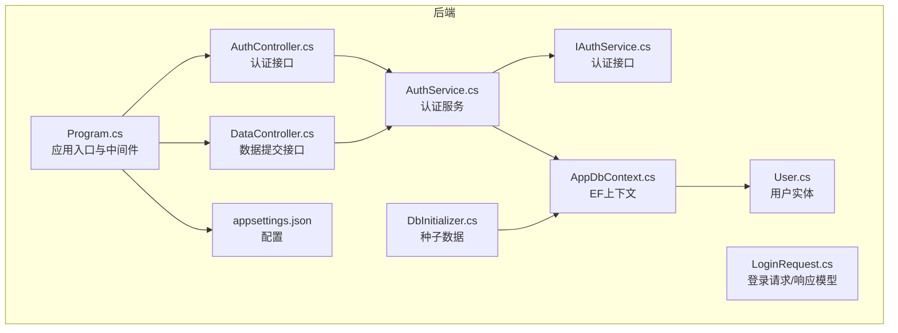
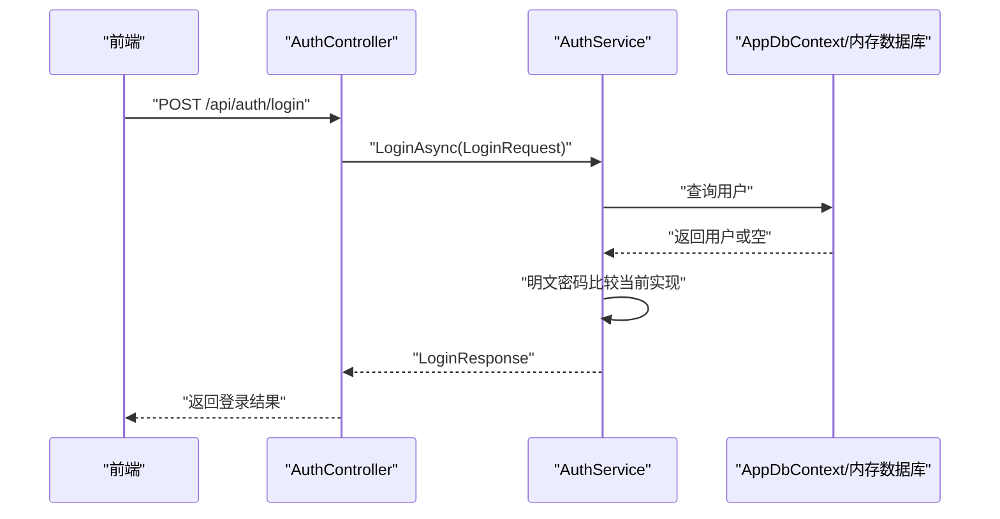
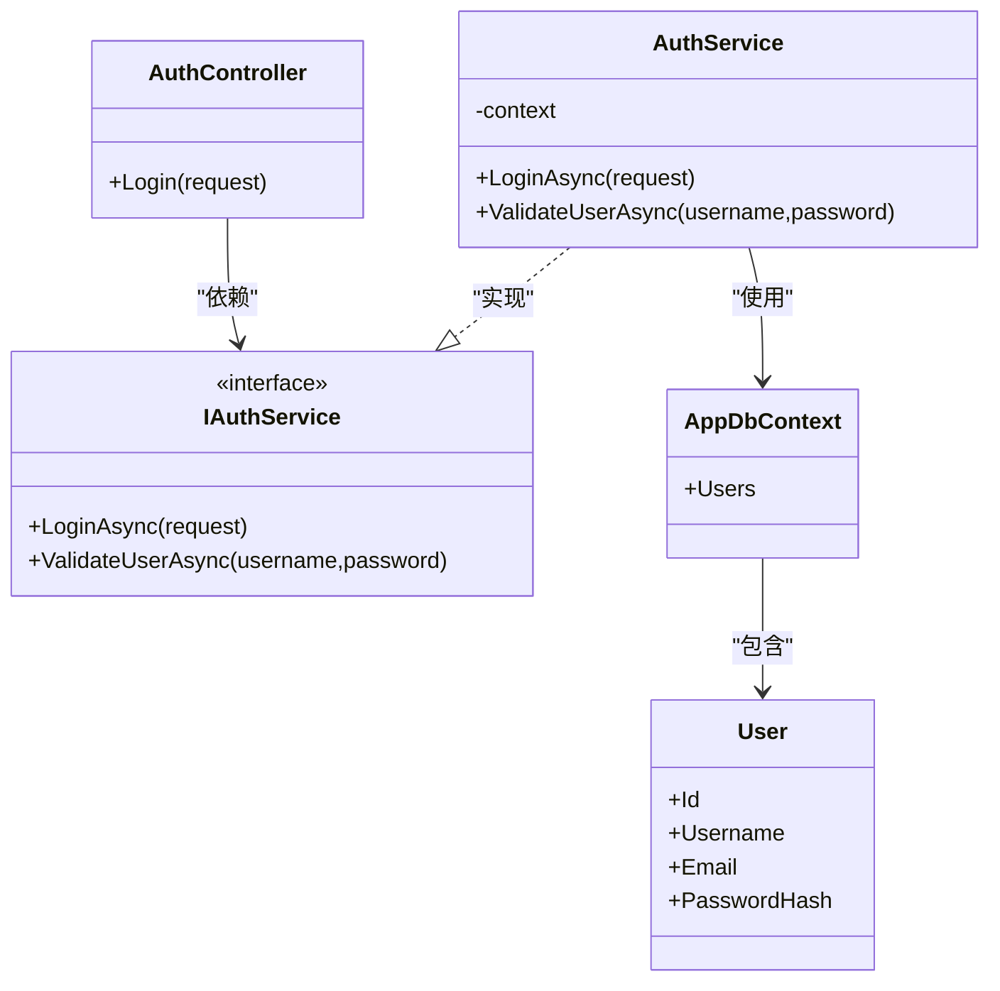

# 安全性与改进建议

<cite>
**本文引用的文件**
- [AuthService.cs](file://vue-csharp-ui-auto/Backend/Services/AuthService.cs)
- [AuthController.cs](file://vue-csharp-ui-auto/Backend/Controllers/AuthController.cs)
- [Program.cs](file://vue-csharp-ui-auto/Backend/Program.cs)
- [appsettings.json](file://vue-csharp-ui-auto/Backend/appsettings.json)
- [LoginRequest.cs](file://vue-csharp-ui-auto/Backend/Models/LoginRequest.cs)
- [User.cs](file://vue-csharp-ui-auto/Backend/Models/User.cs)
- [AppDbContext.cs](file://vue-csharp-ui-auto/Backend/Models/AppDbContext.cs)
- [DbInitializer.cs](file://vue-csharp-ui-auto/Backend/Models/DbInitializer.cs)
- [README.md](file://vue-csharp-ui-auto/README.md)
- [DataController.cs](file://vue-csharp-ui-auto/Backend/Controllers/DataController.cs)
</cite>

## 目录
1. [引言](#引言)
2. [项目结构](#项目结构)
3. [核心组件](#核心组件)
4. [架构总览](#架构总览)
5. [详细组件分析](#详细组件分析)
6. [依赖关系分析](#依赖关系分析)
7. [性能与安全特性](#性能与安全特性)
8. [故障排查指南](#故障排查指南)
9. [结论](#结论)
10. [附录：生产级演进路线图](#附录生产级演进路线图)

## 引言
本文件系统性评估智能体项目的当前安全状况，聚焦于认证与授权、配置管理、跨域策略、输入验证与SQL注入防护、速率限制等关键领域。针对AuthService.cs中明文密码比较、appsettings.json中硬编码密钥、CORS策略过宽等问题，提出可落地的改进方案；并结合README.md中的说明，规划从演示项目向生产级系统演进的技术路线图，涵盖日志审计、监控告警、身份认证集成等高级能力。

## 项目结构
后端采用ASP.NET Core + Entity Framework，前后端分离，前端通过Vite代理访问后端API。后端提供健康检查、认证与数据提交接口，使用内存数据库进行测试与演示。

图表来源
- [Program.cs](file://vue-csharp-ui-auto/Backend/Program.cs#L1-L55)
- [AuthController.cs](file://vue-csharp-ui-auto/Backend/Controllers/AuthController.cs#L1-L25)
- [DataController.cs](file://vue-csharp-ui-auto/Backend/Controllers/DataController.cs#L1-L25)
- [AuthService.cs](file://vue-csharp-ui-auto/Backend/Services/AuthService.cs#L1-L64)
- [LoginRequest.cs](file://vue-csharp-ui-auto/Backend/Models/LoginRequest.cs#L1-L28)
- [User.cs](file://vue-csharp-ui-auto/Backend/Models/User.cs#L1-L11)
- [AppDbContext.cs](file://vue-csharp-ui-auto/Backend/Models/AppDbContext.cs#L1-L24)
- [DbInitializer.cs](file://vue-csharp-ui-auto/Backend/Models/DbInitializer.cs#L1-L40)
- [appsettings.json](file://vue-csharp-ui-auto/Backend/appsettings.json#L1-L18)

章节来源
- [README.md](file://vue-csharp-ui-auto/README.md#L1-L113)
- [Program.cs](file://vue-csharp-ui-auto/Backend/Program.cs#L1-L55)

## 核心组件
- 认证控制器：接收登录请求，调用认证服务返回结果。
- 认证服务：查询用户并进行密码校验（当前为明文比较，存在严重风险）。
- 数据上下文与模型：定义用户实体及EF配置，包含PasswordHash字段。
- 应用入口：注册服务、启用Swagger/CORS、HTTPS重定向、授权与路由映射。
- 配置文件：包含JWT密钥、连接字符串与日志级别等。

章节来源
- [AuthController.cs](file://vue-csharp-ui-auto/Backend/Controllers/AuthController.cs#L1-L25)
- [AuthService.cs](file://vue-csharp-ui-auto/Backend/Services/AuthService.cs#L1-L64)
- [AppDbContext.cs](file://vue-csharp-ui-auto/Backend/Models/AppDbContext.cs#L1-L24)
- [User.cs](file://vue-csharp-ui-auto/Backend/Models/User.cs#L1-L11)
- [Program.cs](file://vue-csharp-ui-auto/Backend/Program.cs#L1-L55)
- [appsettings.json](file://vue-csharp-ui-auto/Backend/appsettings.json#L1-L18)

## 架构总览
后端通过控制器暴露REST接口，认证服务负责用户校验与令牌发放（当前未实现），EF用于内存数据库存取。CORS策略默认允许本地开发环境的多个来源，未对生产环境做约束。

图表来源
- [AuthController.cs](file://vue-csharp-ui-auto/Backend/Controllers/AuthController.cs#L1-L25)
- [AuthService.cs](file://vue-csharp-ui-auto/Backend/Services/AuthService.cs#L1-L64)
- [AppDbContext.cs](file://vue-csharp-ui-auto/Backend/Models/AppDbContext.cs#L1-L24)

## 详细组件分析

### 认证服务与明文密码比较问题
- 现状：登录逻辑直接比较明文密码，且在数据库中也存储了明文或伪哈希值，存在极高安全风险。
- 风险：
  - 明文密码泄露导致账户被冒用；
  - 数据库备份或日志中可能暴露敏感信息；
  - 缺少密码强度策略与盐值处理，易受彩虹表攻击。
- 建议：
  - 引入密码哈希（如BCrypt）对用户密码进行安全存储与比对；
  - 在注册/修改密码时执行哈希处理；
  - 登录时仅比较哈希值，不保存明文。
- 实施要点：
  - 用户模型保留PasswordHash字段，迁移时确保字段非空；
  - 认证服务新增哈希验证逻辑，替换现有明文比较；
  - 前端不再传输明文密码，后端严格校验与脱敏输出。

章节来源
- [AuthService.cs](file://vue-csharp-ui-auto/Backend/Services/AuthService.cs#L1-L64)
- [User.cs](file://vue-csharp-ui-auto/Backend/Models/User.cs#L1-L11)
- [DbInitializer.cs](file://vue-csharp-ui-auto/Backend/Models/DbInitializer.cs#L1-L40)

### JWT令牌认证机制缺失
- 现状：LoginResponse中包含Token字段，但认证服务未生成或返回JWT令牌。
- 建议：
  - 使用标准JWT库生成签名令牌，包含用户标识、签发方、受众、过期时间等声明；
  - 将令牌返回给前端，前端存储在安全位置（如HttpOnly Cookie或安全Storage）；
  - 控制器与中间件在受保护接口上进行令牌解析与权限校验。
- 安全考虑：
  - 密钥必须使用强随机值，避免硬编码；
  - 令牌过期时间应合理，支持刷新机制；
  - 传输层强制HTTPS，令牌存储避免明文。

章节来源
- [LoginRequest.cs](file://vue-csharp-ui-auto/Backend/Models/LoginRequest.cs#L1-L28)
- [appsettings.json](file://vue-csharp-ui-auto/Backend/appsettings.json#L1-L18)

### 配置管理与密钥硬编码风险
- 现状：JWT密钥与数据库连接字符串直接写入appsettings.json，且AllowedHosts为通配符。
- 风险：
  - 密钥泄露将导致伪造令牌；
  - 通配符AllowedHosts可能扩大攻击面；
  - 生产环境应区分开发/测试/生产配置。
- 建议：
  - 使用配置管理服务（如Azure Key Vault、AWS Secrets Manager）或环境变量注入密钥；
  - 通过环境变量覆盖敏感配置，避免提交至版本库；
  - AllowedHosts按部署域名精确配置，避免通配符。

章节来源
- [appsettings.json](file://vue-csharp-ui-auto/Backend/appsettings.json#L1-L18)
- [Program.cs](file://vue-csharp-ui-auto/Backend/Program.cs#L1-L55)

### CORS策略过于宽松
- 现状：CORS允许本地开发的多个来源（localhost与127.0.0.1），未限定生产域名。
- 风险：若部署到公网，可能被任意站点发起跨域请求，带来CSRF与数据泄露风险。
- 建议：
  - 将允许的源限定为实际部署的前端域名；
  - 仅开放必要HTTP方法与头；
  - 对关键接口启用凭证（credentials）时，明确指定Origin而非通配符。

章节来源
- [Program.cs](file://vue-csharp-ui-auto/Backend/Program.cs#L13-L22)

### 输入验证与SQL注入防护
- 现状：控制器接收模型绑定参数，但未见显式输入验证与SQL注入防护逻辑。
- 建议：
  - 在模型上添加数据注解或使用FluentValidation进行参数校验；
  - 对用户输入进行最小化与白名单过滤，避免危险字符；
  - 使用参数化查询或ORM（EF）默认参数化，避免拼接SQL；
  - 对敏感字段（如密码）在日志中脱敏输出。
- 参考路径：
  - 登录请求模型定义处添加验证规则；
  - EF查询统一通过DbSet与LINQ，保持参数化。

章节来源
- [AuthController.cs](file://vue-csharp-ui-auto/Backend/Controllers/AuthController.cs#L1-L25)
- [DataController.cs](file://vue-csharp-ui-auto/Backend/Controllers/DataController.cs#L1-L25)
- [LoginRequest.cs](file://vue-csharp-ui-auto/Backend/Models/LoginRequest.cs#L1-L28)
- [AppDbContext.cs](file://vue-csharp-ui-auto/Backend/Models/AppDbContext.cs#L1-L24)

### 速率限制与防护
- 建议：
  - 在认证接口（如登录）实施IP/账号维度的速率限制，防暴力破解；
  - 对高频接口设置限流，结合缓存或Redis实现；
  - 结合IP黑名单与验证码机制进一步加固。
- 实施位置：可在中间件或控制器层实现，或使用第三方库（如AspNetCoreRateLimit）。

[本节为通用安全建议，不直接分析具体文件，故无章节来源]

### 日志审计与监控告警
- 建议：
  - 统一日志格式与级别，记录关键事件（登录、失败尝试、异常）；
  - 对敏感操作（密码变更、删除）进行审计日志；
  - 集成监控告警（如Prometheus/Grafana + Alertmanager），对异常登录、频繁失败、异常响应时间进行告警。
- 实施位置：在Program.cs中配置日志提供程序，结合中间件记录请求/响应摘要。

[本节为通用安全建议，不直接分析具体文件，故无章节来源]

## 依赖关系分析
- 控制器依赖认证服务接口，认证服务依赖数据库上下文；
- 程序入口注册服务、启用CORS与HTTPS重定向；
- 配置文件影响JWT密钥与数据库连接。

图表来源
- [AuthController.cs](file://vue-csharp-ui-auto/Backend/Controllers/AuthController.cs#L1-L25)
- [AuthService.cs](file://vue-csharp-ui-auto/Backend/Services/AuthService.cs#L1-L64)
- [AppDbContext.cs](file://vue-csharp-ui-auto/Backend/Models/AppDbContext.cs#L1-L24)
- [User.cs](file://vue-csharp-ui-auto/Backend/Models/User.cs#L1-L11)

章节来源
- [AuthController.cs](file://vue-csharp-ui-auto/Backend/Controllers/AuthController.cs#L1-L25)
- [AuthService.cs](file://vue-csharp-ui-auto/Backend/Services/AuthService.cs#L1-L64)
- [AppDbContext.cs](file://vue-csharp-ui-auto/Backend/Models/AppDbContext.cs#L1-L24)

## 性能与安全特性
- 性能：内存数据库适合测试，生产需切换到持久化数据库；认证服务应避免N+1查询，使用投影与分页。
- 安全：引入密码哈希、JWT令牌、严格的CORS与配置管理，是提升整体安全性的关键。

[本节为通用指导，不直接分析具体文件，故无章节来源]

## 故障排查指南
- 登录失败：
  - 检查用户名是否存在，确认数据库中是否正确存储了PasswordHash；
  - 确认认证服务中密码比较逻辑已替换为哈希比对。
- 跨域问题：
  - 检查CORS策略是否允许当前前端域名；
  - 确保生产环境未使用通配符Origin。
- 配置错误：
  - 确认JWT密钥来自环境变量或配置管理服务；
  - 检查AllowedHosts与连接字符串是否符合部署环境。

章节来源
- [AuthService.cs](file://vue-csharp-ui-auto/Backend/Services/AuthService.cs#L1-L64)
- [Program.cs](file://vue-csharp-ui-auto/Backend/Program.cs#L13-L22)
- [appsettings.json](file://vue-csharp-ui-auto/Backend/appsettings.json#L1-L18)

## 结论
当前项目在演示阶段具备基本功能，但在安全方面存在明显短板：明文密码比较、JWT令牌未实现、密钥硬编码、CORS过宽、缺少输入验证与SQL注入防护、速率限制缺失。建议立即引入密码哈希与JWT令牌机制，替换硬编码密钥，收紧CORS策略，并补充输入验证、SQL注入防护与速率限制。在此基础上，逐步完善日志审计、监控告警与身份认证集成，以支撑从演示项目向生产级系统的演进。

[本节为总结，不直接分析具体文件，故无章节来源]

## 附录：生产级演进路线图
- 第一阶段（短期）
  - 替换明文密码比较为BCrypt哈希；
  - 实现JWT令牌生成与校验；
  - 使用环境变量或配置管理服务替换appsettings.json中的密钥；
  - 将CORS策略限定为实际部署域名。
- 第二阶段（中期）
  - 引入输入验证与SQL注入防护（参数化查询、白名单过滤）；
  - 实施速率限制与暴力破解防护；
  - 增加日志审计与异常监控告警。
- 第三阶段（长期）
  - 集成企业级身份认证（如OAuth2/SAML）；
  - 引入API网关与WAF；
  - 建立完善的CI/CD安全扫描与合规检查。

[本节为概念性路线图，不直接分析具体文件，故无章节来源]