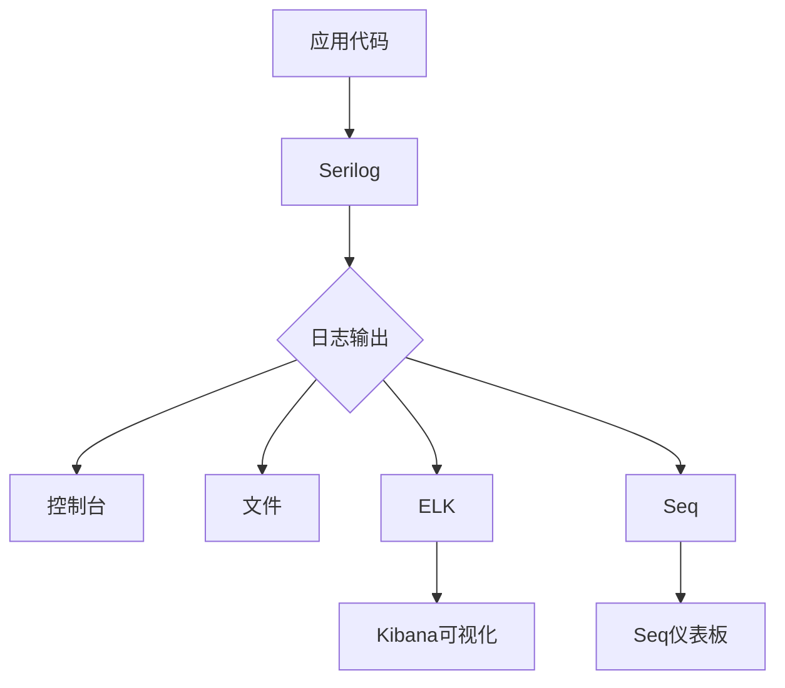
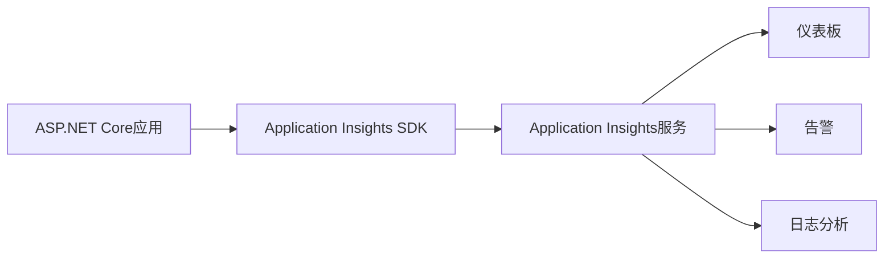
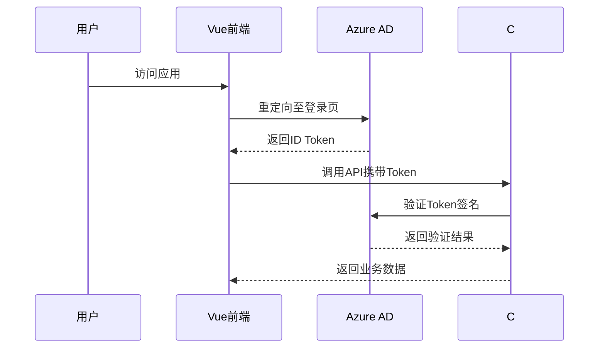
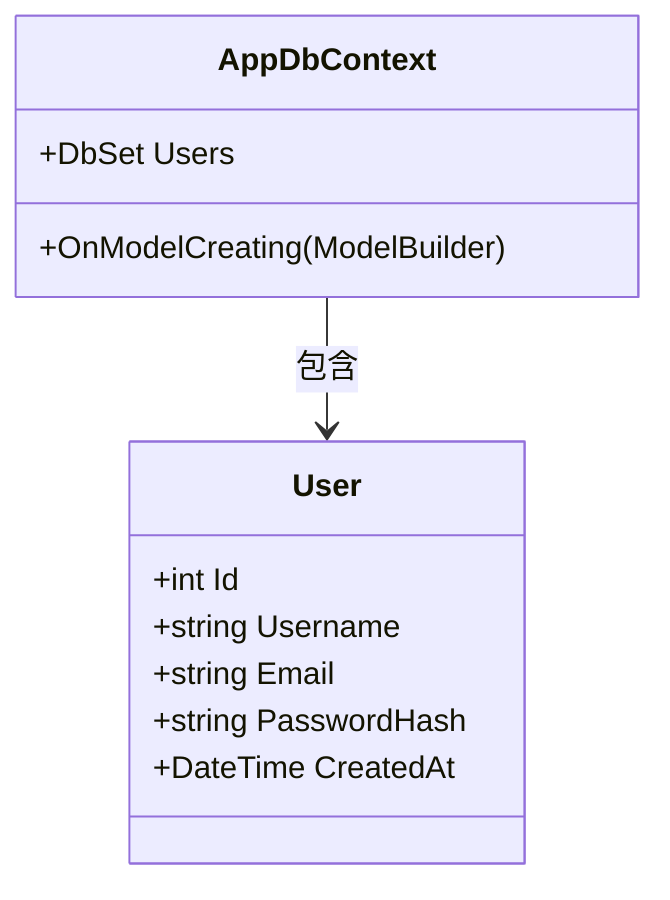
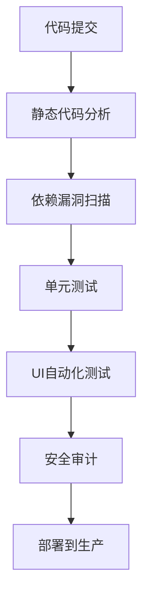

# 生产级系统演进路线图

<cite>
**本文档引用文件**  
- [README.md](file://vue-csharp-ui-auto/README.md)
- [Program.cs](file://vue-csharp-ui-auto/Backend/Program.cs)
- [appsettings.json](file://vue-csharp-ui-auto/Backend/appsettings.json)
- [AppDbContext.cs](file://vue-csharp-ui-auto/Backend/Models/AppDbContext.cs)
- [AuthController.cs](file://vue-csharp-ui-auto/Backend/Controllers/AuthController.cs)
- [AuthService.cs](file://vue-csharp-ui-auto/Backend/Services/AuthService.cs)
- [User.cs](file://vue-csharp-ui-auto/Backend/Models/User.cs)
- [LoginRequest.cs](file://vue-csharp-ui-auto/Backend/Models/LoginRequest.cs)
- [DataController.cs](file://vue-csharp-ui-auto/Backend/Controllers/DataController.cs)
- [DataService.cs](file://vue-csharp-ui-auto/Backend/Services/DataService.cs)
- [HealthController.cs](file://vue-csharp-ui-auto/Backend/Controllers/HealthController.cs)
- [DbInitializer.cs](file://vue-csharp-ui-auto/Backend/Models/DbInitializer.cs)
- [Login.vue](file://vue-csharp-ui-auto/Frontend/src/views/Login.vue)
- [test_vue_page.py](file://vue-csharp-ui-auto/UiAutoTest/test_vue_page.py)
</cite>

## 目录
1. [项目现状分析](#项目现状分析)  
2. [结构化日志与集中式日志平台集成](#结构化日志与集中式日志平台集成)  
3. [应用性能监控（APM）集成](#应用性能监控apm集成)  
4. [企业级身份认证集成](#企业级身份认证集成)  
5. [数据库持久化迁移方案](#数据库持久化迁移方案)  
6. [安全开发生命周期（SDL）建设](#安全开发生命周期sdl建设)  
7. [演进路线图总结](#演进路线图总结)

## 项目现状分析

当前项目为一个基于Vue前端与C# ASP.NET Core后端的演示系统，主要用于展示前后端集成与UI自动化测试流程。系统通过内存数据库（In-Memory Database）进行数据存储，使用硬编码的测试用户凭据进行身份验证，日志记录采用默认的ASP.NET Core内置日志机制，且缺乏性能监控与安全审计机制。

系统核心功能包括用户登录、数据提交与健康检查接口，已配置CORS以支持前端通信，并通过Python+Selenium实现UI自动化测试。项目结构清晰，具备基础的开发与测试能力，但尚未达到生产就绪标准。

**本节来源**  
- [README.md](file://vue-csharp-ui-auto/README.md#L1-L113)
- [Program.cs](file://vue-csharp-ui-auto/Backend/Program.cs#L24-L26)
- [AuthService.cs](file://vue-csharp-ui-auto/Backend/Services/AuthService.cs#L31-L32)
- [appsettings.json](file://vue-csharp-ui-auto/Backend/appsettings.json#L2-L6)

## 结构化日志与集中式日志平台集成

当前系统使用ASP.NET Core默认日志配置，仅输出基础信息级别日志，缺乏结构化与集中化管理能力。为满足生产环境操作审计与故障追踪需求，建议引入**Serilog**作为结构化日志框架，并集成**ELK（Elasticsearch, Logstash, Kibana）**或**Seq**作为集中式日志平台。

### 实施步骤：
1. 在`Backend`项目中安装Serilog相关NuGet包（如`Serilog.AspNetCore`、`Serilog.Sinks.Elasticsearch`或`Serilog.Sinks.Seq`）。
2. 在`Program.cs`中替换默认日志提供程序，配置Serilog写入器指向ELK或Seq。
3. 在关键业务逻辑（如登录、数据提交）中添加结构化日志记录，包含用户ID、操作类型、响应时间等上下文信息。
4. 配置Kibana或Seq仪表板，实现日志搜索、告警与可视化分析。



**图示来源**  
- [Program.cs](file://vue-csharp-ui-auto/Backend/Program.cs#L5-L55)
- [appsettings.json](file://vue-csharp-ui-auto/Backend/appsettings.json#L2-L6)

**本节来源**  
- [Program.cs](file://vue-csharp-ui-auto/Backend/Program.cs#L5-L55)
- [appsettings.json](file://vue-csharp-ui-auto/Backend/appsettings.json#L2-L6)

## 应用性能监控（APM）集成

当前系统缺乏实时性能监控与告警机制，难以及时发现性能瓶颈或异常。建议集成**Application Insights**（Azure Monitor）或**Prometheus + Grafana**实现APM能力。

### 实施建议：
1. 在Azure门户创建Application Insights资源，获取连接字符串。
2. 在`Backend`项目中安装`Microsoft.ApplicationInsights.AspNetCore` NuGet包。
3. 在`Program.cs`中调用`builder.Services.AddApplicationInsightsTelemetry()`启用监控。
4. 配置关键指标监控：API响应时间、错误率、数据库查询性能、依赖调用延迟。
5. 设置告警规则，如5xx错误率超过5%或平均响应时间超过1秒时触发通知。



**图示来源**  
- [Program.cs](file://vue-csharp-ui-auto/Backend/Program.cs#L5-L55)

**本节来源**  
- [Program.cs](file://vue-csharp-ui-auto/Backend/Program.cs#L5-L55)

## 企业级身份认证集成

当前系统使用硬编码密码进行身份验证，存在严重安全风险。建议迁移到**OAuth 2.0**或**OpenID Connect**协议，集成企业级身份提供商如**Azure AD**。

### 迁移步骤：
1. 在Azure AD中注册应用，配置重定向URI与API权限。
2. 在`Backend`项目中安装`Microsoft.AspNetCore.Authentication.JwtBearer`包。
3. 在`appsettings.json`中添加Azure AD配置（`ClientId`、`TenantId`、`Instance`）。
4. 在`Program.cs`中配置JWT Bearer认证：
   ```csharp
   builder.Services.AddAuthentication(JwtBearerDefaults.AuthenticationScheme)
       .AddMicrosoftIdentityWebApi(builder.Configuration);
   ```
5. 更新`AuthController`以支持Azure AD令牌验证，移除硬编码逻辑。
6. 前端Vue应用集成MSAL.js，实现登录重定向与令牌获取。



**图示来源**  
- [AuthController.cs](file://vue-csharp-ui-auto/Backend/Controllers/AuthController.cs#L7-L25)
- [AuthService.cs](file://vue-csharp-ui-auto/Backend/Services/AuthService.cs#L15-L64)
- [Login.vue](file://vue-csharp-ui-auto/Frontend/src/views/Login.vue#L1-L133)

**本节来源**  
- [AuthController.cs](file://vue-csharp-ui-auto/Backend/Controllers/AuthController.cs#L7-L25)
- [AuthService.cs](file://vue-csharp-ui-auto/Backend/Services/AuthService.cs#L15-L64)
- [appsettings.json](file://vue-csharp-ui-auto/Backend/appsettings.json#L12-L17)
- [Login.vue](file://vue-csharp-ui-auto/Frontend/src/views/Login.vue#L1-L133)

## 数据库持久化迁移方案

当前系统使用内存数据库（`UseInMemoryDatabase`），数据在应用重启后丢失，无法满足生产环境数据持久化需求。建议迁移到**SQL Server**或**PostgreSQL**。

### 迁移必要性：
- 数据持久化：避免重启导致数据丢失
- 数据一致性：支持事务、约束与外键
- 可扩展性：支持大数据量与高并发
- 备份与恢复：支持定期备份与灾难恢复

### 迁移步骤：
1. 在`appsettings.json`中启用`ConnectionStrings.DefaultConnection`配置。
2. 修改`Program.cs`中的数据库配置，替换为`UseSqlServer`或`UseNpgsql`：
   ```csharp
   builder.Services.AddDbContext<AppDbContext>(options =>
       options.UseSqlServer(builder.Configuration.GetConnectionString("DefaultConnection")));
   ```
3. 移除`DbInitializer.Initialize(context)`中的种子数据逻辑，改用EF Core迁移（Migrations）管理数据库变更。
4. 执行`Add-Migration InitialCreate`与`Update-Database`命令创建生产数据库。
5. 配置数据库连接池、超时与重试策略。



**图示来源**  
- [AppDbContext.cs](file://vue-csharp-ui-auto/Backend/Models/AppDbContext.cs#L5-L24)
- [User.cs](file://vue-csharp-ui-auto/Backend/Models/User.cs#L3-L11)
- [Program.cs](file://vue-csharp-ui-auto/Backend/Program.cs#L25-L26)
- [appsettings.json](file://vue-csharp-ui-auto/Backend/appsettings.json#L9-L11)

**本节来源**  
- [AppDbContext.cs](file://vue-csharp-ui-auto/Backend/Models/AppDbContext.cs#L5-L24)
- [User.cs](file://vue-csharp-ui-auto/Backend/Models/User.cs#L3-L11)
- [Program.cs](file://vue-csharp-ui-auto/Backend/Program.cs#L25-L26)
- [appsettings.json](file://vue-csharp-ui-auto/Backend/appsettings.json#L9-L11)
- [DbInitializer.cs](file://vue-csharp-ui-auto/Backend/Models/DbInitializer.cs#L7-L40)

## 安全开发生命周期（SDL）建设

为提升系统整体安全性，建议建立完整的安全开发生命周期（SDL），涵盖代码安全、依赖管理与定期审计。

### 核心措施：
1. **代码扫描**：集成SonarQube或GitHub Code Scanning，检测SQL注入、XSS、硬编码密钥等漏洞。
2. **依赖漏洞检测**：使用OWASP Dependency-Check或`dotnet list package --vulnerable`定期扫描NuGet包漏洞。
3. **安全配置**：
   - 移除`appsettings.json`中的测试JWT密钥，改用Azure Key Vault或环境变量。
   - 启用HTTPS强制重定向。
   - 配置安全HTTP头（如CSP、X-Content-Type-Options）。
4. **定期安全审计**：每季度进行渗透测试，审查身份验证、授权与数据访问逻辑。
5. **自动化安全测试**：在GitHub Actions工作流中集成安全扫描步骤。



**图示来源**  
- [test_vue_page.py](file://vue-csharp-ui-auto/UiAutoTest/test_vue_page.py#L1-L161)
- [appsettings.json](file://vue-csharp-ui-auto/Backend/appsettings.json#L13)
- [Program.cs](file://vue-csharp-ui-auto/Backend/Program.cs#L44)

**本节来源**  
- [appsettings.json](file://vue-csharp-ui-auto/Backend/appsettings.json#L13)
- [Program.cs](file://vue-csharp-ui-auto/Backend/Program.cs#L44)
- [test_vue_page.py](file://vue-csharp-ui-auto/UiAutoTest/test_vue_page.py#L1-L161)

## 演进路线图总结

本路线图系统性地规划了从当前演示项目到生产就绪系统的演进路径：

1. **日志与监控**：引入Serilog+ELK/Seq实现结构化日志，集成Application Insights实现APM。
2. **身份认证**：从硬编码验证迁移到Azure AD驱动的OpenID Connect认证。
3. **数据持久化**：从内存数据库迁移到SQL Server/PostgreSQL，确保数据可靠性。
4. **安全体系**：建立SDL，涵盖代码扫描、依赖检测与定期审计。

通过上述演进，系统将具备高可用性、可观测性与企业级安全性，满足生产环境部署要求。

**本节来源**  
- [README.md](file://vue-csharp-ui-auto/README.md#L1-L113)
- [Program.cs](file://vue-csharp-ui-auto/Backend/Program.cs#L5-L55)
- [appsettings.json](file://vue-csharp-ui-auto/Backend/appsettings.json#L9-L17)