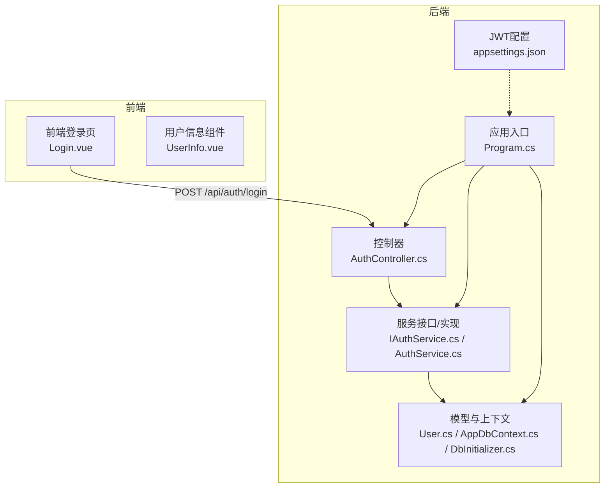
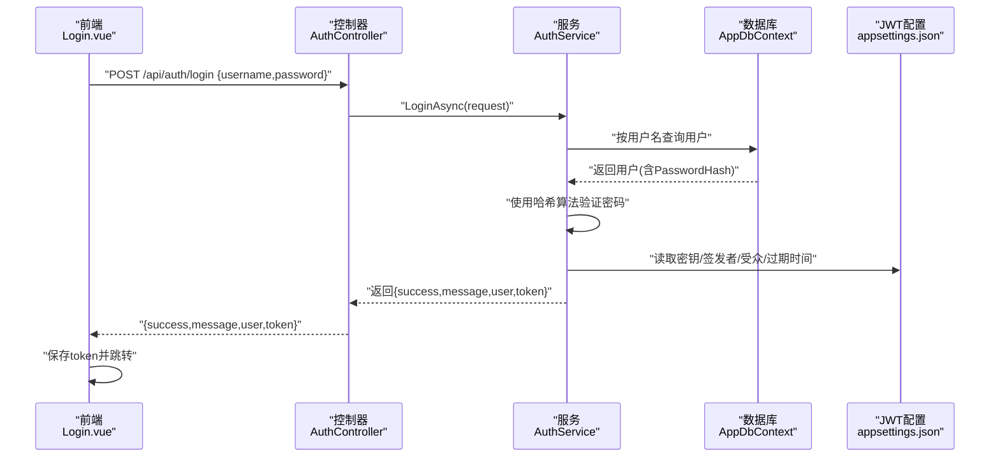
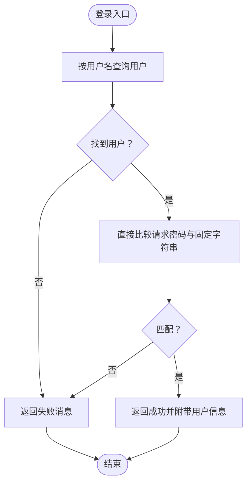
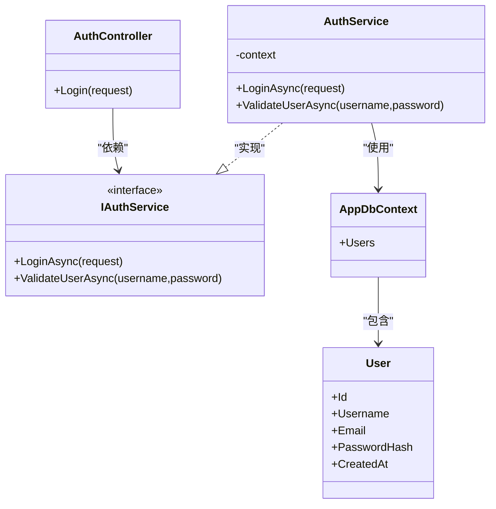

# 认证机制安全增强

<cite>
**本文引用的文件**
- [AuthService.cs](file://vue-csharp-ui-auto/Backend/Services/AuthService.cs)
- [IAuthService.cs](file://vue-csharp-ui-auto/Backend/Services/IAuthService.cs)
- [AuthController.cs](file://vue-csharp-ui-auto/Backend/Controllers/AuthController.cs)
- [User.cs](file://vue-csharp-ui-auto/Backend/Models/User.cs)
- [AppDbContext.cs](file://vue-csharp-ui-auto/Backend/Models/AppDbContext.cs)
- [DbInitializer.cs](file://vue-csharp-ui-auto/Backend/Models/DbInitializer.cs)
- [Program.cs](file://vue-csharp-ui-auto/Backend/Program.cs)
- [Login.vue](file://vue-csharp-ui-auto/Frontend/src/views/Login.vue)
- [UserInfo.vue](file://vue-csharp-ui-auto/Frontend/src/components/UserInfo.vue)
- [appsettings.json](file://vue-csharp-ui-auto/Backend/appsettings.json)
</cite>

## 目录
1. [引言](#引言)
2. [项目结构](#项目结构)
3. [核心组件](#核心组件)
4. [架构总览](#架构总览)
5. [详细组件分析](#详细组件分析)
6. [依赖关系分析](#依赖关系分析)
7. [性能与安全考量](#性能与安全考量)
8. [迁移与实施步骤](#迁移与实施步骤)
9. [故障排查指南](#故障排查指南)
10. [结论](#结论)

## 引言
本文件聚焦于后端认证服务的安全风险与加固路径，特别是针对当前明文密码验证存在的严重缺陷进行系统性分析，并提出基于密码哈希（BCrypt/PBKDF2）与JWT（JSON Web Token）的完整改造方案。同时，结合项目现有结构，给出从当前测试认证模式平滑迁移到安全认证体系的实施步骤，确保生产环境下的数据保护与访问控制。

## 项目结构
后端采用ASP.NET Core + EF Core（内存数据库）+ 前端Vue的前后端分离架构。认证相关的关键文件包括：
- 控制器：AuthController
- 服务层：AuthService（实现IAuthService）
- 数据模型：User、AppDbContext、DbInitializer
- 应用入口：Program.cs
- 前端登录页：Login.vue、用户信息组件UserInfo.vue
- JWT配置：appsettings.json

图表来源
- [AuthController.cs](file://vue-csharp-ui-auto/Backend/Controllers/AuthController.cs#L1-L25)
- [AuthService.cs](file://vue-csharp-ui-auto/Backend/Services/AuthService.cs#L1-L64)
- [IAuthService.cs](file://vue-csharp-ui-auto/Backend/Services/IAuthService.cs#L1-L10)
- [User.cs](file://vue-csharp-ui-auto/Backend/Models/User.cs#L1-L11)
- [AppDbContext.cs](file://vue-csharp-ui-auto/Backend/Models/AppDbContext.cs#L1-L24)
- [DbInitializer.cs](file://vue-csharp-ui-auto/Backend/Models/DbInitializer.cs#L1-L40)
- [Program.cs](file://vue-csharp-ui-auto/Backend/Program.cs#L1-L55)
- [appsettings.json](file://vue-csharp-ui-auto/Backend/appsettings.json#L1-L18)

章节来源
- [Program.cs](file://vue-csharp-ui-auto/Backend/Program.cs#L1-L55)
- [AuthController.cs](file://vue-csharp-ui-auto/Backend/Controllers/AuthController.cs#L1-L25)
- [AuthService.cs](file://vue-csharp-ui-auto/Backend/Services/AuthService.cs#L1-L64)
- [IAuthService.cs](file://vue-csharp-ui-auto/Backend/Services/IAuthService.cs#L1-L10)
- [User.cs](file://vue-csharp-ui-auto/Backend/Models/User.cs#L1-L11)
- [AppDbContext.cs](file://vue-csharp-ui-auto/Backend/Models/AppDbContext.cs#L1-L24)
- [DbInitializer.cs](file://vue-csharp-ui-auto/Backend/Models/DbInitializer.cs#L1-L40)
- [appsettings.json](file://vue-csharp-ui-auto/Backend/appsettings.json#L1-L18)

## 核心组件
- AuthController：暴露登录接口，接收用户名与密码，调用AuthService执行认证。
- AuthService：当前实现为简单字符串比较（测试用途），应改为哈希比对；同时需补充注册时的密码哈希存储与登录返回JWT。
- IAuthService：定义登录与用户校验接口。
- User：包含Id、Username、Email、PasswordHash、CreatedAt等字段；数据库约束要求PasswordHash非空。
- AppDbContext：定义Users表及属性约束。
- DbInitializer：初始化种子用户，当前PasswordHash为占位值（测试用途）。
- Program.cs：注册服务、启用Swagger/CORS、EF内存数据库、映射控制器。
- 前端Login.vue：向后端发起登录请求；UserInfo.vue：模拟本地存储令牌并显示登录状态。

章节来源
- [AuthController.cs](file://vue-csharp-ui-auto/Backend/Controllers/AuthController.cs#L1-L25)
- [AuthService.cs](file://vue-csharp-ui-auto/Backend/Services/AuthService.cs#L1-L64)
- [IAuthService.cs](file://vue-csharp-ui-auto/Backend/Services/IAuthService.cs#L1-L10)
- [User.cs](file://vue-csharp-ui-auto/Backend/Models/User.cs#L1-L11)
- [AppDbContext.cs](file://vue-csharp-ui-auto/Backend/Models/AppDbContext.cs#L1-L24)
- [DbInitializer.cs](file://vue-csharp-ui-auto/Backend/Models/DbInitializer.cs#L1-L40)
- [Program.cs](file://vue-csharp-ui-auto/Backend/Program.cs#L1-L55)
- [Login.vue](file://vue-csharp-ui-auto/Frontend/src/views/Login.vue#L1-L133)
- [UserInfo.vue](file://vue-csharp-ui-auto/Frontend/src/components/UserInfo.vue#L1-L81)

## 架构总览
当前认证流程为“前端提交用户名/密码 -> 后端简单比较 -> 返回结果”。为实现安全认证，需要：
- 注册阶段：使用BCrypt或PBKDF2对明文密码进行哈希存储。
- 登录阶段：根据用户名查询用户，使用哈希算法验证密码；通过后签发JWT。
- 前端：保存JWT并在后续请求头携带；后端启用JWT Bearer认证中间件进行授权。

图表来源
- [AuthController.cs](file://vue-csharp-ui-auto/Backend/Controllers/AuthController.cs#L1-L25)
- [AuthService.cs](file://vue-csharp-ui-auto/Backend/Services/AuthService.cs#L1-L64)
- [AppDbContext.cs](file://vue-csharp-ui-auto/Backend/Models/AppDbContext.cs#L1-L24)
- [appsettings.json](file://vue-csharp-ui-auto/Backend/appsettings.json#L1-L18)

## 详细组件分析

### 当前认证实现的安全风险
- 明文密码验证：登录方法中直接比较请求密码与固定字符串，存在严重安全隐患。
- 密码存储字段存在但未被正确使用：实体定义了PasswordHash字段且数据库约束要求非空，但当前未进行哈希存储。
- 缺少JWT：LoginResponse中存在Token字段，但当前实现未生成与返回。

图表来源
- [AuthService.cs](file://vue-csharp-ui-auto/Backend/Services/AuthService.cs#L15-L62)

章节来源
- [AuthService.cs](file://vue-csharp-ui-auto/Backend/Services/AuthService.cs#L15-L62)
- [User.cs](file://vue-csharp-ui-auto/Backend/Models/User.cs#L1-L11)
- [AppDbContext.cs](file://vue-csharp-ui-auto/Backend/Models/AppDbContext.cs#L13-L21)

### 密码哈希方案设计（BCrypt/PBKDF2）
- 存储策略：注册时对明文密码进行哈希（推荐BCrypt或PBKDF2），仅存储哈希值与必要参数（如盐）。
- 验证策略：登录时根据用户名查询用户，使用相同哈希算法与参数验证请求密码。
- 安全要点：
  - 使用不可逆哈希，避免明文泄露。
  - 选择高成本参数以抵御暴力破解。
  - 对不同用户使用独立随机盐。
  - 避免在日志中记录密码或哈希。

章节来源
- [User.cs](file://vue-csharp-ui-auto/Backend/Models/User.cs#L1-L11)
- [AppDbContext.cs](file://vue-csharp-ui-auto/Backend/Models/AppDbContext.cs#L13-L21)
- [DbInitializer.cs](file://vue-csharp-ui-auto/Backend/Models/DbInitializer.cs#L16-L38)

### JWT集成与流程
- 生成与签名：登录成功后，依据appsettings.json中的密钥、签发者、受众与过期时间生成JWT。
- 验证流程：客户端在后续请求头携带Authorization: Bearer <token>；后端启用JWT Bearer中间件进行验证。
- 刷新与过期：建议采用短期访问令牌+刷新令牌机制，刷新令牌单独存储并限制使用次数与有效期。
- 防重放：使用短期过期时间、唯一JTI（JWT ID）、黑名单/白名单策略（可选）。

章节来源
- [appsettings.json](file://vue-csharp-ui-auto/Backend/appsettings.json#L12-L17)
- [AuthController.cs](file://vue-csharp-ui-auto/Backend/Controllers/AuthController.cs#L1-L25)

### 前端交互与状态管理
- 登录成功后，前端应保存token（localStorage/sessionStorage），并在路由守卫或拦截器中注入到请求头。
- 用户信息组件应读取本地token判断登录状态，登出时清理token与用户信息。

章节来源
- [Login.vue](file://vue-csharp-ui-auto/Frontend/src/views/Login.vue#L52-L77)
- [UserInfo.vue](file://vue-csharp-ui-auto/Frontend/src/components/UserInfo.vue#L36-L51)

## 依赖关系分析
- 控制器依赖服务接口IAuthService，服务实现依赖数据库上下文AppDbContext。
- Program.cs负责注册服务、启用中间件与映射控制器。
- 前端通过Axios调用后端API，Login.vue负责发起登录请求，UserInfo.vue负责状态展示与登出。

图表来源
- [AuthController.cs](file://vue-csharp-ui-auto/Backend/Controllers/AuthController.cs#L1-L25)
- [IAuthService.cs](file://vue-csharp-ui-auto/Backend/Services/IAuthService.cs#L1-L10)
- [AuthService.cs](file://vue-csharp-ui-auto/Backend/Services/AuthService.cs#L1-L64)
- [User.cs](file://vue-csharp-ui-auto/Backend/Models/User.cs#L1-L11)
- [AppDbContext.cs](file://vue-csharp-ui-auto/Backend/Models/AppDbContext.cs#L1-L24)

章节来源
- [AuthController.cs](file://vue-csharp-ui-auto/Backend/Controllers/AuthController.cs#L1-L25)
- [IAuthService.cs](file://vue-csharp-ui-auto/Backend/Services/IAuthService.cs#L1-L10)
- [AuthService.cs](file://vue-csharp-ui-auto/Backend/Services/AuthService.cs#L1-L64)
- [AppDbContext.cs](file://vue-csharp-ui-auto/Backend/Models/AppDbContext.cs#L1-L24)

## 性能与安全考量
- 密码哈希成本：BCrypt/PBKDF2的成本参数应平衡用户体验与安全性，避免过低导致易受攻击。
- 数据库查询：按用户名查询用户应建立索引，减少查询延迟。
- JWT大小：避免在payload中放入敏感信息，保持短小精悍。
- 过期与刷新：合理设置过期时间，提供刷新令牌以降低频繁登录成本。
- 日志与审计：避免记录密码、哈希与完整JWT；对异常登录行为进行审计。

[本节为通用指导，不直接分析具体文件]

## 迁移与实施步骤
为从当前测试认证模式平滑过渡到安全认证体系，建议分步实施：

- 第一步：完善数据模型与初始化
  - 在User实体中保留PasswordHash字段，确保数据库约束生效。
  - 初始化种子用户时，使用哈希后的PasswordHash而非明文。
  
  章节来源
  - [User.cs](file://vue-csharp-ui-auto/Backend/Models/User.cs#L1-L11)
  - [AppDbContext.cs](file://vue-csharp-ui-auto/Backend/Models/AppDbContext.cs#L13-L21)
  - [DbInitializer.cs](file://vue-csharp-ui-auto/Backend/Models/DbInitializer.cs#L16-L38)

- 第二步：实现密码哈希与验证
  - 注册流程：对明文密码进行BCrypt/PBKDF2哈希，保存PasswordHash。
  - 登录流程：按用户名查询用户，使用相同算法验证请求密码。
  
  章节来源
  - [AuthService.cs](file://vue-csharp-ui-auto/Backend/Services/AuthService.cs#L15-L62)
  - [User.cs](file://vue-csharp-ui-auto/Backend/Models/User.cs#L1-L11)

- 第三步：集成JWT Bearer认证
  - 在Program.cs中启用JWT Bearer中间件，配置密钥、签发者、受众与过期时间。
  - 登录成功后生成并返回JWT；后续接口通过Authorize特性保护。
  
  章节来源
  - [Program.cs](file://vue-csharp-ui-auto/Backend/Program.cs#L1-L55)
  - [appsettings.json](file://vue-csharp-ui-auto/Backend/appsettings.json#L12-L17)
  - [AuthController.cs](file://vue-csharp-ui-auto/Backend/Controllers/AuthController.cs#L1-L25)

- 第四步：前端适配
  - 登录成功后保存token；在请求拦截器中自动附加Authorization: Bearer。
  - 用户信息组件根据token更新登录状态；登出时清理本地存储。
  
  章节来源
  - [Login.vue](file://vue-csharp-ui-auto/Frontend/src/views/Login.vue#L52-L77)
  - [UserInfo.vue](file://vue-csharp-ui-auto/Frontend/src/components/UserInfo.vue#L36-L51)

- 第五步：令牌过期与刷新机制
  - 设置短期访问令牌与长期刷新令牌；刷新令牌单独存储并限制使用。
  - 提供刷新接口，客户端在访问令牌即将过期时换取新令牌。
  
  章节来源
  - [appsettings.json](file://vue-csharp-ui-auto/Backend/appsettings.json#L12-L17)

- 第六步：防重放与安全加固
  - 使用短期过期时间；对关键操作增加二次验证。
  - 记录异常登录行为并触发风控策略。
  
  章节来源
  - [appsettings.json](file://vue-csharp-ui-auto/Backend/appsettings.json#L12-L17)

## 故障排查指南
- 登录失败
  - 检查用户名是否存在；确认PasswordHash是否正确写入。
  - 确认JWT配置项（密钥、签发者、受众、过期时间）是否正确。
  
  章节来源
  - [AuthService.cs](file://vue-csharp-ui-auto/Backend/Services/AuthService.cs#L15-L62)
  - [DbInitializer.cs](file://vue-csharp-ui-auto/Backend/Models/DbInitializer.cs#L16-L38)
  - [appsettings.json](file://vue-csharp-ui-auto/Backend/appsettings.json#L12-L17)

- 前端无法携带令牌
  - 确认拦截器已注入Authorization头；检查localStorage中token是否持久化。
  
  章节来源
  - [Login.vue](file://vue-csharp-ui-auto/Frontend/src/views/Login.vue#L52-L77)
  - [UserInfo.vue](file://vue-csharp-ui-auto/Frontend/src/components/UserInfo.vue#L36-L51)

- 授权失败
  - 检查JWT中间件是否启用；核对签发者与受众是否匹配。
  
  章节来源
  - [Program.cs](file://vue-csharp-ui-auto/Backend/Program.cs#L1-L55)
  - [appsettings.json](file://vue-csharp-ui-auto/Backend/appsettings.json#L12-L17)

## 结论
当前实现存在明文密码验证与缺少JWT的重大安全风险。通过引入BCrypt/PBKDF2进行密码哈希存储与验证，并在登录成功后签发JWT，配合短期令牌与刷新机制以及前端令牌持久化与拦截器注入，可显著提升系统的安全性与可用性。建议按照迁移步骤逐步实施，确保在不影响业务连续性的前提下完成安全加固。