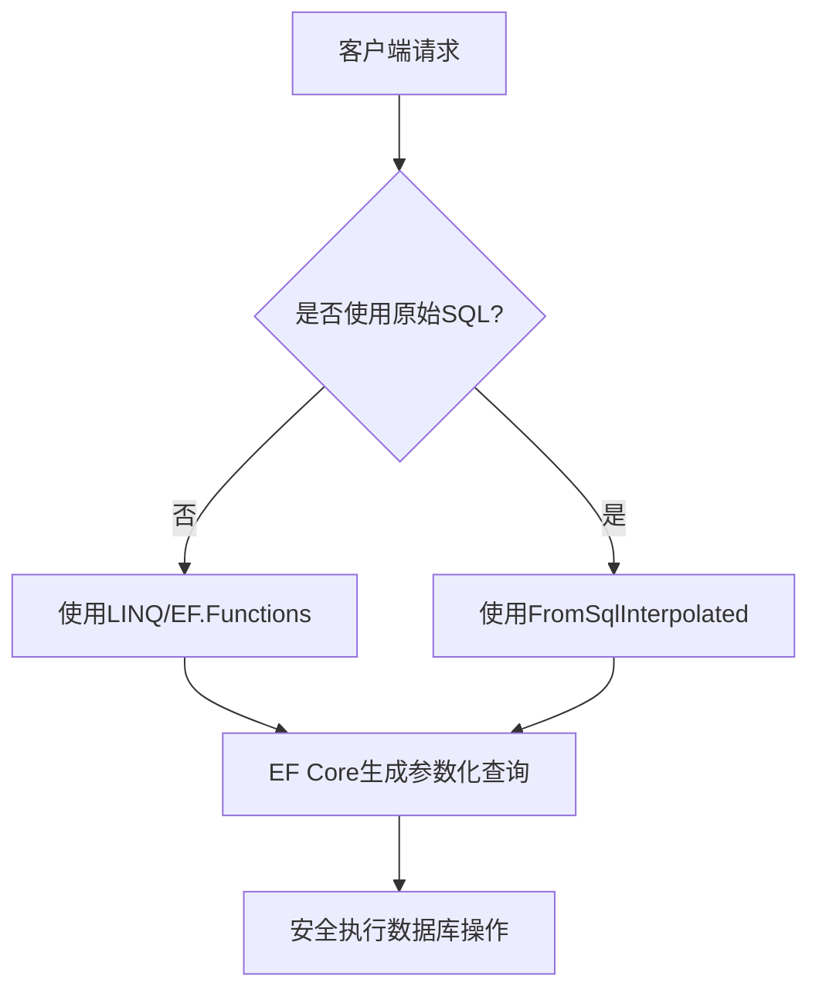
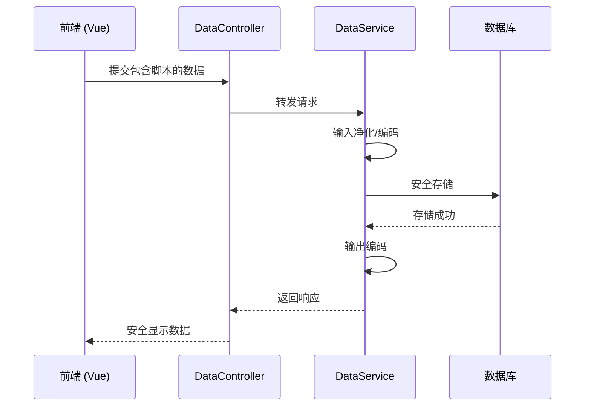
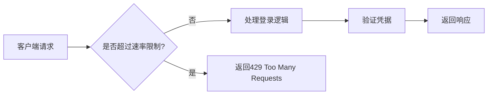
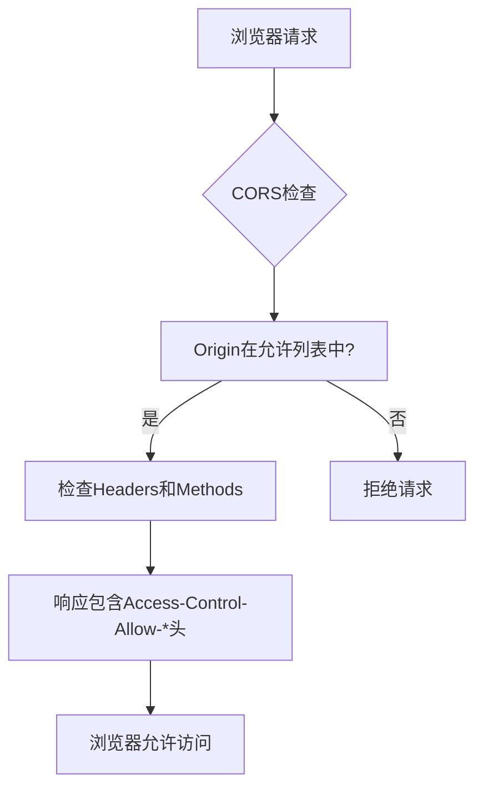

# 输入验证与常见攻击防护

<cite>
**本文档引用的文件**   
- [AuthController.cs](file://vue-csharp-ui-auto/Backend/Controllers/AuthController.cs)
- [DataController.cs](file://vue-csharp-ui-auto/Backend/Controllers/DataController.cs)
- [LoginRequest.cs](file://vue-csharp-ui-auto/Backend/Models/LoginRequest.cs)
- [SubmitDataRequest.cs](file://vue-csharp-ui-auto/Backend/Models/LoginRequest.cs)
- [AuthService.cs](file://vue-csharp-ui-auto/Backend/Services/AuthService.cs)
- [DataService.cs](file://vue-csharp-ui-auto/Backend/Services/DataService.cs)
- [AppDbContext.cs](file://vue-csharp-ui-auto/Backend/Models/AppDbContext.cs)
- [Program.cs](file://vue-csharp-ui-auto/Backend/Program.cs)
- [appsettings.json](file://vue-csharp-ui-auto/Backend/appsettings.json)
</cite>

## 目录
1. [输入验证强化策略](#输入验证强化策略)
2. [SQL注入防护](#sql注入防护)
3. [跨站脚本（XSS）攻击防护](#跨站脚本xss攻击防护)
4. [速率限制（Rate Limiting）方案](#速率限制rate-limiting方案)
5. [CORS策略精细化控制](#cors策略精细化控制)

## 输入验证强化策略

当前系统中，`AuthController` 和 `DataController` 的 API 端点接收的请求模型（如 `LoginRequest` 和 `SubmitDataRequest`）缺乏基础的输入验证机制。建议在模型层面使用 **Data Annotations** 实现声明式验证，以确保输入数据的合法性。

在 `LoginRequest` 类中，应添加以下验证属性：
- `[Required]`：确保用户名和密码字段不为空
- `[StringLength]`：限制用户名和密码的最大长度，防止过长输入
- `[RegularExpression]`：对密码实施复杂度要求（如包含大小写字母、数字和特殊字符）

在 `SubmitDataRequest` 类中，应添加：
- `[Required]`：确保姓名和邮箱字段必填
- `[EmailAddress]`：验证邮箱格式合法性
- `[StringLength]`：限制字段长度，避免数据库存储问题

此外，在服务层（如 `AuthService` 和 `DataService`）应实施业务规则校验。例如，在 `LoginAsync` 方法中，除了验证用户存在性外，还应检查账户状态（是否被锁定、是否已激活等），并在多次失败登录后实施临时锁定机制。

**Section sources**
- [LoginRequest.cs](file://vue-csharp-ui-auto/Backend/Models/LoginRequest.cs#L3-L7)
- [SubmitDataRequest.cs](file://vue-csharp-ui-auto/Backend/Models/LoginRequest.cs#L17-L21)
- [AuthService.cs](file://vue-csharp-ui-auto/Backend/Services/AuthService.cs#L15-L48)
- [DataService.cs](file://vue-csharp-ui-auto/Backend/Services/DataService.cs#L7-L28)

## SQL注入防护

尽管项目使用了 Entity Framework Core，其参数化查询机制已提供一定程度的 SQL 注入防护，但仍需警惕潜在风险，尤其是在未来可能引入原始 SQL 查询或动态查询拼接的场景。

在 `AuthService` 中，当前使用 LINQ 查询用户：
```csharp
var user = await _context.Users.FirstOrDefaultAsync(u => u.Username == request.Username);
```
此写法由 EF Core 自动转换为参数化查询，是安全的。但若未来改为使用 `FromSqlRaw` 或字符串拼接方式，则可能引入漏洞。

建议：
1. 避免使用 `FromSqlRaw`，优先使用 `FromSqlInterpolated`，后者会自动对插值表达式进行参数化处理
2. 如需动态查询，使用 `EF.Functions` 提供的安全方法，而非字符串拼接
3. 在 `AppDbContext` 中，确保所有数据库操作均通过强类型实体进行，避免直接执行 SQL 字符串



**Diagram sources**
- [AuthService.cs](file://vue-csharp-ui-auto/Backend/Services/AuthService.cs#L17-L18)
- [AppDbContext.cs](file://vue-csharp-ui-auto/Backend/Models/AppDbContext.cs#L11-L23)

## 跨站脚本（XSS）攻击防护

XSS 攻击可能通过 `DataController` 的 `Submit` 接口提交恶意脚本。当前 `DataService` 仅检查字段是否为空，但未对内容进行清理或编码。

建议：
1. 在服务层对输入数据进行净化处理，移除或转义潜在的脚本标签
2. 在输出到前端前，对响应数据进行 HTML 编码，特别是在 `SubmitDataResponse` 中包含用户输入内容时
3. 在前端 Vue 组件（如 `UserInfo.vue`）中，使用 `v-html` 时需格外谨慎，优先使用文本插值 `{}`

在 `DataService` 的 `SubmitDataAsync` 方法中，应在处理前对 `request.Name` 和 `request.Email` 进行内容检查：
- 使用正则表达式过滤特殊字符
- 或集成 HTML 清理库（如 HtmlSanitizer）进行净化



**Diagram sources**
- [DataController.cs](file://vue-csharp-ui-auto/Backend/Controllers/DataController.cs#L18-L23)
- [DataService.cs](file://vue-csharp-ui-auto/Backend/Services/DataService.cs#L7-L28)
- [UserInfo.vue](file://vue-csharp-ui-auto/Frontend/src/components/UserInfo.vue)

## 速率限制（Rate Limiting）方案

为防止暴力破解登录接口，建议实施速率限制策略。当前 `AuthController` 的 `Login` 端点无任何限流机制。

推荐使用 `AspNetCoreRateLimit` 中间件实现 IP 或用户级别的请求限制。配置步骤如下：

1. 在 `Backend.csproj` 中添加 NuGet 包引用：
```xml
<PackageReference Include="AspNetCoreRateLimit" Version="4.5.0" />
```

2. 在 `Program.cs` 中注册限流服务：
```csharp
builder.Services.AddMemoryCache();
builder.Services.Configure<IpRateLimitOptions>(Configuration.GetSection("IpRateLimiting"));
builder.Services.AddSingleton<IIpPolicyStore, MemoryCacheIpPolicyStore>();
builder.Services.AddSingleton<IRateLimitCounterStore, MemoryCacheRateLimitCounterStore>();
builder.Services.AddSingleton<IRateLimitConfiguration, RateLimitConfiguration>();
```

3. 在 `appsettings.json` 中配置限流规则：
```json
"IpRateLimiting": {
  "EnableEndpointRateLimiting": true,
  "StackBlockedRequests": false,
  "HttpStatusCode": 429,
  "GeneralRules": [
    {
      "Endpoint": "POST:/api/auth/login",
      "Period": "1m",
      "Limit": 5
    }
  ]
}
```

4. 在请求管道中启用中间件：
```csharp
app.UseIpRateLimiting();
```

此配置将限制每个 IP 每分钟最多发起 5 次登录请求，超过则返回 429 状态码。



**Diagram sources**
- [AuthController.cs](file://vue-csharp-ui-auto/Backend/Controllers/AuthController.cs#L18-L23)
- [Program.cs](file://vue-csharp-ui-auto/Backend/Program.cs#L7-L55)
- [appsettings.json](file://vue-csharp-ui-auto/Backend/appsettings.json#L1-L18)

## CORS策略精细化控制

当前项目已在 `Program.cs` 中配置了 CORS 策略 `AllowVueApp`，仅允许特定的 Vue 前端源访问，避免了使用 `AllowAnyOrigin` 的安全风险。

现有配置已较为合理：
```csharp
policy.WithOrigins("http://localhost:8080", "https://localhost:8080", "http://127.0.0.1:8080", "https://127.0.0.1:8080")
      .AllowAnyHeader()
      .AllowAnyMethod();
```

建议进一步优化：
1. 在生产环境中，应使用更严格的源限制，避免包含 `http://` 协议
2. 明确指定允许的 HTTP 方法（如仅 `GET`、`POST`），而非 `AllowAnyMethod`
3. 添加 `AllowCredentials` 时需谨慎，确保与 `WithOrigins` 配合使用，避免凭证泄露



**Diagram sources**
- [Program.cs](file://vue-csharp-ui-auto/Backend/Program.cs#L13-L22)
- [AuthController.cs](file://vue-csharp-ui-auto/Backend/Controllers/AuthController.cs#L7-L9)