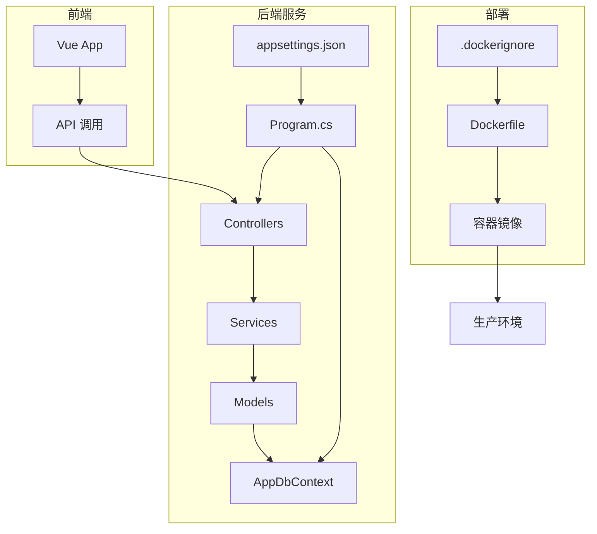
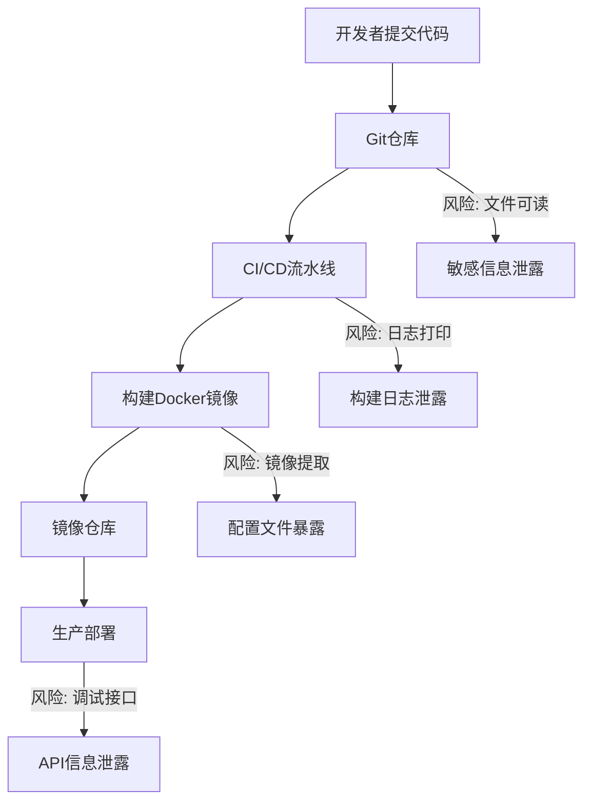

# 配置管理与密钥安全

<cite>
**本文档引用的文件**  
- [appsettings.json](file://vue-csharp-ui-auto/Backend/appsettings.json)
- [Program.cs](file://vue-csharp-ui-auto/Backend/Program.cs)
- [AppDbContext.cs](file://vue-csharp-ui-auto/Backend/Models/AppDbContext.cs)
- [AuthService.cs](file://vue-csharp-ui-auto/Backend/Services/AuthService.cs)
- [Dockerfile](file://ConsoleApp1/Dockerfile)
- [Backend.csproj](file://vue-csharp-ui-auto/Backend/Backend.csproj)
- [.dockerignore](file://ConsoleApp1/.dockerignore)
</cite>

## 目录
1. [引言](#引言)
2. [项目结构](#项目结构)
3. [核心配置分析](#核心配置分析)
4. [安全风险评估](#安全风险评估)
5. [环境变量替代方案](#环境变量替代方案)
6. [集中式密钥管理服务](#集中式密钥管理服务)
7. [多环境配置管理最佳实践](#多环境配置管理最佳实践)
8. [配置文件版本控制策略](#配置文件版本控制策略)
9. [结论](#结论)

## 引言
本文档旨在评估当前项目中 `appsettings.json` 文件内硬编码配置项（如数据库连接字符串、JWT密钥等）所带来的安全风险，特别是在CI/CD流水线和容器化部署场景下的敏感信息泄露隐患。通过分析现有代码结构，提出使用环境变量替代敏感配置的实践方法，并推荐引入Azure Key Vault、AWS Secrets Manager或Docker Secrets等集中式配置管理服务。同时，提供在开发、测试、生产等不同环境中安全切换配置的最佳实践，确保配置信息在版本控制系统中不暴露敏感数据。

## 项目结构
本项目包含两个主要子系统：一个基于ASP.NET Core的后端API服务和一个控制台应用，后者已配置为支持Docker容器化部署。后端服务与Vue前端集成，采用典型的分层架构（Controllers、Models、Services），并通过`appsettings.json`进行配置管理。



**图示来源**  
- [appsettings.json](file://vue-csharp-ui-auto/Backend/appsettings.json)
- [Program.cs](file://vue-csharp-ui-auto/Backend/Program.cs)
- [AppDbContext.cs](file://vue-csharp-ui-auto/Backend/Models/AppDbContext.cs)
- [Dockerfile](file://ConsoleApp1/Dockerfile)
- [.dockerignore](file://ConsoleApp1/.dockerignore)

**本节来源**  
- [appsettings.json](file://vue-csharp-ui-auto/Backend/appsettings.json)
- [Backend.csproj](file://vue-csharp-ui-auto/Backend/Backend.csproj)
- [Dockerfile](file://ConsoleApp1/Dockerfile)

## 核心配置分析
当前后端服务的 `appsettings.json` 文件中包含多个敏感配置项，这些配置在应用程序启动时由`Program.cs`通过ASP.NET Core的`IConfiguration`接口加载。

### 敏感配置项识别
- **数据库连接字符串**：`ConnectionStrings:DefaultConnection` 包含本地数据库路径和信任连接信息
- **JWT安全密钥**：`JwtSettings:Key` 使用明文硬编码的测试密钥 `"SuperSecretKeyForTestingOnlyDontUseInProduction"`
- **JWT发行方与受众**：虽非密钥，但属于应环境化配置的参数

这些配置在`Program.cs`中通过`builder.Configuration`被间接使用，例如在配置数据库上下文时：

```csharp
builder.Services.AddDbContext<AppDbContext>(options =>
    options.UseInMemoryDatabase("TestDb"));
```

尽管当前使用的是内存数据库，但配置结构表明其设计意图支持SQL Server连接。

**本节来源**  
- [appsettings.json](file://vue-csharp-ui-auto/Backend/appsettings.json#L9-L17)
- [Program.cs](file://vue-csharp-ui-auto/Backend/Program.cs#L24-L26)

## 安全风险评估
硬编码配置在CI/CD和容器化部署中存在严重安全隐患：

### CI/CD 流水线风险
- **源码泄露**：`appsettings.json` 提交至Git仓库，任何有权限访问仓库的人员均可查看敏感信息
- **构建日志泄露**：CI构建过程中若打印配置，可能被日志系统记录
- **第三方依赖扫描**：自动化安全扫描工具可能标记此类文件为高风险

### 容器化部署风险
- **镜像层泄露**：Docker镜像中包含`appsettings.json`，即使运行时不可访问，仍可通过`docker history`或镜像提取查看
- **环境变量注入缺失**：当前Dockerfile未配置环境变量注入机制，无法实现运行时配置覆盖
- **调试模式暴露**：开发环境启用Swagger UI，若配置不当可能暴露API和配置信息



**图示来源**  
- [appsettings.json](file://vue-csharp-ui-auto/Backend/appsettings.json)
- [Dockerfile](file://ConsoleApp1/Dockerfile)
- [Program.cs](file://vue-csharp-ui-auto/Backend/Program.cs)

**本节来源**  
- [appsettings.json](file://vue-csharp-ui-auto/Backend/appsettings.json)
- [Dockerfile](file://ConsoleApp1/Dockerfile)
- [Program.cs](file://vue-csharp-ui-auto/Backend/Program.cs#L35-L39)

## 环境变量替代方案
ASP.NET Core原生支持从环境变量读取配置，优先级高于`appsettings.json`。

### 配置读取机制
ASP.NET Core按以下顺序加载配置（后加载的覆盖先加载的）：
1. `appsettings.json`
2. `appsettings.{Environment}.json`
3. 环境变量
4. 命令行参数

### 编码实践
使用`IConfiguration`接口安全读取环境变量：

```csharp
// 在 Program.cs 或服务中
var jwtKey = builder.Configuration["JwtSettings:Key"];
var connectionString = builder.Configuration.GetConnectionString("DefaultConnection");
```

环境变量命名需遵循特定格式：
- `JwtSettings__Key` 对应 `JwtSettings:Key`
- `ConnectionStrings__DefaultConnection` 对应连接字符串

### Docker 环境变量注入
在`docker run`时通过`-e`参数注入：

```bash
docker run -e "JwtSettings__Key=production_secure_key" \
           -e "ConnectionStrings__DefaultConnection=Server=prod_db;Database=AppDb;..." \
           my-app-image
```

或使用`.env`文件：

```bash
docker run --env-file .env my-app-image
```

**本节来源**  
- [Program.cs](file://vue-csharp-ui-auto/Backend/Program.cs)
- [appsettings.json](file://vue-csharp-ui-auto/Backend/appsettings.json)

## 集中式密钥管理服务
为实现更高级别的安全性和审计能力，建议集成专业密钥管理服务。

### 推荐方案对比
| 服务 | 适用场景 | ASP.NET Core 集成方式 |
|------|----------|---------------------|
| Azure Key Vault | Azure云环境 | `Azure.Extensions.AspNetCore.Configuration.Secrets` |
| AWS Secrets Manager | AWS云环境 | `Amazon.Extensions.Configuration.SystemsManager` |
| Docker Secrets | Docker Swarm/K8s | 挂载`/run/secrets`目录 |
| HashiCorp Vault | 混合云/本地 | 自定义`IConfigurationSource` |

### Azure Key Vault 集成示例
```csharp
// Program.cs
builder.Configuration.AddAzureKeyVault(
    new Uri("https://your-vault.vault.azure.net/"),
    new DefaultAzureCredential());
```

此方式在应用启动时从Key Vault动态获取密钥，避免任何本地存储。

**本节来源**  
- [Program.cs](file://vue-csharp-ui-auto/Backend/Program.cs)

## 多环境配置管理最佳实践
实现安全的多环境配置切换策略。

### 配置层次结构
```
appsettings.json          # 公共默认配置
appsettings.Development.json  # 开发专用（.gitignore）
appsettings.Production.json   # 生产专用（不提交）
```

### 环境感知配置
```csharp
if (builder.Environment.IsDevelopment())
{
    builder.Services.AddDbContext<AppDbContext>(options =>
        options.UseInMemoryDatabase("DevDb"));
}
else
{
    // 从环境变量或Key Vault读取生产连接字符串
    builder.Services.AddDbContext<AppDbContext>(options =>
        options.UseSqlServer(builder.Configuration.GetConnectionString("DefaultConnection")));
}
```

### CI/CD 变量注入
在CI/CD管道中设置环境变量，而非提交配置文件：
- GitHub Actions: `secrets` 上下文
- Azure DevOps: 变量组
- Jenkins: Credentials Binding

**本节来源**  
- [Program.cs](file://vue-csharp-ui-auto/Backend/Program.cs#L35-L39)
- [appsettings.json](file://vue-csharp-ui-auto/Backend/appsettings.json)

## 配置文件版本控制策略
确保配置文件在版本控制中的安全性。

### .gitignore 规则
```gitignore
# 敏感配置文件
appsettings.Production.json
secrets.json

# 环境文件
.env
.env.local

# 本地开发配置
launchSettings.json
```

### 安全的配置模板
提供`appsettings.json.example`作为模板：

```json
{
  "JwtSettings": {
    "Key": "PLACEHOLDER_KEY",
    "Issuer": "MyApp",
    "Audience": "MyUsers"
  },
  "ConnectionStrings": {
    "DefaultConnection": "Server=localhost;Database=AppDb;..."
  }
}
```

### Docker 安全实践
- 在`.dockerignore`中排除敏感文件
- 使用多阶段构建分离构建与运行环境
- 运行时容器不包含源码和配置文件

```dockerfile
# .dockerignore 示例
**/appsettings.Production.json
**/.env
**/secrets/
```

**图示来源**  
- [.dockerignore](file://ConsoleApp1/.dockerignore)
- [Dockerfile](file://ConsoleApp1/Dockerfile)

**本节来源**  
- [.dockerignore](file://ConsoleApp1/.dockerignore)
- [Dockerfile](file://ConsoleApp1/Dockerfile)

## 结论
当前项目在`appsettings.json`中硬编码敏感配置存在显著安全风险，特别是在容器化部署场景下。建议立即采取以下措施：
1. **迁移至环境变量**：将JWT密钥、数据库连接字符串等敏感信息移至环境变量
2. **实施配置分层**：使用`appsettings.{Environment}.json`实现环境差异化配置
3. **集成密钥管理服务**：在生产环境中采用Azure Key Vault或类似服务
4. **强化CI/CD安全**：通过CI/CD系统注入密钥，避免源码中存储
5. **完善.gitignore**：确保敏感配置文件不被提交至版本控制

通过以上实践，可显著提升应用的安全性，满足现代云原生应用的安全合规要求。