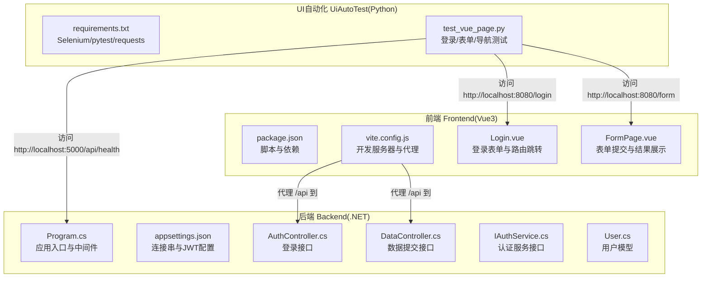
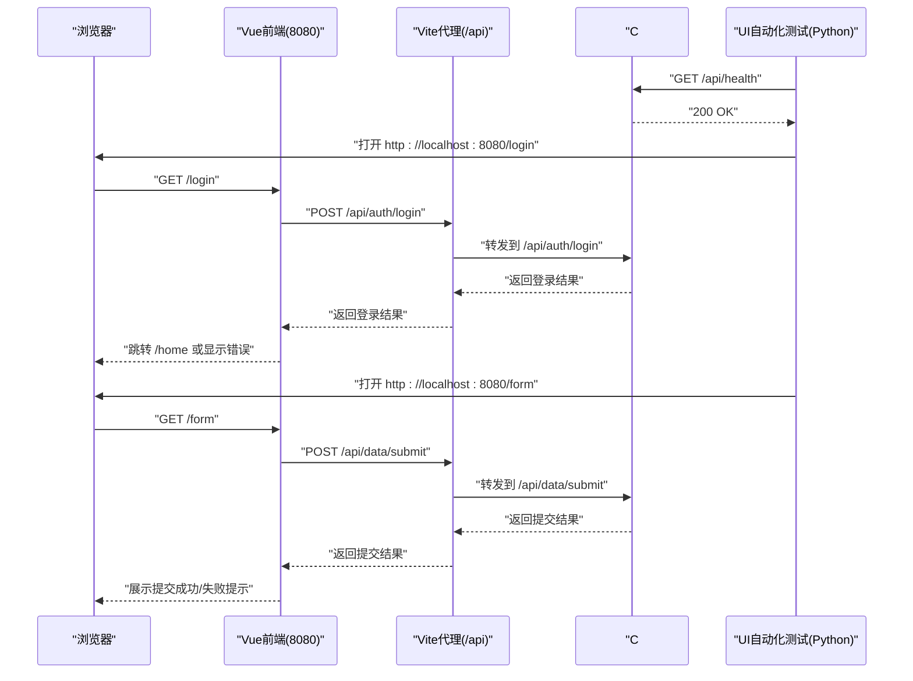
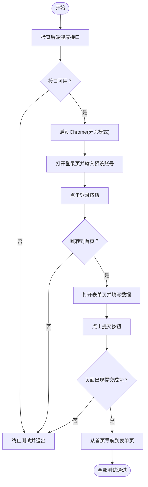
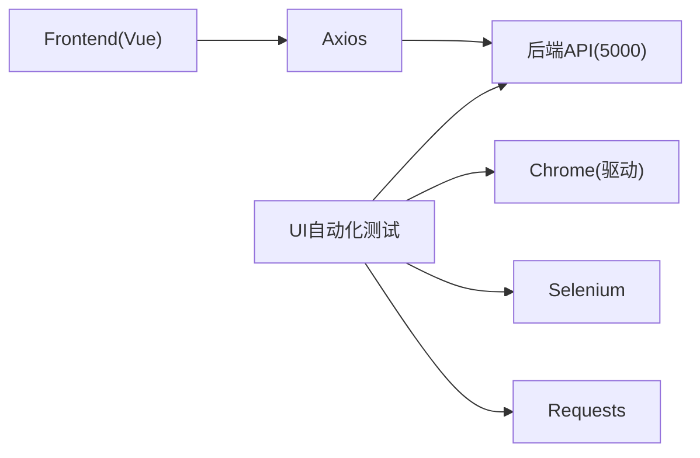

# 开发者入门指南

<cite>
**本文引用的文件**
- [README.md](file://vue-csharp-ui-auto/README.md)
- [Program.cs](file://vue-csharp-ui-auto/Backend/Program.cs)
- [appsettings.json](file://vue-csharp-ui-auto/Backend/appsettings.json)
- [AuthController.cs](file://vue-csharp-ui-auto/Backend/Controllers/AuthController.cs)
- [DataController.cs](file://vue-csharp-ui-auto/Backend/Controllers/DataController.cs)
- [IAuthService.cs](file://vue-csharp-ui-auto/Backend/Services/IAuthService.cs)
- [User.cs](file://vue-csharp-ui-auto/Backend/Models/User.cs)
- [package.json](file://vue-csharp-ui-auto/Frontend/package.json)
- [vite.config.js](file://vue-csharp-ui-auto/Frontend/vite.config.js)
- [Login.vue](file://vue-csharp-ui-auto/Frontend/src/views/Login.vue)
- [FormPage.vue](file://vue-csharp-ui-auto/Frontend/src/views/FormPage.vue)
- [requirements.txt](file://vue-csharp-ui-auto/UiAutoTest/requirements.txt)
- [test_vue_page.py](file://vue-csharp-ui-auto/UiAutoTest/test_vue_page.py)
</cite>

## 目录
1. [简介](#简介)
2. [项目结构](#项目结构)
3. [核心组件](#核心组件)
4. [架构总览](#架构总览)
5. [详细组件分析](#详细组件分析)
6. [依赖关系分析](#依赖关系分析)
7. [性能注意事项](#性能注意事项)
8. [故障排查指南](#故障排查指南)
9. [结论](#结论)
10. [附录](#附录)

## 简介
本指南面向首次接触本项目的开发者，帮助你在本地环境中快速搭建并运行智能体项目。你将学会：
- 安装必要的前置工具：.NET 8 SDK、Node.js、Python 及 ChromeDriver
- 启动后端 API 服务（默认端口 5000）
- 启动前端 Vue 应用（默认端口 8080）
- 在浏览器访问页面，使用预设账号登录并测试表单提交
- 运行 UI 自动化测试脚本，验证登录、表单提交与页面导航

为确保顺利运行，请先确认系统满足以下要求：
- Windows/macOS/Linux 均可
- 已安装 .NET 8 SDK
- 已安装 Node.js（推荐使用 LTS 版本）
- 已安装 Python 3.x
- 已安装 Chrome 浏览器，并准备对应版本的 ChromeDriver（建议与 Chrome 主版本匹配）

## 项目结构
项目采用前后端分离架构，根目录包含三个主要子模块：
- Backend：C# ASP.NET Core 后端，提供认证与数据提交接口
- Frontend：Vue3 前端，包含登录页、首页与表单页，使用 Axios 调用后端 API
- UiAutoTest：Python + Selenium 的 UI 自动化测试脚本，覆盖登录、表单提交与页面导航

图表来源
- [Program.cs](file://vue-csharp-ui-auto/Backend/Program.cs#L1-L55)
- [appsettings.json](file://vue-csharp-ui-auto/Backend/appsettings.json#L1-L18)
- [AuthController.cs](file://vue-csharp-ui-auto/Backend/Controllers/AuthController.cs#L1-L25)
- [DataController.cs](file://vue-csharp-ui-auto/Backend/Controllers/DataController.cs#L1-L25)
- [IAuthService.cs](file://vue-csharp-ui-auto/Backend/Services/IAuthService.cs#L1-L10)
- [User.cs](file://vue-csharp-ui-auto/Backend/Models/User.cs#L1-L11)
- [package.json](file://vue-csharp-ui-auto/Frontend/package.json#L1-L19)
- [vite.config.js](file://vue-csharp-ui-auto/Frontend/vite.config.js#L1-L22)
- [Login.vue](file://vue-csharp-ui-auto/Frontend/src/views/Login.vue#L1-L133)
- [FormPage.vue](file://vue-csharp-ui-auto/Frontend/src/views/FormPage.vue#L1-L142)
- [requirements.txt](file://vue-csharp-ui-auto/UiAutoTest/requirements.txt#L1-L4)
- [test_vue_page.py](file://vue-csharp-ui-auto/UiAutoTest/test_vue_page.py#L1-L161)

章节来源
- [README.md](file://vue-csharp-ui-auto/README.md#L1-L113)

## 核心组件
- 后端 API
  - 健康检查接口：用于 UI 自动化测试前的可用性校验
  - 登录接口：接收用户名与密码，返回登录结果
  - 数据提交接口：接收表单数据，返回处理结果
- 前端页面
  - 登录页：输入用户名/密码，调用后端登录接口，成功后跳转首页
  - 表单页：输入姓名/邮箱，调用后端数据提交接口，展示提交结果
- UI 自动化测试
  - 使用 Selenium 控制 Chrome，按顺序执行登录、表单提交与页面导航测试
  - 通过 data-testid 与 ID 等选择器精准定位元素，提升稳定性

章节来源
- [AuthController.cs](file://vue-csharp-ui-auto/Backend/Controllers/AuthController.cs#L1-L25)
- [DataController.cs](file://vue-csharp-ui-auto/Backend/Controllers/DataController.cs#L1-L25)
- [Login.vue](file://vue-csharp-ui-auto/Frontend/src/views/Login.vue#L1-L133)
- [FormPage.vue](file://vue-csharp-ui-auto/Frontend/src/views/FormPage.vue#L1-L142)
- [test_vue_page.py](file://vue-csharp-ui-auto/UiAutoTest/test_vue_page.py#L1-L161)

## 架构总览
下图展示了从浏览器到后端 API 的完整调用链路，以及 UI 自动化测试对各组件的验证路径。

图表来源
- [vite.config.js](file://vue-csharp-ui-auto/Frontend/vite.config.js#L1-L22)
- [AuthController.cs](file://vue-csharp-ui-auto/Backend/Controllers/AuthController.cs#L1-L25)
- [DataController.cs](file://vue-csharp-ui-auto/Backend/Controllers/DataController.cs#L1-L25)
- [test_vue_page.py](file://vue-csharp-ui-auto/UiAutoTest/test_vue_page.py#L1-L161)

## 详细组件分析

### 后端启动与配置
- 应用入口与中间件
  - 添加控制器、Swagger（开发环境）、CORS 策略（允许前端 8080 访问）、Entity Framework 内存数据库、自定义服务注册
  - 启动时创建数据库并初始化
- 配置文件
  - 日志级别、允许主机、连接字符串（LocalDB）、JWT 密钥与有效期
- 关键接口
  - 登录接口：接收用户名/密码，返回登录响应
  - 数据提交接口：接收姓名/邮箱，返回提交响应

章节来源
- [Program.cs](file://vue-csharp-ui-auto/Backend/Program.cs#L1-L55)
- [appsettings.json](file://vue-csharp-ui-auto/Backend/appsettings.json#L1-L18)
- [AuthController.cs](file://vue-csharp-ui-auto/Backend/Controllers/AuthController.cs#L1-L25)
- [DataController.cs](file://vue-csharp-ui-auto/Backend/Controllers/DataController.cs#L1-L25)

### 前端启动与代理
- 开发服务器
  - 默认监听 0.0.0.0:8080，可通过 --host 0.0.0.0 对外访问
- API 代理
  - 将 /api 前缀的请求代理到 http://localhost:5000，解决跨域问题
- 页面与交互
  - 登录页：使用 Axios 调用 /api/auth/login，成功后跳转首页
  - 表单页：使用 Axios 调用 /api/data/submit，展示提交结果

章节来源
- [package.json](file://vue-csharp-ui-auto/Frontend/package.json#L1-L19)
- [vite.config.js](file://vue-csharp-ui-auto/Frontend/vite.config.js#L1-L22)
- [Login.vue](file://vue-csharp-ui-auto/Frontend/src/views/Login.vue#L1-L133)
- [FormPage.vue](file://vue-csharp-ui-auto/Frontend/src/views/FormPage.vue#L1-L142)

### UI 自动化测试流程
- 前置校验
  - 通过 requests 检查后端健康接口是否可达
- 浏览器配置
  - 使用 Chrome 无头模式，设置窗口尺寸与沙盒参数
- 登录测试
  - 打开登录页，输入预设账号（用户名与密码见“预设账号”），点击登录按钮，断言跳转到首页
- 表单提交测试
  - 打开表单页，填写姓名与邮箱，点击提交，断言页面出现“提交成功”的提示
- 页面导航测试
  - 从首页点击“表单测试页”，断言跳转到表单页
- 报告生成
  - 使用 pytest-html 生成 HTML 测试报告

图表来源
- [test_vue_page.py](file://vue-csharp-ui-auto/UiAutoTest/test_vue_page.py#L1-L161)

章节来源
- [requirements.txt](file://vue-csharp-ui-auto/UiAutoTest/requirements.txt#L1-L4)
- [test_vue_page.py](file://vue-csharp-ui-auto/UiAutoTest/test_vue_page.py#L1-L161)

## 依赖关系分析
- 前端依赖
  - Vue3、Vue Router、Axios、Vite 插件与开发服务器
- 后端依赖
  - ASP.NET Core MVC、Entity Framework In-Memory Database、Swagger、CORS
- 测试依赖
  - Selenium、Pytest、Pytest-html、Requests

图表来源
- [package.json](file://vue-csharp-ui-auto/Frontend/package.json#L1-L19)
- [Program.cs](file://vue-csharp-ui-auto/Backend/Program.cs#L1-L55)
- [requirements.txt](file://vue-csharp-ui-auto/UiAutoTest/requirements.txt#L1-L4)

章节来源
- [package.json](file://vue-csharp-ui-auto/Frontend/package.json#L1-L19)
- [Program.cs](file://vue-csharp-ui-auto/Backend/Program.cs#L1-L55)
- [requirements.txt](file://vue-csharp-ui-auto/UiAutoTest/requirements.txt#L1-L4)

## 性能注意事项
- 前端开发服务器默认监听 0.0.0.0:8080，若需要对外访问，请确保防火墙放行
- 后端使用内存数据库，适合本地测试；生产环境请替换为真实数据库
- UI 自动化测试使用无头模式，减少资源占用；如需调试可临时切换为有头模式
- 代理配置将 /api 请求转发至后端，避免跨域问题；若后端端口变更，请同步更新代理配置

## 故障排查指南
- 启动后端失败
  - 确认已安装 .NET 8 SDK 并可正常编译运行
  - 查看控制台输出的异常堆栈，定位具体服务注册或数据库初始化问题
- 启动前端失败
  - 确认 Node.js 已安装且版本兼容
  - 在 Frontend 目录执行依赖安装与启动命令
- 跨域错误
  - 后端已配置允许前端 8080 访问；若前端端口变更，请同步修改 CORS 策略
- 代理无效
  - 确认 Vite 代理配置中的目标地址与后端端口一致
- UI 自动化测试失败
  - 先检查后端健康接口是否可达
  - 确认 Chrome 与 ChromeDriver 版本匹配，且驱动路径可被 Selenium 正确发现
  - 若页面元素定位失败，检查 data-testid 与 ID 是否与测试脚本一致
- 预设账号无法登录
  - 确认用户名与密码与测试脚本中使用的值一致
  - 检查后端是否正确初始化测试数据

章节来源
- [Program.cs](file://vue-csharp-ui-auto/Backend/Program.cs#L1-L55)
- [vite.config.js](file://vue-csharp-ui-auto/Frontend/vite.config.js#L1-L22)
- [test_vue_page.py](file://vue-csharp-ui-auto/UiAutoTest/test_vue_page.py#L1-L161)

## 结论
通过本指南，你可以在本地成功运行智能体项目的后端 API、前端页面与 UI 自动化测试。建议在开发过程中：
- 保持前后端端口与代理配置一致
- 使用预设账号进行手动验证与回归测试
- 在 CI 中复用相同的 UI 自动化测试流程，确保质量稳定

## 附录

### 本地运行步骤（面向新手）
- 安装前置工具
  - .NET 8 SDK：用于编译与运行后端
  - Node.js：用于安装前端依赖与启动开发服务器
  - Python：用于运行 UI 自动化测试
  - ChromeDriver：与 Chrome 浏览器版本匹配，供 Selenium 使用
- 启动后端 API
  - 进入 Backend 目录，执行 dotnet run，默认监听 5000 端口
  - 预期输出：控制台显示应用启动成功、Swagger 可用（开发环境）
- 启动前端 Vue
  - 进入 Frontend 目录，执行 npm install 安装依赖，再执行 npm run serve 启动开发服务器
  - 预期输出：开发服务器启动于 0.0.0.0:8080，浏览器自动打开或可手动访问
- 访问页面并登录
  - 在浏览器访问 http://localhost:8080
  - 使用预设账号登录：用户名与密码见“预设账号”
  - 登录成功后应跳转到首页
- 测试表单提交
  - 在首页点击“表单测试页”，进入表单页
  - 填写姓名与邮箱并提交，页面应显示“提交成功”的提示
- 运行 UI 自动化测试
  - 进入 UiAutoTest 目录，执行 pip install -r requirements.txt 安装测试依赖
  - 执行 python test_vue_page.py 运行测试
  - 预期输出：控制台打印各项测试通过信息，并生成 HTML 报告（由 pytest-html 生成）

章节来源
- [README.md](file://vue-csharp-ui-auto/README.md#L66-L94)
- [Program.cs](file://vue-csharp-ui-auto/Backend/Program.cs#L1-L55)
- [package.json](file://vue-csharp-ui-auto/Frontend/package.json#L1-L19)
- [vite.config.js](file://vue-csharp-ui-auto/Frontend/vite.config.js#L1-L22)
- [test_vue_page.py](file://vue-csharp-ui-auto/UiAutoTest/test_vue_page.py#L1-L161)

### 预设账号与端口
- 预设账号
  - 用户名：test_user
  - 密码：test_pass123
- 端口
  - 前端：8080
  - 后端：5000

章节来源
- [README.md](file://vue-csharp-ui-auto/README.md#L88-L94)
- [test_vue_page.py](file://vue-csharp-ui-auto/UiAutoTest/test_vue_page.py#L1-L161)