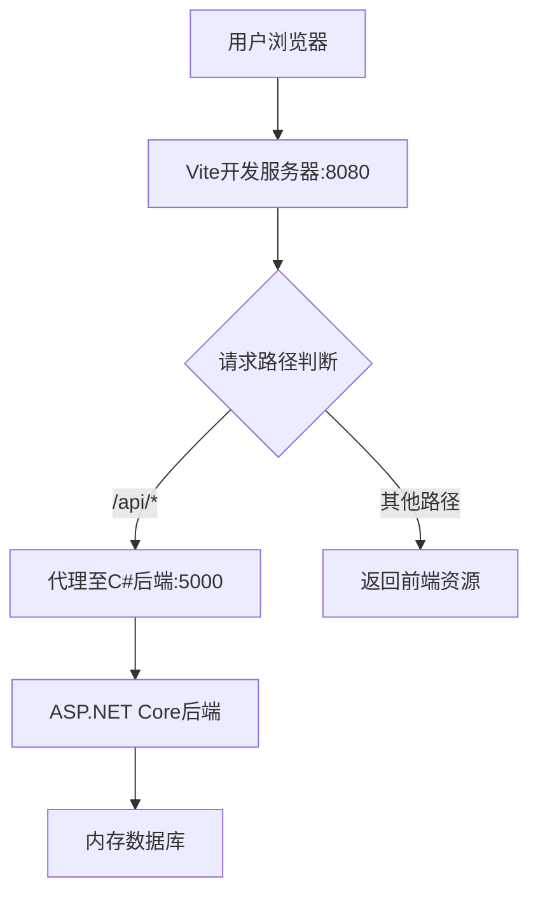
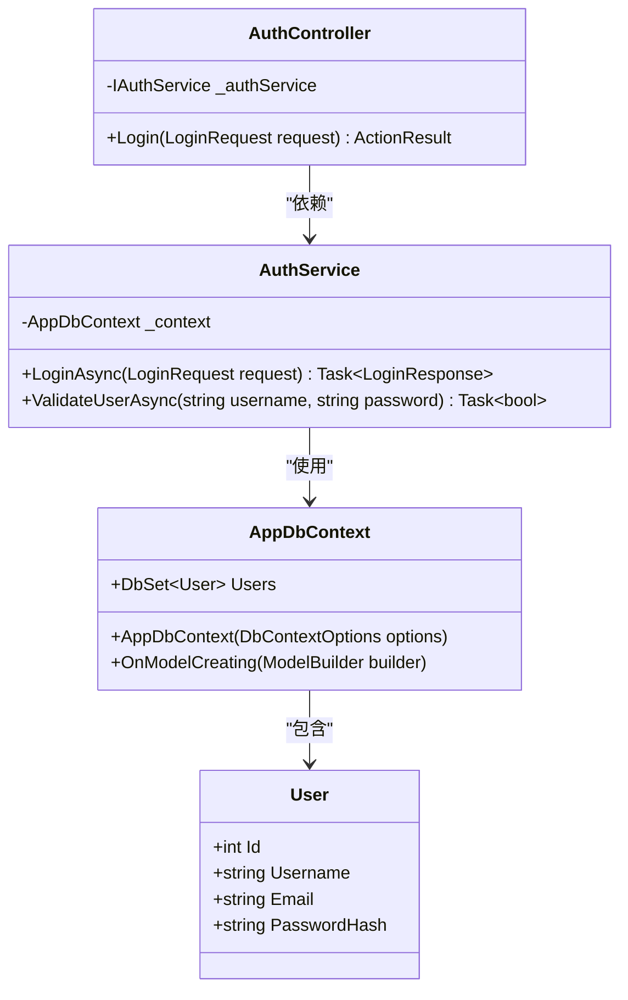
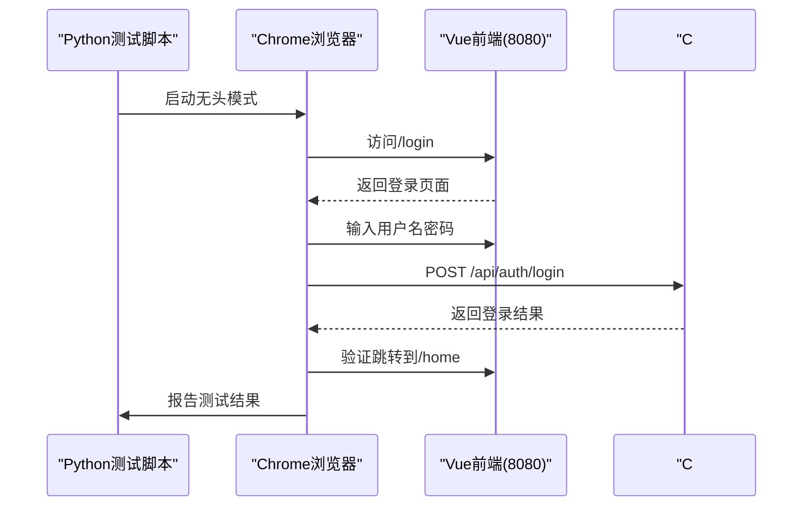

# 技术栈与依赖

<cite>
**本文档引用的文件**  
- [Backend.csproj](file://vue-csharp-ui-auto/Backend/Backend.csproj)
- [package.json](file://vue-csharp-ui-auto/Frontend/package.json)
- [requirements.txt](file://vue-csharp-ui-auto/UiAutoTest/requirements.txt)
- [README.md](file://vue-csharp-ui-auto/README.md)
- [Program.cs](file://vue-csharp-ui-auto/Backend/Program.cs)
- [appsettings.json](file://vue-csharp-ui-auto/Backend/appsettings.json)
- [vite.config.js](file://vue-csharp-ui-auto/Frontend/vite.config.js)
- [main.js](file://vue-csharp-ui-auto/Frontend/src/main.js)
- [AuthController.cs](file://vue-csharp-ui-auto/Backend/Controllers/AuthController.cs)
- [AppDbContext.cs](file://vue-csharp-ui-auto/Backend/Models/AppDbContext.cs)
- [AuthService.cs](file://vue-csharp-ui-auto/Backend/Services/AuthService.cs)
- [index.js](file://vue-csharp-ui-auto/Frontend/src/router/index.js)
- [Login.vue](file://vue-csharp-ui-auto/Frontend/src/views/Login.vue)
- [test_vue_page.py](file://vue-csharp-ui-auto/UiAutoTest/test_vue_page.py)
</cite>

## 目录
1. [项目概述](#项目概述)
2. [前端技术栈](#前端技术栈)
3. [后端技术栈](#后端技术栈)
4. [自动化测试层](#自动化测试层)
5. [跨语言协作架构](#跨语言协作架构)
6. [依赖关系分析](#依赖关系分析)
7. [系统集成与工作流](#系统集成与工作流)
8. [最佳实践与配置要点](#最佳实践与配置要点)

## 项目概述

本项目构建了一个完整的全栈系统，采用Vue 3作为前端框架，ASP.NET Core 8作为后端服务，Python + Selenium作为UI自动化测试工具。系统通过清晰的分层架构和跨语言协作模式，实现了前后端分离、接口通信、数据持久化和自动化测试的完整闭环。项目支持本地开发与GitHub Actions持续集成，确保了开发效率与系统稳定性。

**本节来源**  
- [README.md](file://vue-csharp-ui-auto/README.md#L1-L113)

## 前端技术栈

前端采用Vue 3 + Vite + Vue Router + Axios技术组合，构建现代化的单页应用（SPA）。Vue 3提供响应式组件系统，Vite作为构建工具显著提升开发体验，Vue Router实现客户端路由导航，Axios负责与C#后端进行HTTP通信。

### 核心组件与版本
- **Vue**: 3.4.0 - 核心框架，提供组合式API和响应式系统
- **Vite**: 5.0.0 - 构建工具，支持快速热更新和模块化加载
- **Vue Router**: 4.2.5 - 路由管理，实现页面跳转与导航
- **Axios**: 1.6.0 - HTTP客户端，用于调用后端REST API

### 关键配置
Vite配置文件（vite.config.js）中设置了开发服务器端口为8080，并通过代理将`/api`请求转发至C#后端（localhost:5000），解决了开发环境下的跨域问题。



**图表来源**  
- [vite.config.js](file://vue-csharp-ui-auto/Frontend/vite.config.js#L7-L17)
- [package.json](file://vue-csharp-ui-auto/Frontend/package.json#L1-L19)

**本节来源**  
- [package.json](file://vue-csharp-ui-auto/Frontend/package.json#L1-L19)
- [vite.config.js](file://vue-csharp-ui-auto/Frontend/vite.config.js#L1-L22)
- [main.js](file://vue-csharp-ui-auto/Frontend/src/main.js#L1-L8)
- [index.js](file://vue-csharp-ui-auto/Frontend/src/router/index.js#L1-L33)

## 后端技术栈

后端基于ASP.NET Core 8构建，采用Entity Framework Core In-Memory数据库进行测试，Swashbuckle Swagger提供API文档与测试界面。系统实现了RESTful API设计，支持健康检查、用户认证和数据提交功能。

### 核心组件与版本
- **ASP.NET Core**: 8.0 - 高性能Web框架，支持跨平台部署
- **Entity Framework Core**: 8.0.0 - ORM框架，使用In-Memory模式进行无副作用测试
- **Swashbuckle.AspNetCore**: 6.4.0 - 自动生成OpenAPI文档，提供Swagger UI交互界面
- **Microsoft.AspNetCore.OpenApi**: 8.0.0 - OpenAPI规范支持

### 关键配置
`Program.cs`中配置了CORS策略，允许来自Vue前端（http://localhost:8080）的跨域请求。同时注册了内存数据库上下文`AppDbContext`，确保测试环境的数据隔离性。



**图表来源**  
- [Program.cs](file://vue-csharp-ui-auto/Backend/Program.cs#L1-L55)
- [AppDbContext.cs](file://vue-csharp-ui-auto/Backend/Models/AppDbContext.cs#L1-L24)
- [AuthService.cs](file://vue-csharp-ui-auto/Backend/Services/AuthService.cs#L1-L64)
- [AuthController.cs](file://vue-csharp-ui-auto/Backend/Controllers/AuthController.cs#L1-L25)

**本节来源**  
- [Backend.csproj](file://vue-csharp-ui-auto/Backend/Backend.csproj#L1-L18)
- [Program.cs](file://vue-csharp-ui-auto/Backend/Program.cs#L1-L55)
- [appsettings.json](file://vue-csharp-ui-auto/Backend/appsettings.json#L1-L18)

## 自动化测试层

自动化测试层采用Python + Selenium + ChromeDriver技术栈，实现对Vue前端页面的端到端（E2E）测试。测试脚本通过模拟真实用户操作，验证前端界面与C#后端API的联动功能。

### 核心组件与版本
- **Selenium**: 4.15.2 - 浏览器自动化框架，控制Chrome进行UI测试
- **Pytest**: 7.4.3 - 测试框架，提供断言和测试组织功能
- **Pytest-html**: 4.0.2 - 生成HTML格式的测试报告
- **Requests**: 2.31.0 - 可选依赖，用于预检后端API可用性

### 测试用例设计
测试脚本`test_vue_page.py`包含三个核心测试用例：
1. Vue登录页面与C#认证API联动测试
2. Vue表单提交与C#数据接口联动测试
3. Vue页面导航功能测试



**图表来源**  
- [test_vue_page.py](file://vue-csharp-ui-auto/UiAutoTest/test_vue_page.py#L1-L161)
- [requirements.txt](file://vue-csharp-ui-auto/UiAutoTest/requirements.txt#L1-L4)

**本节来源**  
- [requirements.txt](file://vue-csharp-ui-auto/UiAutoTest/requirements.txt#L1-L4)
- [test_vue_page.py](file://vue-csharp-ui-auto/UiAutoTest/test_vue_page.py#L1-L161)

## 跨语言协作架构

本项目展示了C# + JavaScript + Python三种语言在现代全栈开发中的协同工作模式。每种语言承担特定职责，通过标准化接口进行通信，形成高内聚、低耦合的系统架构。

```mermaid
graph TB
subgraph "前端层"
Vue[Vue 3]
Vite[Vite]
Router[Vue Router]
Axios[Axios]
end
subgraph "后端层"
CSharp[ASP.NET Core 8]
EF[Entity Framework Core]
Swagger[Swashbuckle Swagger]
end
subgraph "测试层"
Python[Python]
Selenium[Selenium]
Chrome[ChromeDriver]
end
Axios --> CSharp : HTTP API调用
Selenium --> Vue : UI自动化
Selenium --> CSharp : 验证API响应
CSharp --> EF : 数据访问
EF --> InMemory[(内存数据库)]
style Vue fill:#41B883,stroke:#35495E
style CSharp fill:#512DA8,stroke:#311B92
style Python fill:#377662,stroke:#2B2D2F
```

**图表来源**  
- [Login.vue](file://vue-csharp-ui-auto/Frontend/src/views/Login.vue#L1-L133)
- [AuthService.cs](file://vue-csharp-ui-auto/Backend/Services/AuthService.cs#L1-L64)
- [test_vue_page.py](file://vue-csharp-ui-auto/UiAutoTest/test_vue_page.py#L1-L161)

**本节来源**  
- [README.md](file://vue-csharp-ui-auto/README.md#L1-L113)
- [Login.vue](file://vue-csharp-ui-auto/Frontend/src/views/Login.vue#L1-L133)
- [test_vue_page.py](file://vue-csharp-ui-auto/UiAutoTest/test_vue_page.py#L1-L161)

## 依赖关系分析

### 前端依赖
| 依赖包 | 版本 | 用途 |
|--------|------|------|
| vue | ^3.4.0 | 核心框架 |
| vue-router | ^4.2.5 | 路由管理 |
| axios | ^1.6.0 | API通信 |

### 后端依赖
| 依赖包 | 版本 | 用途 |
|--------|------|------|
| Microsoft.EntityFrameworkCore.InMemory | 8.0.0 | 内存数据库测试 |
| Swashbuckle.AspNetCore | 6.4.0 | API文档生成 |
| Microsoft.AspNetCore.OpenApi | 8.0.0 | OpenAPI支持 |

### 测试依赖
| 依赖包 | 版本 | 用途 |
|--------|------|------|
| selenium | 4.15.2 | 浏览器自动化 |
| pytest | 7.4.3 | 测试框架 |
| requests | 2.31.0 | API预检 |

**本节来源**  
- [package.json](file://vue-csharp-ui-auto/Frontend/package.json#L1-L19)
- [Backend.csproj](file://vue-csharp-ui-auto/Backend/Backend.csproj#L1-L18)
- [requirements.txt](file://vue-csharp-ui-auto/UiAutoTest/requirements.txt#L1-L4)

## 系统集成与工作流

系统通过GitHub Actions实现CI/CD流水线，自动化执行以下步骤：
1. 拉取代码
2. 配置C#运行环境并启动后端
3. 配置Node.js环境并启动前端
4. 配置Python环境并运行UI自动化测试
5. 生成测试报告并上传日志

本地开发时，开发者可独立启动前后端服务：
- 前端：`npm run serve` (端口8080)
- 后端：`dotnet run` (端口5000)
- 测试：`python test_vue_page.py`

**本节来源**  
- [README.md](file://vue-csharp-ui-auto/README.md#L52-L65)
- [README.md](file://vue-csharp-ui-auto/README.md#L68-L86)

## 最佳实践与配置要点

1. **跨域配置**：后端明确配置CORS策略，仅允许前端域名访问
2. **测试标识**：Vue组件使用`data-testid`属性，便于Selenium精确定位
3. **内存数据库**：后端使用EF Core In-Memory模式，避免测试污染
4. **无头模式**：Selenium配置`--headless=new`，适配CI/CD环境
5. **代理配置**：Vite设置API代理，解决开发环境跨域问题
6. **预检机制**：Python测试脚本先验证后端API可用性，避免误报

**本节来源**  
- [README.md](file://vue-csharp-ui-auto/README.md#L89-L113)
- [Program.cs](file://vue-csharp-ui-auto/Backend/Program.cs#L14-L22)
- [vite.config.js](file://vue-csharp-ui-auto/Frontend/vite.config.js#L11-L17)
- [test_vue_page.py](file://vue-csharp-ui-auto/UiAutoTest/test_vue_page.py#L10-L20)