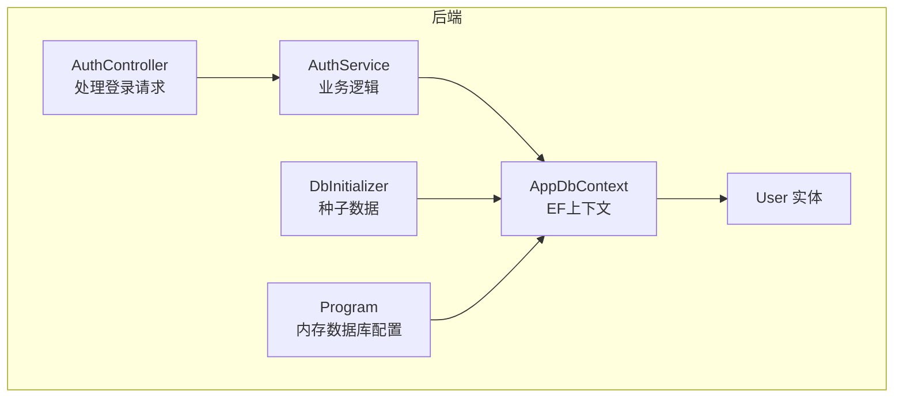
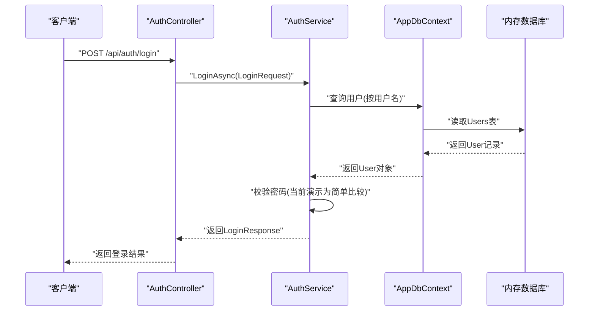
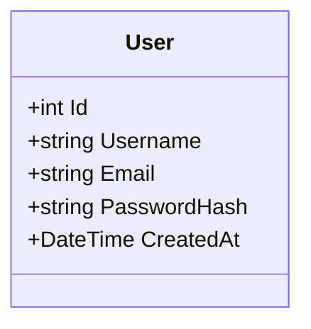
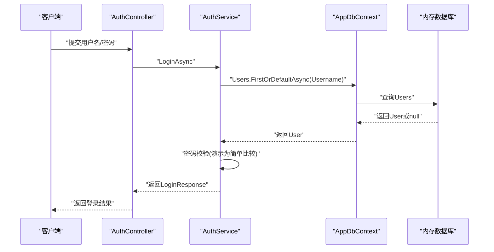
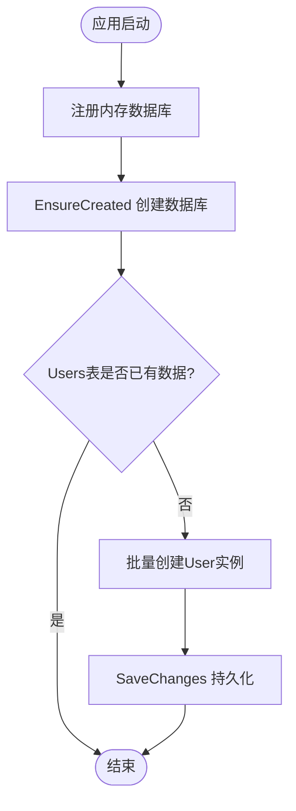
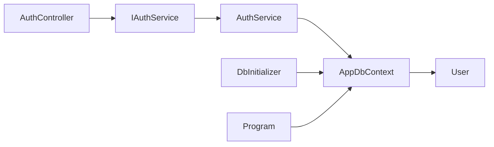

# 实体模型定义

<cite>
**本文引用的文件**
- [User.cs](file://vue-csharp-ui-auto/Backend/Models/User.cs)
- [AppDbContext.cs](file://vue-csharp-ui-auto/Backend/Models/AppDbContext.cs)
- [DbInitializer.cs](file://vue-csharp-ui-auto/Backend/Models/DbInitializer.cs)
- [AuthService.cs](file://vue-csharp-ui-auto/Backend/Services/AuthService.cs)
- [AuthController.cs](file://vue-csharp-ui-auto/Backend/Controllers/AuthController.cs)
- [LoginRequest.cs](file://vue-csharp-ui-auto/Backend/Models/LoginRequest.cs)
- [Program.cs](file://vue-csharp-ui-auto/Backend/Program.cs)
</cite>

## 目录
1. [简介](#简介)
2. [项目结构](#项目结构)
3. [核心组件](#核心组件)
4. [架构总览](#架构总览)
5. [详细组件分析](#详细组件分析)
6. [依赖分析](#依赖分析)
7. [性能考虑](#性能考虑)
8. [故障排除指南](#故障排除指南)
9. [结论](#结论)

## 简介
本文件围绕智能体项目中的User实体模型进行系统性说明，重点覆盖以下方面：
- User类的五个属性：Id（主键）、Username（用户名，最大长度50）、Email（邮箱，最大长度100）、PasswordHash（密码哈希）、CreatedAt（创建时间，默认UTC时间）。
- 属性的数据类型、初始化逻辑与业务含义。
- 结合代码路径说明User模型如何支撑用户认证流程。
- 在生产环境应使用加密哈希（如BCrypt）而非明文或简单哈希的安全建议。
- 在内存数据库中的实例化与种子数据行为说明。

## 项目结构
后端采用C# + ASP.NET Core + Entity Framework Core，User实体位于Models目录，数据库上下文为AppDbContext，认证服务由AuthService提供，控制器AuthController暴露登录接口。程序启动时通过Program配置内存数据库并执行种子初始化。

图表来源
- [AuthController.cs](file://vue-csharp-ui-auto/Backend/Controllers/AuthController.cs#L1-L25)
- [AuthService.cs](file://vue-csharp-ui-auto/Backend/Services/AuthService.cs#L1-L64)
- [AppDbContext.cs](file://vue-csharp-ui-auto/Backend/Models/AppDbContext.cs#L1-L24)
- [User.cs](file://vue-csharp-ui-auto/Backend/Models/User.cs#L1-L11)
- [DbInitializer.cs](file://vue-csharp-ui-auto/Backend/Models/DbInitializer.cs#L1-L40)
- [Program.cs](file://vue-csharp-ui-auto/Backend/Program.cs#L1-L55)

章节来源
- [Program.cs](file://vue-csharp-ui-auto/Backend/Program.cs#L24-L30)
- [AppDbContext.cs](file://vue-csharp-ui-auto/Backend/Models/AppDbContext.cs#L1-L24)
- [User.cs](file://vue-csharp-ui-auto/Backend/Models/User.cs#L1-L11)
- [DbInitializer.cs](file://vue-csharp-ui-auto/Backend/Models/DbInitializer.cs#L1-L40)
- [AuthController.cs](file://vue-csharp-ui-auto/Backend/Controllers/AuthController.cs#L1-L25)
- [AuthService.cs](file://vue-csharp-ui-auto/Backend/Services/AuthService.cs#L1-L64)

## 核心组件
- User实体：定义用户的核心字段及默认值。
- AppDbContext：配置实体映射规则（主键、必填、长度限制）。
- AuthService：实现登录验证逻辑（当前演示用简单比较，生产需替换为哈希比对）。
- AuthController：对外提供登录API。
- DbInitializer：在内存数据库中插入初始用户数据。
- Program：注册内存数据库并执行初始化。

章节来源
- [User.cs](file://vue-csharp-ui-auto/Backend/Models/User.cs#L1-L11)
- [AppDbContext.cs](file://vue-csharp-ui-auto/Backend/Models/AppDbContext.cs#L13-L21)
- [AuthService.cs](file://vue-csharp-ui-auto/Backend/Services/AuthService.cs#L15-L48)
- [AuthController.cs](file://vue-csharp-ui-auto/Backend/Controllers/AuthController.cs#L18-L23)
- [DbInitializer.cs](file://vue-csharp-ui-auto/Backend/Models/DbInitializer.cs#L16-L37)
- [Program.cs](file://vue-csharp-ui-auto/Backend/Program.cs#L24-L30)

## 架构总览
下图展示从客户端到数据库的调用链路，以及User实体在其中的角色。

图表来源
- [AuthController.cs](file://vue-csharp-ui-auto/Backend/Controllers/AuthController.cs#L18-L23)
- [AuthService.cs](file://vue-csharp-ui-auto/Backend/Services/AuthService.cs#L15-L48)
- [AppDbContext.cs](file://vue-csharp-ui-auto/Backend/Models/AppDbContext.cs#L11-L13)
- [Program.cs](file://vue-csharp-ui-auto/Backend/Program.cs#L24-L30)

## 详细组件分析

### User实体模型
- 数据类型与约束
  - Id：整型主键，由EF自增策略管理（在OnModelCreating中声明主键）。
  - Username：字符串，必填，最大长度50。
  - Email：字符串，必填，最大长度100。
  - PasswordHash：字符串，必填，用于存储密码哈希值。
  - CreatedAt：DateTime，默认值为UTC时间（DateTime.UtcNow）。
- 初始化逻辑
  - 在User类中，各属性均提供默认值（字符串为空，时间默认UTC）。
  - 在DbInitializer中，通过构造函数初始化User集合并添加到上下文，随后保存更改。
- 业务含义
  - 用户标识与凭证：Id唯一标识用户；Username与Email用于登录与识别；PasswordHash用于安全认证。
  - 时间戳：CreatedAt记录用户创建时间，便于审计与统计。

图表来源
- [User.cs](file://vue-csharp-ui-auto/Backend/Models/User.cs#L5-L9)

章节来源
- [User.cs](file://vue-csharp-ui-auto/Backend/Models/User.cs#L5-L9)
- [AppDbContext.cs](file://vue-csharp-ui-auto/Backend/Models/AppDbContext.cs#L17-L20)
- [DbInitializer.cs](file://vue-csharp-ui-auto/Backend/Models/DbInitializer.cs#L16-L37)

### 认证流程与User模型的协作
- 登录请求处理
  - AuthController接收登录请求，调用AuthService.LoginAsync。
  - AuthService根据用户名查询User实体，若未找到则返回失败。
  - 当前演示逻辑对密码进行简单比较（仅为测试目的），生产环境应改为哈希比对。
- User在流程中的作用
  - 提供用户名、邮箱、密码哈希等关键字段，作为认证依据。
  - CreatedAt可用于审计与风控场景。

图表来源
- [AuthController.cs](file://vue-csharp-ui-auto/Backend/Controllers/AuthController.cs#L18-L23)
- [AuthService.cs](file://vue-csharp-ui-auto/Backend/Services/AuthService.cs#L15-L48)
- [AppDbContext.cs](file://vue-csharp-ui-auto/Backend/Models/AppDbContext.cs#L11-L13)

章节来源
- [AuthController.cs](file://vue-csharp-ui-auto/Backend/Controllers/AuthController.cs#L18-L23)
- [AuthService.cs](file://vue-csharp-ui-auto/Backend/Services/AuthService.cs#L15-L48)
- [LoginRequest.cs](file://vue-csharp-ui-auto/Backend/Models/LoginRequest.cs#L1-L17)

### 内存数据库中的实例化行为
- 内存数据库配置
  - Program中通过AddDbContext注册内存数据库，数据库名称为“TestDb”。
- 种子数据
  - DbInitializer在首次运行时创建数据库并检查是否已有用户数据。
  - 若无用户，则批量创建User实例并保存，从而在内存数据库中形成初始状态。
- 实例化要点
  - User对象在内存数据库中以实体形式存在，遵循AppDbContext的映射规则（主键、必填、长度）。
  - CreatedAt默认值为UTC时间，确保跨时区一致性。

图表来源
- [Program.cs](file://vue-csharp-ui-auto/Backend/Program.cs#L24-L30)
- [DbInitializer.cs](file://vue-csharp-ui-auto/Backend/Models/DbInitializer.cs#L7-L38)
- [AppDbContext.cs](file://vue-csharp-ui-auto/Backend/Models/AppDbContext.cs#L11-L13)

章节来源
- [Program.cs](file://vue-csharp-ui-auto/Backend/Program.cs#L24-L30)
- [DbInitializer.cs](file://vue-csharp-ui-auto/Backend/Models/DbInitializer.cs#L7-L38)

## 依赖分析
- 组件耦合关系
  - AuthController依赖IAuthService接口，实现控制层与业务层解耦。
  - AuthService依赖AppDbContext，负责数据访问与业务逻辑。
  - AppDbContext依赖User实体，定义映射规则。
  - DbInitializer依赖AppDbContext与User，负责种子数据注入。
- 外部依赖
  - EF Core用于ORM与内存数据库。
  - ASP.NET Core用于Web API框架。

图表来源
- [AuthController.cs](file://vue-csharp-ui-auto/Backend/Controllers/AuthController.cs#L1-L25)
- [AuthService.cs](file://vue-csharp-ui-auto/Backend/Services/AuthService.cs#L1-L14)
- [AppDbContext.cs](file://vue-csharp-ui-auto/Backend/Models/AppDbContext.cs#L1-L24)
- [User.cs](file://vue-csharp-ui-auto/Backend/Models/User.cs#L1-L11)
- [DbInitializer.cs](file://vue-csharp-ui-auto/Backend/Models/DbInitializer.cs#L1-L40)
- [Program.cs](file://vue-csharp-ui-auto/Backend/Program.cs#L1-L55)

章节来源
- [AuthController.cs](file://vue-csharp-ui-auto/Backend/Controllers/AuthController.cs#L1-L25)
- [AuthService.cs](file://vue-csharp-ui-auto/Backend/Services/AuthService.cs#L1-L14)
- [AppDbContext.cs](file://vue-csharp-ui-auto/Backend/Models/AppDbContext.cs#L1-L24)
- [User.cs](file://vue-csharp-ui-auto/Backend/Models/User.cs#L1-L11)
- [DbInitializer.cs](file://vue-csharp-ui-auto/Backend/Models/DbInitializer.cs#L1-L40)
- [Program.cs](file://vue-csharp-ui-auto/Backend/Program.cs#L1-L55)

## 性能考虑
- 查询优化
  - 建议在Username上建立索引以提升登录查询性能（可通过EF配置或迁移脚本实现）。
- 密码处理
  - 生产环境必须使用强哈希算法（如BCrypt、Argon2、PBKDF2）对密码进行加盐哈希，避免明文或弱哈希存储。
- 内存数据库
  - 内存数据库适合测试与开发，不适用于高并发或持久化需求场景。生产请切换至关系型数据库。

## 故障排除指南
- 登录失败排查
  - 确认用户名是否存在且大小写匹配。
  - 确认PasswordHash字段已正确设置（生产环境应为哈希值）。
  - 检查数据库连接与内存数据库是否已初始化。
- 数据库初始化问题
  - 若Users表为空，确认DbInitializer是否执行，以及SeedChanges是否被调用。
- 控制器与服务交互
  - 确保AuthController正确注入IAuthService，且路由/api/auth/login可用。

章节来源
- [AuthService.cs](file://vue-csharp-ui-auto/Backend/Services/AuthService.cs#L15-L48)
- [AuthController.cs](file://vue-csharp-ui-auto/Backend/Controllers/AuthController.cs#L18-L23)
- [DbInitializer.cs](file://vue-csharp-ui-auto/Backend/Models/DbInitializer.cs#L7-L38)
- [Program.cs](file://vue-csharp-ui-auto/Backend/Program.cs#L49-L54)

## 结论
User实体模型简洁清晰，具备基本的用户标识、凭证与时间戳能力。在当前演示中，认证流程通过简单比较进行演示，但生产环境必须采用强哈希（如BCrypt）进行密码存储与比对。内存数据库配置与种子初始化使开发与测试更加便捷，但在生产中应迁移到稳定的关系型数据库并完善索引与安全策略。