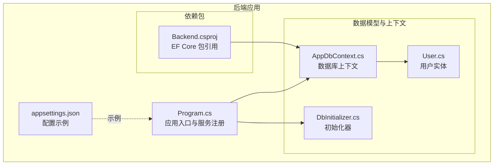
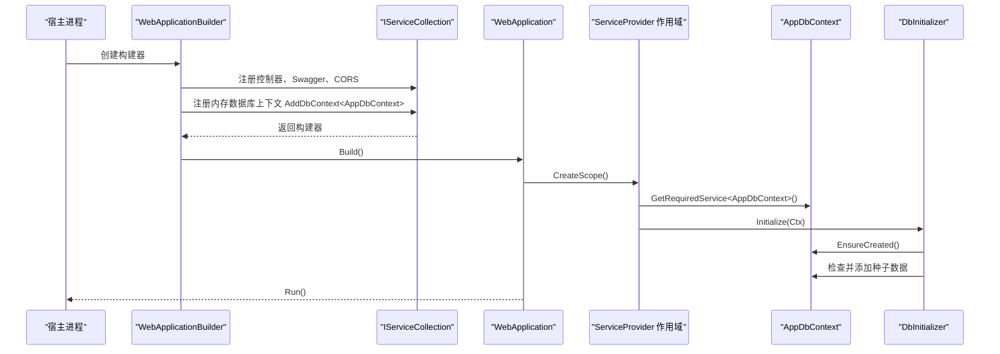
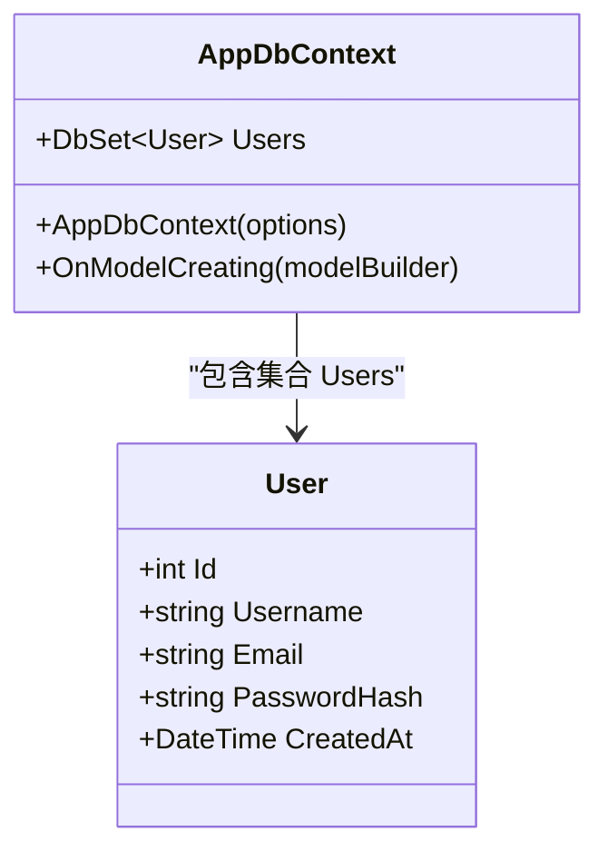
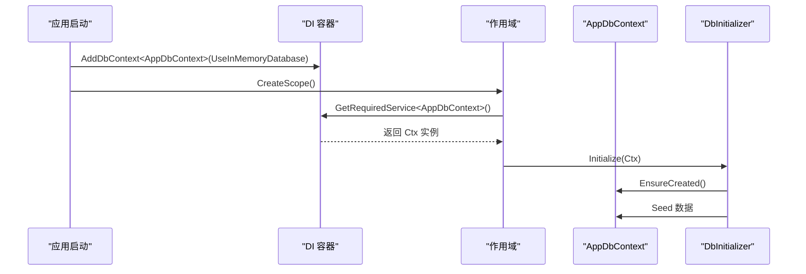
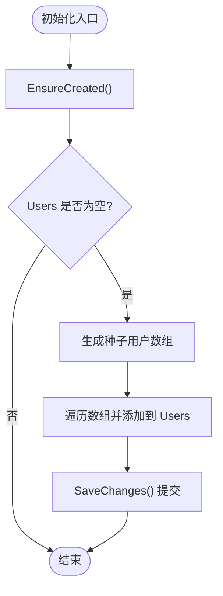
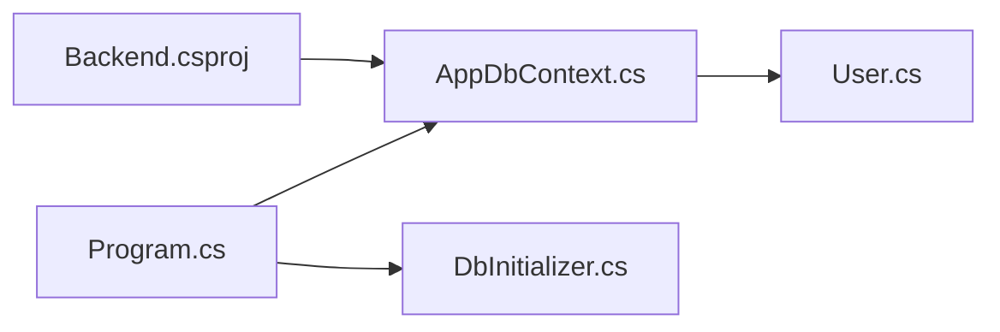

# 数据库上下文配置

<cite>
**本文引用的文件**
- [AppDbContext.cs](file://vue-csharp-ui-auto/Backend/Models/AppDbContext.cs)
- [User.cs](file://vue-csharp-ui-auto/Backend/Models/User.cs)
- [Program.cs](file://vue-csharp-ui-auto/Backend/Program.cs)
- [DbInitializer.cs](file://vue-csharp-ui-auto/Backend/Models/DbInitializer.cs)
- [Backend.csproj](file://vue-csharp-ui-auto/Backend/Backend.csproj)
- [appsettings.json](file://vue-csharp-ui-auto/Backend/appsettings.json)
</cite>

## 目录
1. [简介](#简介)
2. [项目结构](#项目结构)
3. [核心组件](#核心组件)
4. [架构总览](#架构总览)
5. [详细组件分析](#详细组件分析)
6. [依赖关系分析](#依赖关系分析)
7. [性能考量](#性能考量)
8. [故障排查指南](#故障排查指南)
9. [结论](#结论)
10. [附录](#附录)

## 简介
本文件聚焦于 AppDbContext 类的技术实现，作为 EF Core 内存数据库的核心配置组件，系统性阐述以下内容：
- 继承自 DbContext 的机制与构造函数注入
- DbSet<User> 属性如何映射到数据表
- OnModelCreating 中使用 Fluent API 对实体进行配置（主键、必填、长度限制）
- 这些约束对数据完整性的作用
- 在 ASP.NET Core 中通过 AddDbContext 注册 DbContextOptions 的依赖注入模式与生命周期管理

## 项目结构
后端采用 ASP.NET Core Web 应用，EF Core 用于数据访问层，内存数据库用于测试场景。关键文件分布如下：
- 入口程序：Program.cs
- 数据模型与上下文：Models/User.cs、Models/AppDbContext.cs
- 初始化器：Models/DbInitializer.cs
- 依赖包：Backend.csproj
- 配置示例：appsettings.json（包含连接字符串示例）

图表来源
- [Program.cs](file://vue-csharp-ui-auto/Backend/Program.cs#L1-L55)
- [AppDbContext.cs](file://vue-csharp-ui-auto/Backend/Models/AppDbContext.cs#L1-L24)
- [User.cs](file://vue-csharp-ui-auto/Backend/Models/User.cs#L1-L11)
- [DbInitializer.cs](file://vue-csharp-ui-auto/Backend/Models/DbInitializer.cs#L1-L40)
- [Backend.csproj](file://vue-csharp-ui-auto/Backend/Backend.csproj#L1-L18)
- [appsettings.json](file://vue-csharp-ui-auto/Backend/appsettings.json#L1-L18)

章节来源
- [Program.cs](file://vue-csharp-ui-auto/Backend/Program.cs#L1-L55)
- [Backend.csproj](file://vue-csharp-ui-auto/Backend/Backend.csproj#L1-L18)

## 核心组件
- AppDbContext：继承自 DbContext，提供 Users 集合，并在 OnModelCreating 中完成实体配置。
- User：普通实体类，包含标识符、用户名、邮箱、密码哈希与创建时间等字段。
- DbInitializer：负责数据库创建与种子数据插入。

章节来源
- [AppDbContext.cs](file://vue-csharp-ui-auto/Backend/Models/AppDbContext.cs#L1-L24)
- [User.cs](file://vue-csharp-ui-auto/Backend/Models/User.cs#L1-L11)
- [DbInitializer.cs](file://vue-csharp-ui-auto/Backend/Models/DbInitializer.cs#L1-L40)

## 架构总览
下图展示了 ASP.NET Core 启动流程、服务注册与上下文初始化的关系：

图表来源
- [Program.cs](file://vue-csharp-ui-auto/Backend/Program.cs#L1-L55)
- [DbInitializer.cs](file://vue-csharp-ui-auto/Backend/Models/DbInitializer.cs#L1-L40)

## 详细组件分析

### AppDbContext 类分析
- 继承与构造函数注入
  - 继承自 DbContext，并通过构造函数注入 DbContextOptions<AppDbContext>，将选项传递给基类，从而启用 EF Core 的配置能力。
  - 参考路径：[构造函数定义](file://vue-csharp-ui-auto/Backend/Models/AppDbContext.cs#L6-L8)

- DbSet<User> 映射
  - 通过 public DbSet<User> Users 提供对“用户”表的查询与变更入口。
  - 参考路径：[Users 集合声明](file://vue-csharp-ui-auto/Backend/Models/AppDbContext.cs#L10-L11)

- 实体配置（Fluent API）
  - 在 OnModelCreating 中，针对 User 实体设置：
    - 主键：HasKey(e => e.Id)
    - 字段约束：
      - Username：IsRequired() 且 MaxLength(50)
      - Email：IsRequired() 且 MaxLength(100)
      - PasswordHash：IsRequired()
  - 这些配置将被转换为数据库层面的约束，保障数据完整性。
  - 参考路径：[实体配置](file://vue-csharp-ui-auto/Backend/Models/AppDbContext.cs#L13-L21)

- 关系与复杂度
  - 该上下文仅包含一个实体集合，因此实体间关系简单；复杂度主要体现在实体属性约束与查询时的索引/唯一性需求（当前未显式声明）。
  - 参考路径：[User 实体定义](file://vue-csharp-ui-auto/Backend/Models/User.cs#L1-L11)

图表来源
- [AppDbContext.cs](file://vue-csharp-ui-auto/Backend/Models/AppDbContext.cs#L1-L24)
- [User.cs](file://vue-csharp-ui-auto/Backend/Models/User.cs#L1-L11)

章节来源
- [AppDbContext.cs](file://vue-csharp-ui-auto/Backend/Models/AppDbContext.cs#L1-L24)
- [User.cs](file://vue-csharp-ui-auto/Backend/Models/User.cs#L1-L11)

### DbContextOptions 依赖注入与生命周期
- 注册方式
  - 在 Program.cs 中使用 AddDbContext<AppDbContext> 注册上下文，并指定 UseInMemoryDatabase("TestDb")。
  - 参考路径：[上下文注册](file://vue-csharp-ui-auto/Backend/Program.cs#L24-L26)

- 生命周期
  - 默认生命周期为 Scoped，适合 Web 请求范围内的数据操作。
  - 参考路径：[服务注册与控制器](file://vue-csharp-ui-auto/Backend/Program.cs#L8-L11)

- 使用方式
  - 在应用启动阶段，通过 CreateScope 获取 ServiceProvider 并解析 AppDbContext，随后调用 DbInitializer.Initialize 完成数据库初始化。
  - 参考路径：[作用域解析与初始化](file://vue-csharp-ui-auto/Backend/Program.cs#L48-L53)

图表来源
- [Program.cs](file://vue-csharp-ui-auto/Backend/Program.cs#L24-L53)
- [DbInitializer.cs](file://vue-csharp-ui-auto/Backend/Models/DbInitializer.cs#L1-L40)

章节来源
- [Program.cs](file://vue-csharp-ui-auto/Backend/Program.cs#L24-L53)

### 数据完整性约束与保障
- 主键约束：HasKey(e => e.Id) 确保每条记录唯一标识。
- 必填约束：IsRequired() 应用于 Username、Email、PasswordHash，防止空值写入。
- 长度约束：HasMaxLength(n) 限制 Username 最大长度为 50，Email 最大长度为 100，避免超长数据导致的存储或索引问题。
- 以上约束共同保证了数据的一致性与可维护性。

章节来源
- [AppDbContext.cs](file://vue-csharp-ui-auto/Backend/Models/AppDbContext.cs#L13-L21)

### 初始化流程与种子数据
- 初始化步骤
  - EnsureCreated：确保数据库已创建。
  - 若 Users 表已有数据则跳过，否则批量插入预设用户。
  - 调用 SaveChanges 提交事务。
- 参考路径：
  - [EnsureCreated 与检查逻辑](file://vue-csharp-ui-auto/Backend/Models/DbInitializer.cs#L9-L14)
  - [种子数据定义与插入](file://vue-csharp-ui-auto/Backend/Models/DbInitializer.cs#L16-L37)
  - [提交保存](file://vue-csharp-ui-auto/Backend/Models/DbInitializer.cs#L37-L38)

图表来源
- [DbInitializer.cs](file://vue-csharp-ui-auto/Backend/Models/DbInitializer.cs#L1-L40)

章节来源
- [DbInitializer.cs](file://vue-csharp-ui-auto/Backend/Models/DbInitializer.cs#L1-L40)

## 依赖关系分析
- 外部依赖
  - EF Core InMemory：用于测试环境的内存数据库。
  - 参考路径：[包引用](file://vue-csharp-ui-auto/Backend/Backend.csproj#L10-L16)
- 内部依赖
  - Program.cs 依赖 AppDbContext 与 DbInitializer。
  - AppDbContext 依赖 User 实体。
- 可能的循环依赖
  - 当前无循环依赖迹象；各模块职责清晰。

图表来源
- [Program.cs](file://vue-csharp-ui-auto/Backend/Program.cs#L1-L55)
- [AppDbContext.cs](file://vue-csharp-ui-auto/Backend/Models/AppDbContext.cs#L1-L24)
- [User.cs](file://vue-csharp-ui-auto/Backend/Models/User.cs#L1-L11)
- [DbInitializer.cs](file://vue-csharp-ui-auto/Backend/Models/DbInitializer.cs#L1-L40)
- [Backend.csproj](file://vue-csharp-ui-auto/Backend/Backend.csproj#L10-L16)

章节来源
- [Backend.csproj](file://vue-csharp-ui-auto/Backend/Backend.csproj#L10-L16)
- [Program.cs](file://vue-csharp-ui-auto/Backend/Program.cs#L1-L55)

## 性能考量
- 内存数据库特性
  - 适用于单元测试与本地开发，不支持 SQL Server 的全部功能，如跨行事务、某些索引策略等。
- 查询与更新
  - 建议在生产环境切换到关系型数据库（如 SQL Server），并在需要时为高频查询字段建立索引。
- 生命周期
  - 上下文默认 Scoped 生命周期，避免在长时间运行的服务中滥用长生命周期实例。

[本节为通用建议，无需特定文件引用]

## 故障排查指南
- 上下文未注册
  - 症状：无法解析 AppDbContext。
  - 排查：确认 Program.cs 中是否调用 AddDbContext<AppDbContext> 并传入 UseInMemoryDatabase。
  - 参考路径：[上下文注册](file://vue-csharp-ui-auto/Backend/Program.cs#L24-L26)

- 初始化失败
  - 症状：EnsureCreated 或 Seed 数据报错。
  - 排查：检查实体配置是否正确，尤其是主键与必填字段；确认数据库名称一致。
  - 参考路径：[初始化流程](file://vue-csharp-ui-auto/Backend/Models/DbInitializer.cs#L9-L38)

- 连接字符串相关
  - appsettings.json 中包含默认连接字符串示例，但当前项目使用内存数据库，无需实际连接字符串即可运行。
  - 参考路径：[配置示例](file://vue-csharp-ui-auto/Backend/appsettings.json#L9-L11)

章节来源
- [Program.cs](file://vue-csharp-ui-auto/Backend/Program.cs#L24-L26)
- [DbInitializer.cs](file://vue-csharp-ui-auto/Backend/Models/DbInitializer.cs#L9-L38)
- [appsettings.json](file://vue-csharp-ui-auto/Backend/appsettings.json#L9-L11)

## 结论
AppDbContext 以简洁的方式实现了 EF Core 的核心配置：通过构造函数注入 DbContextOptions，暴露 DbSet<User>，并在 OnModelCreating 中使用 Fluent API 设置主键与字段约束，有效保障了数据完整性。结合 ASP.NET Core 的依赖注入与作用域生命周期，该上下文在测试环境中易于使用且可维护性强。若转向生产环境，建议替换为关系型数据库并根据业务需求扩展索引与约束。

[本节为总结性内容，无需特定文件引用]

## 附录
- 相关文件清单
  - [AppDbContext.cs](file://vue-csharp-ui-auto/Backend/Models/AppDbContext.cs#L1-L24)
  - [User.cs](file://vue-csharp-ui-auto/Backend/Models/User.cs#L1-L11)
  - [Program.cs](file://vue-csharp-ui-auto/Backend/Program.cs#L1-L55)
  - [DbInitializer.cs](file://vue-csharp-ui-auto/Backend/Models/DbInitializer.cs#L1-L40)
  - [Backend.csproj](file://vue-csharp-ui-auto/Backend/Backend.csproj#L10-L16)
  - [appsettings.json](file://vue-csharp-ui-auto/Backend/appsettings.json#L9-L11)