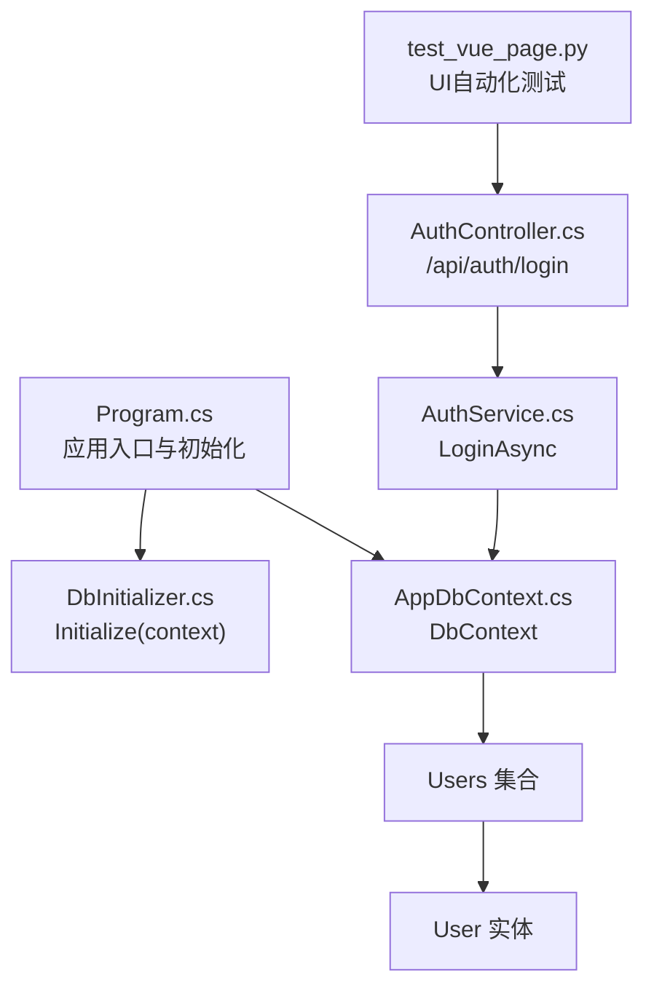
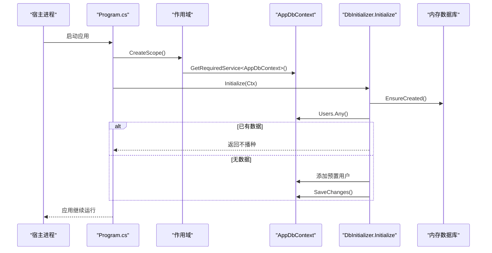
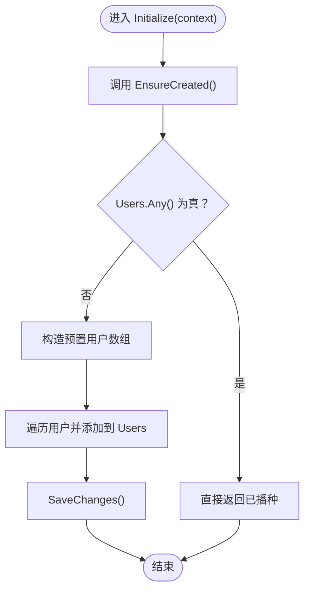
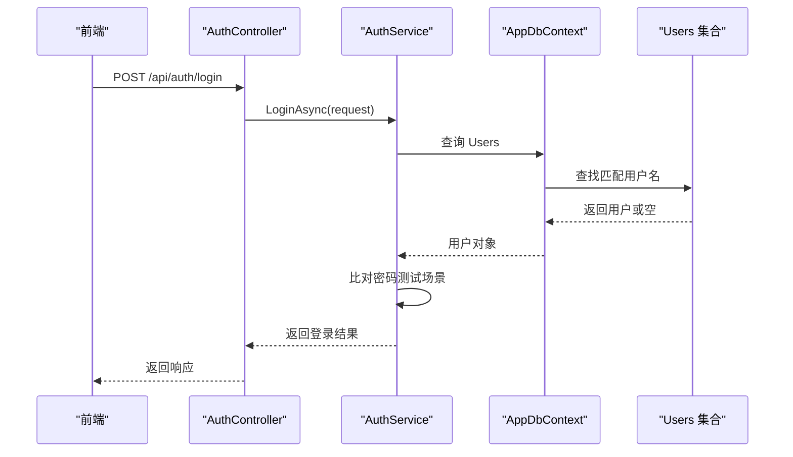
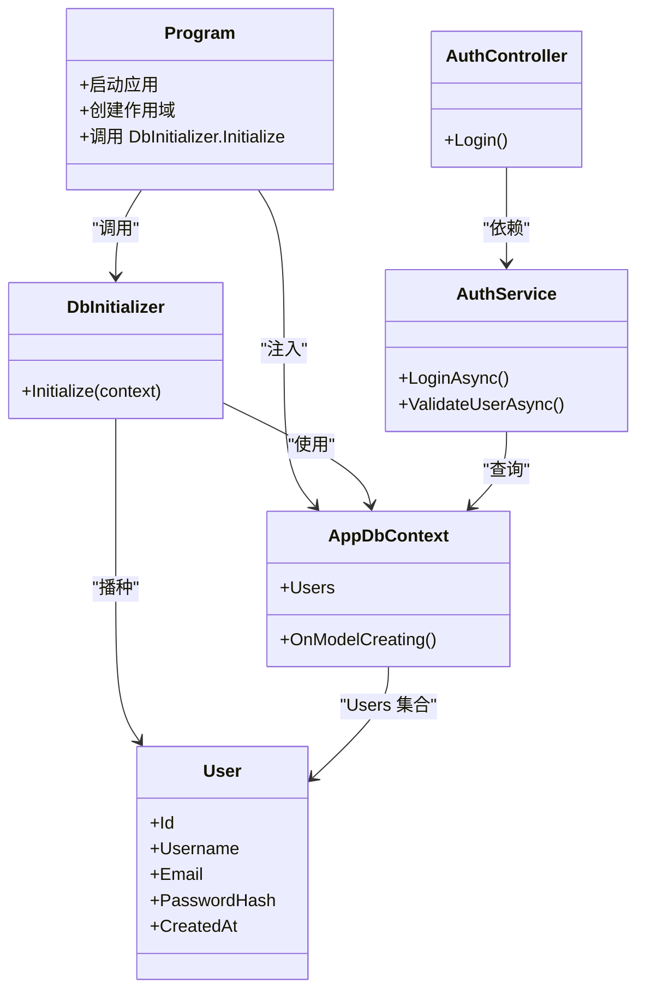

# 数据库初始化逻辑

<cite>
**本文引用的文件**
- [DbInitializer.cs](file://vue-csharp-ui-auto/Backend/Models/DbInitializer.cs)
- [AppDbContext.cs](file://vue-csharp-ui-auto/Backend/Models/AppDbContext.cs)
- [User.cs](file://vue-csharp-ui-auto/Backend/Models/User.cs)
- [Program.cs](file://vue-csharp-ui-auto/Backend/Program.cs)
- [AuthService.cs](file://vue-csharp-ui-auto/Backend/Services/AuthService.cs)
- [AuthController.cs](file://vue-csharp-ui-auto/Backend/Controllers/AuthController.cs)
- [test_vue_page.py](file://vue-csharp-ui-auto/UiAutoTest/test_vue_page.py)
</cite>

## 目录
1. [简介](#简介)
2. [项目结构](#项目结构)
3. [核心组件](#核心组件)
4. [架构总览](#架构总览)
5. [详细组件分析](#详细组件分析)
6. [依赖关系分析](#依赖关系分析)
7. [性能考量](#性能考量)
8. [故障排查指南](#故障排查指南)
9. [结论](#结论)
10. [附录](#附录)

## 简介
本文件围绕 DbInitializer 类在应用启动时的数据初始化流程进行系统化说明，重点解释 Initialize 方法如何通过 EnsureCreated 确保内存数据库存在，并通过检查 Users 集合是否已有数据来避免重复播种；同时列举预置的两个测试用户（test_user 和 admin）的初始化数据及其在自动化测试中的用途；最后强调该机制在 CI/CD 环境中一次性初始化的优势，并指出迁移到持久化数据库时应采用基于迁移的初始化策略。

## 项目结构
后端采用 ASP.NET Core + EF Core 架构，内存数据库用于开发与测试场景。关键文件与职责如下：
- Program.cs：应用入口，注册内存数据库与服务，启动后立即执行数据库初始化。
- AppDbContext.cs：EF Core 上下文，定义 Users 集合及实体约束。
- User.cs：用户实体模型。
- DbInitializer.cs：静态初始化器，负责 EnsureCreated 与种子数据播种。
- AuthService.cs / AuthController.cs：认证相关业务与控制器，依赖 Users 集合进行登录验证。
- test_vue_page.py：UI 自动化测试脚本，依赖 test_user 账号完成登录与导航测试。

图表来源
- [Program.cs](file://vue-csharp-ui-auto/Backend/Program.cs#L1-L55)
- [DbInitializer.cs](file://vue-csharp-ui-auto/Backend/Models/DbInitializer.cs#L1-L40)
- [AppDbContext.cs](file://vue-csharp-ui-auto/Backend/Models/AppDbContext.cs#L1-L24)
- [User.cs](file://vue-csharp-ui-auto/Backend/Models/User.cs#L1-L11)
- [AuthService.cs](file://vue-csharp-ui-auto/Backend/Services/AuthService.cs#L1-L64)
- [AuthController.cs](file://vue-csharp-ui-auto/Backend/Controllers/AuthController.cs#L1-L25)
- [test_vue_page.py](file://vue-csharp-ui-auto/UiAutoTest/test_vue_page.py#L1-L161)

章节来源
- [Program.cs](file://vue-csharp-ui-auto/Backend/Program.cs#L1-L55)
- [AppDbContext.cs](file://vue-csharp-ui-auto/Backend/Models/AppDbContext.cs#L1-L24)
- [User.cs](file://vue-csharp-ui-auto/Backend/Models/User.cs#L1-L11)
- [DbInitializer.cs](file://vue-csharp-ui-auto/Backend/Models/DbInitializer.cs#L1-L40)
- [AuthService.cs](file://vue-csharp-ui-auto/Backend/Services/AuthService.cs#L1-L64)
- [AuthController.cs](file://vue-csharp-ui-auto/Backend/Controllers/AuthController.cs#L1-L25)
- [test_vue_page.py](file://vue-csharp-ui-auto/UiAutoTest/test_vue_page.py#L1-L161)

## 核心组件
- DbInitializer.Initialize(context)
  - 使用 EnsureCreated 创建数据库（内存数据库）。
  - 检查 Users 是否已有数据，若已有则直接返回，避免重复播种。
  - 若为空，则批量添加预置用户并 SaveChanges。
- AppDbContext
  - 提供 Users DbSet，并在 OnModelCreating 中设置实体约束（主键、字段长度、必填等）。
- User 实体
  - 包含 Id、Username、Email、PasswordHash、CreatedAt 等字段。
- Program 启动流程
  - 注册内存数据库（UseInMemoryDatabase），随后在应用生命周期内创建作用域并调用 DbInitializer.Initialize。
- AuthService / AuthController
  - 登录接口通过查询 Users 集合进行验证，测试中使用预置账号 test_user 完成登录。

章节来源
- [DbInitializer.cs](file://vue-csharp-ui-auto/Backend/Models/DbInitializer.cs#L1-L40)
- [AppDbContext.cs](file://vue-csharp-ui-auto/Backend/Models/AppDbContext.cs#L1-L24)
- [User.cs](file://vue-csharp-ui-auto/Backend/Models/User.cs#L1-L11)
- [Program.cs](file://vue-csharp-ui-auto/Backend/Program.cs#L1-L55)
- [AuthService.cs](file://vue-csharp-ui-auto/Backend/Services/AuthService.cs#L1-L64)
- [AuthController.cs](file://vue-csharp-ui-auto/Backend/Controllers/AuthController.cs#L1-L25)

## 架构总览
DbInitializer 在应用启动阶段作为“一次性初始化器”，确保内存数据库具备且仅在首次运行时播种测试用户。后续请求通过控制器与服务访问 Users 集合，实现登录与业务处理。

图表来源
- [Program.cs](file://vue-csharp-ui-auto/Backend/Program.cs#L48-L53)
- [DbInitializer.cs](file://vue-csharp-ui-auto/Backend/Models/DbInitializer.cs#L7-L38)
- [AppDbContext.cs](file://vue-csharp-ui-auto/Backend/Models/AppDbContext.cs#L1-L24)

## 详细组件分析

### DbInitializer.Initialize 初始化流程
- EnsureCreated：确保数据库存在（内存数据库）。即使数据库已存在，也不会重建或删除现有数据。
- 重复播种保护：通过 Users.Any() 判断是否已有数据，若有则直接返回，避免重复播种。
- 种子数据播种：若为空，批量创建预置用户并 SaveChanges。
- 适用场景：内存数据库 + 开发/测试环境，保证每次启动都有固定测试账号可用。

图表来源
- [DbInitializer.cs](file://vue-csharp-ui-auto/Backend/Models/DbInitializer.cs#L7-L38)

章节来源
- [DbInitializer.cs](file://vue-csharp-ui-auto/Backend/Models/DbInitializer.cs#L7-L38)

### 预置测试用户与自动化测试用途
- 预置用户
  - 用户名：test_user
  - 邮箱：test@example.com
  - 密码哈希：test_pass123_hash（测试用途）
  - 另一个管理员用户：admin，邮箱 admin@example.com，密码哈希 admin_pass123_hash
- 自动化测试用途
  - UI 自动化测试脚本通过输入 test_user 与测试密码完成登录，验证页面跳转与功能导航。
  - 该策略确保测试在稳定的初始状态下运行，避免因数据库状态不一致导致的测试波动。

章节来源
- [DbInitializer.cs](file://vue-csharp-ui-auto/Backend/Models/DbInitializer.cs#L16-L30)
- [AuthService.cs](file://vue-csharp-ui-auto/Backend/Services/AuthService.cs#L15-L48)
- [AuthController.cs](file://vue-csharp-ui-auto/Backend/Controllers/AuthController.cs#L18-L23)
- [test_vue_page.py](file://vue-csharp-ui-auto/UiAutoTest/test_vue_page.py#L57-L69)

### 认证流程与数据库交互
- AuthController 接收登录请求，调用 AuthService.LoginAsync。
- AuthService 查询 Users 集合，匹配用户名并进行密码比对（测试场景使用简单比较）。
- 登录成功后返回响应，前端据此跳转至首页。

图表来源
- [AuthController.cs](file://vue-csharp-ui-auto/Backend/Controllers/AuthController.cs#L18-L23)
- [AuthService.cs](file://vue-csharp-ui-auto/Backend/Services/AuthService.cs#L15-L48)
- [AppDbContext.cs](file://vue-csharp-ui-auto/Backend/Models/AppDbContext.cs#L11-L13)

章节来源
- [AuthController.cs](file://vue-csharp-ui-auto/Backend/Controllers/AuthController.cs#L18-L23)
- [AuthService.cs](file://vue-csharp-ui-auto/Backend/Services/AuthService.cs#L15-L48)
- [AppDbContext.cs](file://vue-csharp-ui-auto/Backend/Models/AppDbContext.cs#L11-L13)

### CI/CD 环境中的一次性初始化优势
- 内存数据库 + EnsureCreated：无需外部数据库实例，启动即就绪，适合容器化与流水线。
- 重复播种保护：避免多次运行导致的重复数据，保证测试稳定性。
- 固定种子数据：确保测试可重复、可预测，降低环境差异带来的不确定性。

章节来源
- [Program.cs](file://vue-csharp-ui-auto/Backend/Program.cs#L24-L26)
- [DbInitializer.cs](file://vue-csharp-ui-auto/Backend/Models/DbInitializer.cs#L9-L14)

### 迁移到持久化数据库时的策略建议
- 当从内存数据库迁移到真实持久化数据库（如 SQL Server、PostgreSQL）时，应采用基于迁移的初始化策略，而非静态播种。
- 建议使用 EF Core 迁移：
  - 通过迁移创建表结构与约束。
  - 使用迁移种子（SeedData）在迁移中插入初始数据，确保版本化与可追溯。
  - 在生产环境通过部署脚本自动执行迁移，避免手动播种。
- 优点
  - 版本化管理：迁移记录变更历史，便于回滚与审计。
  - 可重复性：在新环境部署时自动执行，减少人为错误。
  - 并发安全：避免多实例同时播种导致的数据竞争。

章节来源
- [AppDbContext.cs](file://vue-csharp-ui-auto/Backend/Models/AppDbContext.cs#L13-L21)
- [DbInitializer.cs](file://vue-csharp-ui-auto/Backend/Models/DbInitializer.cs#L16-L37)

## 依赖关系分析
- 组件耦合
  - Program 依赖 DbInitializer 与 AppDbContext。
  - DbInitializer 依赖 AppDbContext 与 User。
  - AuthController 依赖 IAuthService，AuthService 依赖 AppDbContext。
- 外部依赖
  - EF Core：提供 DbContext、EnsureCreated、SaveChanges 等能力。
  - 内存数据库：简化开发与测试，无需外部数据库。

图表来源
- [Program.cs](file://vue-csharp-ui-auto/Backend/Program.cs#L48-L53)
- [DbInitializer.cs](file://vue-csharp-ui-auto/Backend/Models/DbInitializer.cs#L7-L38)
- [AppDbContext.cs](file://vue-csharp-ui-auto/Backend/Models/AppDbContext.cs#L1-L24)
- [User.cs](file://vue-csharp-ui-auto/Backend/Models/User.cs#L1-L11)
- [AuthController.cs](file://vue-csharp-ui-auto/Backend/Controllers/AuthController.cs#L1-L25)
- [AuthService.cs](file://vue-csharp-ui-auto/Backend/Services/AuthService.cs#L1-L64)

章节来源
- [Program.cs](file://vue-csharp-ui-auto/Backend/Program.cs#L1-L55)
- [DbInitializer.cs](file://vue-csharp-ui-auto/Backend/Models/DbInitializer.cs#L1-L40)
- [AppDbContext.cs](file://vue-csharp-ui-auto/Backend/Models/AppDbContext.cs#L1-L24)
- [User.cs](file://vue-csharp-ui-auto/Backend/Models/User.cs#L1-L11)
- [AuthService.cs](file://vue-csharp-ui-auto/Backend/Services/AuthService.cs#L1-L64)
- [AuthController.cs](file://vue-csharp-ui-auto/Backend/Controllers/AuthController.cs#L1-L25)

## 性能考量
- 内存数据库：读写速度快，适合开发与测试；但在高并发或多实例场景下需注意内存占用与隔离性。
- EnsureCreated：幂等操作，多次调用不会重建数据库；但不适用于持久化数据库的迁移管理。
- 重复播种保护：Users.Any() 为 O(n) 查询，n 为用户数量；在种子数据规模较小时影响可忽略。
- 建议
  - 在持久化数据库中使用迁移与索引优化查询。
  - 对于大量种子数据，考虑分批插入与事务封装，减少 SaveChanges 调用次数。

[本节为通用指导，不直接分析具体文件]

## 故障排查指南
- 症状：登录失败或页面无法跳转
  - 检查 DbInitializer 是否成功播种 test_user/admin。
  - 确认 Program 启动时已调用 Initialize。
- 症状：数据库未创建或 Users 为空
  - 确认 EnsureCreated 是否被调用。
  - 检查 Users.Any() 的判断逻辑是否被提前返回。
- 症状：CI/CD 环境中测试不稳定
  - 确保每次运行前数据库处于干净状态（内存数据库重启即清空）。
  - 如迁移到持久化数据库，使用迁移而非静态播种。

章节来源
- [Program.cs](file://vue-csharp-ui-auto/Backend/Program.cs#L48-L53)
- [DbInitializer.cs](file://vue-csharp-ui-auto/Backend/Models/DbInitializer.cs#L9-L14)
- [AuthService.cs](file://vue-csharp-ui-auto/Backend/Services/AuthService.cs#L15-L48)
- [test_vue_page.py](file://vue-csharp-ui-auto/UiAutoTest/test_vue_page.py#L57-L69)

## 结论
DbInitializer 通过 EnsureCreated 与重复播种保护，在内存数据库环境下实现了启动时的一次性初始化，为自动化测试提供了稳定、可重复的初始状态。在 CI/CD 环境中，该策略显著降低了环境差异与部署复杂度。当迁移到持久化数据库时，应采用基于迁移的初始化策略，以获得更好的版本化、可维护性与可扩展性。

[本节为总结，不直接分析具体文件]

## 附录
- 关键路径参考
  - Initialize 调用链：[Program.cs](file://vue-csharp-ui-auto/Backend/Program.cs#L48-L53) → [DbInitializer.cs](file://vue-csharp-ui-auto/Backend/Models/DbInitializer.cs#L7-L38)
  - 登录验证链路：[AuthController.cs](file://vue-csharp-ui-auto/Backend/Controllers/AuthController.cs#L18-L23) → [AuthService.cs](file://vue-csharp-ui-auto/Backend/Services/AuthService.cs#L15-L48) → [AppDbContext.cs](file://vue-csharp-ui-auto/Backend/Models/AppDbContext.cs#L11-L13)
  - 测试脚本依赖：[test_vue_page.py](file://vue-csharp-ui-auto/UiAutoTest/test_vue_page.py#L57-L69)