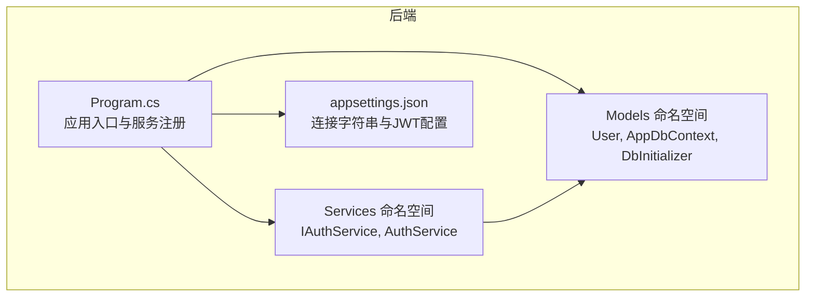
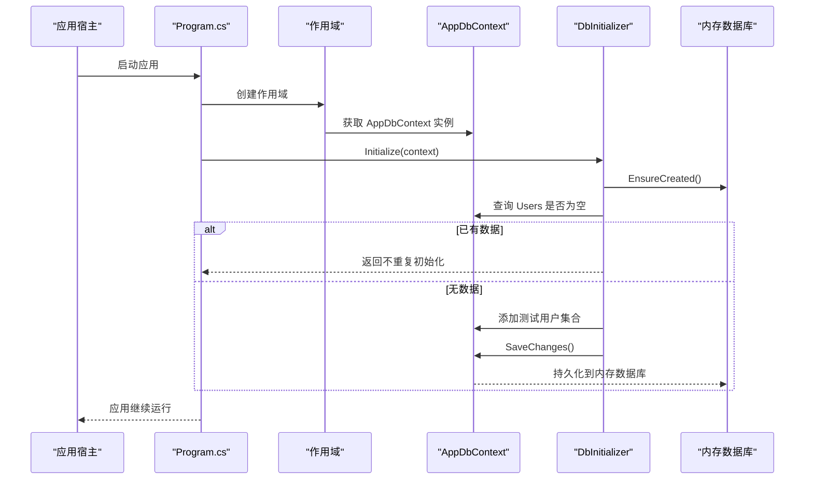
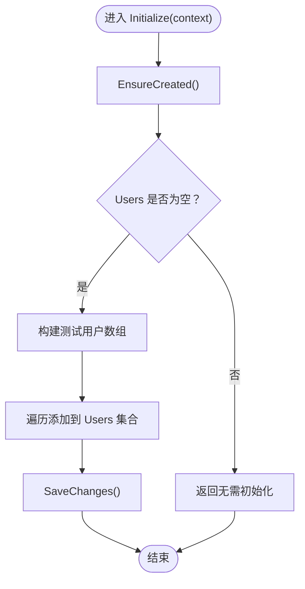
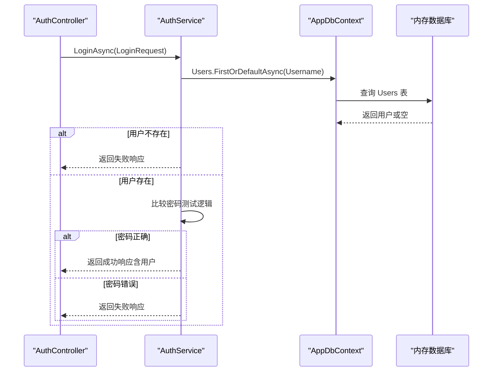
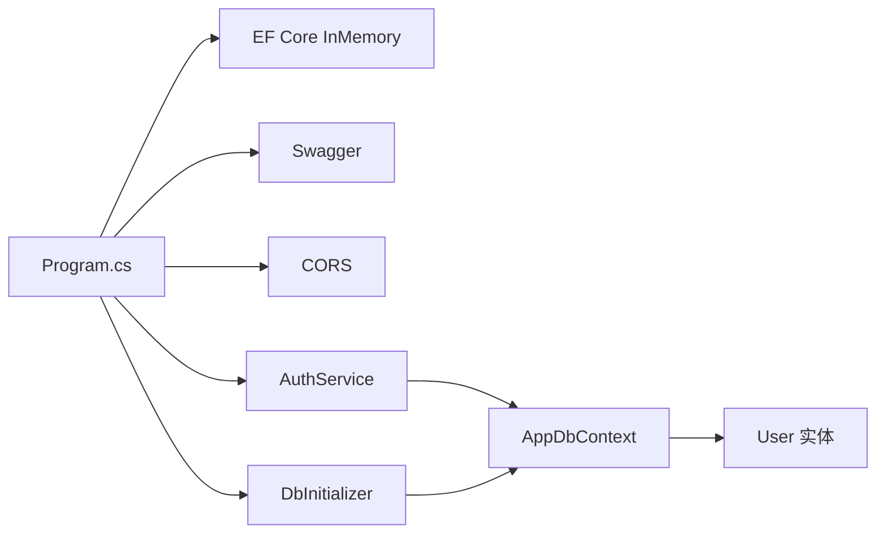

# 数据库设计与初始化

<cite>
**本文引用的文件**
- [User.cs](file://vue-csharp-ui-auto/Backend/Models/User.cs)
- [AppDbContext.cs](file://vue-csharp-ui-auto/Backend/Models/AppDbContext.cs)
- [DbInitializer.cs](file://vue-csharp-ui-auto/Backend/Models/DbInitializer.cs)
- [Program.cs](file://vue-csharp-ui-auto/Backend/Program.cs)
- [appsettings.json](file://vue-csharp-ui-auto/Backend/appsettings.json)
- [AuthService.cs](file://vue-csharp-ui-auto/Backend/Services/AuthService.cs)
- [IAuthService.cs](file://vue-csharp-ui-auto/Backend/Services/IAuthService.cs)
- [LoginRequest.cs](file://vue-csharp-ui-auto/Backend/Models/LoginRequest.cs)
- [Backend.csproj](file://vue-csharp-ui-auto/Backend/Backend.csproj)
</cite>

## 目录
1. [引言](#引言)
2. [项目结构](#项目结构)
3. [核心组件](#核心组件)
4. [架构总览](#架构总览)
5. [详细组件分析](#详细组件分析)
6. [依赖分析](#依赖分析)
7. [性能考虑](#性能考虑)
8. [故障排除指南](#故障排除指南)
9. [结论](#结论)
10. [附录](#附录)

## 引言
本文件面向智能体项目的数据库设计与初始化，围绕以下目标展开：
- 解释使用 Entity Framework Core 内存数据库的设计动机：实现测试隔离、避免数据污染、提升运行速度。
- 完整描述 User 实体模型的字段定义、数据类型、约束条件及其在 AppDbContext 中的 Fluent API 映射。
- 阐述 OnModelCreating 方法中 Fluent API 的使用方式。
- 说明 DbInitializer 类如何在应用启动时预填充测试用户数据，并确保数据库仅初始化一次。
- 提供数据库模式的文本表示，并讨论未来扩展至 SQL Server、SQLite 等持久化数据库的迁移路径。

## 项目结构
后端采用 ASP.NET Core + EF Core 架构，核心数据层位于 Models 命名空间，包含实体、上下文与初始化器；服务层位于 Services 命名空间，负责业务逻辑；入口程序 Program.cs 负责注册服务、配置中间件与执行数据库初始化。

图表来源
- [Program.cs](file://vue-csharp-ui-auto/Backend/Program.cs#L1-L55)
- [appsettings.json](file://vue-csharp-ui-auto/Backend/appsettings.json#L1-L18)
- [User.cs](file://vue-csharp-ui-auto/Backend/Models/User.cs#L1-L11)
- [AppDbContext.cs](file://vue-csharp-ui-auto/Backend/Models/AppDbContext.cs#L1-L24)
- [DbInitializer.cs](file://vue-csharp-ui-auto/Backend/Models/DbInitializer.cs#L1-L40)
- [AuthService.cs](file://vue-csharp-ui-auto/Backend/Services/AuthService.cs#L1-L64)
- [IAuthService.cs](file://vue-csharp-ui-auto/Backend/Services/IAuthService.cs#L1-L10)

章节来源
- [Program.cs](file://vue-csharp-ui-auto/Backend/Program.cs#L1-L55)
- [Backend.csproj](file://vue-csharp-ui-auto/Backend/Backend.csproj#L1-L18)

## 核心组件
- User 实体：承载用户标识、用户名、邮箱、密码哈希与创建时间等属性。
- AppDbContext：EF 上下文，暴露 Users 集合，并通过 Fluent API 在 OnModelCreating 中进行实体映射与约束配置。
- DbInitializer：应用启动时初始化数据库，若表为空则插入测试用户数据，保证只初始化一次。
- Program：注册内存数据库服务、启用 Swagger/CORS、在应用生命周期内调用初始化器。
- AuthService：演示基于内存数据库的查询与验证流程，用于登录场景。

章节来源
- [User.cs](file://vue-csharp-ui-auto/Backend/Models/User.cs#L1-L11)
- [AppDbContext.cs](file://vue-csharp-ui-auto/Backend/Models/AppDbContext.cs#L1-L24)
- [DbInitializer.cs](file://vue-csharp-ui-auto/Backend/Models/DbInitializer.cs#L1-L40)
- [Program.cs](file://vue-csharp-ui-auto/Backend/Program.cs#L1-L55)
- [AuthService.cs](file://vue-csharp-ui-auto/Backend/Services/AuthService.cs#L1-L64)

## 架构总览
内存数据库在开发环境提供快速、隔离且可重复的测试体验。应用启动时通过 Program 注册内存数据库服务，随后立即执行 DbInitializer，确保数据库已创建且包含初始用户数据。业务层通过 EF 查询 User 实体完成登录校验。

图表来源
- [Program.cs](file://vue-csharp-ui-auto/Backend/Program.cs#L48-L53)
- [DbInitializer.cs](file://vue-csharp-ui-auto/Backend/Models/DbInitializer.cs#L7-L38)
- [AppDbContext.cs](file://vue-csharp-ui-auto/Backend/Models/AppDbContext.cs#L1-L24)

## 详细组件分析

### User 实体模型与约束
- 字段与类型
  - Id：整型，作为主键
  - Username：字符串，最大长度限制
  - Email：字符串，最大长度限制
  - PasswordHash：字符串，用于存储密码哈希
  - CreatedAt：日期时间，默认值为 UTC 当前时间
- 约束条件
  - Username、Email、PasswordHash 均为必填
  - Username 最大长度为 50
  - Email 最大长度为 100
- 映射配置
  - 主键：Id
  - 属性映射：上述字段均映射到对应列
  - 约束：通过 Fluent API 设置 IsRequired 与 MaxLength

章节来源
- [User.cs](file://vue-csharp-ui-auto/Backend/Models/User.cs#L1-L11)
- [AppDbContext.cs](file://vue-csharp-ui-auto/Backend/Models/AppDbContext.cs#L13-L21)

### AppDbContext 上下文与 Fluent API
- DbContext 构造函数：接收 DbContextOptions 并传递给基类
- DbSet<User>：公开 Users 集合，供查询与变更追踪
- OnModelCreating：
  - 使用 Fluent API 对 User 实体进行配置
  - 指定主键、必填与最大长度约束
  - 未显式设置的属性默认遵循 EF 默认行为（如默认值、可空性）

章节来源
- [AppDbContext.cs](file://vue-csharp-ui-auto/Backend/Models/AppDbContext.cs#L1-L24)

### DbInitializer 初始化流程
- EnsureCreated：确保数据库已创建（内存数据库）
- 判断 Users 是否已有数据：若存在则直接返回，避免重复初始化
- 若为空：
  - 构造测试用户数组（包含用户名、邮箱、密码哈希）
  - 逐条添加到 Users 集合并保存更改
- 该流程在应用启动时由 Program 调用，确保每次启动都有可用的测试数据

图表来源
- [DbInitializer.cs](file://vue-csharp-ui-auto/Backend/Models/DbInitializer.cs#L7-L38)

章节来源
- [DbInitializer.cs](file://vue-csharp-ui-auto/Backend/Models/DbInitializer.cs#L1-L40)
- [Program.cs](file://vue-csharp-ui-auto/Backend/Program.cs#L48-L53)

### Program 启动与服务注册
- 注册内存数据库服务：使用 AddDbContext 将 AppDbContext 注册为内存数据库
- 启用 Swagger/CORS：便于前端调试与接口测试
- 应用启动阶段：在独立作用域中获取 AppDbContext 并调用 DbInitializer.Initialize
- 运行应用：继续处理后续请求

章节来源
- [Program.cs](file://vue-csharp-ui-auto/Backend/Program.cs#L1-L55)
- [Backend.csproj](file://vue-csharp-ui-auto/Backend/Backend.csproj#L10-L16)

### 登录流程示例（AuthService）
- 从 AppDbContext 查询指定用户名的用户
- 若用户不存在，返回失败响应
- 若存在，进行密码比较（测试场景使用简单比较）
- 成功则返回包含用户信息的成功响应

图表来源
- [AuthService.cs](file://vue-csharp-ui-auto/Backend/Services/AuthService.cs#L15-L48)
- [AppDbContext.cs](file://vue-csharp-ui-auto/Backend/Models/AppDbContext.cs#L10-L12)
- [LoginRequest.cs](file://vue-csharp-ui-auto/Backend/Models/LoginRequest.cs#L1-L17)

章节来源
- [AuthService.cs](file://vue-csharp-ui-auto/Backend/Services/AuthService.cs#L1-L64)
- [LoginRequest.cs](file://vue-csharp-ui-auto/Backend/Models/LoginRequest.cs#L1-L28)

## 依赖分析
- 服务注册
  - Program 注册内存数据库服务（InMemory）
  - 注册业务服务（IAuthService、IDataService）
- 外部包
  - EF Core InMemory、SqlServer、Tools
  - Swagger、CORS
- 运行时依赖
  - Program 在应用启动时调用 DbInitializer
  - 控制器依赖 AuthService，AuthService 依赖 AppDbContext

图表来源
- [Program.cs](file://vue-csharp-ui-auto/Backend/Program.cs#L1-L55)
- [Backend.csproj](file://vue-csharp-ui-auto/Backend/Backend.csproj#L10-L16)
- [AuthService.cs](file://vue-csharp-ui-auto/Backend/Services/AuthService.cs#L1-L64)
- [AppDbContext.cs](file://vue-csharp-ui-auto/Backend/Models/AppDbContext.cs#L1-L24)
- [DbInitializer.cs](file://vue-csharp-ui-auto/Backend/Models/DbInitializer.cs#L1-L40)

章节来源
- [Program.cs](file://vue-csharp-ui-auto/Backend/Program.cs#L1-L55)
- [Backend.csproj](file://vue-csharp-ui-auto/Backend/Backend.csproj#L10-L16)

## 性能考虑
- 内存数据库优势
  - 测试隔离：每个进程/测试会话拥有独立内存数据库实例，避免共享状态干扰
  - 避免数据污染：测试结束后不会产生持久化副作用
  - 运行速度快：无需磁盘 IO，查询与写入更高效
- 注意事项
  - 内存数据库不支持事务并发隔离级别与某些 SQL Server 特性
  - 在需要真实并发或复杂事务场景时，应切换到 SQL Server 或 SQLite
  - 对于大规模数据或复杂查询，建议在集成测试中使用 SQL Server LocalDB 或 SQLite

## 故障排除指南
- 数据库未初始化
  - 确认 Program 中是否在应用启动时调用 DbInitializer.Initialize
  - 确认 EnsureCreated 是否被调用
- 用户数据缺失
  - 检查 Users 集合是否为空；若非空则不会重复初始化
  - 确认测试用户对象是否正确添加并保存
- 登录失败
  - 检查用户名是否存在
  - 检查密码比较逻辑（测试场景使用简单比较）
- 连接字符串无效
  - appsettings.json 中的连接字符串仅用于其他数据库场景；内存数据库不需要该配置

章节来源
- [Program.cs](file://vue-csharp-ui-auto/Backend/Program.cs#L48-L53)
- [DbInitializer.cs](file://vue-csharp-ui-auto/Backend/Models/DbInitializer.cs#L7-L38)
- [AuthService.cs](file://vue-csharp-ui-auto/Backend/Services/AuthService.cs#L15-L48)
- [appsettings.json](file://vue-csharp-ui-auto/Backend/appsettings.json#L1-L18)

## 结论
本项目通过 EF Core 内存数据库实现了高效的开发与测试体验：隔离性强、数据不污染、启动速度快。User 实体与 AppDbContext 的 Fluent API 映射清晰地表达了字段约束；DbInitializer 在应用启动时确保了测试数据的可用性。未来如需扩展到 SQL Server、SQLite 等持久化数据库，可通过替换数据库提供程序与连接字符串实现平滑迁移。

## 附录

### 数据库模式（文本表示）
- 表：Users
  - 列
    - Id：整型，主键
    - Username：字符串，必填，最大长度 50
    - Email：字符串，必填，最大长度 100
    - PasswordHash：字符串，必填
    - CreatedAt：日期时间，默认值为 UTC 当前时间

章节来源
- [AppDbContext.cs](file://vue-csharp-ui-auto/Backend/Models/AppDbContext.cs#L13-L21)
- [User.cs](file://vue-csharp-ui-auto/Backend/Models/User.cs#L1-L11)

### 迁移路径：从内存数据库到持久化数据库
- 替换数据库提供程序
  - 移除 InMemory 包引用，添加 SQL Server 或 SQLite 包
  - 在 Program 中将内存数据库替换为相应提供程序（例如 SQL Server）
- 更新连接字符串
  - 在 appsettings.json 中配置 DefaultConnection
  - 在 Program 中使用该连接字符串注册 DbContext
- 迁移策略
  - 使用 EF Core 迁移生成与更新数据库架构
  - 在开发环境使用 LocalDB，在 CI 环境使用 SQLite
  - 保持实体与映射不变，仅调整提供程序与连接字符串

章节来源
- [Backend.csproj](file://vue-csharp-ui-auto/Backend/Backend.csproj#L10-L16)
- [appsettings.json](file://vue-csharp-ui-auto/Backend/appsettings.json#L9-L11)
- [Program.cs](file://vue-csharp-ui-auto/Backend/Program.cs#L24-L26)