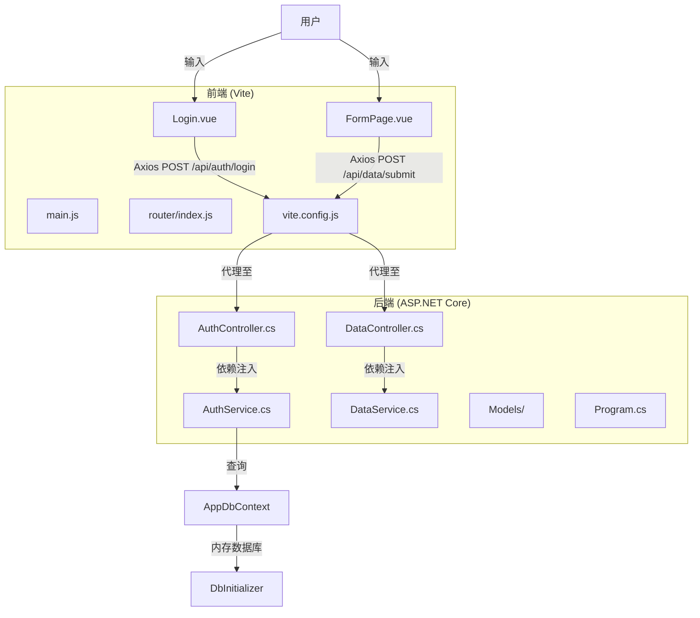
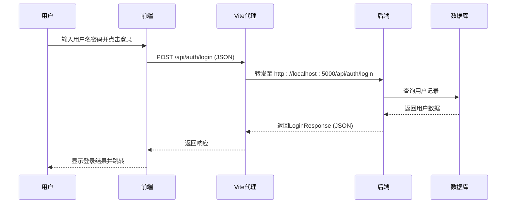
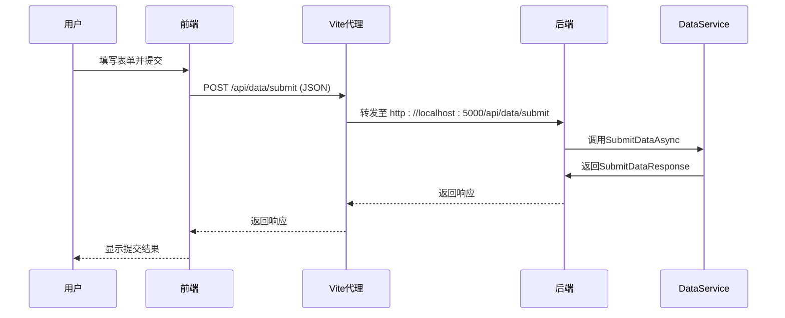

# 数据流与前后端交互

<cite>
**本文档引用的文件**  
- [AuthController.cs](file://vue-csharp-ui-auto/Backend/Controllers/AuthController.cs)
- [AuthService.cs](file://vue-csharp-ui-auto/Backend/Services/AuthService.cs)
- [LoginRequest.cs](file://vue-csharp-ui-auto/Backend/Models/LoginRequest.cs)
- [User.cs](file://vue-csharp-ui-auto/Backend/Models/User.cs)
- [Program.cs](file://vue-csharp-ui-auto/Backend/Program.cs)
- [Login.vue](file://vue-csharp-ui-auto/Frontend/src/views/Login.vue)
- [vite.config.js](file://vue-csharp-ui-auto/Frontend/vite.config.js)
- [AppDbContext.cs](file://vue-csharp-ui-auto/Backend/Models/AppDbContext.cs)
- [DataController.cs](file://vue-csharp-ui-auto/Backend/Controllers/DataController.cs)
- [DataService.cs](file://vue-csharp-ui-auto/Backend/Services/DataService.cs)
- [FormPage.vue](file://vue-csharp-ui-auto/Frontend/src/views/FormPage.vue)
- [DbInitializer.cs](file://vue-csharp-ui-auto/Backend/Models/DbInitializer.cs)
- [router/index.js](file://vue-csharp-ui-auto/Frontend/src/router/index.js)
</cite>

## 目录
1. [简介](#简介)
2. [项目结构](#项目结构)
3. [核心数据流分析](#核心数据流分析)
4. [用户登录流程](#用户登录流程)
5. [表单提交流程](#表单提交流程)
6. [关键技术点](#关键技术点)
7. [接口契约与错误处理](#接口契约与错误处理)
8. [总结](#总结)

## 简介
本文档详细描述智能体项目中两个关键业务场景的数据流动路径：用户登录和表单提交。通过分析前后端代码，揭示从用户输入到服务器响应的完整调用链路，涵盖请求代理、跨域处理、依赖注入、数据序列化等核心技术机制。

## 项目结构
项目采用前后端分离架构，前端基于Vue 3 + Vite构建，后端使用ASP.NET Core开发。前端运行在8080端口，后端API服务运行在5000端口，通过Vite的代理功能实现跨域通信。



**图示来源**  
- [Login.vue](file://vue-csharp-ui-auto/Frontend/src/views/Login.vue)
- [FormPage.vue](file://vue-csharp-ui-auto/Frontend/src/views/FormPage.vue)
- [vite.config.js](file://vue-csharp-ui-auto/Frontend/vite.config.js)
- [AuthController.cs](file://vue-csharp-ui-auto/Backend/Controllers/AuthController.cs)
- [DataController.cs](file://vue-csharp-ui-auto/Backend/Controllers/DataController.cs)
- [Program.cs](file://vue-csharp-ui-auto/Backend/Program.cs)

## 核心数据流分析
系统数据流遵循典型的前后端分离模式，前端通过Axios发送JSON请求，经由Vite开发服务器代理转发至后端API，后端处理完成后返回JSON响应。



**图示来源**  
- [Login.vue](file://vue-csharp-ui-auto/Frontend/src/views/Login.vue#L58-L76)
- [vite.config.js](file://vue-csharp-ui-auto/Frontend/vite.config.js#L11-L16)
- [AuthController.cs](file://vue-csharp-ui-auto/Backend/Controllers/AuthController.cs#L18-L23)
- [AuthService.cs](file://vue-csharp-ui-auto/Backend/Services/AuthService.cs#L15-L48)

## 用户登录流程
用户登录流程从Vue组件开始，通过Axios发送请求，经由Vite代理转发至后端认证控制器，最终返回认证结果。

### 前端处理
Login.vue组件监听表单提交事件，使用Axios向`/api/auth/login`发送POST请求，携带用户名和密码。

**代码路径**  
- [Login.vue](file://vue-csharp-ui-auto/Frontend/src/views/Login.vue#L52-L77)

### 请求代理
Vite配置文件中设置了代理规则，将所有`/api`前缀的请求转发至后端5000端口。

```javascript
proxy: {
  '/api': {
    target: 'http://localhost:5000',
    changeOrigin: true,
    secure: false
  }
}
```

**代码路径**  
- [vite.config.js](file://vue-csharp-ui-auto/Frontend/vite.config.js#L11-L16)

### 后端接收
AuthController通过[FromBody]属性接收JSON请求体，反序列化为LoginRequest对象。

```csharp
[HttpPost("login")]
public async Task<ActionResult<LoginResponse>> Login([FromBody] LoginRequest request)
```

**代码路径**  
- [AuthController.cs](file://vue-csharp-ui-auto/Backend/Controllers/AuthController.cs#L18-L23)

### 服务调用
控制器通过依赖注入获取AuthService实例，调用其LoginAsync方法进行认证。

```csharp
private readonly IAuthService _authService;
public AuthController(IAuthService authService) => _authService = authService;
```

**代码路径**  
- [AuthController.cs](file://vue-csharp-ui-auto/Backend/Controllers/AuthController.cs#L11-L16)
- [AuthService.cs](file://vue-csharp-ui-auto/Backend/Services/AuthService.cs#L6-L13)

### 数据验证
AuthService查询内存数据库中的用户记录，验证用户名存在性和密码正确性。

```csharp
var user = await _context.Users.FirstOrDefaultAsync(u => u.Username == request.Username);
```

**代码路径**  
- [AuthService.cs](file://vue-csharp-ui-auto/Backend/Services/AuthService.cs#L17-L18)

### 响应返回
根据验证结果构造LoginResponse对象，包含成功状态、消息和用户信息。

```csharp
return new LoginResponse
{
    Success = true,
    Message = "登录成功",
    User = user
};
```

**代码路径**  
- [AuthService.cs](file://vue-csharp-ui-auto/Backend/Services/AuthService.cs#L33-L38)

## 表单提交流程
表单提交流程与登录流程类似，但用于提交用户数据。



**图示来源**  
- [FormPage.vue](file://vue-csharp-ui-auto/Frontend/src/views/FormPage.vue#L60-L75)
- [DataController.cs](file://vue-csharp-ui-auto/Backend/Controllers/DataController.cs#L18-L23)
- [DataService.cs](file://vue-csharp-ui-auto/Backend/Services/DataService.cs#L7-L28)

## 关键技术点

### 跨域处理
后端通过CORS策略允许前端访问API。

```csharp
builder.Services.AddCors(options =>
{
    options.AddPolicy("AllowVueApp", policy =>
    {
        policy.WithOrigins("http://localhost:8080", "https://localhost:8080")
              .AllowAnyHeader()
              .AllowAnyMethod();
    });
});
```

**代码路径**  
- [Program.cs](file://vue-csharp-ui-auto/Backend/Program.cs#L14-L21)

### 依赖注入
后端使用ASP.NET Core的依赖注入容器管理服务生命周期。

```csharp
builder.Services.AddScoped<IAuthService, AuthService>();
```

**代码路径**  
- [Program.cs](file://vue-csharp-ui-auto/Backend/Program.cs#L29-L30)

### 内存数据库
使用Entity Framework Core的内存数据库进行测试。

```csharp
builder.Services.AddDbContext<AppDbContext>(options =>
    options.UseInMemoryDatabase("TestDb"));
```

**代码路径**  
- [Program.cs](file://vue-csharp-ui-auto/Backend/Program.cs#L25-L26)

### 数据初始化
应用启动时初始化测试用户数据。

```csharp
DbInitializer.Initialize(context);
```

**代码路径**  
- [Program.cs](file://vue-csharp-ui-auto/Backend/Program.cs#L52)
- [DbInitializer.cs](file://vue-csharp-ui-auto/Backend/Models/DbInitializer.cs#L7-L38)

## 接口契约与错误处理

### 登录接口
**请求示例：**
```json
POST /api/auth/login
{
  "username": "test_user",
  "password": "test_pass123"
}
```

**成功响应：**
```json
{
  "success": true,
  "message": "登录成功",
  "user": {
    "id": 1,
    "username": "test_user",
    "email": "test@example.com"
  }
}
```

**失败响应：**
```json
{
  "success": false,
  "message": "用户名不存在"
}
```

### 表单提交接口
**请求示例：**
```json
POST /api/data/submit
{
  "name": "张三",
  "email": "zhangsan@example.com"
}
```

**成功响应：**
```json
{
  "success": true,
  "message": "数据已成功提交: 张三 (zhangsan@example.com)"
}
```

**失败响应：**
```json
{
  "success": false,
  "message": "姓名和邮箱不能为空"
}
```

**代码路径**  
- [LoginRequest.cs](file://vue-csharp-ui-auto/Backend/Models/LoginRequest.cs#L3-L15)
- [SubmitDataRequest.cs](file://vue-csharp-ui-auto/Backend/Models/LoginRequest.cs#L17-L27)
- [AuthService.cs](file://vue-csharp-ui-auto/Backend/Services/AuthService.cs#L22-L47)
- [DataService.cs](file://vue-csharp-ui-auto/Backend/Services/DataService.cs#L15-L19)

## 总结
本文档详细分析了智能体项目中用户登录和表单提交的数据流动路径。系统采用前后端分离架构，通过Vite代理解决开发环境下的跨域问题，后端使用依赖注入和内存数据库实现松耦合和快速测试。关键流程包括请求代理、数据反序列化、业务逻辑处理和响应序列化，形成了完整的端到端数据流闭环。