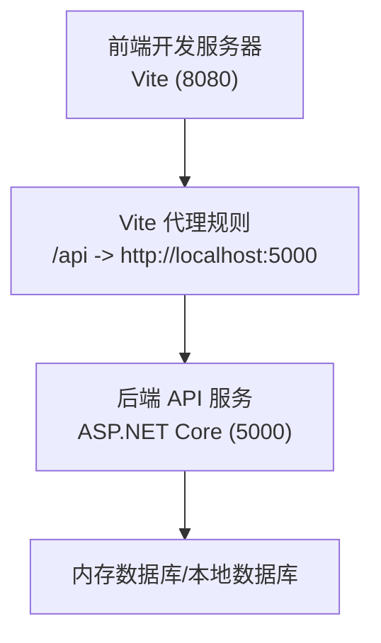
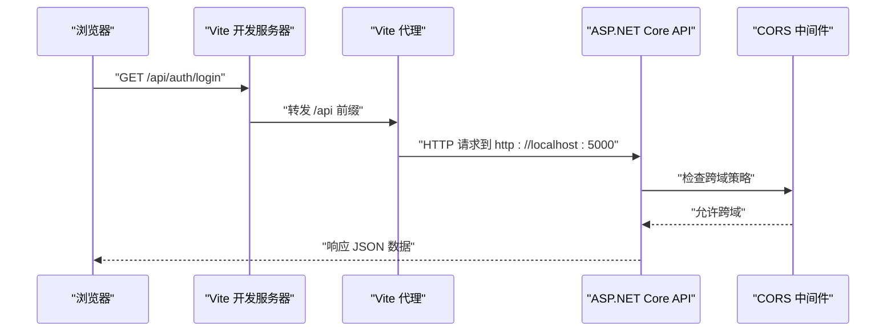
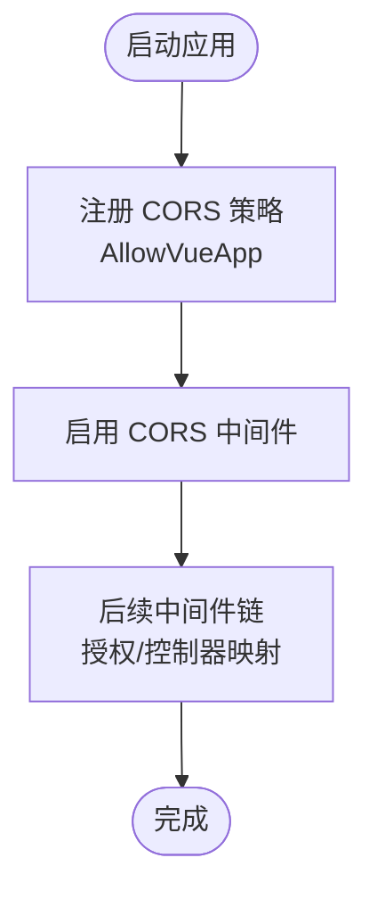
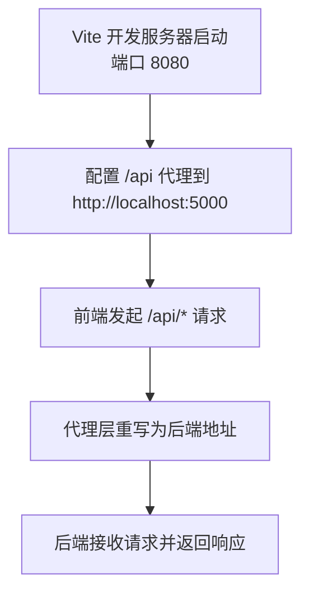
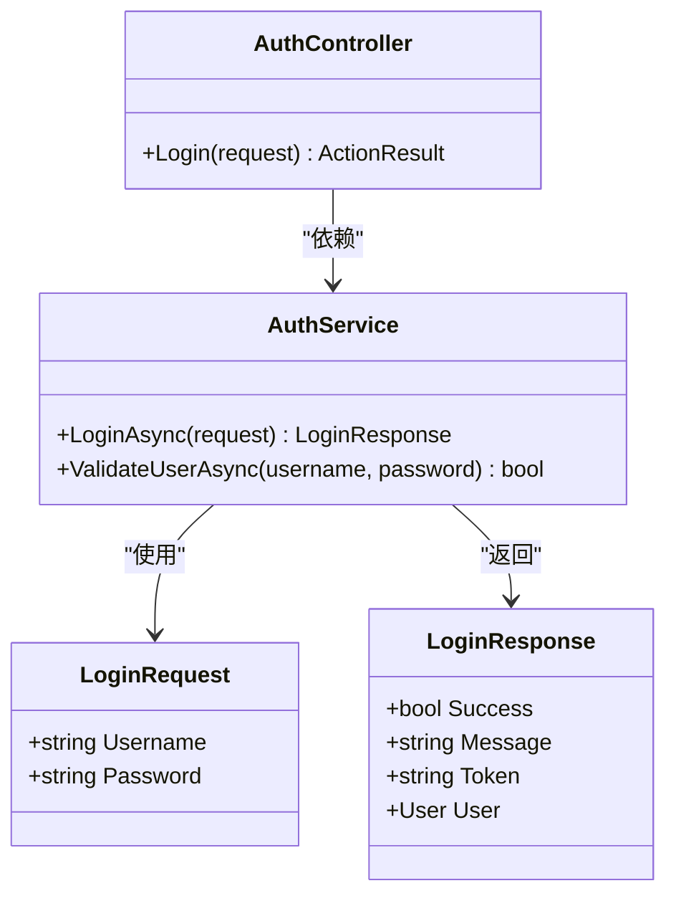
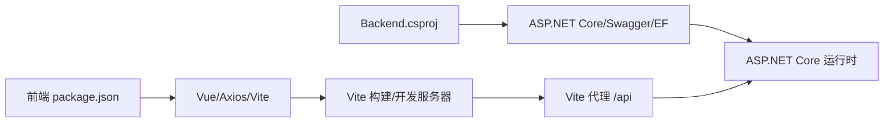

# 环境配置与跨域处理

<cite>
**本文引用的文件**
- [Program.cs](file://vue-csharp-ui-auto/Backend/Program.cs)
- [vite.config.js](file://vue-csharp-ui-auto/Frontend/vite.config.js)
- [appsettings.json](file://vue-csharp-ui-auto/Backend/appsettings.json)
- [AuthController.cs](file://vue-csharp-ui-auto/Backend/Controllers/AuthController.cs)
- [AuthService.cs](file://vue-csharp-ui-auto/Backend/Services/AuthService.cs)
- [LoginRequest.cs](file://vue-csharp-ui-auto/Backend/Models/LoginRequest.cs)
- [package.json](file://vue-csharp-ui-auto/Frontend/package.json)
- [Backend.csproj](file://vue-csharp-ui-auto/Backend/Backend.csproj)
</cite>

## 目录
1. [引言](#引言)
2. [项目结构](#项目结构)
3. [核心组件](#核心组件)
4. [架构总览](#架构总览)
5. [详细组件分析](#详细组件分析)
6. [依赖分析](#依赖分析)
7. [性能考虑](#性能考虑)
8. [故障排查指南](#故障排查指南)
9. [结论](#结论)
10. [附录](#附录)

## 引言
本文件系统性地文档化智能体项目的开发环境配置与跨域解决方案。重点解释在前后端分离架构中出现跨域问题的原因，对比服务端（CORS 策略）与客户端（开发服务器代理）两种解决方式的适用场景；深入解析后端 Program.cs 中 AddCors 与 UseCors 的配置细节（允许的源、头部与方法），以及前端 vite.config.js 中 server.proxy 如何将 /api 前缀请求代理至后端服务，从而绕过浏览器同源策略；最后提供针对本地开发、测试与生产环境的配置修改建议，帮助开发者在不同部署环境下确保系统正常通信。

## 项目结构
该项目采用前后端分离架构：
- 后端为 ASP.NET Core Web 应用，使用控制器暴露 REST 接口（如 /api/auth/login）。
- 前端为基于 Vite + Vue 的单页应用，开发服务器默认监听 8080 端口。
- 开发阶段通过 Vite 代理将 /api 前缀请求转发到后端服务（默认本地 5000 端口）。

图表来源
- [vite.config.js](file://vue-csharp-ui-auto/Frontend/vite.config.js#L1-L22)
- [Program.cs](file://vue-csharp-ui-auto/Backend/Program.cs#L1-L55)
- [AuthController.cs](file://vue-csharp-ui-auto/Backend/Controllers/AuthController.cs#L1-L25)

章节来源
- [Program.cs](file://vue-csharp-ui-auto/Backend/Program.cs#L1-L55)
- [vite.config.js](file://vue-csharp-ui-auto/Frontend/vite.config.js#L1-L22)
- [AuthController.cs](file://vue-csharp-ui-auto/Backend/Controllers/AuthController.cs#L1-L25)

## 核心组件
- 后端 CORS 配置：在 Program.cs 中通过 AddCors 定义策略 AllowVueApp，并在管道中通过 UseCors 启用该策略，允许来自前端开发服务器的跨域请求。
- 前端开发代理：在 vite.config.js 中配置 server.proxy 将 /api 前缀请求代理到后端地址，避免浏览器同源策略限制。
- 控制器与服务：AuthController 暴露 /api/auth/login 接口，AuthService 执行业务逻辑并与数据上下文交互。

章节来源
- [Program.cs](file://vue-csharp-ui-auto/Backend/Program.cs#L13-L22)
- [Program.cs](file://vue-csharp-ui-auto/Backend/Program.cs#L41-L42)
- [vite.config.js](file://vue-csharp-ui-auto/Frontend/vite.config.js#L11-L17)
- [AuthController.cs](file://vue-csharp-ui-auto/Backend/Controllers/AuthController.cs#L18-L23)
- [AuthService.cs](file://vue-csharp-ui-auto/Backend/Services/AuthService.cs#L15-L48)

## 架构总览
下图展示了本地开发时的请求流程：前端通过 Vite 代理将 /api 请求转发到后端，后端启用 CORS 策略允许前端访问。

图表来源
- [vite.config.js](file://vue-csharp-ui-auto/Frontend/vite.config.js#L11-L17)
- [Program.cs](file://vue-csharp-ui-auto/Backend/Program.cs#L13-L22)
- [Program.cs](file://vue-csharp-ui-auto/Backend/Program.cs#L41-L42)
- [AuthController.cs](file://vue-csharp-ui-auto/Backend/Controllers/AuthController.cs#L18-L23)

## 详细组件分析

### 后端 CORS 配置（Program.cs）
- AddCors 定义策略 AllowVueApp，明确允许的源包括 http://localhost:8080、https://localhost:8080、http://127.0.0.1:8080、https://127.0.0.1:8080。
- 允许任意请求头与方法，便于开发调试。
- 在管道中通过 UseCors("AllowVueApp") 启用策略，使后续中间件（如授权、映射控制器）生效。

图表来源
- [Program.cs](file://vue-csharp-ui-auto/Backend/Program.cs#L13-L22)
- [Program.cs](file://vue-csharp-ui-auto/Backend/Program.cs#L41-L42)

章节来源
- [Program.cs](file://vue-csharp-ui-auto/Backend/Program.cs#L13-L22)
- [Program.cs](file://vue-csharp-ui-auto/Backend/Program.cs#L41-L42)

### 前端开发代理（vite.config.js）
- server.host 设置为 0.0.0.0，允许外部访问开发服务器。
- server.port 设为 8080，与后端 CORS 允许的源一致。
- server.proxy 将 /api 前缀请求代理到 http://localhost:5000，secure=false 放宽 HTTPS 校验，changeOrigin=true 修改请求头中的 Origin，避免后端校验失败。

图表来源
- [vite.config.js](file://vue-csharp-ui-auto/Frontend/vite.config.js#L7-L18)

章节来源
- [vite.config.js](file://vue-csharp-ui-auto/Frontend/vite.config.js#L7-L18)

### 控制器与服务（AuthController.cs、AuthService.cs、LoginRequest.cs）
- AuthController 暴露 /api/auth/login 接口，接收 LoginRequest 并调用 AuthService 执行登录逻辑。
- AuthService 查询用户并进行简单密码校验，返回 LoginResponse。
- LoginRequest/Response 定义了登录请求与响应的数据模型。

图表来源
- [AuthController.cs](file://vue-csharp-ui-auto/Backend/Controllers/AuthController.cs#L18-L23)
- [AuthService.cs](file://vue-csharp-ui-auto/Backend/Services/AuthService.cs#L15-L48)
- [LoginRequest.cs](file://vue-csharp-ui-auto/Backend/Models/LoginRequest.cs#L1-L28)

章节来源
- [AuthController.cs](file://vue-csharp-ui-auto/Backend/Controllers/AuthController.cs#L18-L23)
- [AuthService.cs](file://vue-csharp-ui-auto/Backend/Services/AuthService.cs#L15-L48)
- [LoginRequest.cs](file://vue-csharp-ui-auto/Backend/Models/LoginRequest.cs#L1-L28)

## 依赖分析
- 后端项目依赖 ASP.NET Core、Entity Framework（InMemory/SqlServer）、Swagger。
- 前端项目依赖 Vue、Vue Router、Axios、Vite 插件。
- CORS 与代理共同作用：CORS 解决浏览器层面的跨域校验，代理解决开发阶段不同主机/端口导致的同源限制。

图表来源
- [Backend.csproj](file://vue-csharp-ui-auto/Backend/Backend.csproj#L1-L18)
- [package.json](file://vue-csharp-ui-auto/Frontend/package.json#L1-L19)

章节来源
- [Backend.csproj](file://vue-csharp-ui-auto/Backend/Backend.csproj#L1-L18)
- [package.json](file://vue-csharp-ui-auto/Frontend/package.json#L1-L19)

## 性能考虑
- 开发阶段使用代理可减少跨域预检与额外的网络往返，提升调试效率。
- 生产环境建议将前端静态资源与后端 API 同源部署或通过反向代理统一入口，避免不必要的代理层开销。
- CORS 策略在开发阶段允许任意头与方法便于调试，但应根据实际需求收敛，降低攻击面。

## 故障排查指南
- 跨域错误（CORS 失败）
  - 检查后端是否正确注册并启用 CORS 策略。
  - 确认前端代理目标地址与后端监听地址一致。
  - 参考路径：[Program.cs](file://vue-csharp-ui-auto/Backend/Program.cs#L13-L22)、[Program.cs](file://vue-csharp-ui-auto/Backend/Program.cs#L41-L42)、[vite.config.js](file://vue-csharp-ui-auto/Frontend/vite.config.js#L11-L17)
- 代理不生效
  - 确认 Vite 开发服务器已启动且端口为 8080。
  - 确认后端服务运行在 http://localhost:5000。
  - 参考路径：[vite.config.js](file://vue-csharp-ui-auto/Frontend/vite.config.js#L7-L18)、[Program.cs](file://vue-csharp-ui-auto/Backend/Program.cs#L41-L42)
- 登录接口异常
  - 检查控制器路由与请求体格式是否匹配。
  - 参考路径：[AuthController.cs](file://vue-csharp-ui-auto/Backend/Controllers/AuthController.cs#L18-L23)、[LoginRequest.cs](file://vue-csharp-ui-auto/Backend/Models/LoginRequest.cs#L1-L28)

章节来源
- [Program.cs](file://vue-csharp-ui-auto/Backend/Program.cs#L13-L22)
- [Program.cs](file://vue-csharp-ui-auto/Backend/Program.cs#L41-L42)
- [vite.config.js](file://vue-csharp-ui-auto/Frontend/vite.config.js#L7-L18)
- [AuthController.cs](file://vue-csharp-ui-auto/Backend/Controllers/AuthController.cs#L18-L23)
- [LoginRequest.cs](file://vue-csharp-ui-auto/Backend/Models/LoginRequest.cs#L1-L28)

## 结论
本项目通过“前端代理 + 后端 CORS”双通道解决开发阶段的跨域问题：前端代理将 /api 请求透明转发到后端，后端启用 CORS 策略允许前端访问。该方案在本地开发与测试环境中高效可靠；生产环境建议收敛 CORS 策略与代理配置，结合统一反向代理实现更安全稳定的部署。

## 附录

### 不同部署环境下的配置修改建议
- 本地开发（默认）
  - 前端：保持 Vite 开发服务器端口 8080，代理目标 http://localhost:5000。
  - 后端：保持 CORS 策略允许 http://localhost:8080、https://localhost:8080 等开发源。
  - 参考路径：[vite.config.js](file://vue-csharp-ui-auto/Frontend/vite.config.js#L7-L18)、[Program.cs](file://vue-csharp-ui-auto/Backend/Program.cs#L13-L22)
- 测试/预发布
  - 前端：将代理目标指向测试后端域名或内网地址。
  - 后端：将 CORS 策略中的允许源更新为测试域名与端口。
  - 参考路径：[Program.cs](file://vue-csharp-ui-auto/Backend/Program.cs#L13-L22)
- 生产环境
  - 前端：构建产物部署到后端同一域名下，或通过反向代理统一入口，移除 /api 代理。
  - 后端：仅允许生产域名与必要子域，收紧 CORS 策略（限定具体源、头与方法）。
  - 参考路径：[Program.cs](file://vue-csharp-ui-auto/Backend/Program.cs#L13-L22)、[appsettings.json](file://vue-csharp-ui-auto/Backend/appsettings.json#L1-L18)