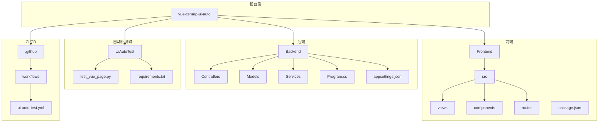
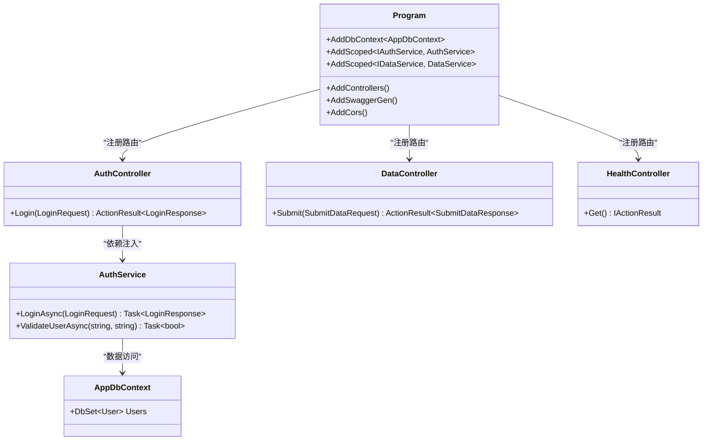
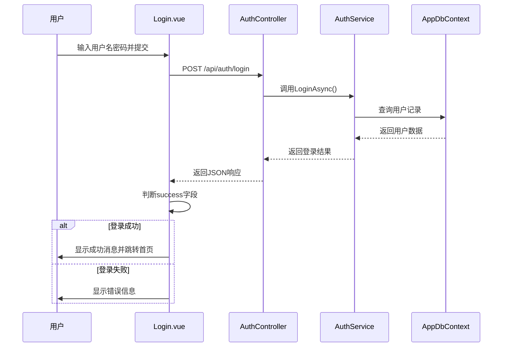
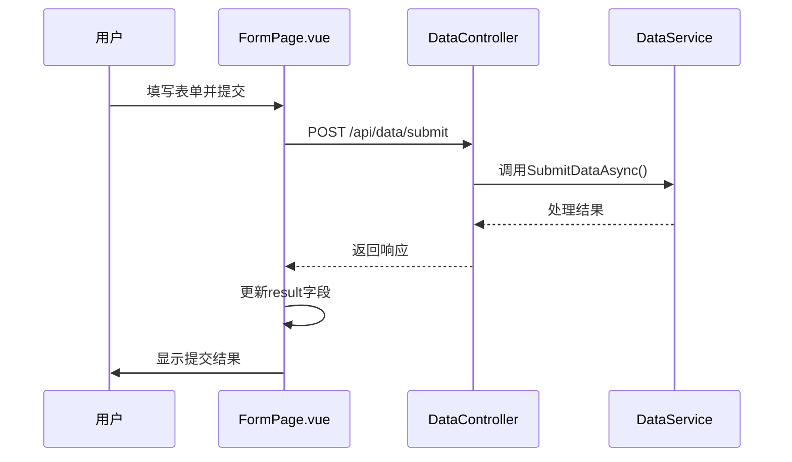
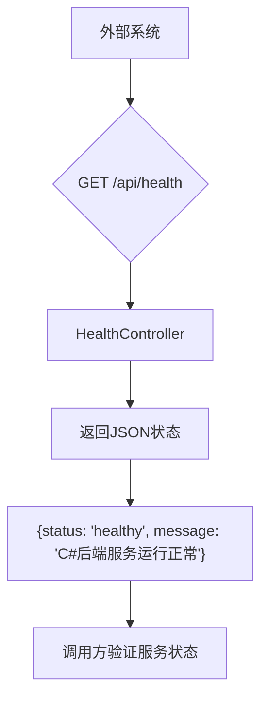
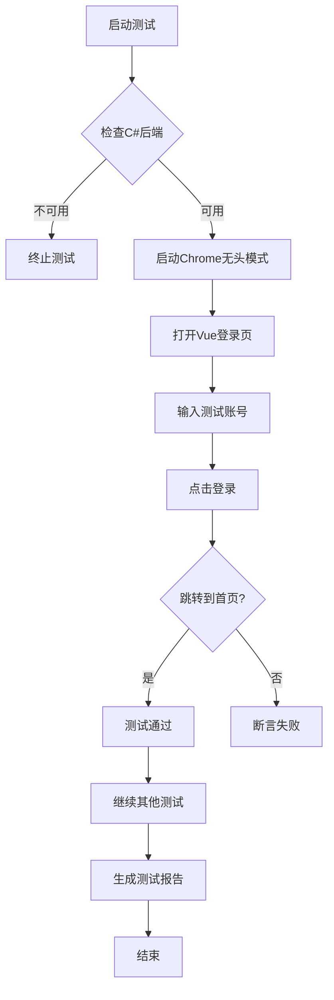

# 系统概述

<cite>
**本文档引用的文件**  
- [README.md](file://vue-csharp-ui-auto/README.md)
- [Program.cs](file://vue-csharp-ui-auto/Backend/Program.cs)
- [appsettings.json](file://vue-csharp-ui-auto/Backend/appsettings.json)
- [AuthController.cs](file://vue-csharp-ui-auto/Backend/Controllers/AuthController.cs)
- [DataController.cs](file://vue-csharp-ui-auto/Backend/Controllers/DataController.cs)
- [HealthController.cs](file://vue-csharp-ui-auto/Backend/Controllers/HealthController.cs)
- [AuthService.cs](file://vue-csharp-ui-auto/Backend/Services/AuthService.cs)
- [User.cs](file://vue-csharp-ui-auto/Backend/Models/User.cs)
- [test_vue_page.py](file://vue-csharp-ui-auto/UiAutoTest/test_vue_page.py)
- [Login.vue](file://vue-csharp-ui-auto/Frontend/src/views/Login.vue)
- [FormPage.vue](file://vue-csharp-ui-auto/Frontend/src/views/FormPage.vue)
- [main.js](file://vue-csharp-ui-auto/Frontend/src/main.js)
- [index.js](file://vue-csharp-ui-auto/Frontend/src/router/index.js)
- [Dockerfile](file://ConsoleApp1/Dockerfile)
</cite>

## 目录
1. [简介](#简介)
2. [项目结构](#项目结构)
3. [核心功能](#核心功能)
4. [前后端架构设计](#前后端架构设计)
5. [关键流程分析](#关键流程分析)
6. [自动化测试实现](#自动化测试实现)
7. [CI/CD与部署支持](#cicd与部署支持)
8. [技术选型与工程考量](#技术选型与工程考量)
9. [总结](#总结)

## 简介

本项目是一个完整的全栈开发实践示例，旨在为开发者提供一个集成前端（Vue 3）、后端（ASP.NET Core）、UI自动化测试和CI/CD流程的标准化开发模板。系统采用前后端分离架构，前端使用Vue 3构建用户界面，后端基于C# ASP.NET Core提供RESTful API服务，通过Selenium实现端到端的UI自动化测试，并利用GitHub Actions完成持续集成与部署流程。

该项目特别适用于希望理解现代Web应用全生命周期管理的开发者，无论是初学者还是高级工程师，都能从中学习到实际项目中的架构设计、组件协作、测试策略和部署方案。

## 项目结构

本项目采用模块化结构，清晰划分前后端与测试组件，便于维护和扩展。



**图示来源**  
- [README.md](file://vue-csharp-ui-auto/README.md)

**本节来源**  
- [README.md](file://vue-csharp-ui-auto/README.md)

## 核心功能

系统实现了三大核心功能模块：用户认证、数据提交和健康检查，构成了典型Web应用的基础能力。

- **用户认证功能**：通过登录页面实现用户身份验证，后端提供`/api/auth/login`接口进行凭证校验。
- **数据提交功能**：前端表单收集用户输入，通过`/api/data/submit`接口提交至后端处理。
- **健康检查功能**：暴露`/api/health`接口供外部系统检测服务运行状态。
- **自动化测试支持**：集成Selenium测试脚本，实现UI层端到端验证。
- **跨域资源共享（CORS）**：后端配置允许前端域名访问API资源。

这些功能共同构成了一个可测试、可部署的完整应用闭环。

**本节来源**  
- [README.md](file://vue-csharp-ui-auto/README.md)
- [AuthController.cs](file://vue-csharp-ui-auto/Backend/Controllers/AuthController.cs)
- [DataController.cs](file://vue-csharp-ui-auto/Backend/Controllers/DataController.cs)
- [HealthController.cs](file://vue-csharp-ui-auto/Backend/Controllers/HealthController.cs)

## 前后端架构设计

系统采用前后端分离架构，前端与后端独立开发、独立部署，通过HTTP API进行通信。

### 前端架构（Vue 3）

前端基于Vue 3 + Vite构建，使用Vue Router实现客户端路由导航。主要组件包括：
- `Login.vue`：用户登录界面
- `FormPage.vue`：数据提交表单
- `Home.vue`：首页展示
- `UserInfo.vue`：用户信息组件

通过Axios库与后端API通信，所有请求均以相对路径发送（如`/api/auth/login`），由开发服务器代理至后端服务。

### 后端架构（ASP.NET Core）

后端采用ASP.NET Core Web API架构，遵循依赖注入和服务注册模式。关键设计包括：



**图示来源**  
- [Program.cs](file://vue-csharp-ui-auto/Backend/Program.cs)
- [AuthController.cs](file://vue-csharp-ui-auto/Backend/Controllers/AuthController.cs)
- [AuthService.cs](file://vue-csharp-ui-auto/Backend/Services/AuthService.cs)
- [User.cs](file://vue-csharp-ui-auto/Backend/Models/User.cs)

**本节来源**  
- [Program.cs](file://vue-csharp-ui-auto/Backend/Program.cs)
- [appsettings.json](file://vue-csharp-ui-auto/Backend/appsettings.json)
- [main.js](file://vue-csharp-ui-auto/Frontend/src/main.js)
- [index.js](file://vue-csharp-ui-auto/Frontend/src/router/index.js)

## 关键流程分析

### 用户认证流程

用户登录流程涉及前后端协同工作：



**图示来源**  
- [Login.vue](file://vue-csharp-ui-auto/Frontend/src/views/Login.vue)
- [AuthController.cs](file://vue-csharp-ui-auto/Backend/Controllers/AuthController.cs)
- [AuthService.cs](file://vue-csharp-ui-auto/Backend/Services/AuthService.cs)

### 数据提交流程

表单提交流程如下：



**图示来源**  
- [FormPage.vue](file://vue-csharp-ui-auto/Frontend/src/views/FormPage.vue)
- [DataController.cs](file://vue-csharp-ui-auto/Backend/Controllers/DataController.cs)

### 健康检查流程

健康检查用于验证后端服务可用性：



**图示来源**  
- [HealthController.cs](file://vue-csharp-ui-auto/Backend/Controllers/HealthController.cs)

**本节来源**  
- [Login.vue](file://vue-csharp-ui-auto/Frontend/src/views/Login.vue)
- [FormPage.vue](file://vue-csharp-ui-auto/Frontend/src/views/FormPage.vue)
- [AuthController.cs](file://vue-csharp-ui-auto/Backend/Controllers/AuthController.cs)
- [DataController.cs](file://vue-csharp-ui-auto/Backend/Controllers/DataController.cs)
- [HealthController.cs](file://vue-csharp-ui-auto/Backend/Controllers/HealthController.cs)

## 自动化测试实现

系统通过Python+Selenium实现UI自动化测试，确保前端与后端集成正确。

### 测试脚本结构

`test_vue_page.py`包含三个核心测试用例：
1. `test_vue_login_with_csharp_api`：验证登录功能
2. `test_vue_form_submit`：验证表单提交
3. `test_vue_navigation`：验证页面导航

### 测试执行流程



测试中使用`data-testid`属性定位元素，提高稳定性。Chrome以无头模式运行，适配CI/CD环境。

**图示来源**  
- [test_vue_page.py](file://vue-csharp-ui-auto/UiAutoTest/test_vue_page.py)

**本节来源**  
- [test_vue_page.py](file://vue-csharp-ui-auto/UiAutoTest/test_vue_page.py)
- [Login.vue](file://vue-csharp-ui-auto/Frontend/src/views/Login.vue)

## CI/CD与部署支持

系统通过GitHub Actions实现自动化CI/CD流程，`ui-auto-test.yml`定义了完整的工作流。

### Docker支持

项目包含Dockerfile，支持容器化部署：

```dockerfile
# 使用.NET 8运行时基础镜像
FROM mcr.microsoft.com/dotnet/runtime:8.0 AS base
WORKDIR /app

# 构建阶段
FROM mcr.microsoft.com/dotnet/sdk:8.0 AS build
WORKDIR /src
COPY ["ConsoleApp1.csproj", "."]
RUN dotnet restore
COPY . .
RUN dotnet build -c Release -o /app/build

# 发布阶段
FROM build AS publish
RUN dotnet publish -c Release -o /app/publish

# 最终镜像
FROM base AS final
COPY --from=publish /app/publish .
ENTRYPOINT ["dotnet", "ConsoleApp1.dll"]
```

该Dockerfile采用多阶段构建，优化镜像大小，适合生产部署。

**图示来源**  
- [Dockerfile](file://ConsoleApp1/Dockerfile)

**本节来源**  
- [Dockerfile](file://ConsoleApp1/Dockerfile)
- [README.md](file://vue-csharp-ui-auto/README.md)

## 技术选型与工程考量

### 前后端分离优势

- **独立开发**：前端与后端团队可并行工作
- **灵活部署**：可分别扩展前端静态资源与后端服务
- **技术栈自由**：前端可用Vue/React，后端可用任意语言
- **易于测试**：API可独立测试，UI可模拟后端响应

### 内存数据库的作用

后端使用EF Core内存数据库（`UseInMemoryDatabase`）进行测试，具有以下优势：
- **测试隔离**：每次运行测试都使用干净的数据状态
- **无需外部依赖**：不依赖SQL Server等数据库服务
- **快速执行**：数据操作在内存中完成，性能高
- **简化配置**：无需管理连接字符串和数据库初始化

### Selenium的选择理由

选择Selenium进行端到端测试的原因：
- **浏览器真实模拟**：在真实浏览器中运行，最接近用户行为
- **跨平台支持**：可在Windows/Linux/Mac上运行
- **多语言支持**：支持Python/Java/C#/JavaScript等
- **成熟生态**：丰富的等待机制、元素定位策略和断言能力

### GitHub Actions的价值

- **自动化触发**：代码推送即自动运行测试
- **完整环境**：可配置C#/Node.js/Python/Chrome等依赖
- **测试报告**：可上传HTML报告和日志文件
- **集成反馈**：测试结果直接反馈到Pull Request

**本节来源**  
- [Program.cs](file://vue-csharp-ui-auto/Backend/Program.cs)
- [test_vue_page.py](file://vue-csharp-ui-auto/UiAutoTest/test_vue_page.py)
- [Dockerfile](file://ConsoleApp1/Dockerfile)
- [README.md](file://vue-csharp-ui-auto/README.md)

## 总结

本项目提供了一个完整的全栈开发实践模板，涵盖了从项目结构、前后端开发、自动化测试到CI/CD部署的全流程。通过Vue 3与ASP.NET Core的结合，展示了现代Web应用的典型架构；通过Selenium与GitHub Actions的集成，实现了高质量的自动化测试保障；通过内存数据库和Docker支持，确保了测试隔离与部署一致性。

该系统不仅适合学习全栈开发技术，也可作为企业级项目的基础模板进行扩展。其清晰的分层设计、规范的代码结构和完善的测试覆盖，体现了良好的工程实践原则。