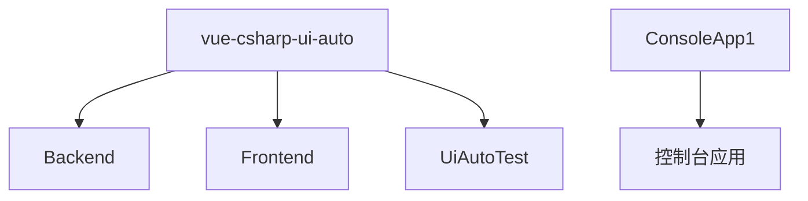
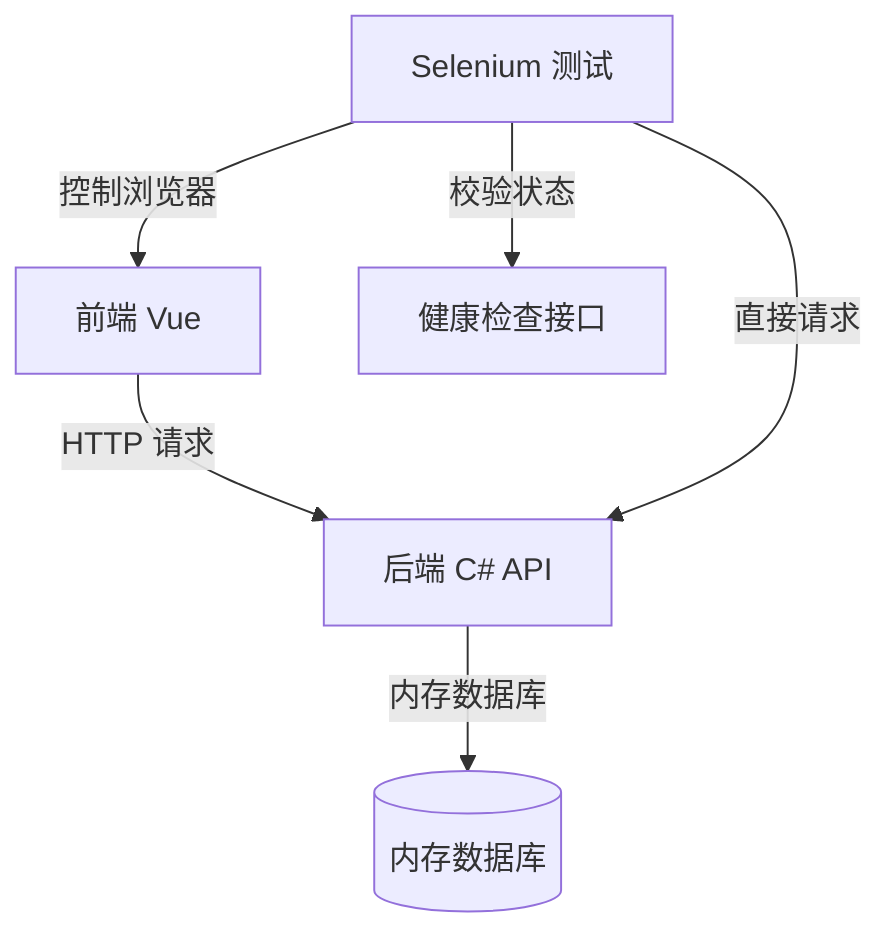

# 项目目录结构详解

<cite>
**本文档引用的文件**  
- [Program.cs](file://vue-csharp-ui-auto/Backend/Program.cs)
- [vite.config.js](file://vue-csharp-ui-auto/Frontend/vite.config.js)
- [test_vue_page.py](file://vue-csharp-ui-auto/UiAutoTest/test_vue_page.py)
- [appsettings.json](file://vue-csharp-ui-auto/Backend/appsettings.json)
- [AuthController.cs](file://vue-csharp-ui-auto/Backend/Controllers/AuthController.cs)
- [AuthService.cs](file://vue-csharp-ui-auto/Backend/Services/AuthService.cs)
- [main.js](file://vue-csharp-ui-auto/Frontend/src/main.js)
- [package.json](file://vue-csharp-ui-auto/Frontend/package.json)
- [index.js](file://vue-csharp-ui-auto/Frontend/src/router/index.js)
- [Login.vue](file://vue-csharp-ui-auto/Frontend/src/views/Login.vue)
- [README.md](file://vue-csharp-ui-auto/README.md)
- [ConsoleApp1.csproj](file://ConsoleApp1/ConsoleApp1.csproj)
- [Dockerfile](file://ConsoleApp1/Dockerfile)
</cite>

## 目录结构

本项目包含两个主要根目录：`vue-csharp-ui-auto` 和 `ConsoleApp1`。其中 `vue-csharp-ui-auto` 是核心项目，采用前后端分离架构，包含完整的 Vue 前端、C# 后端和 UI 自动化测试模块。`ConsoleApp1` 为独立的 .NET 控制台应用，可能是辅助或遗留项目。

**Diagram sources**
- [README.md](file://vue-csharp-ui-auto/README.md#L5-L28)

## 核心模块职责划分

### 后端API服务（Backend）

后端基于 ASP.NET Core 构建，提供 RESTful API 接口，处理业务逻辑、数据验证和数据库交互。主要职责包括用户认证、数据提交和健康检查。

#### 启动入口：Program.cs
`Program.cs` 是后端服务的启动文件，负责配置依赖注入、中间件管道、CORS 策略和数据库初始化。通过 `WebApplication.CreateBuilder` 配置服务，并在应用启动时调用 `DbInitializer.Initialize` 确保内存数据库就绪。

**Section sources**
- [Program.cs](file://vue-csharp-ui-auto/Backend/Program.cs#L1-L55)
- [appsettings.json](file://vue-csharp-ui-auto/Backend/appsettings.json#L1-L18)

#### 接口控制器
- `AuthController.cs`：处理用户登录请求，路由为 `/api/auth/login`
- `DataController.cs`：处理表单数据提交，路由为 `/api/data/submit`
- `HealthController.cs`：提供健康检查接口 `/api/health`

控制器通过依赖注入使用服务层（如 `IAuthService`），实现关注点分离。

**Section sources**
- [AuthController.cs](file://vue-csharp-ui-auto/Backend/Controllers/AuthController.cs#L1-L25)
- [DataController.cs](file://vue-csharp-ui-auto/Backend/Controllers/DataController.cs#L1-L25)

#### 服务与模型
- `AuthService.cs`：实现用户认证逻辑，验证用户名和密码（测试环境使用固定密码）
- `DataService.cs`：处理数据提交业务
- `User.cs`：用户实体模型，定义用户属性
- `AppDbContext.cs`：EF Core 数据上下文，使用内存数据库进行测试

**Section sources**
- [AuthService.cs](file://vue-csharp-ui-auto/Backend/Services/AuthService.cs#L1-L64)
- [User.cs](file://vue-csharp-ui-auto/Backend/Models/User.cs#L1-L11)

### 前端用户界面（Frontend）

前端基于 Vue 3 构建，使用 Vite 作为构建工具，实现响应式用户界面。主要包含登录、首页和表单页面。

#### 开发服务器配置：vite.config.js
该文件配置了开发服务器的代理功能，将 `/api` 请求代理到后端服务 `http://localhost:5000`，解决开发环境下的跨域问题。同时设置前端服务运行在 `0.0.0.0:8080`，便于容器化部署。

**Section sources**
- [vite.config.js](file://vue-csharp-ui-auto/Frontend/vite.config.js#L1-L22)
- [package.json](file://vue-csharp-ui-auto/Frontend/package.json#L1-L19)

#### 应用入口与路由
- `main.js`：Vue 应用的入口文件，创建应用实例并挂载到 DOM
- `router/index.js`：配置前端路由，实现页面导航，根路径重定向到登录页

**Section sources**
- [main.js](file://vue-csharp-ui-auto/Frontend/src/main.js#L1-L8)
- [index.js](file://vue-csharp-ui-auto/Frontend/src/router/index.js#L1-L33)

#### 视图组件
- `Login.vue`：登录页面，包含用户名密码输入框和提交按钮，使用 `axios` 调用后端认证接口
- `Home.vue`：首页，登录后跳转的目标页面
- `FormPage.vue`：表单提交页面，测试数据提交功能

组件中使用 `data-testid` 属性，便于自动化测试时定位元素。

**Section sources**
- [Login.vue](file://vue-csharp-ui-auto/Frontend/src/views/Login.vue#L1-L133)

### UI自动化测试脚本（UiAutoTest）

该模块使用 Python + Selenium 实现端到端的 UI 自动化测试，验证前端页面与后端 API 的集成。

#### 测试用例：test_vue_page.py
包含三个核心测试用例：
1. `test_vue_login_with_csharp_api`：测试登录功能，验证前端登录后能否正确跳转
2. `test_vue_form_submit`：测试表单提交功能，验证数据能否成功提交到后端
3. `test_vue_navigation`：测试页面导航功能，验证路由是否正常工作

测试脚本首先校验后端 API 可用性，然后启动 Chrome 无头浏览器进行操作，确保测试的可靠性。

**Section sources**
- [test_vue_page.py](file://vue-csharp-ui-auto/UiAutoTest/test_vue_page.py#L1-L161)
- [requirements.txt](file://vue-csharp-ui-auto/UiAutoTest/requirements.txt#L1-L4)

## ConsoleApp1目录说明

`ConsoleApp1` 是一个独立的 .NET 8.0 控制台应用程序，包含完整的项目文件和 Docker 配置。根据其 `csproj` 文件内容，该项目仅包含基本的控制台应用依赖，无其他业务逻辑。

该目录可能为遗留项目、辅助工具或用于其他目的的独立服务，**并非当前 `vue-csharp-ui-auto` 项目的核心组成部分**。开发者应重点关注 `vue-csharp-ui-auto` 目录下的三个核心模块，避免将 `ConsoleApp1` 误认为主项目的一部分。

**Section sources**
- [ConsoleApp1.csproj](file://ConsoleApp1/ConsoleApp1.csproj#L1-L17)
- [Dockerfile](file://ConsoleApp1/Dockerfile#L1-L28)

## 组件依赖关系

**Diagram sources**
- [test_vue_page.py](file://vue-csharp-ui-auto/UiAutoTest/test_vue_page.py#L10-L20)
- [Program.cs](file://vue-csharp-ui-auto/Backend/Program.cs#L24-L26)

## 开发与测试流程

本项目支持完整的本地开发和自动化测试流程：

1. **启动后端**：`cd Backend && dotnet run`
2. **启动前端**：`cd Frontend && npm run serve`
3. **运行测试**：`cd UiAutoTest && python test_vue_page.py`

GitHub Actions 工作流可自动执行上述流程，实现持续集成。

**Section sources**
- [README.md](file://vue-csharp-ui-auto/README.md#L66-L86)